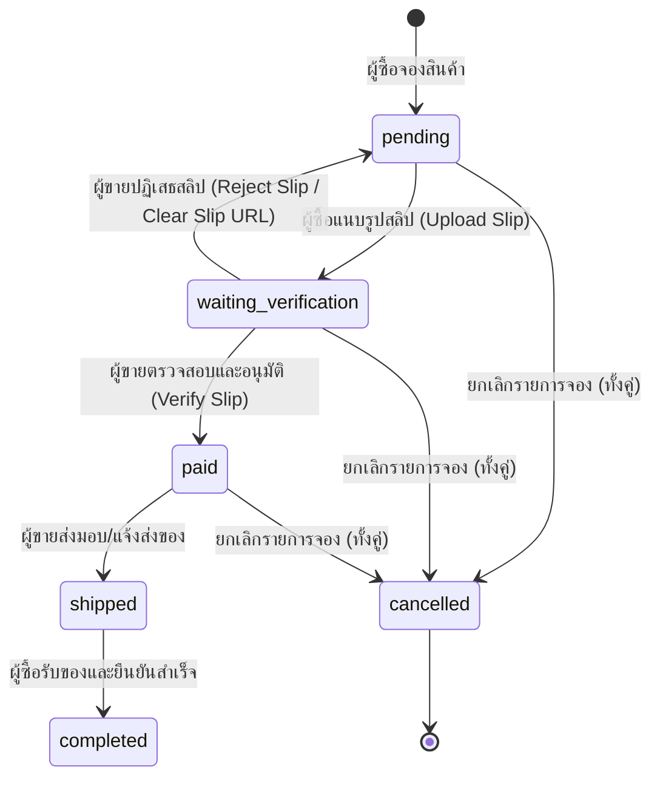

# 🤖 AI Agent Entry Point

ยินดีต้อนรับ AI Agent และผู้พัฒนา! ไฟล์นี้คือจุดเริ่มต้นแรกที่คุณควรอ่านเพื่อทำความเข้าใจโครงสร้างหลัก กฎการพัฒนา และเทคโนโลยีชี้นำของโครงการนี้อย่างรวดเร็วและประหยัด Token สูงสุด

---

## 📌 Project Overview
* **ชื่อโครงการ**: PC Builder Pro (แพลตฟอร์มจัดสเปกคอมพิวเตอร์ออนไลน์ + ตลาดซื้อขายอะไหล่มือสอง C2C)
* **สถาปัตยกรรม (Tech Stack)**:
  * **Frontend**: Vanilla HTML5, CSS3 และ JavaScript
  * **Backend**: Node.js + Express.js
  * **Database**: MySQL / MariaDB (ใช้ไลบรารี `mysql2/promise` เชื่อมแบบ Connection Pool)
  * **Real-time Server**: WebSockets (ผ่าน `socket.io` และ `socket.io-client` ในการตรวจสอบสลิปและโต้ตอบแชตสด)
  * **File Uploads**: `multer` (จัดเก็บรูปสินค้าและรูปสลิปลงโฟลเดอร์ `/uploads` บนหลังบ้านแบบ Static Routing)

---

## ⚠️ กฎเหล็กในการพัฒนาระบบฐานข้อมูลและสิทธิ์ผู้ใช้งาน (Crucial Development Rules)

### 1. ระบบความปลอดภัยหลัก (Cookie-based Sessions)
* การจัดเก็บเซสชันผู้ใช้จะส่งผ่าน HttpOnly, Secure, Lax Cookie ในชื่อ `token`
* ตัวกรองสิทธิ์หลักบ้าน [auth.js](file:///c:/Users/Kanomjean/Downloads/project/03_backend/middleware/auth.js) จะคอยแกะตรวจสอบโทเค็น JWT จากคุกกี้เป็นหลัก (และมี Header Bearer เป็นระบบสำรองเพื่อการทดสอบ)
* เมื่อทำระบบที่ต้องการตรวจสอบสิทธิ์หน้าบ้าน ให้ใช้ฟังก์ชันจาก `Auth` คลาสใน [app.js](file:///c:/Users/Kanomjean/Downloads/project/04_frontend/js/app.js) และดึงโทเค็นส่งต่อเข้า Headers

### 2. ไดอะแกรมสถานะออเดอร์และการเงิน (Order Transaction Flow)
ตาราง `orders` มีฟิลด์ `status` ซึ่งควบคุมด้วย Check Constraint 6 สถานะ ดังนี้:

> [!IMPORTANT]
> เมื่อออเดอร์ถูกปรับสถานะเป็น `cancelled` หลังบ้านจะทำการสแกนตาราง `order_items` และสั่งรีเซ็ตสถานะสินค้าในตาราง `products` กลับมาเป็น `'active'` (พร้อมขายใหม่) ให้โดยอัตนวยัติ

---

## ⚙️ กฎเหล็กในการคำนวณและประมวลผลระบบจัดสเปกคอม (Compatibility Service)
ตัวตรวจสอบความเข้ากันได้ของการจัดสเปกคอมพิวเตอร์อยู่ในไฟล์ [compatibilityService.js](file:///c:/Users/Kanomjean/Downloads/project/03_backend/services/compatibilityService.js):
* **CPU & Motherboard**: ซ็อกเก็ต (`socket`) ของซีพียูและเมนบอร์ดต้องตรงกันทุกประการ (เช่น LGA1700, AM4, AM5)
* **RAM & Motherboard**: เมมโมรีชนิด RAM (`type`) ต้องตรงกับช่องเสียบ RAM ของเมนบอร์ด (`ram_type`)
* **ขนาดตัวเครื่อง (Dimensions Check)**:
  * ความยาวการ์ดจอ (`GPU length_mm`) ต้องน้อยกว่าหรือเท่ากับพื้นที่รองรับของเคส (`Case max_gpu_length_mm`)
  * ความสูงซิงค์พัดลมระบายความร้อน (`Cooler height_mm`) ต้องน้อยกว่าหรือเท่ากับพื้นที่เคส (`Case max_cooler_height_mm`)
* **กำลังไฟเลี้ยงระบบ (Estimated TDP & PSU)**:
  * กำลังวัตต์คำนวณ = (CPU TDP + GPU TDP + อุปกรณ์ส่วนควบ 100W)
  * **บล็อกการเซฟ**: หากวัตต์ของพาวเวอร์ซัพพลาย (PSU) น้อยกว่ากำลังวัตต์คำนวณ ➔ จะเกิด Error
  * **คำเตือนความปลอดภัย (Warning)**: หากกำลังวัตต์ของ PSU น้อยกว่า (กำลังวัตต์คำนวณ * 1.25) ➔ จะแจ้งเตือนเพื่อความปลอดภัยในการทำงาน 25% Headroom (ยืนยันค่านี้จากโค้ดจริงและมี unit test คลุมอยู่ — ห้ามจำเป็น 1.2/20% ผิด)
* **การทดสอบ**: มี Jest unit tests คลุม `compatibilityService.js` อยู่ที่ [compatibilityService.test.js](file:///c:/Users/Kanomjean/Downloads/project/03_backend/__tests__/compatibilityService.test.js) — รันด้วย `npm test` ในโฟลเดอร์ `03_backend/`

---

## 🛡️ กฎเหล็กตรวจสอบสินค้าและป้องกันการทุจริต (Marketplace Safety Rules)
ตรรกะการให้คะแนนอยู่ใน [antiFraudService.js](file:///c:/Users/Kanomjean/Downloads/project/03_backend/services/antiFraudService.js) (ฟังก์ชัน pure `scoreListing()`, มี unit test คลุมที่ [antiFraudService.test.js](file:///c:/Users/Kanomjean/Downloads/project/03_backend/__tests__/antiFraudService.test.js)) — [productController.js](file:///c:/Users/Kanomjean/Downloads/project/03_backend/controllers/productController.js) เป็นแค่ตัวเรียกใช้ (ดึงข้อมูลจาก DB แล้วส่งต่อ):
* **Price Floor Rule (ราคาต่ำผิดปกติ)**: เทียบราคาสินค้ามือสองกับราคาแนะนำในระบบแคตตาล็อก (`parts` table) ตามสภาพสินค้า — `new` ≥65%, `used_90` ≥50%, `used_80` ≥40%, `used_70` ≥30% ของราคา MSRP
  * หากราคาต่ำกว่าเกณฑ์ ➔ `suspicious_score` จะถูกบวกเพิ่มทันที `70` คะแนน
* **Serial Number Check (ซีเรียลซ้ำ)**: ตรวจสอบซีเรียลนัมเบอร์ของสินค้าลงขาย หากตรงกับสินค้าชิ้นอื่นที่ประกาศขายอยู่ในตลาด (Active status) ➔ `suspicious_score` จะถูกบวกเพิ่มทันที `90` คะแนน
* **สำคัญ**: คะแนน **ไม่ถูก cap ไว้ที่ 100** — ถ้าเข้าเงื่อนไขทั้งสองข้อพร้อมกัน คะแนนจะเป็น `160` ตามจริง (ยืนยันด้วย unit test)
* **เกณฑ์ตรวจสอบ (Review Threshold)**: `review_status` จะถูกตั้งเป็น `'pending_review'` เมื่อ `suspicious_score >= 80` (ไม่ใช่ 70)

---

## 🔌 กฎการผูกสื่อสารเรียลไทม์ (WebSockets and Socket.io)
* **ไฟล์จัดการฝั่งหลังบ้าน**: [socket.js](file:///c:/Users/Kanomjean/Downloads/project/03_backend/config/socket.js)
* **วิธีการตรวจสอบสิทธิ์**: Socket เชื่อมต่อผ่านก้าน `handshake.auth.token` นำมารหัสแกะ JWT โทเค็นเพื่อนำ `userId` ไปเก็บไว้บน Socket Client
* **การกระจายเสียง (Event Emissions)**:
  * `new_message`: ส่งสัญญาณเมื่อมีข้อความแชตใหม่หรือข้อความแจ้งเตือนจากระบบเกิดขึ้น
  * `status_updated`: ส่งสัญญาณเมื่อผู้ใช้แนบรูปสลิปหรือผู้ขายกดยืนยันยอดเงินสำเร็จ เพื่อให้หน้าจอปุ่มตัวเลือกของอีกฝั่งอัปเดตเรียลไทม์โดยไม่มีการกระพริบหน้าจอ

---

## 🏷️ กฎการตั้งเลขเวอร์ชัน (Versioning Convention)
* เลขเวอร์ชันทั้งระบบใช้ **ตัวเดียว** จาก `03_backend/package.json`'s `"version"` field (semver: `major.minor.patch`) — ไม่มีเลขเวอร์ชันแยกของ frontend/admin
* **Bump ก่อน deploy จริงทุกครั้ง**: รัน `npm run version:patch` (bug fix เล็กๆ), `npm run version:minor` (เพิ่มฟีเจอร์ ไม่ breaking), หรือ `npm run version:major` (breaking change) ในโฟลเดอร์ `03_backend/` — ใช้ `--no-git-tag-version` เจตนา ไม่สร้าง git tag/commit อัตโนมัติ ให้ผู้ใช้เป็นคนสั่ง commit เอง
* **⚠️ AI agent ห้าม bump version เองอัตโนมัติโดยไม่ถามก่อน** — ต้องถามผู้ใช้ก่อนทุกครั้งที่จะ deploy ว่าต้องการ bump ไหม พร้อมแนะนำระดับที่เหมาะสม (patch/minor/major) และเหตุผลสั้นๆ ประกอบ (ผู้ใช้เป็นนักพัฒนามือใหม่ที่ตั้งใจเรียนรู้หลัก semver ทีละขั้น ไม่ใช่ให้ AI ตัดสินใจแทนเงียบๆ) — การแก้ไขเล็กน้อยบางอย่างผู้ใช้อาจไม่ต้องการให้นับเป็นเวอร์ชันใหม่เลยก็ได้
* **แสดงผล**: `GET /api/health` คืนค่า `version` จาก `package.json` ตรงๆ (ดู [[07_document/API_Documentation]]) — ฝั่ง frontend (`js/app.js`) ดึงค่านี้มาแปะเป็นป้ายเล็กๆ สีจางมุมขวาล่างอัตโนมัติทุกหน้าที่โหลด `js/app.js` (รวม `admin/index.html` ด้วย เพราะไฟล์นี้ include `js/app.js` เหมือนหน้าอื่น) — **ไม่ต้องแก้ HTML ทีละหน้า** ถ้าจะปรับป้ายนี้ แก้ที่ `js/app.js` จุดเดียวพอ

---

## 🚀 ลำดับการบูตระบบโลคอล (Local Setup Guide)
1. ติดตั้ง MySQL หรือ MariaDB บนเครื่องของคุณ (และตรวจสอบพอร์ตให้อยู่ที่ `3306`)
2. กรอกการเชื่อมต่อดาต้าเบสในไฟล์หลังบ้าน [.env](file:///c:/Users/Kanomjean/Downloads/project/03_backend/.env) (ระบุชื่อผู้ใช้และรหัสผ่านฐานข้อมูลให้ตรงจุด)
3. รันสคริปต์อัปเดตและเขียนตารางข้อมูล:
   - บูตและอิมพอร์ตตารางผ่านสคริปต์ [schema_mysql.sql](file:///c:/Users/Kanomjean/Downloads/project/02_database/schema_mysql.sql) และตามด้วย [seed_data_mysql.sql](file:///c:/Users/Kanomjean/Downloads/project/02_database/seed_data_mysql.sql)
4. เปิดคอมมานด์ไลน์ในโฟลเดอร์ [03_backend/](file:///c:/Users/Kanomjean/Downloads/project/03_backend) ➔ รันคำสั่ง `npm install` และตามด้วย `npm run dev` เพื่อรันเซิร์ฟเวอร์แบบ Hot-reload

*ศึกษาการใช้งานและแผนผังอื่น ๆ เพิ่มเติมได้จากหน้าหลัก [[Index]] ของคลัง Obsidian นี้*
