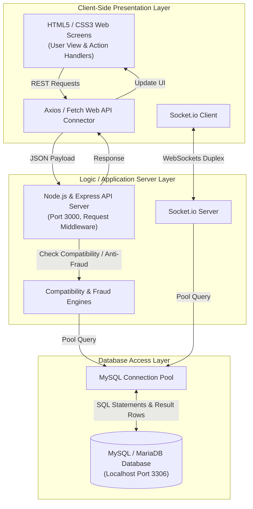
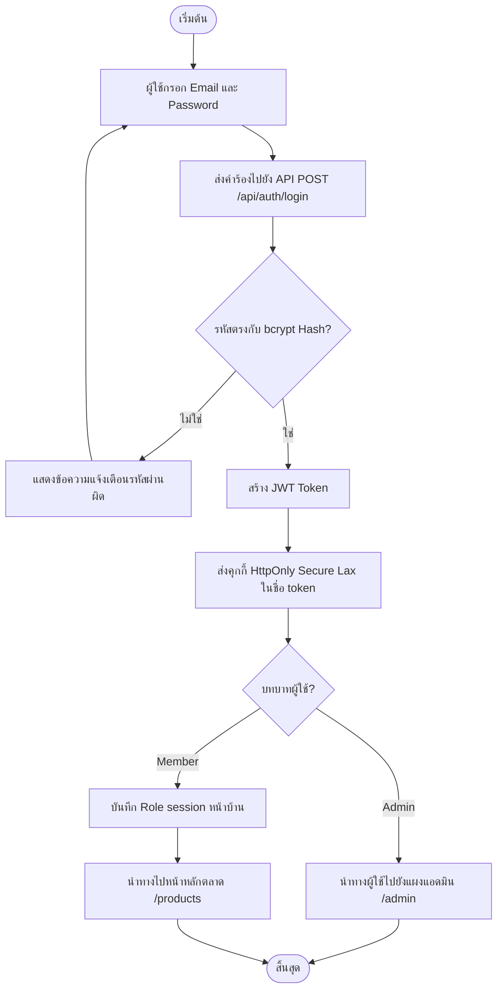
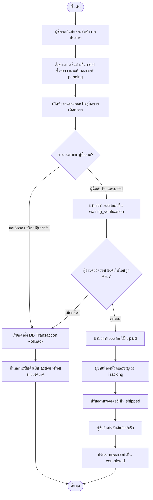
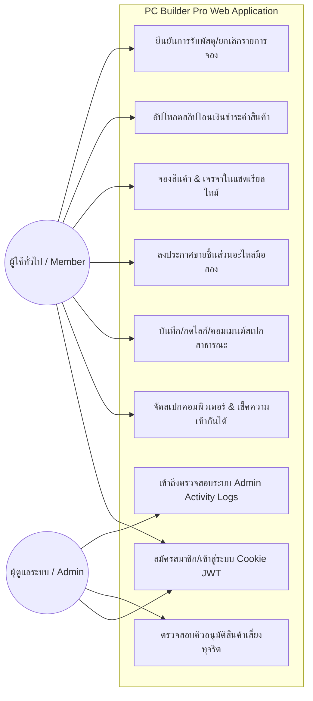
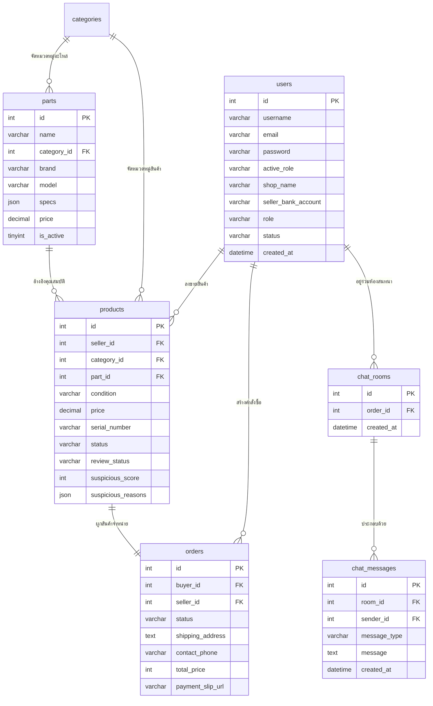
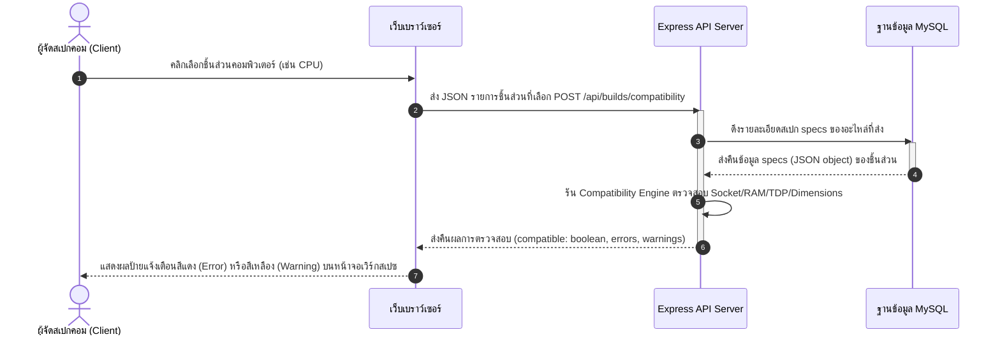
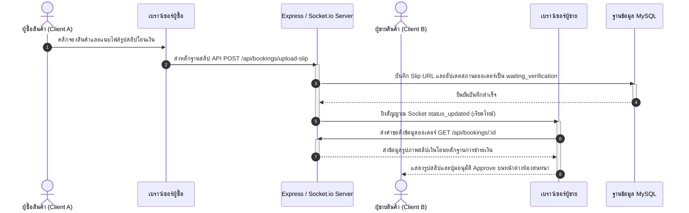

# คู่มือการจัดรูปแบบหน้ากระดาษใน Microsoft Word (สำหรับบทที่ 3)

ในการนำเนื้อหาบทที่ 3 ไปวางในโปรแกรม Microsoft Word ให้ปฏิบัติตามคำแนะนำในการตั้งค่าหน้ากระดาษดังนี้:

1. **ระยะขอบหน้ากระดาษ (Margins):**
   * **ขอบบน (Top):** 1.5 นิ้ว (3.81 ซม.) — *สำหรับหน้าแรกของบท* (หน้าถัดๆ ไปในบทเดียวกัน ตั้งค่าเป็น 1.0 นิ้ว หรือ 2.54 ซม.)
   * **ขอบล่าง (Bottom):** 1.0 นิ้ว (2.54 ซม.)
   * **ขอบซ้าย (Left):** 1.5 นิ้ว (3.81 ซม.) — *สำหรับขอบเข้าเล่ม*
   * **ขอบขวา (Right):** 1.0 นิ้ว (2.54 ซม.)
2. **การจัดรูปแบบตารางและภาพประกอบ (Tables & Figures):**
   * **คำอธิบายตาราง (Table Caption):** พิมพ์คำอธิบายไว้ **ด้านบนตาราง** ชิดขอบซ้าย ขนาด **16pt ตัวหนา** เช่น **ตารางที่ 3.1** โครงสร้างตาราง users
   * **คำอธิบายภาพ (Figure Caption):** พิมพ์คำอธิบายไว้ **ด้านล่างภาพ** จัดกึ่งกลางหน้ากระดาษ ขนาด **16pt ตัวหนา** เช่น **ภาพที่ 3.1** สถาปัตยกรรมระบบ
   * **ตัวตาราง:** เส้นขอบตารางควรใช้แบบมาตรฐานวิชาการ (ไม่มีเส้นขอบแนวตั้ง มีเฉพาะเส้นแนวนอนบนสุด ล่างสุด และเส้นใต้หัวตาราง) ตัวหนังสือในตารางใช้ขนาด 14pt-16pt ตามความเหมาะสม
3. **การจัดหัวข้อและฟอนต์ (Font & Headings):**
   * ใช้ฟอนต์หลัก: **TH Sarabun New** หรือ **TH Sarabun PSK**
   * **บทที่ 3 (บรรทัดแรก):** ขนาด **20pt ตัวหนา** จัดกึ่งกลางหน้ากระดาษ
   * **ชื่อบท (ขั้นตอนการดำเนินการ):** ขนาด **20pt ตัวหนา** จัดกึ่งกลางหน้ากระดาษ
   * **หัวข้อย่อยหลัก (เช่น 3.1, 3.2):** ขนาด **18pt ตัวหนา** จัดชิดซ้าย
   * **หัวข้อย่อยรอง (เช่น 3.1.1):** ขนาด **16pt ตัวหนา** จัดชิดซ้าย (เยื้องขวา 1 Tab)

---

# บทที่ 3
# ขั้นตอนการดำเนินงาน

ในการดำเนินงานโครงการพัฒนาเว็บแอปพลิเคชัน **PC Builder Pro (แพลตฟอร์มจัดสเปกคอมพิวเตอร์ออนไลน์ และตลาดกลางซื้อขายชิ้นส่วนอะไหล่มือสอง C2C)** คณะผู้พัฒนาได้ดำเนินการตามขั้นตอนการวิเคราะห์ ออกแบบระบบ และมีแผนภาพขั้นตอนการดำเนินงานเชิงวิชาการอย่างเป็นระบบดังรายละเอียดต่อไปนี้:

* 3.1 การศึกษาข้อมูลและสถาปัตยกรรมระบบ
* 3.2 การออกแบบระบบและไดอะแกรมการทำงาน
* 3.3 การพัฒนาเว็บแอปพลิเคชัน

---

### 3.1 การศึกษาข้อมูลและสถาปัตยกรรมระบบ

#### 3.1.1 สถาปัตยกรรมการสื่อสารระบบ (System Architecture)
ระบบได้รับการออกแบบโครงสร้างการทำงานในรูปแบบ **3-Tier Architecture** ซึ่งแยกหน้าที่การรับส่งและประมวลผลข้อมูลอย่างเด็ดขาดเพื่อความปลอดภัยและการขยายตัวในอนาคต ดังแสดงรายละเอียดการเชื่อมต่อเครือข่ายและการแลกเปลี่ยนข้อมูลใน **ภาพที่ 3.1**:


**ภาพที่ 3.1** แผนภูมิสถาปัตยกรรมทางโครงสร้างและการรับส่งข้อมูลของระบบ PC Builder Pro

#### 3.1.2 รายละเอียดโครงสร้างตารางข้อมูลในระบบ (Database Table Schemas)
ฐานข้อมูลได้รับการสร้างและจัดการบนระบบ MySQL โดยกำหนดขนาดตัวแปร ดัชนีความเร็ว และการเชื่อมโยงความสัมพันธ์ของคีย์ข้อมูลภายนอก (Foreign Keys) ดังตารางสรุปตารางหลักต่อไปนี้:

##### ตารางที่ 3.1 โครงสร้างตารางเก็บข้อมูลบัญชีผู้ใช้งาน (users)
| ลำดับฟิลด์ | ชื่อคอลัมน์ (Column Name) | ประเภทข้อมูล (Data Type) | ข้อกำหนด (Key / Constraints) | คำอธิบาย (Description) |
| :---: | :--- | :--- | :---: | :--- |
| 1 | `id` | INT | PK, Auto Increment | รหัสผู้ใช้งานระบบ |
| 2 | `username` | VARCHAR(255) | Unique, Not Null | ชื่อบัญชีเข้าสู่ระบบ |
| 3 | `email` | VARCHAR(255) | Unique, Not Null | อีเมลประจำตัวผู้ใช้งาน |
| 4 | `password` | VARCHAR(255) | Not Null | รหัสผ่านที่แฮชด้วย bcrypt |
| 5 | `avatar_url` | TEXT | Nullable | พาธลิงก์รูปภาพประจำตัวผู้ซื้อ |
| 6 | `active_role` | VARCHAR(50) | Check constraint | บทบาทที่เปิดใช้: `'buyer'`, `'seller'` |
| 7 | `shop_name` | VARCHAR(255) | Nullable | ชื่อร้านค้ากรณีสมัครเป็นผู้ขาย |
| 8 | `seller_bank_account` | VARCHAR(100) | Nullable | บัญชีธนาคารสำหรับรับเงินโอนค่าสินค้า |
| 9 | `role` | VARCHAR(50) | Not Null (Default: `'member'`) | สิทธิ์ในระบบ: `'member'`, `'admin'` |
| 10 | `status` | VARCHAR(50) | Not Null (Default: `'active'`) | สถานะบัญชี: `'active'`, `'suspended'` |
| 11 | `created_at` | DATETIME | Default: CURRENT_TIMESTAMP | วันเวลาที่สร้างบัญชี |

##### ตารางที่ 3.2 โครงสร้างตารางเก็บรายการอะไหล่มาตรฐานระบบ (parts)
| ลำดับฟิลด์ | ชื่อคอลัมน์ (Column Name) | ประเภทข้อมูล (Data Type) | ข้อกำหนด (Key / Constraints) | คำอธิบาย (Description) |
| :---: | :--- | :--- | :---: | :--- |
| 1 | `id` | INT | PK, Auto Increment | รหัสอุปกรณ์ในระบบแคตตาล็อก |
| 2 | `name` | VARCHAR(255) | Not Null | ชื่อเต็มชิ้นส่วนอุปกรณ์ไอที |
| 3 | `category_id` | INT | FK -> `categories.id` | รหัสอ้างอิงหมวดหมู่ชิ้นส่วน |
| 4 | `brand` | VARCHAR(255) | Not Null, Index | ตราสินค้ายี่ห้อ (เช่น Intel, AMD) |
| 5 | `model` | VARCHAR(255) | Nullable | รุ่นเฉพาะตัวชิ้นส่วนคอมพิวเตอร์ |
| 6 | `specs` | JSON / TEXT | Not Null | สเปกรายละเอียดเชิงเทคนิคเก็บในรูป JSON |
| 7 | `price` | DECIMAL(10, 2) | Not Null (Default: 0.00) | ราคากลางสินค้า MSRP อ้างอิงระบบ |
| 8 | `is_active` | TINYINT | Default: 1 | ความพร้อมใช้ในแผงจัดสเปก (1=ใช่, 0=ไม่ใช่) |

##### ตารางที่ 3.3 โครงสร้างตารางเก็บสินค้ามือสองลงขาย (products)
| ลำดับฟิลด์ | ชื่อคอลัมน์ (Column Name) | ประเภทข้อมูล (Data Type) | ข้อกำหนด (Key / Constraints) | คำอธิบาย (Description) |
| :---: | :--- | :--- | :---: | :--- |
| 1 | `id` | INT | PK, Auto Increment | รหัสรายการสินค้ามือสองลงขาย |
| 2 | `seller_id` | INT | FK -> `users.id` | รหัสอ้างอิงผู้ขายชิ้นส่วนมือสอง |
| 3 | `category_id` | INT | FK -> `categories.id` | รหัสอ้างอิงหมวดหมู่ชิ้นส่วนสินค้า |
| 4 | `part_id` | INT | FK -> `parts.id` (Nullable) | รหัสเชื่อมโยงอะไหล่แคตตาล็อกกลาง |
| 5 | `condition` | VARCHAR(50) | Check constraint | สภาพ: `'new'`, `'used_90'`, `'used_80'`, `'used_70'` |
| 6 | `price` | DECIMAL(10, 2) | Not Null | ราคาประกาศขายชิ้นส่วนมือสอง |
| 7 | `serial_number` | VARCHAR(255) | Not Null, Index | หมายเลขซีเรียลจากตัวถังฮาร์ดแวร์จริง |
| 8 | `status` | VARCHAR(50) | Check, Index | สถานะจำหน่าย: `'active'`, `'sold'`, `'paused'` |
| 9 | `review_status` | VARCHAR(50) | Check, Index | สถานะตรวจ: `'approved'`, `'pending_review'`, `'rejected'` |
| 10 | `suspicious_score` | INT | Not Null (Default: 0) | คะแนนความน่าสงสัยของการทุจริต |
| 11 | `suspicious_reasons` | JSON / TEXT | Not Null | บันทึกเหตุผลความน่าสงสัยแบบ JSON Array |

##### ตารางที่ 3.4 โครงสร้างตารางเก็บรายการสั่งซื้อจองและธุรกรรม C2C (orders)
| ลำดับฟิลด์ | ชื่อคอลัมน์ (Column Name) | ประเภทข้อมูล (Data Type) | ข้อกำหนด (Key / Constraints) | คำอธิบาย (Description) |
| :---: | :--- | :--- | :---: | :--- |
| 1 | `id` | INT | PK, Auto Increment | รหัสใบสั่งจองสินค้าในระบบ |
| 2 | `buyer_id` | INT | FK -> `users.id`, Index | รหัสอ้างอิงผู้ซื้อสินค้า |
| 3 | `seller_id` | INT | FK -> `users.id`, Index | รหัสอ้างอิงผู้ขายสินค้า |
| 4 | `status` | VARCHAR(50) | Check constraint | สถานะธุรกรรมสั่งซื้อของออเดอร์นั้น |
| 5 | `shipping_address` | TEXT | Not Null | ที่อยู่ในการจัดส่งปลายทางของผู้ซื้อ |
| 6 | `contact_phone` | VARCHAR(50) | Not Null | เบอร์โทรติดต่อของผู้จองรับสินค้า |
| 7 | `total_price` | INT | Not Null | ยอดเงินชำระค่าสินค้าโอนเงินรวม |
| 8 | `payment_slip_url` | VARCHAR(255) | Nullable | พาธเก็บภาพถ่ายสลิปเงินโอนหลักฐาน |

##### ตารางที่ 3.5 โครงสร้างตารางเก็บข้อความห้องแชตคุยโต้ตอบ (chat_messages)
| ลำดับฟิลด์ | ชื่อคอลัมน์ (Column Name) | ประเภทข้อมูล (Data Type) | ข้อกำหนด (Key / Constraints) | คำอธิบาย (Description) |
| :---: | :--- | :--- | :---: | :--- |
| 1 | `id` | INT | PK, Auto Increment | รหัสข้อความแชต |
| 2 | `room_id` | INT | FK -> `chat_rooms.id`, Index | รหัสอ้างอิงห้องสนทนาซื้อขาย |
| 3 | `sender_id` | INT | FK -> `users.id` (Nullable) | รหัสผู้ส่งข้อความ (เป็น NULL หากเป็นระบบออโต้) |
| 4 | `message_type` | VARCHAR(50) | Check constraint | ประเภทข้อความ: `'text'`, `'system'` |
| 5 | `message` | TEXT | Not Null | ข้อความสนทนาเจรจาหรือบันทึกของระบบ |
| 6 | `created_at` | DATETIME | Default: CURRENT_TIMESTAMP | วันเวลาที่ส่งข้อความโต้ตอบแชต |

---

### 3.2 การออกแบบระบบและไดอะแกรมการทำงาน

#### 3.2.1 การออกแบบ Flowchart การทำงานของระบบ (System Process Flowcharts)

##### 3.2.1.1 Flowchart การเข้าสู่ระบบและการสลับบทบาท (Login & Role Verification)
แสดงขั้นตอนการดำเนินงานตรวจสอบความถูกต้องของสิทธิ์บัญชีผู้ใช้งานเมื่อเข้าระบบ ดังภาพที่ 3.2:


**ภาพที่ 3.2** เป็นการดำเนินงานขั้นตอนการเข้าสู่ระบบและการคัดกรองบทบาทผู้ใช้งาน ซึ่งมีรายละเอียดขั้นตอนการทำงานดังนี้:
1) ผู้ใช้ระบุข้อมูลอีเมลและรหัสผ่านจากนั้นส่งคำร้องผ่านทางเครือข่าย API มายังระบบส่วนหลังบ้าน
2) ระบบส่วนหลังบ้านดำเนินการตรวจสอบความถูกต้องโดยเปรียบเทียบค่าแฮช bcrypt ในฐานข้อมูล หากค่าข้อมูลไม่ถูกต้องระบบจะปฏิเสธการเข้าใช้งาน
3) หากการตรวจสอบความถูกต้องเสร็จสิ้นและรหัสผ่านถูกต้อง ระบบจะทำการจัดสรรชุดโทเค็น JWT และตอบกลับเพื่อนำไปบันทึกบนคุกกี้เว็บเบราว์เซอร์ที่มีความปลอดภัยระดับ HttpOnly
4) ระบบประเมินและคัดกรองบทบาทสิทธิ์ หากพบว่าเป็นผู้ดูแลระบบ (Admin) ระบบจะนำทางไปยังแผงควบคุมระบบจัดสรรสิทธิ์ (/admin) หากเป็นสมาชิกทั่วไป (Member) ระบบจะนำทางเข้าสู่หน้าตลาดกลางซื้อขายสินค้าหลัก (/products)

##### 3.2.1.2 Flowchart การจัดสเปกคอมพิวเตอร์และการตรวจสอบความเข้ากันได้ (PC Builder & Compatibility)
แสดงขั้นตอนการทำงานตรวจสอบความถูกต้องเชิงวิศวกรรมสเปกคอมพิวเตอร์ ดังภาพที่ 3.3:

```mermaid
flowchart TD
    Start([ผู้ใช้เลือกชิ้นส่วนในหน้า Builder]) --> SendAPICheck[ส่งรายการสินค้าเข้าหน้า API /api/builds/compatibility]
    SendAPICheck --> QuerySpecs[ค้นหา Specs ชนิด JSON ของชิ้นส่วนที่ถูกส่งมา]
    
    %% Socket & Motherboard
    QuerySpecs --> CheckSocket{มี CPU และ Motherboard ครบ?<br/>Socket ตรงกัน?}
    CheckSocket -- ไม่ตรงกัน --> AddError[บันทึก ERROR: Socket ขัดแย้งกัน]
    CheckSocket -- ตรงกัน --> CheckChipset{Chipset รองรับ CPU ไหม?}
    CheckChipset -- ไม่รองรับ/ตระกูลต่ำ --> AddWarning[บันทึก WARNING: Chipset อาจต้องอัปเกรด BIOS]
    CheckChipset -- รองรับดี --> CheckRAM
    AddError --> CheckRAM
    AddWarning --> CheckRAM
    
    %% RAM & Motherboard
    CheckRAM{มี RAM และ Motherboard ครบ?<br/>RAM Type ตรงกับ Ram Slots?}
    CheckRAM -- ไม่ตรงกัน --> AddRamError[บันทึก ERROR: ประเภท RAM ไม่เข้ากัน]
    CheckRAM -- ตรงกัน --> CheckRamLimit{ความจุ RAM และจำนวนแถวรวม เกินขีดจำกัดบอร์ด?}
    CheckRamLimit -- เกินสเปกบอร์ด --> AddRamWarning[บันทึก WARNING: ความจุ/จำนวนแถวเกินลิมิตบอร์ด]
    CheckRamLimit -- ไม่เกิน --> CheckGPUCase
    AddRamError --> CheckGPUCase
    AddRamWarning --> CheckGPUCase
    
    %% GPU / Cooler Dimension vs Case
    CheckGPUCase{มีการ์ดจอ/พัดลม CPU และเคส ครบ?<br/>ขนาดความยาว/ความสูง เกินพื้นที่เคส?}
    CheckGPUCase -- เกินพิกัดเคส --> AddSizeError[บันทึก ERROR: อุปกรณ์ยาว/สูงเกินพื้นที่เคส]
    CheckGPUCase -- ใกล้เคียงเคส เกิน 90% --> AddSizeWarning[บันทึก WARNING: ขนาดเบียดพื้นที่เคสเกินไป ติดตั้งยาก]
    CheckGPUCase -- ขนาดพอดีเคส --> CheckPSU
    AddSizeError --> CheckPSU
    AddSizeWarning --> CheckPSU
    
    %% PSU Wattage Calculation
    CheckPSU{มี PSU และอุปกรณ์ใช้ไฟในระบบ?<br/>กำลังวัตต์ PSU เพียงพอ?}
    CheckPSU --> CalcWatt[คำนวณ TDP รวม = TDP ของ CPU + TDP ของ GPU + 100W สำหรับอุปกรณ์อื่น]
    CalcWatt --> ComparePSU{วัตต์ PSU < วัตต์ TDP รวม?}
    ComparePSU -- น้อยกว่าพลังงานขั้นต่ำ --> AddPsuError[บันทึก ERROR: กำลังไฟ PSU ไม่พอกับพลังงานที่ระบบใช้จริง]
    ComparePSU -- น้อยกว่า วัตต์รวม * 1.2 --> AddPsuWarning[บันทึก WARNING: กำลังไฟ PSU ต่ำกว่าระดับแนะนำสำหรับความเสถียร 20% Headroom]
    ComparePSU -- วัตต์เหลือเพียงพอ --> SendResult
    AddPsuError --> SendResult
    AddPsuWarning --> SendResult
    
    SendResult[ส่งข้อมูล Errors และ Warnings ทั้งหมดกลับหน้าบ้านเพื่อแจ้งผู้ใช้] --> End([จบการตรวจสอบ])
```


**ภาพที่ 3.3** เป็นการดำเนินงานขั้นตอนการประเมินความเข้ากันได้ของอุปกรณ์ฮาร์ดแวร์ ซึ่งมีรายละเอียดขั้นตอนการทำงานดังนี้:
1) ระบบส่วนติดต่อผู้ใช้งาน (Frontend Client-side) ส่งข้อมูลอาร์เรย์รหัสอะไหล่ชิ้นส่วนที่เลือกผ่านทาง REST API ไปยังตัวคำนวณประเมินผล
2) ตัวเครื่องมือวิเคราะห์ความเข้ากันได้ (Compatibility Engine) ดึงรายละเอียดสเปกและคุณสมบัติทางเทคนิคจากคลังแคตตาล็อกระบบมาทำการตรวจสอบภายใต้ระบบประมวลผลเชิงกฎเกณฑ์ (Rule-based Constraints)
3) ระบบดำเนินการเปรียบเทียบความถูกต้องของชนิด Socket, มาตรฐานพอร์ต DDR ของหน่วยความจำแรม, ตลอดจนขนาดมิติกายภาพความยาวการ์ดแสดงผลและความสูงของพัดลมระบายความร้อนเทียบกับขนาดของตู้เคสคอมพิวเตอร์
4) ระบบประเมินค่าพลังงานความร้อน TDP รวมเปรียบเทียบกับกำลังวัตต์จ่ายกระแสไฟของพาวเวอร์ซัพพลาย (PSU) หากกำลังไฟไม่เพียงพอระบบจะแสดงข้อผิดพลาดระดับวิกฤต (Error) เพื่อระงับขั้นตอนการบันทึก และหากกำลังวัตต์มีสำรองไม่ถึง 25% ตามเกณฑ์แนะนำระบบจะแจ้งเตือน (Warning) ให้ทราบ

##### 3.2.1.3 Flowchart การลงประกาศขายสินค้าและการคำนวณคะแนนความเสี่ยง (Anti-Fraud Listing Screen)
แสดงขั้นตอนคัดกรองพฤติกรรมความน่าสงสัยของการทุจริตก่อนสินค้าแสดงผลในตลาด ดังภาพที่ 3.4:

```mermaid
flowchart TD
    Start([เริ่มต้น]) --> InputProduct[ผู้ขายป้อนราคา สภาพ และซีเรียลสินค้า]
    InputProduct --> VerifyRules[ประเมินความเบี่ยงเบนราคาและเช็คประวัติซีเรียล]
    VerifyRules --> CheckMSRP{ราคาตั้ง < MSRP * Multiplier(สภาพ)?}
    CheckMSRP -- ใช่ --> AddPointsMSRP[บวกคะแนนความเสี่ยง +70 คะแนน] --> CheckSerial
    CheckMSRP -- ไม่ใช่ --> CheckSerial{Serial ซ้ำกับสินค้าที่ยังไม่ขาย?}
    CheckSerial -- ใช่ --> AddPointsSerial[บวกคะแนนความเสี่ยง +90 คะแนน] --> EvaluateScore
    CheckSerial -- ไม่ใช่ --> EvaluateScore
    EvaluateScore{คะแนนความเสี่ยงสะสม >= 70 คะแนน?}
    EvaluateScore -- ใช่ --> SetPending[ปรับ review_status เป็น pending_review และซ่อนสินค้า]
    EvaluateScore -- ไม่ใช่ --> ApproveActive[ปรับ review_status เป็น approved และเผยแพร่ลงตลาด]
    SetPending --> SendQueue[ส่งรายการไปยัง Moderation Queue ของแอดมิน]
    SendQueue --> End([สิ้นสุด])
    ApproveActive --> End
```
**ภาพที่ 3.4** เป็นการดำเนินงานขั้นตอนการคัดกรองพฤติกรรมการทุจริตและการกรองความเสี่ยงสินค้า ซึ่งมีรายละเอียดขั้นตอนการทำงานดังนี้:
1) เมื่อผู้ลงโฆษณาขายส่งข้อมูลประกาศขายผลิตภัณฑ์เข้ามาในระบบ ระบบจะดำเนินการสกัดรับค่าข้อมูลราคา สภาพการใช้งาน และหมายเลขซีเรียลนัมเบอร์เข้าสู่อัลกอริทึม
2) ระบบทำการประมวลผลคำนวณค่าเพดานราคาปลอดภัยต่ำสุด (Price Floor Limit) เทียบกับสภาพสินค้าและราคากลางแนะนำ (MSRP Catalog) หากตั้งราคาต่ำกว่าเกณฑ์วิเคราะห์จะบวกระดับคะแนนความเสี่ยงทันที +70 คะแนน
3) ระบบดำเนินการคิวรีฐานข้อมูลเพื่อตรวจสอบความซ้ำซ้อนของเลขซีเรียลนัมเบอร์กับผลิตภัณฑ์อื่นที่มีอยู่ในระบบและยังไม่ได้ถูกจำหน่ายออกไป หากพบข้อมูลซ้ำซ้อนจะทำการบวกระดับคะแนนความเสี่ยงทันที +90 คะแนน
4) ระบบรวมระดับคะแนนความเสี่ยงสะสม หากคะแนนสะสมเท่ากับหรือมากกว่า 70 คะแนน ระบบจะปรับสถานะการตรวจสอบเป็นรอกลั่นกรอง (Pending Review) เพื่อซ่อนสินค้าออกจากหน้าตลาดปกติโดยอัตโนมัติ และผลักรายการโพสต์ดังกล่าวเข้าสู่คิวงานตรวจสอบของผู้ดูแลระบบ (Moderation Queue) ต่อไป

##### 3.2.1.4 Flowchart การสั่งซื้อและการเปลี่ยนสถานะธุรกรรม C2C (C2C Order State & Booking)
แสดงขั้นตอนการล็อคสต็อกสินค้าและการสั่งคืนสถานะสต็อกเมื่อยกเลิกออเดอร์ ดังภาพที่ 3.5:


**ภาพที่ 3.5** เป็นการดำเนินงานขั้นตอนการสั่งซื้อและการควบคุมสถานะธุรกรรม C2C ซึ่งมีรายละเอียดขั้นตอนการทำงานดังนี้:
1) เมื่อผู้ใช้ฝั่งผู้ซื้อกดยืนยันการสั่งจอง ระบบจะดำเนินการสลับสถานะของผลิตภัณฑ์เป้าหมายในตารางสินค้าเป็นจัดจำหน่ายแล้ว ('sold') ทันทีเพื่อป้องกันการสั่งจองซ้ำซ้อน พร้อมทั้งสถาปนาเปิดห้องสนทนาแชตและใบสั่งซื้อชั่วคราว (Pending Order)
2) ผู้ซื้ออัปโหลดภาพถ่ายหลักฐานสลิปเงินโอนผ่านทางฟังก์ชันห้องแชต ระบบจะเปลี่ยนสถานะธุรกรรมคำสั่งจองเป็นรอตรวจรับการชำระเงิน ('waiting_verification') และทำการแจ้งเตือนไปยังผู้ขายผ่านสัญญาณ WebSockets
3) ผู้ขายทำการวิเคราะห์ภาพถ่ายสลิปเงินโอนและยอดเงินในบัญชีธนาคารส่วนตัว หากการตรวจสอบความถูกต้องเสร็จสิ้นและถูกต้อง ผู้ขายจะกดอนุมัติยอดเพื่อปรับเปลี่ยนสถานะของธุรกรรมเป็นชำระเงินเสร็จสิ้น ('paid') เพื่อเตรียมดำเนินการจัดส่งสินค้า
4) ในกรณีที่มีการแจ้งยกเลิกออเดอร์ หรือผู้ขายปฏิเสธความถูกต้องของสลิปเงินโอน ระบบหลังบ้านจะรันธุรกรรม SQL Database Transaction ในโหมด Rollback เพื่อทำการอัปเดตคืนสถานะของผลิตภัณฑ์ชิ้นดังกล่าวกลับเป็นพร้อมขาย ('active') ในระบบตลาดกลางอย่างรวดเร็วและปลอดภัย

---

#### 3.2.2 การออกแบบแผนภาพจำแนกการโต้ตอบผู้ใช้งาน (Use Case Diagram)
แผนภาพ Use Case Diagram อธิบายขอบเขตปฏิสัมพันธ์และสิทธิ์การเข้าถึงข้อมูลระบบแยกตามบทบาท (Roles) ของ ผู้ใช้งานทั่วไป (Member) และผู้ดูแลระบบ (Admin) ดังแสดงใน **ภาพที่ 3.6**:


**ภาพที่ 3.6** Use Case Diagram แสดงขอบเขตการใช้งานจำแนกตามบทบาทผู้ใช้

---

#### 3.2.3 การออกแบบความสัมพันธ์ตารางข้อมูลฐานข้อมูล (Entity-Relationship Diagram)
แผนภาพ ER Diagram แสดงความเชื่อมโยงและความสัมพันธ์ระหว่างตารางหลักในฐานข้อมูลเชิงสัมพันธ์ของระบบ เพื่อควบคุมความบูรณภาพของข้อมูลด้วยคีย์นอก (Foreign Keys) ดังแสดงใน **ภาพที่ 3.7**:


**ภาพที่ 3.7** Entity-Relationship Diagram (ERD) แสดงโครงสร้างความสัมพันธ์ฐานข้อมูลเชิงสัมพันธ์

---

#### 3.2.4 แผนภาพลำดับการทำงานของระบบ (Sequence Diagrams)

##### 3.2.4.1 Sequence Diagram การจัดสเปกคอมพิวเตอร์และการตรวจสอบความเข้ากันได้
แสดงลำดับการโต้ตอบเมื่อผู้ใช้ดำเนินการแก้ไขหรืออัปเดตชิ้นส่วนในชุดจัดสเปกคอม ดังแสดงใน **ภาพที่ 3.8**:


**ภาพที่ 3.8** Sequence Diagram แสดงลำดับเหตุการณ์การประเมินสเปกฮาร์ดแวร์

##### 3.2.4.2 Sequence Diagram การสั่งซื้อสินค้าและธุรกรรมโอนเงินห้องแชตเรียลไทม์
แสดงการรับส่งสัญญาณ Socket โต้ตอบข้อมูลชำระเงินเรียลไทม์ ดังแสดงใน **ภาพที่ 3.9**:


**ภาพที่ 3.9** เป็นการดำเนินงานขั้นตอนลำดับกระบวนการรับส่งข้อมูลหลักฐานสลิปโอนชำระเงินเรียลไทม์ ซึ่งมีรายละเอียดขั้นตอนการทำงานดังนี้:
1) ผู้ซื้อ (Client A) ทำการแนบภาพถ่ายสลิปเงินโอนหลักฐานการชำระเงินเพื่อบันทึกลงในส่วนแสดงผลเว็บเบราว์เซอร์ A
2) เบราว์เซอร์ฝั่งผู้ซื้อ (Browser A) ทำการยิง API ในรูปแบบ REST Request ไปยังเซิร์ฟเวอร์หลัก (POST /api/bookings/upload-slip)
3) เซิร์ฟเวอร์หลัก (Express Server) ประมวลผลและส่งข้อมูลไปอัปเดตสถานะธุรกรรมคำสั่งจองเป็นรอตรวจรับการชำระเงิน ('waiting_verification') และบันทึก Slip URL ลงในฐานข้อมูล MySQL
4) เซิร์ฟเวอร์หลักส่งสัญญาณแจ้งเตือนและกระจายข้อมูลสดผ่านช่องทาง WebSockets (Socket event: status_updated) ไปยังเครื่องเว็บเบราว์เซอร์ B ของฝั่งผู้ขายแบบเรียลไทม์
5) เว็บเบราว์เซอร์ฝั่งผู้ขาย (Browser B) ได้รับสัญญาณและยิง API ส่งคำร้องขอเพื่อดึงรายละเอียดเอกสารออเดอร์มาตรวจสอบ (GET /api/bookings/:id)
6) เซิร์ฟเวอร์หลักดึงข้อมูลรูปภาพสลิปเงินโอนหลักฐานดังกล่าวและคืนรูปภาพสลิปกลับมาแสดงผลที่เบราว์เซอร์ฝั่งผู้ขาย
7) เบราว์เซอร์ฝั่งผู้ขายนำข้อมูลมาประเมินผลแสดงรูปสลิปและแสดงปุ่มกดยืนยันยอดโอนเงิน (Approve) บนหน้าต่างห้องสนทนาแชตของผู้ขาย (Client B) เพื่อให้กดยืนยันชำระเงิน

---

#### 3.2.5 การออกแบบส่วนติดต่อผู้ใช้งาน (UX/UI Wireframes Design)
คณะผู้พัฒนาได้ดำเนินงานวาดภาพพิมพ์เขียวโครงร่าง (Wireframes UI) เพื่อเป็นต้นแบบในส่วนติดต่อผู้ใช้งาน โดยจัดสไตล์หน้าจอยึดตามโครงสร้าง Glassmorphism 
* จัดลำดับเมนูนำทาง (Sidebar Navigation) ไว้ชิดขอบซ้ายเพื่อความรวดเร็วในการสลับหน้าจอ
* กล่องข้อมูลหลัก (Main Content Container) วางไว้กึ่งกลางหน้ากระดาษ โดยใช้เส้นขอบบางโปร่งใสเพื่อให้เกิดความลึกและมิติในการจัดวางวัตถุ
* แถบแจ้งเตือนระดับวิกฤต (Error Panel) จะวางเด่นไว้ด้านบนสุดของหน้าจัดประกอบสเปก เพื่อให้เกิดการสังเกตได้ทันทีเมื่อระบบประเมินผลความไม่เข้ากันได้ของชิ้นส่วนฮาร์ดแว้า

---

### 3.3 การพัฒนาเว็บแอปพลิเคชัน

#### 3.3.1 การพัฒนาส่วนติดต่อผู้ใช้งานฝั่ง Client-side (Vanilla HTML/CSS/JS)
การดำเนินงานในส่วนของระบบหน้าบ้าน (Frontend) พัฒนาขึ้นโดยใช้ภาษาหลัก HTML5 ในการควบคุมความสมบูรณ์ของแบบฟอร์มข้อมูล, ภาษา CSS3 จัดรูปแบบ Glassmorphism โดยเลือกใช้ฟังก์ชันหลักดังนี้:
* `backdrop-filter: blur(10px)` สำหรับทำความเบลอของวัตถุพื้นหลังให้ความรู้สึกเหมือนกระจกฝ้าหรูหราพรีเมียม
* `background: rgba(20, 20, 30, 0.6)` กำหนดค่าความเข้มมืดโปร่งแสง 60%
* `border: 1px solid rgba(255, 255, 255, 0.1)` เพื่อสร้างเส้นกรอบบางคมเน้นพื้นที่แสดงผล

การเชื่อมต่อ API หน้าบ้านนำการเรียกใช้ `fetch` มาประยุกต์ร่วมกับชุดควบคุมเอกสาร (DOM Manipulation) เพื่อรองรับการเปลี่ยนถ่ายหน้าจอแบบหน้าเดียว (Single Page UI Experience) โดยไม่มีการรีเฟรชหรือกระพริบหน้าจอช่วยยกระดับความสะดวกในการโต้ตอบของผู้รับบริการ

#### 3.3.2 การพัฒนาส่วนเว็บแอปพลิเคชันเซิร์ฟเวอร์หลังบ้าน (Node.js & Express API)
ระบบหลังบ้านทำหน้าที่ประมวลผลคำขอยิงเส้นทาง API (Routing API) โดยแยก Controller ออกตามความรับผิดชอบอย่างชัดเจน:
* `authController.js` จัดเก็บความปลอดภัยโดยการรับรหัส JWT แกะวิเคราะห์สถานะ HttpOnly Cookie
* `productController.js` ฝังตรรกะกรองสินค้าทุจริต (Anti-Fraud Listing Scan) ทำการรวบรวมข้อมูลราคา Msrp และซีเรียลนัมเบอร์เพื่อวิเคราะห์พฤติกรรมการทุจริตก่อนส่งต่อข้อมูลสินค้าในคิวเข้าฐานข้อมูล
* `bookingController.js` ควบคุม Transaction ของการล็อคสต็อกและการ Rollback ย้อนคืนข้อมูลทั้งหมดกลับสู่ตลาดเมื่อใบสั่งจองออเดอร์หมดอายุการชำระเงินหรือโดนปฏิเสธยกเลิก

#### 3.3.3 การผูกสัญญาณสื่อสารเรียลไทม์ (WebSockets & Socket.io Integration)
การสื่อสารในห้องสนทนาเจรจาระหว่างผู้ซื้อและผู้ขาย มีการดำเนินงานติดตั้ง Socket.io เข้ากับวงจรไลฟ์ไซเคิลของเว็บเซิร์ฟเวอร์หลัก โดยมีการสกัดโทเค็น JWT ออกจากข้อมูลคุกกี้ที่ส่งมาแนบ Handshake ตั้งแต่การขอเปิดใช้สัญญาณเชื่อมต่อ (Connection Setup) เพื่อยืนยันสิทธิ์บัญชีผู้ใช้งาน เมื่อมีการกระทำใดๆ ในห้องแชต ระบบจะยิงสัญญาณอีเวนต์ `new_message` และ `status_updated` เพื่อส่งผลลัพธ์ข้อมูลอัปเดตไปยังเบราว์เซอร์ของอีกฝั่งในเสี้ยววินาทีโดยปราศจากความหน่วงเชิงระบบ
