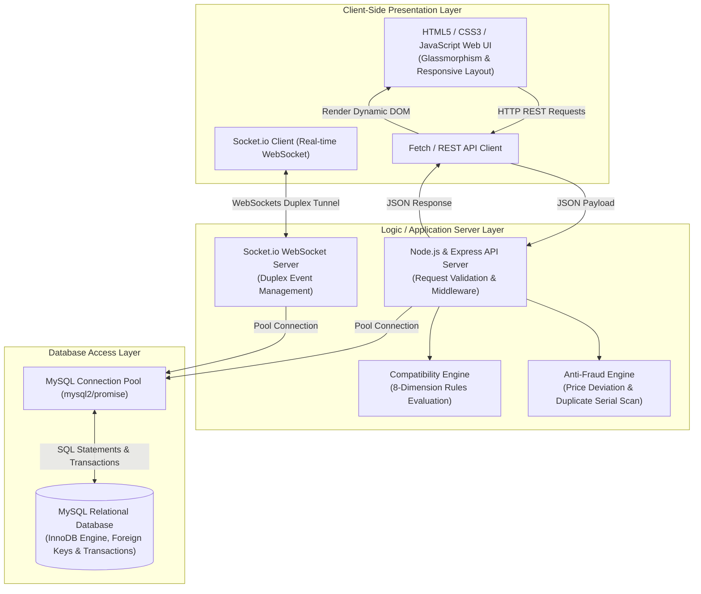
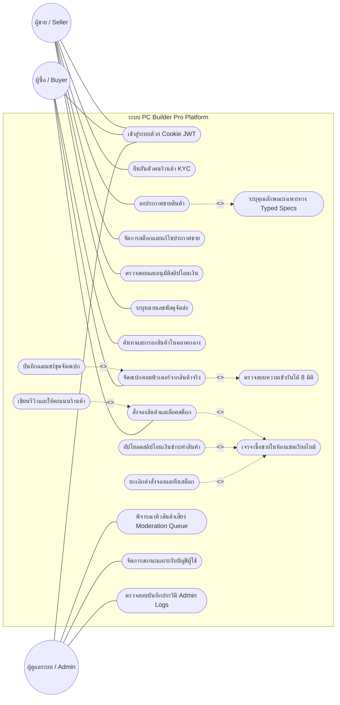
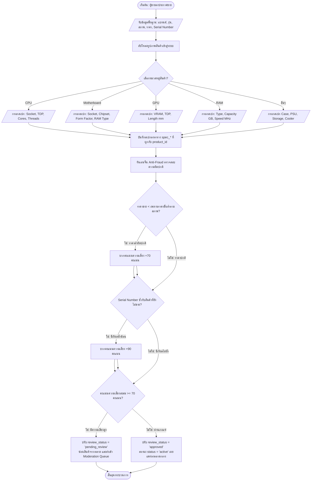
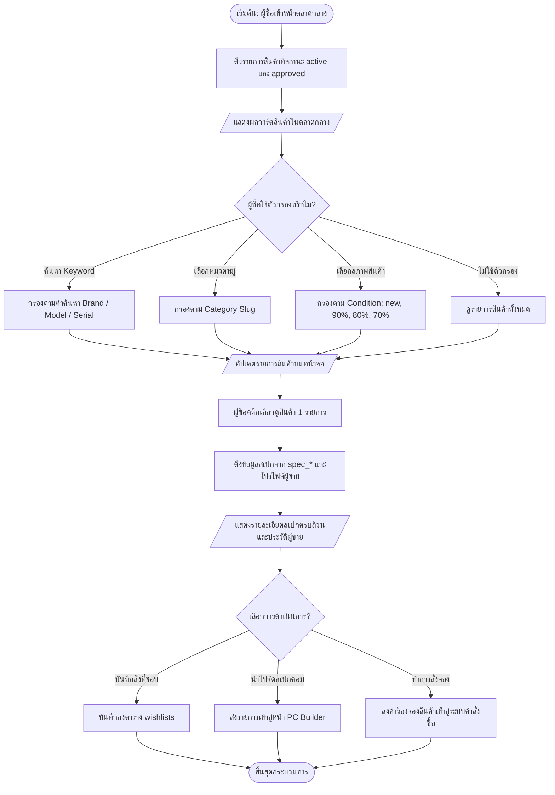
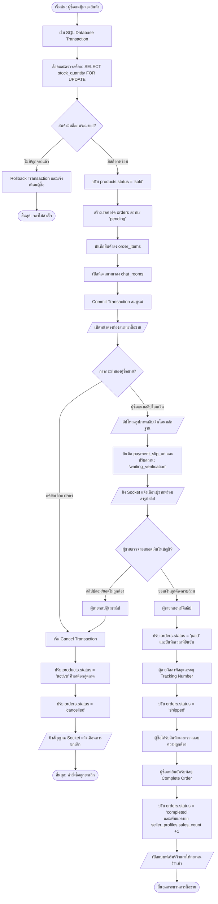
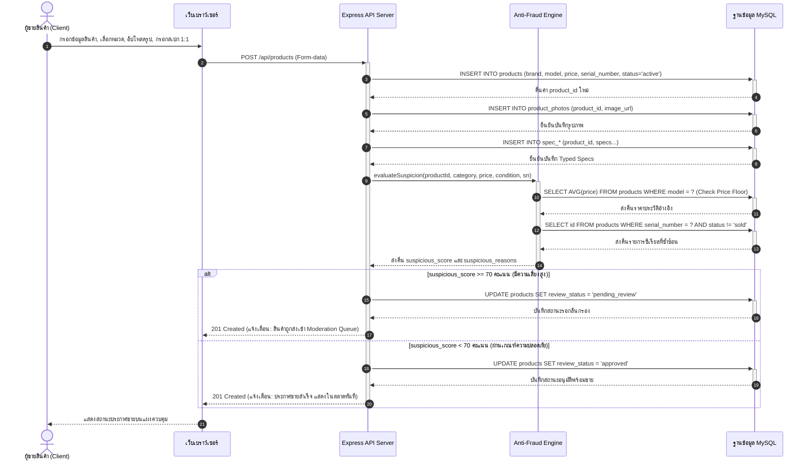
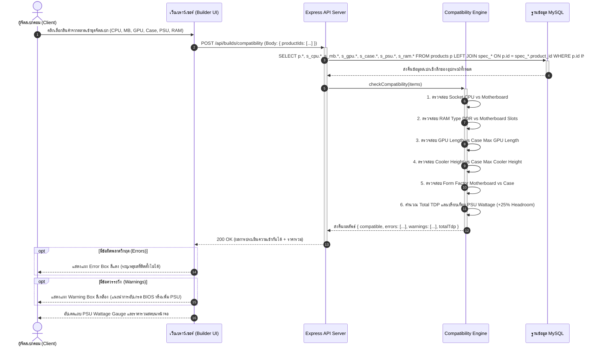
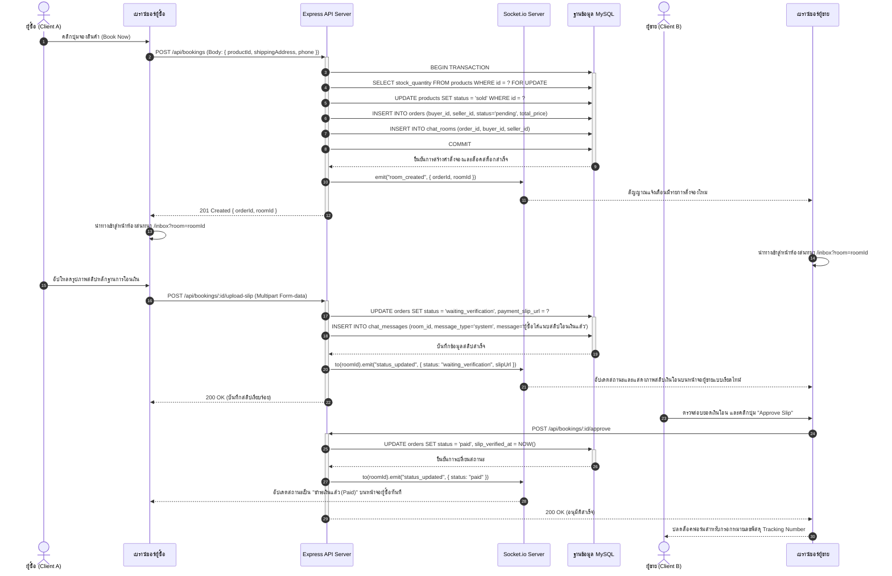

# คู่มือการจัดรูปแบบหน้ากระดาษใน Microsoft Word (สำหรับบทที่ 3)

ในการนำเนื้อหาบทที่ 3 ไปวางในโปรแกรม Microsoft Word ให้ปฏิบัติตามคำแนะนำในการตั้งค่าหน้ากระดาษดังนี้:

1. **ระยะขอบหน้ากระดาษ (Margins):**
   * **ขอบบน (Top):** 1.5 นิ้ว (3.81 ซม.) — *สำหรับหน้าแรกของบท* (หน้าถัดๆ ไปในบทเดียวกัน ตั้งค่าเป็น 1.0 นิ้ว หรือ 2.54 ซม.)
   * **ขอบล่าง (Bottom):** 1.0 นิ้ว (2.54 ซม.)
   * **ขอบซ้าย (Left):** 1.5 นิ้ว (3.81 ซม.) — *สำหรับขอบเข้าเล่ม*
   * **ขอบขวา (Right):** 1.0 นิ้ว (2.54 ซม.)
2. **การจัดรูปแบบตารางและภาพประกอบ (Tables & Figures):**
   * **คำอธิบายตาราง (Table Caption):** พิมพ์คำอธิบายไว้ **ด้านบนตาราง** ชิดขอบซ้าย ขนาด **16pt ตัวหนา** เช่น **ตารางที่ 3.1** โครงสร้างตาราง users
   * **คำอธิบายภาพ (Figure Caption):** พิมพ์คำอธิบายไว้ **ด้านล่างภาพ** จัดกึ่งกลางหน้ากระดาษ ขนาด **16pt ตัวหนา** เช่น **ภาพที่ 3.1** สถาปัตยกรรมระบบ
   * **ตัวตาราง:** เส้นขอบตารางควรใช้แบบมาตรฐานวิชาการ (ไม่มีเส้นขอบแนวตั้ง มีเฉพาะเส้นแนวนอนบนสุด ล่างสุด และเส้นใต้หัวตาราง) ตัวหนังสือในตารางใช้ขนาด 14pt-16pt ตามความเหมาะสม
3. **การจัดหัวข้อและฟอนต์ (Font & Headings):**
   * ใช้ฟอนต์หลัก: **TH Sarabun New** หรือ **TH Sarabun PSK**
   * **บทที่ 3 (บรรทัดแรก):** ขนาด **20pt ตัวหนา** จัดกึ่งกลางหน้ากระดาษ
   * **ชื่อบท (ขั้นตอนการดำเนินงาน):** ขนาด **20pt ตัวหนา** จัดกึ่งกลางหน้ากระดาษ
   * **หัวข้อย่อยหลัก (เช่น 3.1, 3.2):** ขนาด **18pt ตัวหนา** จัดชิดซ้าย
   * **หัวข้อย่อยรอง (เช่น 3.1.1):** ขนาด **16pt ตัวหนา** จัดชิดซ้าย (เยื้องขวา 1 Tab)

---

# บทที่ 3
# ขั้นตอนการดำเนินงาน

ในการดำเนินงานโครงการพัฒนาเว็บแอปพลิเคชัน **PC Builder Pro (แพลตฟอร์มจัดสเปกคอมพิวเตอร์ออนไลน์ และตลาดกลางซื้อขายชิ้นส่วนอะไหล่มือสอง C2C)** คณะผู้พัฒนาได้วิเคราะห์ ออกแบบระบบ และสร้างแผนภาพขั้นตอนการดำเนินงานเชิงวิศวกรรมซอฟต์แวร์ตามมาตรฐาน **ISO 5807** สำหรับผังงาน และมาตรฐาน **OMG UML 2.5** สำหรับแผนภาพระบบ ภายใต้สถาปัตยกรรม **Product-Centric Architecture** ซึ่งยึดถือรายการสินค้าที่ผู้ใช้งานลงประกาศขายจริงในระบบเป็นศูนย์กลางข้อมูลหลัก (Single Source of Truth) เพื่อนำไปใช้งานร่วมกันทั้งในตลาดกลางซื้อขายและเครื่องมือจัดสเปกคอมพิวเตอร์ โดยจำแนกรายละเอียดออกเป็นหัวข้อหลักดังต่อไปนี้:

* 3.1 การศึกษาข้อมูลและสถาปัตยกรรมระบบ
* 3.2 การออกแบบระบบและไดอะแกรมการทำงาน
* 3.3 การพัฒนาเว็บแอปพลิเคชัน

---

### 3.1 การศึกษาข้อมูลและสถาปัตยกรรมระบบ

#### 3.1.1 สถาปัตยกรรมการสื่อสารระบบ (System Architecture)
ระบบได้รับการออกแบบโครงสร้างการทำงานในรูปแบบ **3-Tier Client-Server Architecture** ซึ่งแยกหน้าที่การรับส่งข้อมูล การประมวลผลตรรกะทางธุรกิจ และการจัดการฐานข้อมูลออกจากกันอย่างเป็นสัดส่วน ดังแสดงรายละเอียดใน **ภาพที่ 3.1**:


**ภาพที่ 3.1** แผนภูมิสถาปัตยกรรมทางโครงสร้างและการรับส่งข้อมูลของระบบ PC Builder Pro

#### 3.1.2 รายละเอียดโครงสร้างตารางข้อมูลในระบบ (Database Table Schemas)
ฐานข้อมูลได้รับการออกแบบและพัฒนาบนระบบจัดการฐานข้อมูลเชิงสัมพันธ์ **MySQL (InnoDB Engine)** โดยกำหนดขนาดชนิดข้อมูล ดัชนีความเร็ว (Indexes) และข้อกำหนดคีย์นอก (Foreign Key Constraints) ดังตารางต่อไปนี้:

##### ตารางที่ 3.1 โครงสร้างตารางเก็บข้อมูลบัญชีผู้ใช้งาน (users)
| ลำดับ | ชื่อคอลัมน์ (Column Name) | ประเภทข้อมูล (Data Type) | ข้อกำหนด (Key / Constraints) | คำอธิบาย (Description) |
| :---: | :--- | :--- | :---: | :--- |
| 1 | `id` | INT | PK, Auto Increment | รหัสประจำตัวผู้ใช้งาน |
| 2 | `username` | VARCHAR(255) | Unique, Not Null | ชื่อบัญชีผู้ใช้งาน |
| 3 | `email` | VARCHAR(255) | Unique, Not Null | อีเมลประจำตัวผู้ใช้งาน |
| 4 | `password` | VARCHAR(255) | Not Null | รหัสผ่านที่เข้ารหัสด้วย bcrypt |
| 5 | `avatar_url` | TEXT | Nullable | พาธลิงก์รูปภาพโปรไฟล์ |
| 6 | `phone` | VARCHAR(50) | Unique, Nullable | หมายเลขโทรศัพท์ติดต่อ |
| 7 | `active_role` | VARCHAR(50) | Check constraint | บทบาทที่เปิดใช้: `'buyer'`, `'seller'` |
| 8 | `role` | VARCHAR(50) | Not Null (Default: `'member'`) | สิทธิ์ในระบบ: `'member'`, `'admin'` |
| 9 | `status` | VARCHAR(50) | Not Null (Default: `'active'`) | สถานะบัญชี: `'active'`, `'suspended'` |
| 10 | `created_at` | DATETIME | Default: CURRENT_TIMESTAMP | วันเวลาที่สร้างบัญชีผู้ใช้ |

##### ตารางที่ 3.2 โครงสร้างตารางเก็บข้อมูลโปรไฟล์และข้อมูลยืนยันตัวตนผู้ขาย (seller_profiles)
| ลำดับ | ชื่อคอลัมน์ (Column Name) | ประเภทข้อมูล (Data Type) | ข้อกำหนด (Key / Constraints) | คำอธิบาย (Description) |
| :---: | :--- | :--- | :---: | :--- |
| 1 | `user_id` | INT | PK, FK -> `users.id` ON DELETE CASCADE | รหัสผู้ใช้งานที่ผูก 1:1 กับตาราง users |
| 2 | `shop_name` | VARCHAR(255) | Nullable | ชื่อร้านค้าของผู้ขาย |
| 3 | `full_name` | VARCHAR(255) | Nullable | ชื่อ-นามสกุลจริงของผู้ขาย |
| 4 | `contact_phone` | VARCHAR(50) | Nullable | หมายเลขโทรศัพท์ร้านค้า |
| 5 | `bank_name` | VARCHAR(100) | Nullable | ชื่อธนาคารสำหรับรับเงินโอน |
| 6 | `bank_account_number` | VARCHAR(100) | Nullable | เลขที่บัญชีธนาคารสำหรับรับเงินโอน |
| 7 | `bank_account_name` | VARCHAR(255) | Nullable | ชื่อบัญชีธนาคารผู้รับเงิน |
| 8 | `kyc_status` | VARCHAR(50) | Default: `'none'` | สถานะยืนยันตัวตน: `'none'`, `'pending'`, `'verified'`, `'rejected'` |
| 9 | `rating` | DECIMAL(3, 2) | Default: 0.00 | คะแนนเฉลี่ยความน่าเชื่อถือของผู้ขาย (1.00 - 5.00) |
| 10 | `sales_count` | INT | Default: 0 | จำนวนรายการออเดอร์ที่จำหน่ายสำเร็จ |

##### ตารางที่ 3.3 โครงสร้างตารางเก็บรายการสินค้าที่ลงประกาศขาย (products - ศูนย์กลางข้อมูลหลัก)
| ลำดับ | ชื่อคอลัมน์ (Column Name) | ประเภทข้อมูล (Data Type) | ข้อกำหนด (Key / Constraints) | คำอธิบาย (Description) |
| :---: | :--- | :--- | :---: | :--- |
| 1 | `id` | INT | PK, Auto Increment | รหัสสินค้าในระบบ |
| 2 | `seller_id` | INT | FK -> `users.id`, Index | รหัสผู้ขายที่ลงประกาศ |
| 3 | `category_id` | INT | FK -> `categories.id`, Index | รหัสหมวดหมู่ของสินค้า |
| 4 | `brand` | VARCHAR(100) | Not Null, Index | ยี่ห้อผู้ผลิต (เช่น Intel, AMD, ASUS, MSI) |
| 5 | `model` | VARCHAR(150) | Not Null, Index | รุ่นของสินค้า |
| 6 | `condition` | VARCHAR(50) | Check constraint | สภาพสินค้า: `'new'`, `'used_90'`, `'used_80'`, `'used_70'` |
| 7 | `price` | DECIMAL(10, 2) | Not Null, Index | ราคาประกาศขายสินค้า |
| 8 | `original_price` | DECIMAL(10, 2) | Nullable | ราคาเปิดตัว/ราคาซื้อมือหนึ่ง (ใช้อ้างอิงราคา) |
| 9 | `stock_quantity` | INT | Not Null (Default: 1) | จำนวนสินค้าในสต็อก |
| 10 | `serial_number` | VARCHAR(255) | Nullable, Index | หมายเลขซีเรียลนัมเบอร์ฮาร์ดแวร์จริง |
| 11 | `description` | TEXT | Nullable | รายละเอียดคำอธิบายสินค้า |
| 12 | `status` | VARCHAR(50) | Check, Index | สถานะจำหน่าย: `'active'`, `'sold'`, `'paused'` |
| 13 | `review_status` | VARCHAR(50) | Check, Index | สถานะการตรวจสอบ: `'approved'`, `'pending_review'`, `'rejected'` |
| 14 | `suspicious_score` | INT | Not Null (Default: 0) | คะแนนความน่าสงสัยของการทุจริต (0-100) |
| 15 | `suspicious_reasons` | TEXT | Not Null | เหตุผลความเสี่ยงเก็บในรูปแบบ JSON Array |
| 16 | `created_at` | DATETIME | Default: CURRENT_TIMESTAMP | วันเวลาที่สร้างประกาศขาย |

##### ตารางที่ 3.4 โครงสร้างตารางเก็บคุณลักษณะเฉพาะทางเทคนิคของสินค้าครอบคลุมทุกหมวดหมู่ (Typed Spec Tables)
ระบบแยกตารางสเปกเฉพาะทาง 8 หมวดหมู่ เชื่อมโยง 1:1 กับ `products.id` ผ่านคีย์นอก `product_id` (ON DELETE CASCADE):

1. **ตาราง `spec_cpu` (หน่วยประมวลผลกลาง):**
   * `product_id` (PK, FK), `socket` (VARCHAR(50), ซ็อกเก็ต เช่น LGA1700, AM5), `generation` (VARCHAR(50)), `series` (VARCHAR(50)), `tdp` (INT, กำลังไฟความร้อน วัตต์), `cores` (INT), `threads` (INT), `integrated_graphics` (TINYINT)
2. **ตาราง `spec_cpu_cooler` (ชุดระบายความร้อนซีพียู):**
   * `product_id` (PK, FK), `cooler_type` (VARCHAR(50), เช่น Air, Liquid 240mm), `radiator_size` (INT), `height_mm` (INT, ความสูงพัดลม มม.), `supported_sockets` (TEXT, ซ็อกเก็ตที่รองรับ)
3. **ตาราง `spec_motherboard` (เมนบอร์ด):**
   * `product_id` (PK, FK), `socket` (VARCHAR(50)), `chipset` (VARCHAR(50)), `generation` (VARCHAR(50)), `form_factor` (VARCHAR(50), เช่น ATX, Micro-ATX, Mini-ITX), `ram_type` (VARCHAR(20), เช่น DDR4, DDR5), `ram_slots` (INT), `max_ram_gb` (INT)
4. **ตาราง `spec_ram` (หน่วยความจำหลัก):**
   * `product_id` (PK, FK), `type` (VARCHAR(20), เช่น DDR4, DDR5), `capacity_gb` (INT, ความจุ GB), `speed` (INT, บัส MHz), `modules` (INT, จำนวนแถว)
5. **ตาราง `spec_gpu` (การ์ดแสดงผล):**
   * `product_id` (PK, FK), `series` (VARCHAR(50)), `chip` (VARCHAR(100)), `vram_gb` (INT), `vram_type` (VARCHAR(20)), `tdp` (INT, วัตต์), `length_mm` (INT, ความยาวการ์ด มม.)
6. **ตาราง `spec_case` (เคสคอมพิวเตอร์):**
   * `product_id` (PK, FK), `form_factor` (VARCHAR(50)), `case_type` (VARCHAR(50)), `max_gpu_length_mm` (INT, รองรับความยาวการ์ดจอสูงสุด), `max_cooler_height_mm` (INT, รองรับความสูงพัดลมสูงสุด), `radiator_support` (VARCHAR(100))
7. **ตาราง `spec_psu` (พาวเวอร์ซัพพลาย):**
   * `product_id` (PK, FK), `wattage` (INT, กำลังวัตต์ เช่น 650, 750, 850), `efficiency` (VARCHAR(50), เช่น 80 Plus Bronze/Gold), `modularity` (VARCHAR(50), เช่น Non-Modular, Fully-Modular)
8. **ตาราง `spec_storage` (อุปกรณ์จัดเก็บข้อมูล):**
   * `product_id` (PK, FK), `interface` (VARCHAR(50), เช่น NVMe PCIe 4.0, SATA III), `capacity_gb` (INT), `read_speed` (VARCHAR(50))

##### ตารางที่ 3.5 โครงสร้างตารางเก็บชุดจัดสเปกคอมพิวเตอร์และชิ้นส่วนในชุด (builds & build_parts)
* **ตาราง `builds`:** `id` (PK), `user_id` (FK -> `users.id`), `name` (VARCHAR(255)), `description` (TEXT), `is_public` (TINYINT), `total_price` (DECIMAL(12, 2)), `created_at` (DATETIME)
* **ตาราง `build_parts` (ตารางเชื่อมโยงการจัดสเปกกับสินค้าในตลาด):** `id` (PK), `build_id` (FK -> `builds.id`), `product_id` (FK -> `products.id`), `quantity` (INT), `price` (DECIMAL(10, 2))

##### ตารางที่ 3.6 โครงสร้างตารางเก็บรายการสั่งซื้อจองและรายการสินค้า (orders & order_items)
* **ตาราง `orders`:** `id` (PK), `buyer_id` (FK -> `users.id`), `seller_id` (FK -> `users.id`), `status` (VARCHAR(50), Check: `'pending'`, `'waiting_verification'`, `'paid'`, `'shipped'`, `'completed'`, `'cancelled'`, `'disputed'`), `shipping_address` (TEXT), `contact_phone` (VARCHAR(50)), `total_price` (DECIMAL(12, 2)), `courier_name` (VARCHAR(100)), `tracking_number` (VARCHAR(100)), `payment_slip_url` (VARCHAR(255)), `created_at` (DATETIME)
* **ตาราง `order_items`:** `id` (PK), `order_id` (FK -> `orders.id`), `product_id` (FK -> `products.id`), `price` (INT)

##### ตารางที่ 3.7 โครงสร้างตารางห้องแชตเจรจาและข้อความเรียลไทม์ (chat_rooms & chat_messages)
* **ตาราง `chat_rooms`:** `id` (PK), `order_id` (FK -> `orders.id`), `buyer_id` (FK -> `users.id`), `seller_id` (FK -> `users.id`), `created_at` (DATETIME)
* **ตาราง `chat_messages`:** `id` (PK), `room_id` (FK -> `chat_rooms.id`), `sender_id` (FK -> `users.id`), `message_type` (VARCHAR(50), `'text'`, `'system'`), `message` (TEXT), `created_at` (DATETIME)

---

### 3.2 การออกแบบระบบและไดอะแกรมการทำงาน

#### 3.2.1 การออกแบบความสัมพันธ์ตารางข้อมูลฐานข้อมูล (Entity-Relationship Diagram: ERD)
แผนภาพ ER Diagram แสดงความเชื่อมโยงภายใต้สถาปัตยกรรม **Product-Centric** ตามมาตรฐาน Crow's Foot Notation โดยรายการสินค้าที่ลงประกาศขาย (`products`) เป็นศูนย์กลางเชื่อมโยงไปยังตารางสเปกย่อยทั้ง 8 หมวดหมู่, แกลเลอรีรูปภาพสินค้า, ชุดจัดสเปกคอมพิวเตอร์ และรายการสั่งซื้อ ดังแสดงใน **ภาพที่ 3.2**:

```mermaid
erDiagram
    users ||--o| seller_profiles : "มีโปรไฟล์ผู้ขาย (1:0..1)"
    users ||--o{ buyer_addresses : "มีที่อยู่จัดส่ง (1:0..N)"
    users ||--o{ products : "ลงประกาศขาย (1:0..N)"
    users ||--o{ builds : "สร้างชุดจัดสเปก (1:0..N)"
    users ||--o{ build_likes : "กดถูกใจสเปก (1:0..N)"
    users ||--o{ orders : "สั่งซื้อสินค้า (1:0..N)"
    users ||--o{ reviews : "เขียนรีวิวผู้ขาย (1:0..N)"
    users ||--o{ wishlists : "บันทึกสินค้าโปรด (1:0..N)"
    users ||--o{ admin_logs : "บันทึกการกระทำแอดมิน (1:0..N)"

    categories ||--o{ products : "จำแนกหมวดหมู่ (1:0..N)"
    products ||--o{ product_photos : "มีรูปภาพประกอบ (1:0..N)"
    products ||--o{ product_review_flags : "มีธงแจ้งเตือนความเสี่ยง (1:0..N)"
    products ||--o{ wishlists : "ถูกบันทึกเป็นสินค้าโปรด (1:0..N)"
    
    %% 8 Typed Specs (1:0..1)
    products ||--o| spec_cpu : "มีสเปก CPU (1:0..1)"
    products ||--o| spec_cpu_cooler : "มีสเปก Cooler (1:0..1)"
    products ||--o| spec_motherboard : "มีสเปก Motherboard (1:0..1)"
    products ||--o| spec_ram : "มีสเปก RAM (1:0..1)"
    products ||--o| spec_gpu : "มีสเปก GPU (1:0..1)"
    products ||--o| spec_case : "มีสเปก Case (1:0..1)"
    products ||--o| spec_psu : "มีสเปก PSU (1:0..1)"
    products ||--o| spec_storage : "มีสเปก Storage (1:0..1)"

    %% Junction Tables for N:M
    builds ||--|{ build_parts : "ประกอบด้วยชิ้นส่วน (1:1..N)"
    products ||--o{ build_parts : "ถูกเลือกเข้าจัดสเปก (1:0..N)"
    builds ||--o{ build_likes : "ได้รับการกดถูกใจ (1:0..N)"

    orders ||--|{ order_items : "ประกอบด้วยรายการสินค้า (1:1..N)"
    products ||--o{ order_items : "ผูกสินค้าที่ซื้อ (1:0..N)"

    %% Orders, Chat & Review
    orders ||--|| chat_rooms : "เปิดห้องสนทนาซื้อขาย (1:1)"
    chat_rooms ||--o{ chat_messages : "บันทึกข้อความแชต (1:0..N)"
    orders ||--o| reviews : "ได้รับผลรีวิว (1:0..1)"

    users {
        int id PK
        varchar username
        varchar email
        varchar password
        varchar active_role
        varchar role
        varchar status
        datetime created_at
    }
    seller_profiles {
        int user_id PK,FK
        varchar shop_name
        varchar contact_phone
        varchar bank_name
        varchar bank_account_number
        varchar kyc_status
        decimal rating
        int sales_count
    }
    buyer_addresses {
        int id PK
        int user_id FK
        varchar recipient_name
        varchar phone
        text address_line
        tinyint is_default
    }
    categories {
        int id PK
        varchar name
        varchar slug
        varchar icon
    }
    products {
        int id PK
        int seller_id FK
        int category_id FK
        varchar brand
        varchar model
        varchar condition
        decimal price
        int stock_quantity
        varchar serial_number
        varchar status
        varchar review_status
        int suspicious_score
    }
    product_photos {
        int id PK
        int product_id FK
        text image_url
        tinyint is_primary
        int sort_order
    }
    product_review_flags {
        int id PK
        int product_id FK
        varchar reason
        varchar severity
        datetime created_at
    }
    spec_cpu {
        int product_id PK,FK
        varchar socket
        varchar generation
        varchar series
        int tdp
        int cores
        int threads
    }
    spec_cpu_cooler {
        int product_id PK,FK
        varchar cooler_type
        int radiator_size
        int height_mm
        text supported_sockets
    }
    spec_motherboard {
        int product_id PK,FK
        varchar socket
        varchar chipset
        varchar form_factor
        varchar ram_type
        int ram_slots
        int max_ram_gb
    }
    spec_ram {
        int product_id PK,FK
        varchar type
        int capacity_gb
        int speed
        int modules
    }
    spec_gpu {
        int product_id PK,FK
        varchar series
        varchar chip
        int vram_gb
        int tdp
        int length_mm
    }
    spec_case {
        int product_id PK,FK
        varchar form_factor
        int max_gpu_length_mm
        int max_cooler_height_mm
    }
    spec_psu {
        int product_id PK,FK
        int wattage
        varchar efficiency
        varchar modularity
    }
    spec_storage {
        int product_id PK,FK
        varchar interface
        int capacity_gb
        varchar read_speed
    }
    builds {
        int id PK
        int user_id FK
        varchar name
        tinyint is_public
        decimal total_price
    }
    build_parts {
        int id PK
        int build_id FK
        int product_id FK
        int quantity
        decimal price
    }
    build_likes {
        int id PK
        int build_id FK
        int user_id FK
        datetime created_at
    }
    orders {
        int id PK
        int buyer_id FK
        int seller_id FK
        varchar status
        text shipping_address
        varchar contact_phone
        decimal total_price
        varchar courier_name
        varchar tracking_number
        varchar payment_slip_url
    }
    order_items {
        int id PK
        int order_id FK
        int product_id FK
        decimal price
    }
    chat_rooms {
        int id PK
        int order_id FK
        int buyer_id FK
        int seller_id FK
        datetime created_at
    }
    chat_messages {
        int id PK
        int room_id FK
        int sender_id FK
        varchar message_type
        text message
        datetime created_at
    }
    reviews {
        int id PK
        int order_id FK
        int reviewer_id FK
        int seller_id FK
        int rating
        text comment
    }
    wishlists {
        int id PK
        int user_id FK
        int product_id FK
        datetime created_at
    }
    admin_logs {
        int id PK
        int admin_id FK
        varchar action
        text details
        datetime created_at
    }
```


**ภาพที่ 3.2** Entity-Relationship Diagram (ERD) แสดงโครงสร้างความสัมพันธ์ฐานข้อมูลเชิงสัมพันธ์แบบ Product-Centric Architecture (Crow's Foot Notation)

---

#### 3.2.2 การออกแบบแผนภาพจำแนกการโต้ตอบผู้ใช้งาน (Use Case Diagram)
แผนภาพ Use Case Diagram อธิบายขอบเขตปฏิสัมพันธ์และสิทธิ์การเข้าถึงข้อมูลระบบแยกตามบทบาทของผู้ใช้งาน 3 กลุ่ม ได้แก่ ผู้ขาย (Seller), ผู้ซื้อ/ผู้จัดสเปก (Buyer), และผู้ดูแลระบบ (Admin) ตามมาตรฐาน **OMG UML 2.5** ดังแสดงใน **ภาพที่ 3.3**:


**ภาพที่ 3.3** Use Case Diagram แสดงขอบเขตการใช้งานจำแนกตามขั้นตอนการดำเนินงานของผู้ใช้แต่ละบทบาท (OMG UML 2.5 Standard)

---

#### 3.2.3 การออกแบบ Flowchart การทำงานของระบบ (System Process Flowcharts)
ลำดับขั้นตอนการทำงานของระบบจำแนกตามวงจรการทำงานจริง (Data Lifecycle: จากการลงขาย -> ตลาด -> จัดสเปก -> การสั่งจอง -> จบธุรกรรม) ตามมาตรฐาน **ISO 5807** ดังนี้:

##### 3.2.3.1 Flowchart 1: การลงประกาศขายสินค้าและการตรวจคัดกรองความเสี่ยง Anti-Fraud
แสดงกระบวนการตั้งแต่ผู้ขายป้อนข้อมูลสินค้า อัปโหลดรูปภาพ บันทึกสเปกเฉพาะทาง 1:1 และการคำนวณคะแนนความเสี่ยง ดังแสดงใน **ภาพที่ 3.4**:


**ภาพที่ 3.4** Flowchart การลงประกาศขายสินค้า การบันทึก Typed Specs และการประเมินความเสี่ยง Anti-Fraud Engine (ISO 5807)

---

##### 3.2.3.2 Flowchart 2: การค้นหาสินค้าในตลาดกลางและการเลือกดูสเปก
แสดงขั้นตอนที่ผู้ซื้อเข้าใช้งานตลาดกลางเพื่อค้นหาและตรวจสอบสเปกชิ้นส่วนคอมพิวเตอร์ ดังแสดงใน **ภาพที่ 3.5**:


**ภาพที่ 3.5** Flowchart การสืบค้นสินค้าและการเรียกดูคุณลักษณะทางเทคนิคในตลาดกลาง (ISO 5807)

---

##### 3.2.3.3 Flowchart 3: การนำสินค้าในระบบมาจัดสเปกและตรวจสอบความเข้ากันได้ 8 มิติ
แสดงกระบวนการจัดชุดคอมพิวเตอร์โดยดึงสินค้าที่มีอยู่จริงในระบบมารันตรวจสอบเงื่อนไขทางวิศวกรรม ดังแสดงใน **ภาพที่ 3.6**:

```mermaid
flowchart TD
    Start([เริ่มต้น: เข้าสู่หน้า PC Builder]) --> PickSlot[เลือกช่องหมวดหมู่อุปกรณ์]
    PickSlot --> FetchMarketItems[ดึงรายการสินค้าจริงที่มีในตลาดของหมวดนั้น]
    FetchMarketItems --> SelectProduct[เลือกสินค้า 1 ชิ้นเข้าสู่ชุดจัดสเปก]
    SelectProduct --> TriggerEngine[ส่ง Product IDs เข้าประเมิน Compatibility]
    
    TriggerEngine --> CheckSocket{1. CPU Socket ตรงกับ Motherboard Socket?}
    CheckSocket -- ไม่ตรงกัน --> AddErr1[บันทึก ERROR: Socket ขัดแย้งกัน ไม่สามารถติดตั้งได้] --> CheckChipset
    CheckSocket -- ตรงกัน --> CheckChipset{2. Chipset รองรับ Generation ของ CPU?}
    
    CheckChipset -- ต้องอัปเกรด BIOS --> AddWarn2[บันทึก WARNING: Chipset อาจต้องอัปเดต BIOS] --> CheckRAMType
    CheckChipset -- รองรับสมบูรณ์ --> CheckRAMType{3. RAM Type DDR ตรงกับ Motherboard?}
    
    AddErr1 --> CheckChipset
    AddWarn2 --> CheckRAMType
    
    CheckRAMType -- ไม่ตรงกัน --> AddErr3[บันทึก ERROR: ชนิด DDR ของ RAM ไม่ตรงกับเมนบอร์ด] --> CheckRAMLimit
    CheckRAMType -- ตรงกัน --> CheckRAMLimit{4. จำนวนแถวหรือความจุ RAM เกินสเปกบอร์ด?}
    
    CheckRAMLimit -- เกินขีดจำกัด --> AddWarn4[บันทึก WARNING: ความจุหรือแถว RAM เกินลิมิตบอร์ด] --> CheckGPULength
    CheckRAMLimit -- ไม่เกิน --> CheckGPULength{5. ความยาว GPU เกินขนาดพื้นที่ของ Case?}
    
    AddErr3 --> CheckRAMLimit
    AddWarn4 --> CheckGPULength
    
    CheckGPULength -- ยาวเกินเคส --> AddErr5[บันทึก ERROR: การ์ดจอยาวเกินพื้นที่ตู้เคส] --> CheckCoolerHeight
    CheckGPULength -- ขนาดพอดี --> CheckCoolerHeight{6. ความสูงพัดลม CPU เกินฝาข้าง Case?}
    
    AddErr5 --> CheckCoolerHeight
    
    CheckCoolerHeight -- สูงเกินเคส --> AddErr6[บันทึก ERROR: พัดลมระบายความร้อนสูงเกินฝาข้างเคส] --> CheckMBForm
    CheckCoolerHeight -- ขนาดพอดี --> CheckMBForm{7. Form Factor เมนบอร์ดใส่ใน Case ได้?}
    
    AddErr6 --> CheckMBForm
    
    CheckMBForm -- ขนาดบอร์ดใหญ่เกินเคส --> AddErr7[บันทึก ERROR: ขนาดเมนบอร์ดใหญ่กว่าที่เคสรองรับ] --> CalcPower
    CheckMBForm -- ขนาดพอดี --> CalcPower[8. คำนวณ TDP รวม = CPU TDP + GPU TDP + 70W อุปกรณ์อื่น]
    
    AddErr7 --> CalcPower
    
    CalcPower --> CheckPSU{วัตต์ PSU < TDP รวม?}
    CheckPSU -- วัตต์ไม่พอจ่ายไฟ --> AddErr8[บันทึก ERROR: กำลังไฟ PSU ไม่เพียงพอกับที่ระบบใช้] --> ReturnResult
    CheckPSU -- วัตต์พอ แต่สำรอง < 25% --> AddWarn8[บันทึก WARNING: วัตต์ PSU สำรองน้อยกว่า 25%] --> ReturnResult
    CheckPSU -- วัตต์เพียงพอสมบูรณ์ --> ReturnResult[/ส่งผลการประเมิน Errors/Warnings และราคารวมกลับหน้าจอ/]
    
    AddErr8 --> ReturnResult
    AddWarn8 --> ReturnResult
    
    ReturnResult --> UserDecision{ผู้ใช้บันทึกชุดสเปกหรือไม่?}
    UserDecision -- ใช่ --> SaveDB[บันทึกลงตาราง builds และ build_parts] --> End([สิ้นสุดกระบวนการ])
    UserDecision -- ไม่ใช่/ปรับแต่งต่อ --> PickSlot
```


**ภาพที่ 3.6** Flowchart การจัดสเปกคอมพิวเตอร์และการประเมินความเข้ากันได้ 8 มิติ (ISO 5807)

---

##### 3.2.3.4 Flowchart 4: วงจรคำสั่งซื้อ การล็อคสต็อก การแชตส่งสลิป และการ Rollback
แสดงขั้นตอนการทำธุรกรรมแบบ C2C ผ่านระบบห้องสนทนา และการคืนสต็อกสินค้าเมื่อมีการยกเลิกคำสั่งซื้อ ดังแสดงใน **ภาพที่ 3.7**:


**ภาพที่ 3.7** Flowchart วงจรคำสั่งซื้อ C2C การล็อคสต็อก การตรวจสอบสลิปเงินโอน และการ Rollback คืนสต็อก (ISO 5807)

---

##### 3.2.3.5 Flowchart 5: การส่งมอบสินค้า การปิดยอดออเดอร์ และการให้คะแนนรีวิวร้านค้า
แสดงกระบวนการปิดรอบธุรกรรมและการให้คะแนนผู้ขายเพื่อคำนวณคะแนนเฉลี่ยความน่าเชื่อถือใหม่ ดังแสดงใน **ภาพที่ 3.8**:

```mermaid
flowchart TD
    Start([เริ่มต้น: ออเดอร์สถานะ completed]) --> OpenReviewForm[/ผู้ซื้อเปิดแบบฟอร์มรีวิวร้านค้า/]
    OpenReviewForm --> InputReview[/เลือกคะแนน 1 - 5 ดาว และพิมพ์ข้อความความคิดเห็น/]
    InputReview --> SubmitReview[ส่งคำร้อง API POST /api/reviews]
    
    SubmitReview --> CheckExisting{เคยรีวิวออเดอร์นี้แล้วหรือยัง?}
    CheckExisting -- เคยรีวิวแล้ว --> ShowErr[/แสดงข้อผิดพลาด: รีวิวได้เพียง 1 ครั้งต่อออเดอร์/] --> EndFail([สิ้นสุด: ปฏิเสธการรีวิว])
    CheckExisting -- ยังไม่เคยรีวิว --> InsertReview[บันทึกข้อมูลลงตาราง reviews]
    
    InsertReview --> CalcAvgRating[คำนวณคะแนนเฉลี่ยใหม่: SELECT AVG(rating) FROM reviews WHERE seller_id = ?]
    CalcAvgRating --> UpdateProfile[อัปเดต seller_profiles.rating = ค่าเฉลี่ยใหม่]
    UpdateProfile --> UpdateSellerBadge[คำนวณสิทธิ์เข็มกลัดร้านค้ายอดเยี่ยม Top Rated Seller]
    UpdateSellerBadge --> ShowSuccess[/แสดงผลคะแนนดาวใหม่บนหน้าร้านค้า/] --> EndSuccess([สิ้นสุดกระบวนการรีวิว])
```
**ภาพที่ 3.8** Flowchart การประเมินคะแนนรีวิวร้านค้าและการคำนวณคะแนนความน่าเชื่อถือ (ISO 5807)

---

#### 3.2.4 แผนภาพลำดับการทำงานของระบบ (Sequence Diagrams)

##### 3.2.4.1 Sequence Diagram 1: การลงขายสินค้า การบันทึกสเปก 1:1 และการคำนวณคะแนนความเสี่ยง
แสดงลำดับการสื่อสารเมื่อผู้ขายลงประกาศขายสินค้าและการทำงานของ Anti-Fraud Engine ตามมาตรฐาน **OMG UML 2.5** ดังแสดงใน **ภาพที่ 3.9**:


**ภาพที่ 3.9** Sequence Diagram ลำดับขั้นตอนการลงประกาศขาย การจัดเก็บสเปก 1:1 และการตรวจสอบความเสี่ยงทุจริต (OMG UML 2.5)

---

##### 3.2.4.2 Sequence Diagram 2: การดึงสินค้าในตลาดมาประกอบสเปกและการประเมินความเข้ากันได้
แสดงลำดับการเลือกชิ้นส่วนและการรันตรวจสอบความเข้ากันได้แบบ 8 มิติ ดังแสดงใน **ภาพที่ 3.10**:


**ภาพที่ 3.10** Sequence Diagram ลำดับการประเมินความเข้ากันได้ของชิ้นส่วนคอมพิวเตอร์ในระบบจัดสเปก (OMG UML 2.5)

---

##### 3.2.4.3 Sequence Diagram 3: การสั่งจองสินค้า การเจรจาโอนเงินผ่าน WebSockets และการอนุมัติสลิป
แสดงลำดับการทำงานของการล็อคสต็อก การส่งสลิปผ่านห้องแชต และการกระจายสัญญาณ Socket ดังแสดงใน **ภาพที่ 3.11**:


**ภาพที่ 3.11** Sequence Diagram ลำดับการสั่งจอง การส่งสลิปเงินโอน และการยืนยันยอดเงินผ่านห้องสนทนาเรียลไทม์ (OMG UML 2.5)

---

#### 3.2.5 การออกแบบส่วนติดต่อผู้ใช้งาน (UX/UI Wireframes Design)
คณะผู้พัฒนาได้ออกแบบโครงสร้างส่วนติดต่อผู้ใช้งานภายใต้แนวคิด **Glassmorphism Aesthetic** ผสานความสวยงามแบบพรีเมียมล้ำสมัย (Futuristic Look) เข้ากับความสะดวกในการใช้งานจริง:
* **Sidebar Navigation:** แถบเมนูนำทางจัดวางชิดซ้ายเพื่อความสะดวกในการสลับหน้าจอระหว่าง ตลาดกลาง (Marketplace), เวิร์กสเปซจัดสเปก (PC Builder), ห้องสนทนา (Chats), และโปรไฟล์ร้านค้า (Seller Hub)
* **Product Listing Grid:** จัดวางการ์ดสินค้าแบบ CSS Grid Layout ที่ปรับขนาดอัตโนมัติตามความกว้างหน้าจอ แสดงรูปภาพสินค้า สภาพ ป้ายความเข้ากันได้ และราคาชัดเจน
* **PC Builder Workspace:** แบ่งหน้าจอเป็น 2 ฝั่งหลัก ฝั่งซ้ายเป็นรายการช่องชิ้นส่วนอุปกรณ์ 8 หมวดหมู่ ฝั่งขวาเป็นแผงสรุปผลกำลังวัตต์ PSU และแถบแจ้งเตือนระดับวิกฤต (Error Panel) ที่จะปรากฏขึ้นทันทีหากพบความไม่เข้ากันได้ทางวิศวกรรม

---

### 3.3 การพัฒนาเว็บแอปพลิเคชัน

#### 3.3.1 โครงสร้างไฟล์และสถาปัตยกรรมซอฟต์แวร์ (Project Structure)
ระบบได้รับการจัดวางโครงสร้างไดเรกทอรีอย่างเป็นระบบตามมาตรฐาน Separation of Concerns:
```text
project/
├── 02_database/
│   ├── schema_mysql.sql          # สคริปต์โครงสร้างตาราง MySQL Product-Centric
│   └── seed_data_mysql.sql       # ข้อมูลตัวอย่างสินค้าและสเปกสำหรับทดสอบ
├── 03_backend/
│   ├── config/
│   │   ├── db.js                 # ระบบ MySQL Connection Pool (mysql2/promise)
│   │   └── socket.js             # การกำหนดค่า WebSockets Event Handlers
│   ├── controllers/
│   │   ├── authController.js     # ควบคุมระบบ Login, Register, JWT Cookies
│   │   ├── productController.js  # จัดการสินค้า, Typed Specs และ Anti-Fraud Engine
│   │   ├── buildsController.js   # ควบคุมการจัดสเปกคอมพิวเตอร์
│   │   ├── bookingController.js  # ควบคุมวงจรออเดอร์, ล็อคสต็อก, สลิป และ Rollback
│   │   └── adminController.js    # จัดการ Moderation Queue และ Activity Logs
│   ├── services/
│   │   └── compatibilityService.js # เอนจิ้นตรวจสอบความเข้ากันได้ 8 มิติ
│   └── server.js                 # จุดเริ่มต้นหลักของ Express Application Server
└── 04_frontend/
    ├── css/                      # สไตล์ชีท Glassmorphism และธีม Dark/Light
    ├── js/                       # สคริปต์ควบคุมการโต้ตอบหน้าเว็บและ Socket Client
    ├── index.html                # หน้าแรกและทางเข้าสู่ระบบ
    ├── products.html             # หน้าตลาดกลางซื้อขายสินค้า C2C
    ├── builder.html              # หน้าเวิร์กสเปซจัดสเปกคอมพิวเตอร์ออนไลน์
    ├── inbox.html                # หน้าต่างห้องสนทนาเจรจาซื้อขายเรียลไทม์
    └── admin.html                # แผงควบคุมสำหรับผู้ดูแลระบบ
```

#### 3.3.2 การพัฒนาส่วนติดต่อผู้ใช้งานฝั่ง Client-side (Vanilla HTML/CSS/JS)
ส่วนติดต่อผู้ใช้งานพัฒนาขึ้นโดยใช้เทคโนโลยีมาตรฐานเว็บที่ไม่พึ่งพาเฟรมเวิร์กขนาดใหญ่ เพื่อให้โหลดได้รวดเร็วและตอบสนองได้ทันที:
* **Glassmorphic Styling:** ใช้คำสั่ง CSS `backdrop-filter: blur(12px)`, `background: rgba(25, 25, 35, 0.65)` และเส้นขอบบาง `border: 1px solid rgba(255, 255, 255, 0.08)`
* **Dynamic DOM & Asynchronous Fetch:** ควบคุมการดึงข้อมูลและอัปเดตหน้าจอแบบ Single-Page Experience ผ่านการส่งคำขอแบบ Asynchronous โดยไม่มีการรีเฟรชหน้าเว็บ

#### 3.3.3 การพัฒนาฝั่ง Logic Tier & RESTful API (Express.js)
เซิร์ฟเวอร์หลังบ้านพัฒนาขึ้นบน Node.js และ Express.js ทำหน้าที่ประมวลผลคำขอและตรวจสอบสิทธิ์:
* **JWT Cookie Authentication:** ดึงโทเค็นจาก HttpOnly Cookie ในทุกคำขอเพื่อระบุตัวตนและตรวจสอบสิทธิ์ตามบทบาท (`member` หรือ `admin`)
* **Atomic Database Transactions:** ใช้คำสั่ง `await conn.beginTransaction()`, `await conn.commit()` และ `await conn.rollback()` ในขั้นตอนการจองและยกเลิกออเดอร์ เพื่อรับประกันว่าสถานะสต็อกและธุรกรรมจะมีความถูกต้องสมบูรณ์เสมอ

#### 3.3.4 การสื่อสารสองทิศทางแบบเรียลไทม์ผ่าน WebSockets (Socket.io)
การเชื่อมต่อ WebSockets ถูกติดตั้งเข้ากับเซิร์ฟเวอร์ HTTP หลัก โดยมีการตรวจสอบโทเค็น JWT ตั้งแต่ขั้นตอน Handshake เมื่อเกิดเหตุการณ์ในระบบ เช่น การส่งข้อความแชต การอัปโหลดสลิป หรือการเปลี่ยนสถานะคำสั่งซื้อ เซิร์ฟเวอร์จะยิงอีเวนต์ `new_message` และ `status_updated` ไปยังห้องสนทนา (`room_id`) เฉพาะของคู่ซื้อขาย ส่งผลให้หน้าจอของทั้งสองฝ่ายอัปเดตสถานะตรงกันในทันทีโดยไม่ต้องกดรีเฟรชหน้าจอ
