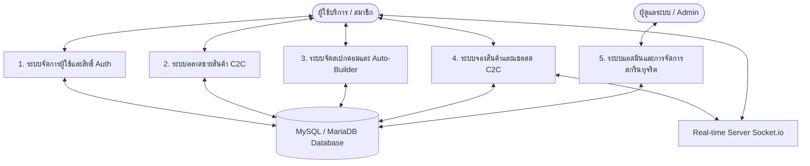
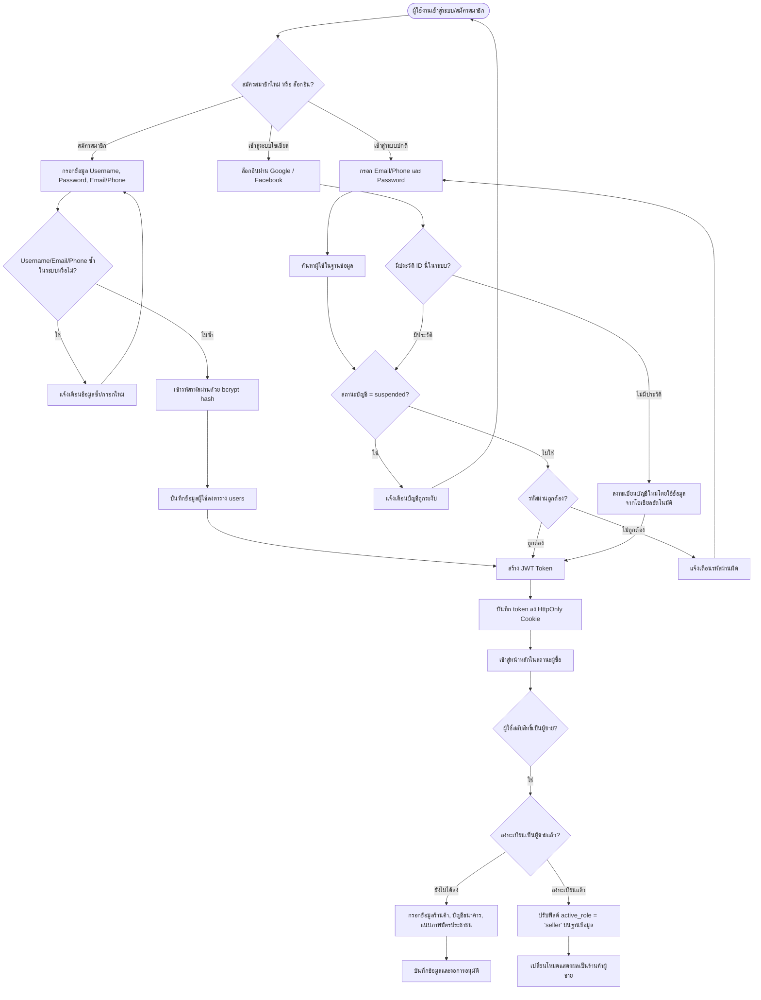
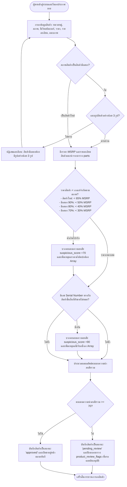
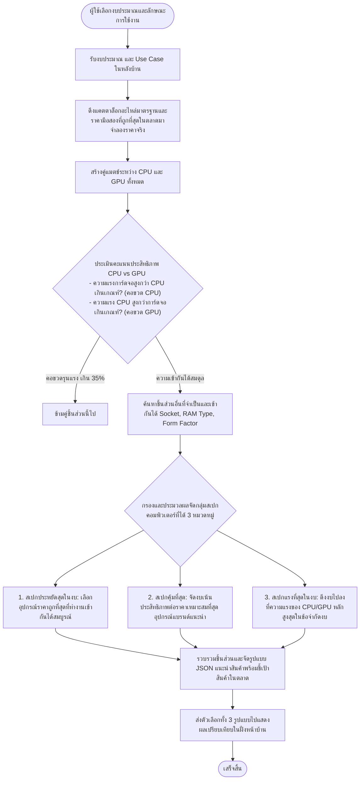
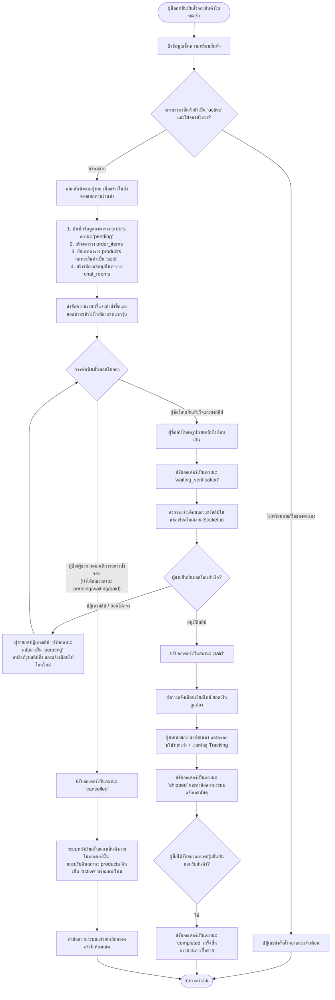
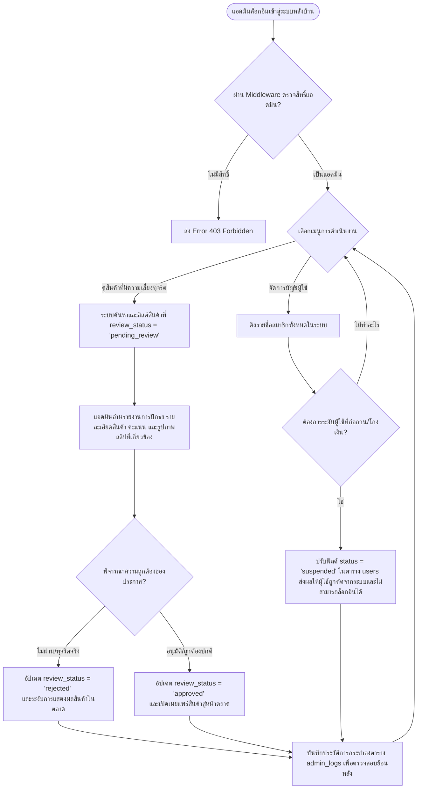

# 🗂️ PC Builder Pro & Second-hand C2C Marketplace - Project Analysis & Flowcharts

เอกสารนี้รวบรวมรายละเอียดการวิเคราะห์ระบบย่อยของโครงการ **PC Builder Pro** ทั้งในส่วนของโครงสร้างฐานข้อมูล หน้าบ้าน หลังบ้าน และกฎการประมวลผลทางธุรกิจ พร้อม Flowchart แสดงลำดับขั้นตอนการทำงาน (Workflows) ในแต่ละส่วนด้วย Mermaid Diagram

---

## 🗺️ ภาพรวมสถาปัตยกรรมระบบ (System Subsystems Overview)

โครงการนี้ประกอบด้วย 5 ระบบย่อยหลักที่เชื่อมต่อประสานงานกันผ่านฐานข้อมูล MySQL/MariaDB และ WebSockets ดังนี้:

1. **Authentication & Profile Management (ระบบลงทะเบียน เข้าสู่ระบบ และจัดการสิทธิ์)**:
   * รองรับการล็อกอินแบบปกติ (Email/Phone + bcrypt password) และแบบโซเชียล (Google/Facebook)
   * รักษาความปลอดภัยของเซสชันผ่าน JWT HttpOnly Cookie
   * มีระบบสมัครเปิดร้านค้า (Seller Registration) เพื่อป้อนข้อมูลประวัติการเงิน บัญชีธนาคาร และบัตรประชาชน
   * จัดการที่อยู่จัดส่งสินค้า (Delivery Addresses) และรายการสินค้าที่สนใจ (Wishlist) ของผู้ใช้
   * มีระบบส่งและยืนยัน OTP สำหรับการตรวจสอบเบอร์โทรศัพท์และอีเมล

2. **Marketplace & Anti-Fraud Inspection (ระบบลงขายสินค้ามือสองและการสกรีนตรวจจับทุจริต)**:
   * เปิดให้ผู้ขายที่ได้รับการยืนยันลงประกาศขายอุปกรณ์ไอทีแยกตามหมวดหมู่
   * ตรวจสอบความถูกต้องของรูปถ่ายสินค้า (บังคับใช้รูปภาพอย่างน้อย 3 รูปสำหรับสินค้าสภาพมือสองเพื่อความโปร่งใส)
   * **Anti-Fraud Engine**: เมื่อมีการสร้างหรืออัปเดตโพสต์ ระบบจะนำราคาไปเปรียบเทียบกับราคากลาง (MSRP) ในแคตตาล็อกอะไหล่มาตรฐาน (`parts` table) ตามสภาพการใช้งาน หากต่ำเกินราคาขั้นต่ำ (`Price Floor Rule`) จะถูกหักคะแนนความน่าเชื่อถือ `+70` ทันที และตรวจสอบหากซีเรียลนัมเบอร์ของสินค้าซ้ำกับสินค้าอื่นที่วางขายอยู่ในระบบ จะโดนหัก `+90` คะแนน 
   * หาก `suspicious_score` เกิน `70` ขึ้นไป ประกาศจะถูกส่งเข้าสถานะ `pending_review` เพื่อรอแอดมินตรวจสอบ โดยยังไม่เผยแพร่สู่ผู้ใช้อื่น

3. **PC Builder & Compatibility Engine (ระบบจัดสเปกคอมพิวเตอร์และการคำนวณความเข้ากันได้)**:
   * **Manual Mode**: ให้ผู้ใช้เลือกชิ้นส่วนทีละชิ้น และสแกนความเข้ากันได้แบบเรียลไทม์ (ซ็อกเก็ต CPU/บอร์ด, ชนิด RAM/บอร์ด, ความยาว GPU/เคส, ความสูงซิงค์พัดลม/เคส, ขนาด AIO/เคส, ขนาดบอร์ด/เคส, และความต้องการพลังงาน PSU โดยมี safety headroom 20%)
   * **Auto Build Solver**: อัลกอริทึมจัดสเปกอัจฉริยะ รับข้อมูล งบประมาณ และลักษณะการใช้งาน ( gaming, work, general) แล้วสืบค้นแคตตาล็อกร่วมกับราคาที่ถูกที่สุดในตลาดมือสอง เพื่อออกแบบสเปกที่คุ้มค่าที่สุด 3 ทางเลือก: ประหยัดสุดในงบ, คุ้มที่สุด (แนะนำ), และประสิทธิภาพสูงสุดในงบ โดยมีการคํานวณปัญหาคอขวด (Bottleneck) ระหว่าง CPU และ GPU

4. **C2C Booking, Payment & Transaction Lifecycle (ระบบสั่งจอง เจรจา และโอนเงิน)**:
   * จัดกลุ่มออเดอร์ตามผู้ขาย (Order Splitting) เมื่อผู้ซื้อเลือกสินค้าหลายรายการจากผู้ขายต่างคนกัน
   * เปลี่ยนสถานะสินค้าที่ถูกจองให้กลายเป็น `'sold'` ทันทีเพื่อล็อกสินค้าไม่ให้ผู้อื่นกดสั่งซื้อซ้ำ
   * สร้างห้องแชตเจรจาระหว่างผู้ซื้อและผู้ขายโดยอัตนวยัติ พร้อมส่ง System message เริ่มต้นดีล
   * ผู้ซื้อจ่ายเงินโดยอัปโหลดรูปภาพสลิปหลักฐานการโอนเงิน (Slip Upload) และผู้ขายเป็นผู้ตรวจสอบอนุมัติ
   * ควบคุมการเปลี่ยนสถานะการทำรายการผ่าน 6 สถานะหลัก พร้อมดักกลไกรีเซ็ตคืนค่าสินค้าเป็น `'active'` เมื่อมีการยกเลิกออเดอร์ (`cancelled`)
   * อัปเดตข้อมูลห้องแชต สถานะใบสั่งซื้อ และการส่งข้อความสดผ่าน Socket.io แบบเรียลไทม์

5. **Admin Moderation & Operations (ระบบหลังบ้านสำหรับผู้ดูแลระบบ)**:
   * ตรวจสอบประกาศขายที่ถูกส่งมารอกลั่นกรองและอนุมัติ (Flagged Products)
   * เข้าดูประวัติบันทึกการทำงานของทีมงาน (Admin Logs) เพื่อเพิ่มความโปร่งใสของระบบ
   * จัดการระงับการใช้งานบัญชีผู้ใช้ (Suspend Users) หรือปรับปรุงข้อมูลแคตตาล็อกอะไหล่มาตรฐานของระบบ

---

## 📊 แผนผังการทำงานของแต่ละระบบย่อย (System Workflows)

### 1. ระบบจัดการผู้ใช้และสิทธิ์การเข้าใช้งาน (Authentication & Profile Flow)
แสดงขั้นตอนตั้งแต่การสมัครสมาชิก การเข้าสู่ระบบ และการตรวจสอบสิทธิ์การเป็นผู้ขายในการลงประกาศหรือสลับบทบาท

---

### 2. ระบบลงขายสินค้าและการสกรีนความโปร่งใส (Product Listing & Anti-Fraud Flow)
แสดงขั้นตอนการตรวจสอบความเสี่ยงของการขายสินค้า เช่น ราคาต่ำเกินจริงหรือซีเรียลซ้ำซ้อน

---

### 3. ระบบประมวลผลความเข้ากันได้และการจัดสเปกอัจฉริยะ (Compatibility & Auto-Builder Flow)
แสดงกระบวนการตรวจสอบความถูกต้องของการประกอบฮาร์ดแวร์ และขั้นตอนการทำงานของอัลกอริทึมจัดสเปกอัจฉริยะ

#### ก) บริการตรวจสอบความเข้ากันได้ของอุปกรณ์ (Compatibility Check Workflow)

```mermaid
flowchart TD
    Start([ผู้ใช้เลือกชิ้นส่วนในหน้า Builder]) --> SendAPICheck[ส่งรายการสินค้าเข้าหน้า API /api/builds/compatibility]
    SendAPICheck --> QuerySpecs[ค้นหา Specs ชนิด JSON ของชิ้นส่วนที่ถูกส่งมา]
    
    %% Socket & Motherboard
    QuerySpecs --> CheckSocket{มี CPU และ Motherboard ครบ?<br/>Socket ตรงกัน?}
    CheckSocket -- ไม่ตรงกัน --> AddError[บันทึก ERROR: Socket ขัดแย้งกัน]
    CheckSocket -- ตรงกัน --> CheckChipset{Chipset รองรับ CPU ไหม?}
    CheckChipset -- ไม่รองรับ/ตระกูลต่ำ --> AddWarning[บันทึก WARNING: Chipset อาจต้องอัปเกรด BIOS]
    CheckChipset -- รองรับดี --> CheckRAM
    AddError --> CheckRAM
    AddWarning --> CheckRAM
    
    %% RAM & Motherboard
    CheckRAM{มี RAM และ Motherboard ครบ?<br/>RAM Type ตรงกับ Ram Slots?}
    CheckRAM -- ไม่ตรงกัน --> AddRamError[บันทึก ERROR: ประเภท RAM ไม่เข้ากัน]
    CheckRAM -- ตรงกัน --> CheckRamLimit{ความจุ RAM และจำนวนแถวรวม เกินขีดจำกัดบอร์ด?}
    CheckRamLimit -- เกินสเปกบอร์ด --> AddRamWarning[บันทึก WARNING: ความจุ/จำนวนแถวเกินลิมิตบอร์ด]
    CheckRamLimit -- ไม่เกิน --> CheckGPUCase
    AddRamError --> CheckGPUCase
    AddRamWarning --> CheckGPUCase
    
    %% GPU / Cooler Dimension vs Case
    CheckGPUCase{มีการ์ดจอ/พัดลม CPU และเคส ครบ?<br/>ขนาดความยาว/ความสูง เกินพื้นที่เคส?}
    CheckGPUCase -- เกินพิกัดเคส --> AddSizeError[บันทึก ERROR: อุปกรณ์ยาว/สูงเกินพื้นที่เคส]
    CheckGPUCase -- ใกล้เคียงเคส เกิน 90% --> AddSizeWarning[บันทึก WARNING: ขนาดเบียดพื้นที่เคสเกินไป ติดตั้งยาก]
    CheckGPUCase -- ขนาดพอดีเคส --> CheckPSU
    AddSizeError --> CheckPSU
    AddSizeWarning --> CheckPSU
    
    %% PSU Wattage Calculation
    CheckPSU{มี PSU และอุปกรณ์ใช้ไฟในระบบ?<br/>กำลังวัตต์ PSU เพียงพอ?}
    CheckPSU --> CalcWatt[คำนวณ TDP รวม = TDP ของ CPU + TDP ของ GPU + 100W สำหรับอุปกรณ์อื่น]
    CalcWatt --> ComparePSU{วัตต์ PSU < วัตต์ TDP รวม?}
    ComparePSU -- น้อยกว่าพลังงานขั้นต่ำ --> AddPsuError[บันทึก ERROR: กำลังไฟ PSU ไม่พอกับพลังงานที่ระบบใช้จริง]
    ComparePSU -- น้อยกว่า วัตต์รวม * 1.2 --> AddPsuWarning[บันทึก WARNING: กำลังไฟ PSU ต่ำกว่าระดับแนะนำสำหรับความเสถียร 20% Headroom]
    ComparePSU -- วัตต์เหลือเพียงพอ --> SendResult
    AddPsuError --> SendResult
    AddPsuWarning --> SendResult
    
    SendResult[ส่งข้อมูล Errors และ Warnings ทั้งหมดกลับหน้าบ้านเพื่อแจ้งผู้ใช้] --> End([จบการตรวจสอบ])
```

#### ข) ระบบจัดสเปกคอมพิวเตอร์อัตโนมัติ (Auto-Builder Solver Workflow)

---

### 4. ระบบสั่งจอง เจรจา และโอนเงิน C2C (Order Booking & Live Chat Flow)
แสดงวัฏจักรชีวิตของออเดอร์ (Order Status Transition Lifecycle) และระบบการทำงานของ WebSocket

---

### 5. ระบบตรวจสอบทุจริตและการดำเนินงานฝั่งแอดมิน (Admin Moderation & Anti-Fraud Operations Flow)
แสดงขั้นตอนที่แอดมินดูแลความโปร่งใสในระบบ ตรวจสอบโพสต์ที่น่าสงสัย และควบคุมสมาชิก

---

## 📝 ข้อสังเกตและคำถามสำคัญสำหรับการพัฒนาเพิ่มเติม (Observations & Open Questions)

ในฐานะนักพัฒนา นี่คือข้อสังเกตและคำถามทางเทคนิคที่สามารถระบุเพื่อความเสถียรสูงสุดของแอปพลิเคชัน:

1. **การยืนยันตัวตนและการตรวจจับภาพสลิปโอนเงิน (Slip Verification Integration)**:
   * *สถานะปัจจุบัน*: ระบบใช้การจำลอง PromptPay QR หน้าบ้าน และให้ผู้ซื้อส่งภาพหลักฐานเพื่อรอผู้ขายกดยอมรับ/ปฏิเสธด้วยมือ (Manual Approval)
   * *คำถาม/ข้อเสนอแนะ*: ในอนาคตต้องการให้เชื่อมต่อบริการภายนอก เช่น SlipOk หรือ EasySlip API ในการตรวจสอบยอดเงิน วันเวลาที่โอน และผู้รับเงินผ่านรหัสภาพ QR Code (Mini-QR) แบบอัตโนมัติ เพื่อป้องกันการปลอมแปลงสลิป หรือสลิปซ้ำหรือไม่?

2. **ระบบการยกเลิกออเดอร์อัตโนมัติเมื่อค้างชำระ (Pending Timeout)**:
   * *สถานะปัจจุบัน*: ปัจจุบันออเดอร์ที่อยู่ในสถานะ `pending` จะคงอยู่ตลอดไปจนกว่าจะมีคนกดยกเลิก (Cancelled) ด้วยตัวเอง
   * *คำถาม/ข้อเสนอแนะ*: ควรมีระบบตั้งเวลาอัตโนมัติ (เช่น Cron Job หรือ Database Event Scheduler) เพื่อยกเลิกออเดอร์อัตโนมัติและคืนของกลับเป็น `'active'` หากผู้ใช้กดยืนยันจองแล้วไม่มีการอัปโหลดรูปสลิปการโอนเงินภายในเวลาที่กำหนด (เช่น 30 นาที หรือ 1 ชั่วโมง) หรือไม่?

3. **กลไกการสแกนความเข้ากันได้แบบครอบคลุม (Edge Cases in Compatibility)**:
   * *สถานะปัจจุบัน*: ระบบการตรวจสอบ TDP ของ PSU ใช้การประมวลผลพื้นฐานคือ CPU TDP + GPU TDP + 100W (สำหรับบอร์ด/อุปกรณ์อื่น) และเปรียบเทียบกับกำลังไฟ PSU
   * *คำถาม/ข้อเสนอแนะ*: ข้อมูลของพัดลมระบายความร้อนหม้อน้ำ AIO และขนาดเคสบางตัวอาจรองรับได้หลายจุด (เช่น หน้าเคส 360มม. / ด้านบนเคส 240มม.) โครงสร้างข้อมูลตาราง `parts` ของสเปกเคสเป็นรูปแบบสตริง เช่น `"240/360mm"` ซึ่งใช้วิธีแยกคำและตรวจสอบทางข้อมูล การป้อนข้อมูลแคตตาล็อกจึงต้องใช้ความแม่นยำสูงในฟิลด์ JSON ของตาราง `parts.specs`
