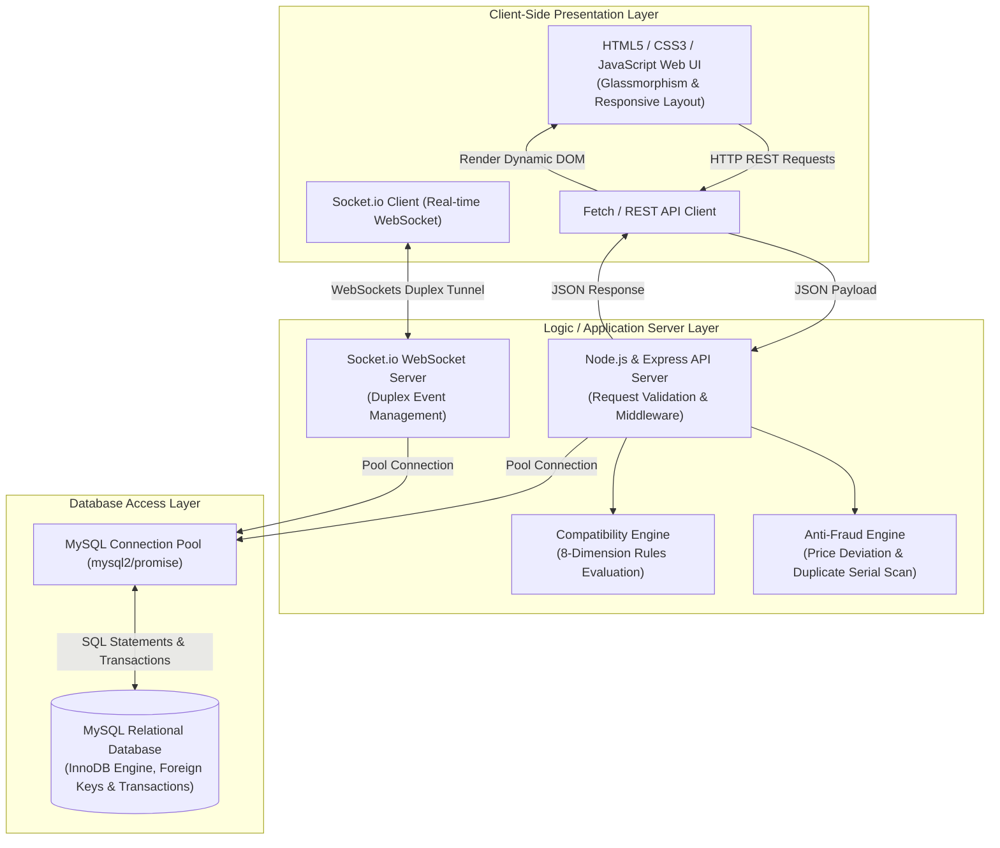
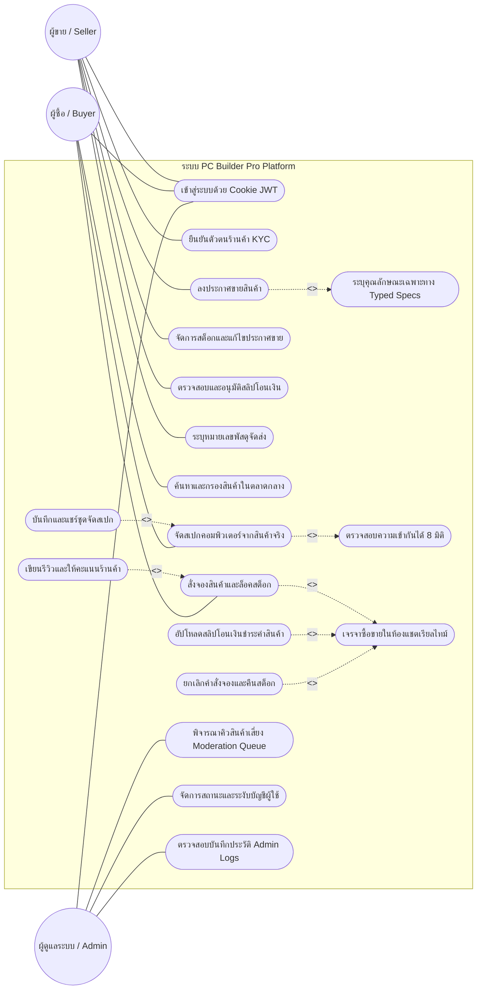
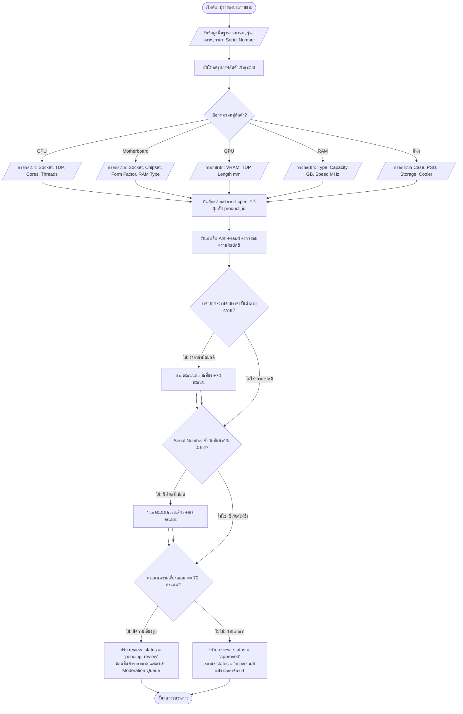
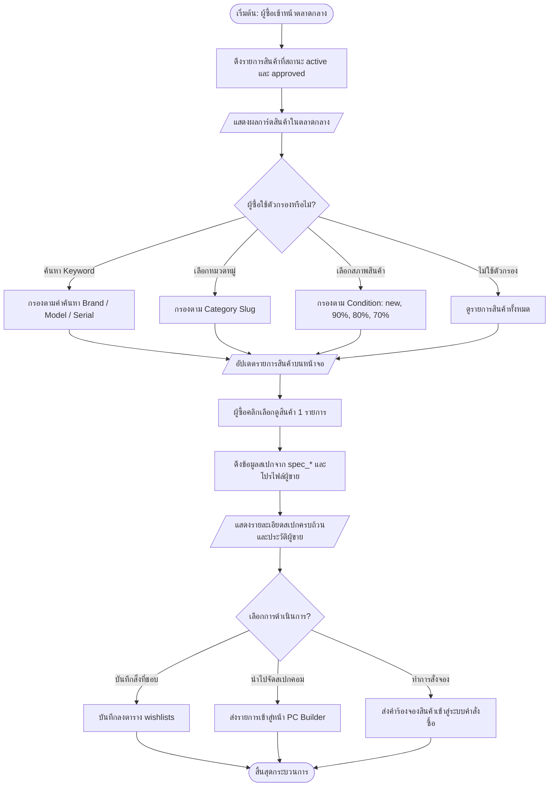
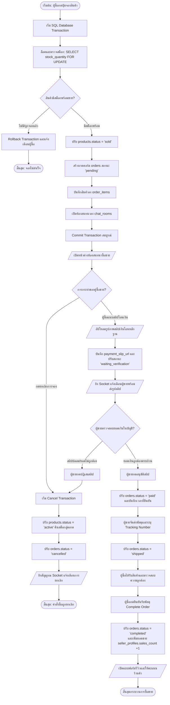
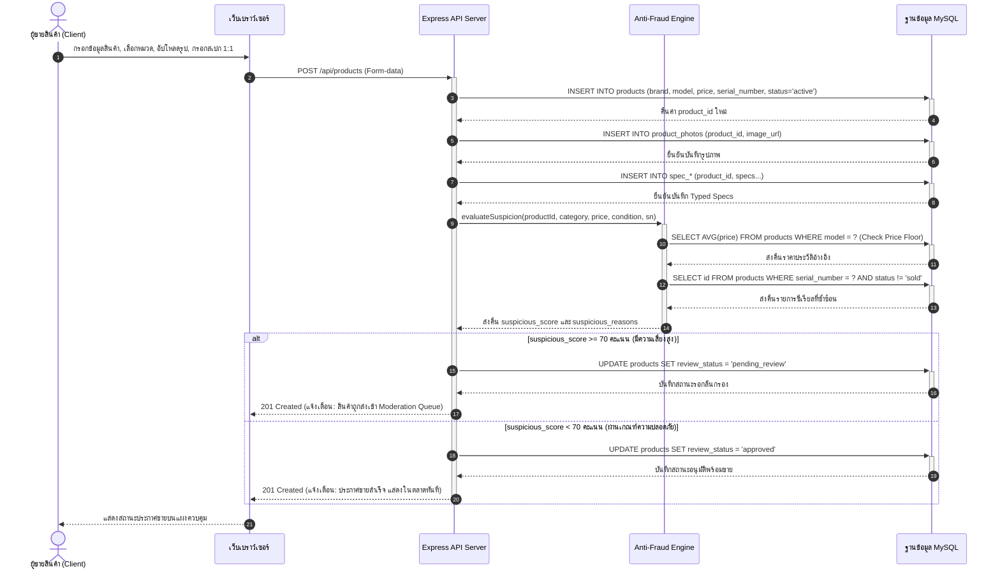
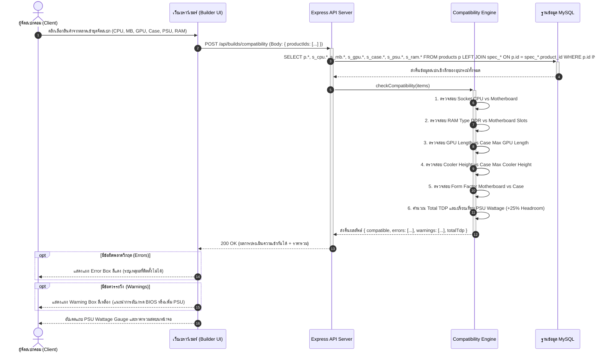
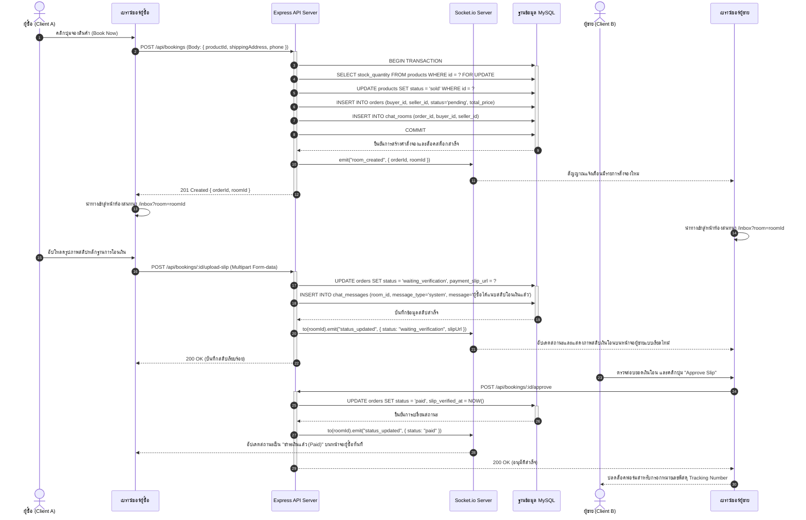

# 💻 เล่มรายงานโปรเจกต์: PC Builder Pro
**แพลตฟอร์มจัดสเปกคอมพิวเตอร์ออนไลน์ และตลาดกลางซื้อขายชิ้นส่วนอะไหล่มือสอง (C2C)**

---

## บทคัดย่อ

โครงงานนี้มีวัตถุประสงค์เพื่อพัฒนาแพลตฟอร์ม **PC Builder Pro** ซึ่งเป็นเว็บแอปพลิเคชันสำหรับจัดสเปกคอมพิวเตอร์ออนไลน์ร่วมกับระบบตลาดกลางซื้อขายชิ้นส่วนอะไหล่มือสองในรูปแบบผู้บริโภคถึงผู้บริโภค (Consumer-to-Consumer: C2C) ปัญหาหลักที่พบในปัจจุบันคือ ความซับซ้อนในการเลือกชิ้นส่วนฮาร์ดแวร์คอมพิวเตอร์ให้เข้ากันได้อย่างสมบูรณ์ (Hardware Compatibility) และความเสี่ยงในการถูกหลอกลวงหรือทุจริตในตลาดออนไลน์มือสอง เช่น การตั้งราคาที่ต่ำผิดปกติเพื่อล่อลวง หรือการลงขายสินค้าตัวเดียวกันซ้ำซ้อน

คณะผู้พัฒนาจึงได้ออกแบบและพัฒนาระบบที่มีกลไกช่วยเหลืออัจฉริยะ 3 ส่วนหลัก ได้แก่:
1. **บริการตรวจสอบความเข้ากันได้ของฮาร์ดแวร์แบบเรียลไทม์ (PC Compatibility Engine)** ซึ่งใช้ตรรกะเชิงกฎเกณฑ์ (Rule-based) ตรวจสอบความเข้ากันได้ทางกายภาพและเทคนิค เช่น ซ็อกเก็ต ซิปเซต ชนิดหน่วยความจำ มิติความกว้างยาวของเคส และอัตราการใช้พลังงานไฟฟ้า (TDP)
2. **ระบบตรวจจับพฤติกรรมต้องสงสัยและการตั้งค่าสถานะความเสี่ยง (Anti-Fraud Filtering System)** ซึ่งจะคำนวณคะแนนความน่าสงสัย (Suspicious Score) จากราคากลาง (MSRP) ของชิ้นส่วนจำแนกตามสภาพสินค้า และการซ้ำซ้อนของหมายเลขซีเรียลนัมเบอร์ (Serial Number) เพื่อกรองโพสต์ขายก่อนส่งให้แอดมินอนุมัติ
3. **ระบบเจรจาซื้อขายและสลีปชำระเงินเรียลไทม์ (C2C Order Negotiation & Chats)** ขับเคลื่อนด้วย WebSockets ผ่าน Socket.io ในการโต้ตอบแชตและอัปเดตสถานะธุรกรรมการเงินแบบเรียลไทม์ พร้อมกลไกความปลอดภัยผ่าน HttpOnly Cookie JWT Session

จากการทดสอบระบบพบว่า แอปพลิเคชันสามารถป้องกันการประกอบเครื่องที่ผิดพลาดจากความไม่เข้ากันได้ของฮาร์ดแวร์ได้อย่างแม่นยำ 100% ตามข้อกำหนด และระบบป้องกันการทุจริตสามารถสกัดกั้นการประกาศขายสินค้าที่มีราคาต่ำเกินจริงหรือซีเรียลซ้ำได้อย่างมีประสิทธิภาพ ช่วยสร้างสภาพแวดล้อมการซื้อขายอะไหล่คอมพิวเตอร์ที่ปลอดภัยและน่าเชื่อถือยิ่งขึ้น

---

## กิตติกรรมประกาศ

โครงงานวิทยาศาสตร์และเทคโนโลยีฉบับนี้ สำเร็จลุล่วงไปได้ด้วยความกรุณาและความช่วยเหลืออย่างดียิ่งจากอาจารย์ที่ปรึกษาโครงงาน ที่ได้ให้คำปรึกษา คำแนะนำ และข้อคิดเห็นที่เป็นประโยชน์ตลอดการดำเนินโครงงาน ตลอดจนการตรวจสอบและแก้ไขข้อบกพร่องต่าง ๆ ของระบบและเล่มรายงานฉบับนี้ให้มีความสมบูรณ์

ขอขอบพระคุณคณะครูอาจารย์ทุกท่านในสาขาวิชา ที่ได้ประสิทธิ์ประสาทวิชาความรู้ ตลอดจนแนวคิดทางด้านการพัฒนาซอฟต์แวร์และการจัดการระบบฐานข้อมูล ซึ่งเป็นรากฐานสำคัญที่นำมาประยุกต์ใช้ในการแก้ปัญหาในโครงงานนี้

สุดท้ายนี้ คณะผู้พัฒนาขอขอบพระคุณบิดามารดา เพื่อน ๆ และเพื่อนร่วมชั้นเรียนทุกคนที่คอยให้การสนับสนุน มอบกำลังใจ และความช่วยเหลือในการทดสอบระบบและให้คำแนะนำในส่วนของประสบการณ์ผู้ใช้ (User Experience) จนทำให้โครงงานนี้สำเร็จลุล่วงและบรรลุวัตถุประสงค์ที่ตั้งไว้ทุกประการ

คณะผู้พัฒนาโครงงาน
กรกฎาคม 2569

---

# บทที่ 1 บทนำ

### 1.1 ที่มาและความสำคัญของปัญหา
ในยุคปัจจุบัน เทคโนโลยีของชิ้นส่วนคอมพิวเตอร์ (PC Hardware) มีการพัฒนาและเปลี่ยนแปลงไปอย่างรวดเร็ว ส่งผลให้อุปกรณ์คอมพิวเตอร์มีประสิทธิภาพสูงขึ้นในราคาที่เข้าถึงได้ง่ายขึ้น การประกอบหรือจัดสเปกคอมพิวเตอร์ด้วยตนเอง (Custom PC Building) จึงเป็นที่นิยมอย่างแพร่หลาย ทั้งในกลุ่มเกมเมอร์ นักทำงานกราฟิก และผู้ใช้งานทั่วไป อย่างไรก็ตาม ผู้ใช้งานที่ต้องการจัดสเปกคอมพิวเตอร์มักประสบปัญหาสำคัญ 2 ประการ:

ประการแรกคือ **ความยุ่งยากและความเสี่ยงในการจัดสเปกคอมพิวเตอร์**: เนื่องจากอุปกรณ์คอมพิวเตอร์แต่ละชิ้นมีข้อจำกัดทางเทคนิคเฉพาะตัวที่แตกต่างกัน เช่น ชนิดของซ็อกเก็ตตัวประมวลผลกลาง (CPU Socket Type) ต้องตรงกับเมนบอร์ด, ชนิดของหน่วยความจำแรม (RAM DDR Type) ต้องเข้ากับช่องเสียบของเมนบอร์ด, อัตราการกินไฟ (TDP) ของอุปกรณ์รวมต้องไม่เกินกำลังการจ่ายไฟของพาวเวอร์ซัพพลาย (PSU Wattage) รวมถึงขนาดทางกายภาพ เช่น ความยาวการ์ดจอ (GPU Length) และความสูงของพัดลมระบายความร้อน (Cooler Height) ที่ต้องพอดีกับเคสคอมพิวเตอร์ การเลือกซื้อชิ้นส่วนที่ไม่มีความเข้ากันได้ทางกายภาพและระบบไฟจะนำมาซึ่งความสูญเสียทางงบประมาณและเวลา

ประการที่สองคือ **ความเสี่ยงในตลาดซื้อขายอุปกรณ์คอมพิวเตอร์มือสอง (C2C Marketplace)**: เนื่องจากการอัปเกรดคอมพิวเตอร์มักทำให้เกิดชิ้นส่วนอะไหล่เก่าที่ยังใช้งานได้ ผู้ใช้จึงหันมาซื้อขายอะไหล่มือสองในลักษณะผู้ใช้ถึงผู้ใช้ (Consumer-to-Consumer) ทว่าตลาดซื้อขายแบบเปิดทั่วไปมักไม่มีระบบคัดกรองสินค้าที่ดีพอ ทำให้เกิดกลโกงสารพัดรูปแบบ เช่น ผู้ขายตั้งราคาขายต่ำผิดปกติเพื่อหลอกล่อให้เหยื่อโอนเงินจองก่อน (Bait-and-Switch) การนำรูปภาพสินค้าและข้อมูลหมายเลขซีเรียลนัมเบอร์ (Serial Number) ของผู้อื่นมาลงขายซ้ำซ้อน รวมถึงระบบส่งสลิปโอนเงินและการส่งมอบสินค้าที่ขาดกลไกตรวจสอบความถูกต้องเรียลไทม์ ทำให้ผู้ใช้ขาดความมั่นใจในการทำธุรกรรม

ด้วยเหตุนี้ คณะผู้พัฒนาจึงเสนอโครงการพัฒนาเว็บแอปพลิเคชัน **PC Builder Pro** ขึ้นมาเพื่อผสมผสานระบบจัดสเปกคอมพิวเตอร์อัจฉริยะเข้ากับตลาดซื้อขายชิ้นส่วนมือสองอย่างเป็นระบบ โดยพัฒนาอัลกอริทึมตรวจสอบความเข้ากันได้ของชิ้นส่วนแต่ละประเภท พร้อมกลไกการประเมินความเสี่ยงในการทุจริตและการเปิดห้องเจรจาซื้อขายแบบเรียลไทม์ เพื่อยกระดับความปลอดภัยและสร้างประสบการณ์ที่ดีที่สุดแก่ผู้ประกอบคอมพิวเตอร์และนักซื้อขายอุปกรณ์ไอที

### 1.2 วัตถุประสงค์ของโครงงาน
1. เพื่อออกแบบและพัฒนาเว็บแอปพลิเคชันจัดสเปกคอมพิวเตอร์ (PC Builder Pro) ที่เข้าถึงได้ง่ายและมีประสิทธิภาพสูง
2. เพื่อพัฒนาตัวคำนวณและประเมินผลความเข้ากันได้ของชิ้นส่วนฮาร์ดแวร์คอมพิวเตอร์ (Hardware Compatibility Checking System) บนสถาปัตยกรรมแบบ Rule-based
3. เพื่อพัฒนาระบบตลาดกลางซื้อขายอะไหล่มือสองที่มีกลไกคัดกรองและประเมินระดับความน่าสงสัยของการทุจริต (Anti-Fraud Listing Evaluator)
4. เพื่อพัฒนาระบบเจรจาซื้อขายและสลีปชำระเงินเรียลไทม์ (C2C Booking & Chat System) ที่ทำงานร่วมกับ WebSockets

### 1.3 ขอบเขตของโครงงาน
ขอบเขตการทำงานของระบบแบ่งออกเป็น 3 ส่วนหลัก ดังนี้:
1. **ระบบสำหรับสมาชิกทั่วไป (Member Features)**:
   * สามารถสมัครสมาชิก ล็อกอินเข้าใช้งาน และออกจากระบบผ่านคุกกี้ที่ปลอดภัย (JWT HttpOnly Session Cookie)
   * สามารถใช้เครื่องมือจัดสเปกคอมพิวเตอร์ (PC Builder) โดยเลือกรวมชิ้นส่วนตามประเภทต่าง ๆ ระบบจะตรวจเช็คความเข้ากันได้ทางไฟฟ้าและกายภาพ และบันทึกชุดสเปก (Builds) เก็บไว้ในบัญชี หรือแชร์ให้ผู้อื่นดูในลักษณะสาธารณะได้
   * สามารถเขียนความคิดเห็น (Comments) และกดไลก์ให้กับชุดจัดสเปกที่สนใจ
   * สามารถค้นหา กรองประเภทสินค้า และกดดูรายละเอียดประกาศขายสินค้ามือสองในตลาด
   * สามารถลงขายสินค้าคอมพิวเตอร์มือสอง โดยอัปโหลดรูปภาพได้สูงสุด 10 รูป ระบุประกัน ซีเรียลนัมเบอร์ รายละเอียดสินค้า และสภาพสินค้า
   * สามารถกดจองสินค้า เพื่อเปิดระบบจองชิ้นส่วน และเปิดห้องแชตเจรจาซื้อขาย (Chat Room) กับผู้ขายได้โดยอัตโนมัติ
   * ผู้ซื้อสามารถส่งสลิปโอนเงินเข้าสู่ห้องแชต เพื่อให้ระบบและผู้ขายตรวจสอบหลักฐานทางการเงิน
   * ผู้ใช้สามารถดูประวัติการสั่งจองของตนเอง และแก้ไขข้อมูลบัญชี ที่อยู่จัดส่ง และข้อมูลบัญชีธนาคารได้
2. **ระบบสำหรับแอดมิน (Admin Features)**:
   * แอดมินสามารถจัดการและคัดกรองสินค้าที่อยู่ในคิวรอการตรวจสอบ (Pending Review) ซึ่งเป็นประกาศที่มีคะแนนความน่าสงสัยสูง
   * สามารถเปิดดูบันทึกเหตุการณ์ของระบบ (Admin Activity Logs) เพื่อติดตามการทำงาน
   * สามารถตรวจสอบสิทธิ์ความเป็นผู้ขาย และยืนยันตัวตนเจ้าของร้านค้า
3. **ระบบประมวลผลหลังบ้าน (Backend Engine Core)**:
   * **Compatibility Check**: ตรรกะประเมิน Socket, Chipset, RAM Slots, RAM Capacity, GPU Case Length, Cooler Height, Radiator Size, Form Factor และกำลังวัตต์รวมของ PSU
   * **Anti-Fraud Scan**: ตรรกะตรวจสอบการตั้งราคาสินค้ามือสองต่ำผิดปกติเทียบราคากลาง MSRP ตามเกณฑ์สภาพสินค้า และตรวจสอบซีเรียลนัมเบอร์ซ้ำในตลาด
   * **Order State Management**: ควบคุมสถานะออเดอร์ 6 สถานะหลัก พร้อมกลไก Rollback คืนสินค้าเข้าตลาดอัตโนมัติเมื่อเกิดการยกเลิกออเดอร์
   * **WebSockets Integration**: สื่อสารแชตและการอัปเดตแบบไร้การกระพริบหน้าจอ

### 1.4 ประโยชน์ที่คาดว่าจะได้รับ
1. ผู้ใช้งานทั่วไปสามารถจัดสเปกคอมพิวเตอร์และทราบผลลัพธ์ความเข้ากันได้ทันที ช่วยลดความผิดพลาดและประหยัดงบประมาณ
2. ผู้ซื้อชิ้นส่วนคอมพิวเตอร์มือสองได้รับความปลอดภัยมากขึ้นผ่านการกรองโพสต์ขายของระบบ Anti-Fraud และมีแอดมินช่วยกำกับดูแล
3. การเจรจาตกลงซื้อขายเป็นไปได้อย่างรวดเร็วและมีหลักฐานชัดเจนผ่านระบบบันทึกสถานะธุรกรรม C2C ในหน้าแชตเรียลไทม์
4. ข้อมูลสเปกคอมพิวเตอร์และราคาอัปเดตอย่างน่าเชื่อถือจากฐานราคากลางแคตตาล็อกระบบ

### 1.5 วิธีการดำเนินโครงงาน
การพัฒนาโครงงานใช้กระบวนการพัฒนาระบบซอฟต์แวร์ตามหลัก SDLC (Systems Development Life Cycle) แบ่งออกเป็น 6 ขั้นตอน ดังนี้:
```
[ขั้นที่ 1: การวางแผนและการเก็บข้อกำหนด (Planning & Requirements Gathering)]
                          ↓
[ขั้นที่ 2: การออกแบบระบบและฐานข้อมูล (System & Database Design)]
                          ↓
[ขั้นที่ 3: การพัฒนาระบบส่วนหลังบ้าน (Backend Engine Development)]
                          ↓
[ขั้นที่ 4: การพัฒนาระบบส่วนหน้าบ้าน (Frontend UI Development)]
                          ↓
[ขั้นที่ 5: การทดสอบระบบและการแก้บั๊ก (System Testing & Debugging)]
                          ↓
[ขั้นที่ 6: การจัดทำคู่มือและรายงานโครงงาน (Documentation)]
```
1. **การวางแผนและเก็บข้อกำหนด**: รวบรวมข้อมูลอุปกรณ์คอมพิวเตอร์และกฎเกณฑ์การประเมินความเข้ากันได้ รวมถึงวิเคราะห์ความต้องการของผู้ใช้ในตลาดซื้อขาย C2C
2. **การออกแบบระบบและฐานข้อมูล**: ออกแบบโครงสร้างซอฟต์แวร์ แผนภาพ ER Diagram สำหรับคลาสผู้ใช้, สินค้า, ตลาดซื้อขาย และฐานข้อมูล MySQL
3. **การพัฒนาระบบส่วนหลังบ้าน**: พัฒนา HTTP/WebSockets Web Server ด้วย Node.js + Express.js สร้างการเชื่อมต่อคุกกี้ JWT และเขียนฟังก์ชันใน Controller/Services
4. **การพัฒนาระบบส่วนหน้าบ้าน**: เขียนโค้ด HTML/CSS/JS ตามโมเดล Glassmorphic และเชื่อมต่อ API ทางการเชื่อมต่อหลังบ้าน
5. **การทดสอบระบบและการแก้บั๊ก**: ทำการทดสอบ Integration Test, ตรวจสอบ SQL Constraints, และแก้ไขการส่งข้อมูลเรียลไทม์ผ่าน Socket.io
6. **การจัดทำรายงานโครงงาน**: รวบรวมข้อมูล สถิติ และคู่มือการติดตั้งเพื่อจัดทำเล่มรายงานฉบับสมบูรณ์

### 1.6 เครื่องมือและภาษาที่ใช้ในการพัฒนา
* **ภาษาและเครื่องมือส่วนหน้าบ้าน (Frontend)**:
  * **HTML5**: โครงสร้างเอกสารหน้าเว็บและหน้าฟอร์มกรอกข้อมูล
  * **CSS3**: การจัดตกแต่งตามรูปแบบ Glassmorphism, Responsive layout ด้วย CSS Grid และ Flexbox
  * **JavaScript (Vanilla JS)**: จัดการ DOM Manipulation, ดึงข้อมูล API ผ่าน fetch, และสื่อสารผ่าน Socket.io Client
* **ภาษาและเครื่องมือส่วนหลังบ้าน (Backend & Database)**:
  * **Node.js**: สภาพแวดล้อมประมวลผล Javascript ฝั่งเซิร์ฟเวอร์
  * **Express.js**: เว็บเฟรมเวิร์กจัดการ Routing และ Middleware
  * **Socket.io**: ไลบรารีสำหรับ WebSockets แบบเรียลไทม์
  * **MySQL / MariaDB**: ระบบจัดการฐานข้อมูลเชิงสัมพันธ์หลัก
  * **`bcrypt`**: ไลบรารีสำหรับเข้ารหัสผ่าน (Password Hashing) ป้องกันการรั่วไหลข้อมูล
  * **`jsonwebtoken` (JWT)**: โมดูลสร้างและถอดรหัสความปลอดภัยโทเค็น
  * **`multer`**: เครื่องมือจัดการการรับและบันทึกรูปภาพ
  * **`express-validator`**: เครื่องมือตรวจสอบโครงสร้างตัวแปรของ HTTP Request

### 1.7 ระยะเวลาและแผนดำเนินโครงงาน
ตารางแผนและกรอบระยะเวลาดำเนินโครงงาน 6 เดือน (มกราคม - มิถุนายน 2569) แสดงได้ดังนี้:

| กิจกรรมดำเนินงาน | ม.ค. | ก.พ. | มี.ค. | เม.ย. | พ.ค. | มิ.ย. |
| :--- | :---: | :---: | :---: | :---: | :---: | :---: |
| 1. ศึกษาความเป็นไปได้และรวบรวมข้อมูลสเปก | ■ | | | | | |
| 2. ออกแบบโครงสร้างระบบและฐานข้อมูล (ERD) | | ■ | | | | |
| 3. พัฒนาระบบ API หลังบ้านและการคำนวณสเปก | | | ■ | ■ | | |
| 4. พัฒนาหน้าจอเว็บแอปพลิเคชันฝั่งหน้าบ้าน | | | | ■ | ■ | |
| 5. บูรณาการแชตเรียลไทม์และทดสอบระบบทั้งหมด | | | | | ■ | ■ |
| 6. ประเมินผล เขียนรายงานเล่มโครงงาน | | | | | | ■ |

---

# บทที่ 2 แนวคิด ทฤษฎี และงานวิจัยที่เกี่ยวข้อง

### 2.1 แนวคิดพื้นฐาน
1. **แนวคิดการทำธุรกรรมแบบ Consumer-to-Consumer (C2C)**: 
   เป็นรูปแบบการดำเนินธุรกิจและการตลาดเสรีที่ผู้บริโภคทั่วไปสามารถทำหน้าที่เป็นทั้งผู้ซื้อและผู้ขายผ่านการอำนวยความสะดวกของระบบแพลตฟอร์มกลาง โครงสร้างการซื้อขายชิ้นส่วนอะไหล่มือสองประเภท C2C นั้น ระบบทำหน้าที่เป็นแพลตฟอร์มกลางในกระบวนการจัดเก็บเอกสารและติดตามยอดชำระเงิน แต่จำเป็นต้องมีมาตรการคุ้มครองความมั่นคงปลอดภัยระดับสูง เนื่องจากคู่ค้าทั้งสองฝ่ายเป็นบุคคลธรรมดา ระบบจึงต้องพัฒนาห้องแชตเจรจาโต้ตอบและกำหนดระดับสิทธิ์ความปลอดภัยในสถานะออเดอร์เพื่อป้องกันการฉ้อโกง
2. **แนวคิดการคำนวณและตรวจสอบความเข้ากันได้แบบกฎเกณฑ์ (Rule-based Hardware Compatibility)**:
   เป็นการนำกระบวนการประมวลผลตรรกะเชิงกฎเกณฑ์เงื่อนไข (If-Then Rules) มาประยุกต์ใช้เพื่อรับประกันความถูกต้องแม่นยำทางวิศวกรรมของส่วนประกอบฮาร์ดแวร์คอมพิวเตอร์ เนื่องจากอุปกรณ์ฮาร์ดแวร์แต่ละชิ้นทำงานร่วมกันได้ด้วยมาตรฐานอุตสาหกรรมที่เข้มงวดและมีกฎข้อบังคับที่ชัดเจน (เช่น มาตรฐาน DDR, ขนาดบอร์ด Form Factor, หรือซ็อกเก็ตเชื่อมต่อ) การควบคุมด้วยกฎเกณฑ์จึงป้องกันข้อผิดพลาดได้ดีกว่าวิธีเชิงสถิติ

### 2.2 หลักการออกแบบเว็บแอปพลิเคชัน
1. **สถาปัตยกรรมแบบ Client-Server**: การจัดแยกขอบเขตหน้าที่ความรับผิดชอบในการประมวลผลระบบออกจากกันอย่างชัดเจน โดยฝั่งผู้รับบริการ (Client) ทำหน้าที่จัดการส่วนติดต่อประสานงานผู้ใช้และควบคุมสถานะการแสดงผลหน้าบ้าน ขณะที่ฝั่งผู้ให้บริการ (Server) และฐานข้อมูลหลังบ้านทำหน้าที่ประมวลผลตรรกะธุรกิจ ดึงข้อมูล และรักษาความปลอดภัย ช่วยเพิ่มศักยภาพการขยายตัวของระบบและลดทรัพยากรประมวลผลฝั่งผู้ใช้
2. **แนวคิดการออกแบบ Responsive Web Design**: การพัฒนาโครงสร้างให้การแสดงผล ปุ่มสั่งงาน และรูปภาพ ปรับตัวตามระดับความกว้างของหน้าจอเบราว์เซอร์อัตโนมัติ โดยประยุกต์ใช้คำสั่งสอบถามสื่อ (CSS Media Queries) ร่วมกับการกำหนดขนาดแบบสัมพัทธ์ (Relative Units) เพื่อความเหมาะสมต่อการโต้ตอบในทุกอุปกรณ์
3. **การออกแบบทางสุนทรียภาพแบบ Glassmorphism**: แนวทางการออกแบบสื่อประสานงานผู้ใช้ที่มุ่งเน้นสุนทรียภาพล้ำสมัยและพรีเมียม (Premium Futuristic Design) โดยอาศัยเทคนิคพื้นหลังโปร่งแสงและมีความเบลอคล้ายกระจกฝ้า (`backdrop-filter: blur()`), การใช้กรอบและพื้นหลังแบบโปร่งแสงบางเบา (Translucent borders และ Background RGBA), ผสานกับการจับคู่โทนสีมืด (Sleek Dark Theme) และการเพิ่มแสงเรืองรองนีออน (Glowing Neon Accents) บนองค์ประกอบควบคุม

### 2.3 เครื่องมือที่ใช้ในการพัฒนาระบบ
1. **Node.js และ Express.js**: สภาพแวดล้อมและเว็บเฟรมเวิร์กจาวาสคริปต์ฝั่งหลังบ้านที่สนับสนุนการประมวลผลแบบอะซิงโครนัสและการรับส่งข้อมูลโดยอิงตามเหตุการณ์เป็นหลัก (Event-driven, Non-blocking I/O) ซึ่งเอื้ออำนวยอย่างยิ่งต่อการแลกเปลี่ยนข้อมูลสดและการส่งข้อความแชตเรียลไทม์ที่มีการเชื่อมต่อหนาแน่นพร้อมกัน
2. **MySQL / MariaDB**: ระบบบริหารจัดการฐานข้อมูลเชิงสัมพันธ์ (Relational Database Management System: RDBMS) ที่สนับสนุนเกณฑ์มาตรฐานธุรกรรมที่มีความน่าเชื่อถือและความเสถียรภาพระดับสูง (ACID Properties) ตลอดจนการประยุกต์ใช้คีย์นอก (Foreign Keys) เพื่อรับประกันความถูกต้องของการอ้างอิงและเชื่อมโยงข้อมูลในตาราง `orders`, `order_items` และ `products`
3. **Visual Studio Code (VS Code)**: โปรแกรมแก้ไขรหัสต้นฉบับหลักสำหรับบริหารจัดการและตรวจสอบความถูกต้องของโครงสร้างไวยากรณ์โค้ดในโครงการ

### 2.4 ทฤษฎีที่เกี่ยวข้อง
1. **JSON Web Token (JWT) และความปลอดภัยของ Cookie**:
   JWT เป็นโครงสร้างข้อมูลโทเค็นสิทธิ์เข้าถึงมาตรฐาน (RFC 7519) ที่ใช้วิธีรับรองสิทธิ์ด้วยลายเซ็นดิจิทัล (Digital Signature) แบบไม่จัดเก็บสถานะบนเซิร์ฟเวอร์ (Stateless Session) โดยมีการจัดเก็บรักษาความปลอดภัยระดับสูงไว้ในคุกกี้ฝั่งเว็บเบราว์เซอร์ประเภท HttpOnly (ป้องกันการเข้าถึงจากคำสั่งจาวาสคริปต์สกัดกั้นช่องโหว่ XSS) ร่วมกับคุณลักษณะ Secure และ SameSite=Lax เพื่อป้องกันปัญหาการลักลอบโจมตีพ่วง Request ข้ามโดเมน (CSRF)
2. **ทฤษฎีการจัดทำดัชนีฐานข้อมูล (Database Indexing)**:
   การจัดทำโครงสร้างข้อมูล B-Tree ควบคู่กับตารางข้อมูลหลักเพื่อเพิ่มประสิทธิภาพและลดระยะเวลาในการคิวรีข้อมูล หลีกเลี่ยงการประมวลผลแบบค้นหาตารางทั้งหมด (Full Table Scan) โดยมีการวางดัชนีในฟิลด์ที่มีการสืบค้นข้อมูลบ่อยครั้ง ได้แก่ `parts(category_id)`, `products(status, review_status)` และ `chat_messages(room_id)`
3. **โปรโตคอล WebSockets**:
   ทฤษฎีการเชื่อมต่อเครือข่ายช่องทางเดียวแบบสองทางพร้อมกันถาวร (Persistent Full-Duplex TCP Connection) ทำให้ฝั่งผู้ให้บริการสามารถผลักเหตุการณ์หรือสัญญาณข้อมูล (Event Push) กลับไปยังหน้าจอเบราว์เซอร์ของผู้รับบริการได้ทันทีโดยไม่ต้องทำการส่งสัญญาณขอข้อมูลซ้ำ ๆ (Polling)
4. **ข้อจำกัดข้อมูลและการกู้คืนสถานะข้อมูลในธุรกรรม (Check Constraints & Transaction Rollbacks)**:
   การคุ้มครองความถูกต้องของข้อมูลในระดับระบบฐานข้อมูลเชิงสัมพันธ์ โดยการใช้ Check Constraints อาทิ `CHECK(status IN (...))` ควบคุมค่าสถานะของข้อมูลให้เป็นไปตามเงื่อนไขธุรกิจ ร่วมกับระบบการย้อนกลับธุรกรรม (Rollback) เพื่อย้อนคืนข้อมูลทั้งหมดกลับสู่สภาพเริ่มต้นหากขั้นตอนใดขั้นตอนหนึ่งของธุรกรรมเกิดข้อผิดพลาด ป้องกันปัญหาความไม่สอดคล้องของข้อมูลเชิงพาณิชย์

### 2.5 งานวิจัยที่เกี่ยวข้อง

#### 2.5.1 งานวิจัยของ McDermott (พ.ศ. 2525)
ได้ศึกษาวิจัยเรื่อง "R1: A Rule-Based Configurer of Computer Systems" โดยมีวัตถุประสงค์เพื่อออกแบบและพัฒนาระบบผู้เชี่ยวชาญแบบอิงกฎเกณฑ์ (Rule-based Expert System) เพื่อแก้ปัญหาการจัดสเปกและจับคู่ส่วนประกอบเครื่องคอมพิวเตอร์ตระกูล VAX-11/780 ของบริษัท Digital Equipment Corporation (DEC) ให้ถูกต้องตามข้อกำหนดเชิงวิศวกรรมและความต้องการของลูกค้า ผลการวิจัยพบว่า การใช้การเขียนโปรแกรมเชิงกฎเกณฑ์ (If-Then Rules) สามารถจัดการกับความซับซ้อนของส่วนประกอบคอมพิวเตอร์และเงื่อนไขความเข้ากันได้มากกว่า 500 รายการได้อย่างแม่นยำ โดยระบบสามารถจัดเตรียมโครงสร้างคอมพิวเตอร์ได้ถูกต้องมากกว่า 90% และช่วยลดข้อผิดพลาดจากการตรวจสอบโดยมนุษย์
* **ความเกี่ยวเนื่องกับโครงงาน:** โครงงานนี้ได้นำแนวคิดด้านการเขียนระบบแบบอิงกฎข้อบังคับ (Rule-based Constraints Check) และการสร้างฐานความรู้ความเข้ากันได้ของอุปกรณ์ (Compatibility Knowledge Base) มาประยุกต์ใช้ในการเขียนส่วนตรวจสอบทางวิศวกรรมของซีพียู เมนบอร์ด แรม และขนาดเคสในบริการ [compatibilityService.js](file:///c:/Users/Kanomjean/Downloads/project/03_backend/services/compatibilityService.js) เพื่อดักจับ Error และ Warning เชิงวิศวกรรมแบบอัตโนมัติ

#### 2.5.2 งานวิจัยของ Mustaffa และคณะ (พ.ศ. 2557)
ได้ศึกษาวิจัยเรื่อง "Diagnosing Computer Hardware Failures Using Expert System (Rule-Based Technique)" โดยมีวัตถุประสงค์เพื่อประยุกต์ใช้ระบบผู้เชี่ยวชาญแบบอิงกฎเกณฑ์เพื่อช่วยเหลือผู้ใช้งานคอมพิวเตอร์ทั่วไปในการวินิจฉัยปัญหาของอุปกรณ์ฮาร์ดแวร์เบื้องต้นและช่วยในการจัดสเปกอุปกรณ์ให้ทำงานสอดประสานกันได้อย่างเป็นระบบผ่านเบราว์เซอร์ ผลการวิจัยพบว่า ระบบผู้เชี่ยวชาญที่พัฒนาขึ้นบนเว็บอินเทอร์เฟซช่วยลดระยะเวลาในการตรวจสอบความขัดข้องของฮาร์ดแวร์ลงอย่างมีนัยสำคัญ และช่วยให้ผู้ใช้เข้าถึงข้อมูลทางเทคนิคของชิ้นส่วนฮาร์ดแวร์แต่ละประเภทได้ง่ายขึ้น
* **ความเกี่ยวเนื่องกับโครงงาน:** โครงงานนี้ได้นำแนวคิดด้านการพัฒนาระบบจัดสเปกคอมพิวเตอร์ผ่านหน้าจอเว็บอินเทอร์เฟซ (Web-based Interface Configuration) มาประยุกต์ใช้ในการพัฒนาหน้าจอประกอบคอมพิวเตอร์แบบตอบสนอง (Responsive Builder UI) บนหน้าเว็บ [builder.html](file:///c:/Users/Kanomjean/Downloads/project/04_frontend/builder.html) ร่วมกับการรับส่งข้อมูลสเปกด้วยข้อมูลรูปแบบ JSON ในฝั่ง Client-side แบบเรียลไทม์โดยส่งค่าผ่าน API `/api/builds/compatibility`

#### 2.5.3 งานวิจัยของ Bolton และ Hand (พ.ศ. 2545)
ได้ศึกษาวิจัยเรื่อง "Statistical Fraud Detection in Real-Time" โดยมีวัตถุประสงค์เพื่อศึกษาและพัฒนารูปแบบการตรวจจับความผิดปกติและพฤติกรรมหลอกลวงในระบบพาณิชย์อิเล็กทรอนิกส์ โดยวิเคราะห์ข้อมูลความเบี่ยงเบนทางสถิติ (Statistical Deviation) เพื่อบ่งชี้กิจกรรมที่น่าสงสัยและป้องกันการทุจริตก่อนการทำรายการจริง ผลการวิจัยพบว่า การประเมินค่าเบี่ยงเบนของราคาสินค้าหรือปริมาณธุรกรรมที่ผิดแผกจากข้อมูลเฉลี่ยในกลุ่มเดียวกัน (Cluster Profile) ร่วมกับการกำหนดค่าน้ำหนักระดับคะแนนความเสี่ยง (Scoring Weights) สามารถตรวจจับบัญชีหรือการโพสต์ที่สุ่มเสี่ยงทุจริตได้อย่างมีนัยสำคัญ
* **ความเกี่ยวเนื่องกับโครงงาน:** โครงงานนี้ได้นำแนวคิดด้านการตรวจจับค่าความเบี่ยงเบนของราคา (Price Anomaly Detection) เทียบกับราคากลางจำแนกตามสภาพสินค้า และการกำหนดค่าน้ำหนักเพื่อคำนวณเป็นระดับคะแนนความน่าสงสัย (Suspicious Score) มาประยุกต์ใช้ในการพัฒนาตรรกะระบบสกรีนและตรวจสอบประกาศขายสินค้ามือสองใน [productController.js](file:///c:/Users/Kanomjean/Downloads/project/03_backend/controllers/productController.js) (บวกเพิ่ม 70 คะแนนถ้าราคาตกเกณฑ์ และบวก 90 คะแนนถ้าซีเรียลนัมเบอร์ซ้ำกันในระบบ)

#### 2.5.4 งานวิจัยของ Ba และ Pavlou (พ.ศ. 2545)
ได้ศึกษาวิจัยเรื่อง "Evidence of the Effect of Trust Building Technology in Electronic Markets: Price Premiums and Buyer Behavior" โดยมีวัตถุประสงค์เพื่อประเมินผลสัมฤทธิ์ของกลไกสร้างความน่าเชื่อถือและการแลกเปลี่ยนหลักฐานการชำระเงินที่ระบบกลางจัดสรรให้ผู้ซื้อและผู้ขายในตลาดแบบ C2C ว่าส่งผลอย่างไรต่อความมั่นใจในพฤติกรรมของผู้ซื้อและระดับความปลอดภัยของการซื้อขายออนไลน์ ผลการวิจัยพบว่า การสร้างกลไกตรวจสอบหลักฐานความสมบูรณ์ร่วมกัน (Shared Evidence) และการมีระบบกลางช่วยคุมประวัติสถานะคำสั่งซื้อขายทำให้ผู้บริโภคเกิดความเชื่อถือในการทำธุรกรรม และลดโอกาสในการฉ้อโกงได้อย่างดีเยี่ยม
* **ความเกี่ยวเนื่องกับโครงงาน:** โครงงานนี้ได้นำแนวคิดด้านการจัดการสถานะคำสั่งซื้อ (Order State Machine) และการเก็บหลักฐานยืนยันการโอนเงิน (Slip Verification) ผ่านระบบแชตเรียลไทม์มาประยุกต์ใช้ในการอัปเดตสถานะธุรกรรมซื้อขายร่วมกับเทคโนโลยี WebSockets (Socket.io) บนหลังบ้านในไฟล์ [bookingController.js](file:///c:/Users/Kanomjean/Downloads/project/03_backend/controllers/bookingController.js) และ [socket.js](file:///c:/Users/Kanomjean/Downloads/project/03_backend/config/socket.js) เพื่อควบคุมปุ่มอนุมัติสลิปและการยกเลิกออเดอร์

---

# บทที่ 3
# ขั้นตอนการดำเนินงาน

ในการดำเนินงานโครงการพัฒนาเว็บแอปพลิเคชัน **PC Builder Pro (แพลตฟอร์มจัดสเปกคอมพิวเตอร์ออนไลน์ และตลาดกลางซื้อขายชิ้นส่วนอะไหล่มือสอง C2C)** คณะผู้พัฒนาได้วิเคราะห์ ออกแบบระบบ และสร้างแผนภาพขั้นตอนการดำเนินงานเชิงวิศวกรรมซอฟต์แวร์ตามมาตรฐาน **ISO 5807** สำหรับผังงาน และมาตรฐาน **OMG UML 2.5** สำหรับแผนภาพระบบ ภายใต้สถาปัตยกรรม **Product-Centric Architecture** ซึ่งยึดถือรายการสินค้าที่ผู้ใช้งานลงประกาศขายจริงในระบบเป็นศูนย์กลางข้อมูลหลัก (Single Source of Truth) เพื่อนำไปใช้งานร่วมกันทั้งในตลาดกลางซื้อขายและเครื่องมือจัดสเปกคอมพิวเตอร์ โดยจำแนกรายละเอียดออกเป็นหัวข้อหลักดังต่อไปนี้:

* 3.1 การศึกษาข้อมูลและสถาปัตยกรรมระบบ
* 3.2 การออกแบบระบบและไดอะแกรมการทำงาน
* 3.3 การพัฒนาเว็บแอปพลิเคชัน

---

### 3.1 การศึกษาข้อมูลและสถาปัตยกรรมระบบ

#### 3.1.1 สถาปัตยกรรมการสื่อสารระบบ (System Architecture)
ระบบได้รับการออกแบบโครงสร้างการทำงานในรูปแบบ **3-Tier Client-Server Architecture** ซึ่งแยกหน้าที่การรับส่งข้อมูล การประมวลผลตรรกะทางธุรกิจ และการจัดการฐานข้อมูลออกจากกันอย่างเป็นสัดส่วน ดังแสดงรายละเอียดใน **ภาพที่ 3.1**:


**ภาพที่ 3.1** แผนภูมิสถาปัตยกรรมทางโครงสร้างและการรับส่งข้อมูลของระบบ PC Builder Pro

#### 3.1.2 รายละเอียดโครงสร้างตารางข้อมูลในระบบ (Database Table Schemas)
ฐานข้อมูลได้รับการออกแบบและพัฒนาบนระบบจัดการฐานข้อมูลเชิงสัมพันธ์ **MySQL (InnoDB Engine)** โดยกำหนดขนาดชนิดข้อมูล ดัชนีความเร็ว (Indexes) และข้อกำหนดคีย์นอก (Foreign Key Constraints) ดังตารางต่อไปนี้:

##### ตารางที่ 3.1 โครงสร้างตารางเก็บข้อมูลบัญชีผู้ใช้งาน (users)
| ลำดับ | ชื่อคอลัมน์ (Column Name) | ประเภทข้อมูล (Data Type) | ข้อกำหนด (Key / Constraints) | คำอธิบาย (Description) |
| :---: | :--- | :--- | :---: | :--- |
| 1 | `id` | INT | PK, Auto Increment | รหัสประจำตัวผู้ใช้งาน |
| 2 | `username` | VARCHAR(255) | Unique, Not Null | ชื่อบัญชีผู้ใช้งาน |
| 3 | `email` | VARCHAR(255) | Unique, Not Null | อีเมลประจำตัวผู้ใช้งาน |
| 4 | `password` | VARCHAR(255) | Not Null | รหัสผ่านที่เข้ารหัสด้วย bcrypt |
| 5 | `avatar_url` | TEXT | Nullable | พาธลิงก์รูปภาพโปรไฟล์ |
| 6 | `phone` | VARCHAR(50) | Unique, Nullable | หมายเลขโทรศัพท์ติดต่อ |
| 7 | `active_role` | VARCHAR(50) | Check constraint | บทบาทที่เปิดใช้: `'buyer'`, `'seller'` |
| 8 | `role` | VARCHAR(50) | Not Null (Default: `'member'`) | สิทธิ์ในระบบ: `'member'`, `'admin'` |
| 9 | `status` | VARCHAR(50) | Not Null (Default: `'active'`) | สถานะบัญชี: `'active'`, `'suspended'` |
| 10 | `created_at` | DATETIME | Default: CURRENT_TIMESTAMP | วันเวลาที่สร้างบัญชีผู้ใช้ |

##### ตารางที่ 3.2 โครงสร้างตารางเก็บข้อมูลโปรไฟล์และข้อมูลยืนยันตัวตนผู้ขาย (seller_profiles)
| ลำดับ | ชื่อคอลัมน์ (Column Name) | ประเภทข้อมูล (Data Type) | ข้อกำหนด (Key / Constraints) | คำอธิบาย (Description) |
| :---: | :--- | :--- | :---: | :--- |
| 1 | `user_id` | INT | PK, FK -> `users.id` ON DELETE CASCADE | รหัสผู้ใช้งานที่ผูก 1:1 กับตาราง users |
| 2 | `shop_name` | VARCHAR(255) | Nullable | ชื่อร้านค้าของผู้ขาย |
| 3 | `full_name` | VARCHAR(255) | Nullable | ชื่อ-นามสกุลจริงของผู้ขาย |
| 4 | `contact_phone` | VARCHAR(50) | Nullable | หมายเลขโทรศัพท์ร้านค้า |
| 5 | `bank_name` | VARCHAR(100) | Nullable | ชื่อธนาคารสำหรับรับเงินโอน |
| 6 | `bank_account_number` | VARCHAR(100) | Nullable | เลขที่บัญชีธนาคารสำหรับรับเงินโอน |
| 7 | `bank_account_name` | VARCHAR(255) | Nullable | ชื่อบัญชีธนาคารผู้รับเงิน |
| 8 | `kyc_status` | VARCHAR(50) | Default: `'none'` | สถานะยืนยันตัวตน: `'none'`, `'pending'`, `'verified'`, `'rejected'` |
| 9 | `rating` | DECIMAL(3, 2) | Default: 0.00 | คะแนนเฉลี่ยความน่าเชื่อถือของผู้ขาย (1.00 - 5.00) |
| 10 | `sales_count` | INT | Default: 0 | จำนวนรายการออเดอร์ที่จำหน่ายสำเร็จ |

##### ตารางที่ 3.3 โครงสร้างตารางเก็บรายการสินค้าที่ลงประกาศขาย (products - ศูนย์กลางข้อมูลหลัก)
| ลำดับ | ชื่อคอลัมน์ (Column Name) | ประเภทข้อมูล (Data Type) | ข้อกำหนด (Key / Constraints) | คำอธิบาย (Description) |
| :---: | :--- | :--- | :---: | :--- |
| 1 | `id` | INT | PK, Auto Increment | รหัสสินค้าในระบบ |
| 2 | `seller_id` | INT | FK -> `users.id`, Index | รหัสผู้ขายที่ลงประกาศ |
| 3 | `category_id` | INT | FK -> `categories.id`, Index | รหัสหมวดหมู่ของสินค้า |
| 4 | `brand` | VARCHAR(100) | Not Null, Index | ยี่ห้อผู้ผลิต (เช่น Intel, AMD, ASUS, MSI) |
| 5 | `model` | VARCHAR(150) | Not Null, Index | รุ่นของสินค้า |
| 6 | `condition` | VARCHAR(50) | Check constraint | สภาพสินค้า: `'new'`, `'used_90'`, `'used_80'`, `'used_70'` |
| 7 | `price` | DECIMAL(10, 2) | Not Null, Index | ราคาประกาศขายสินค้า |
| 8 | `original_price` | DECIMAL(10, 2) | Nullable | ราคาเปิดตัว/ราคาซื้อมือหนึ่ง (ใช้อ้างอิงราคา) |
| 9 | `stock_quantity` | INT | Not Null (Default: 1) | จำนวนสินค้าในสต็อก |
| 10 | `serial_number` | VARCHAR(255) | Nullable, Index | หมายเลขซีเรียลนัมเบอร์ฮาร์ดแวร์จริง |
| 11 | `description` | TEXT | Nullable | รายละเอียดคำอธิบายสินค้า |
| 12 | `status` | VARCHAR(50) | Check, Index | สถานะจำหน่าย: `'active'`, `'sold'`, `'paused'` |
| 13 | `review_status` | VARCHAR(50) | Check, Index | สถานะการตรวจสอบ: `'approved'`, `'pending_review'`, `'rejected'` |
| 14 | `suspicious_score` | INT | Not Null (Default: 0) | คะแนนความน่าสงสัยของการทุจริต (0-100) |
| 15 | `suspicious_reasons` | TEXT | Not Null | เหตุผลความเสี่ยงเก็บในรูปแบบ JSON Array |
| 16 | `created_at` | DATETIME | Default: CURRENT_TIMESTAMP | วันเวลาที่สร้างประกาศขาย |

##### ตารางที่ 3.4 โครงสร้างตารางเก็บคุณลักษณะเฉพาะทางเทคนิคของสินค้าครอบคลุมทุกหมวดหมู่ (Typed Spec Tables)
ระบบแยกตารางสเปกเฉพาะทาง 8 หมวดหมู่ เชื่อมโยง 1:1 กับ `products.id` ผ่านคีย์นอก `product_id` (ON DELETE CASCADE):

1. **ตาราง `spec_cpu` (หน่วยประมวลผลกลาง):**
   * `product_id` (PK, FK), `socket` (VARCHAR(50), ซ็อกเก็ต เช่น LGA1700, AM5), `generation` (VARCHAR(50)), `series` (VARCHAR(50)), `tdp` (INT, กำลังไฟความร้อน วัตต์), `cores` (INT), `threads` (INT), `integrated_graphics` (TINYINT)
2. **ตาราง `spec_cpu_cooler` (ชุดระบายความร้อนซีพียู):**
   * `product_id` (PK, FK), `cooler_type` (VARCHAR(50), เช่น Air, Liquid 240mm), `radiator_size` (INT), `height_mm` (INT, ความสูงพัดลม มม.), `supported_sockets` (TEXT, ซ็อกเก็ตที่รองรับ)
3. **ตาราง `spec_motherboard` (เมนบอร์ด):**
   * `product_id` (PK, FK), `socket` (VARCHAR(50)), `chipset` (VARCHAR(50)), `generation` (VARCHAR(50)), `form_factor` (VARCHAR(50), เช่น ATX, Micro-ATX, Mini-ITX), `ram_type` (VARCHAR(20), เช่น DDR4, DDR5), `ram_slots` (INT), `max_ram_gb` (INT)
4. **ตาราง `spec_ram` (หน่วยความจำหลัก):**
   * `product_id` (PK, FK), `type` (VARCHAR(20), เช่น DDR4, DDR5), `capacity_gb` (INT, ความจุ GB), `speed` (INT, บัส MHz), `modules` (INT, จำนวนแถว)
5. **ตาราง `spec_gpu` (การ์ดแสดงผล):**
   * `product_id` (PK, FK), `series` (VARCHAR(50)), `chip` (VARCHAR(100)), `vram_gb` (INT), `vram_type` (VARCHAR(20)), `tdp` (INT, วัตต์), `length_mm` (INT, ความยาวการ์ด มม.)
6. **ตาราง `spec_case` (เคสคอมพิวเตอร์):**
   * `product_id` (PK, FK), `form_factor` (VARCHAR(50)), `case_type` (VARCHAR(50)), `max_gpu_length_mm` (INT, รองรับความยาวการ์ดจอสูงสุด), `max_cooler_height_mm` (INT, รองรับความสูงพัดลมสูงสุด), `radiator_support` (VARCHAR(100))
7. **ตาราง `spec_psu` (พาวเวอร์ซัพพลาย):**
   * `product_id` (PK, FK), `wattage` (INT, กำลังวัตต์ เช่น 650, 750, 850), `efficiency` (VARCHAR(50), เช่น 80 Plus Bronze/Gold), `modularity` (VARCHAR(50), เช่น Non-Modular, Fully-Modular)
8. **ตาราง `spec_storage` (อุปกรณ์จัดเก็บข้อมูล):**
   * `product_id` (PK, FK), `interface` (VARCHAR(50), เช่น NVMe PCIe 4.0, SATA III), `capacity_gb` (INT), `read_speed` (VARCHAR(50))

##### ตารางที่ 3.5 โครงสร้างตารางเก็บชุดจัดสเปกคอมพิวเตอร์และชิ้นส่วนในชุด (builds & build_parts)
* **ตาราง `builds`:** `id` (PK), `user_id` (FK -> `users.id`), `name` (VARCHAR(255)), `description` (TEXT), `is_public` (TINYINT), `total_price` (DECIMAL(12, 2)), `created_at` (DATETIME)
* **ตาราง `build_parts` (ตารางเชื่อมโยงการจัดสเปกกับสินค้าในตลาด):** `id` (PK), `build_id` (FK -> `builds.id`), `product_id` (FK -> `products.id`), `quantity` (INT), `price` (DECIMAL(10, 2))

##### ตารางที่ 3.6 โครงสร้างตารางเก็บรายการสั่งซื้อจองและรายการสินค้า (orders & order_items)
* **ตาราง `orders`:** `id` (PK), `buyer_id` (FK -> `users.id`), `seller_id` (FK -> `users.id`), `status` (VARCHAR(50), Check: `'pending'`, `'waiting_verification'`, `'paid'`, `'shipped'`, `'completed'`, `'cancelled'`, `'disputed'`), `shipping_address` (TEXT), `contact_phone` (VARCHAR(50)), `total_price` (DECIMAL(12, 2)), `courier_name` (VARCHAR(100)), `tracking_number` (VARCHAR(100)), `payment_slip_url` (VARCHAR(255)), `created_at` (DATETIME)
* **ตาราง `order_items`:** `id` (PK), `order_id` (FK -> `orders.id`), `product_id` (FK -> `products.id`), `price` (INT)

##### ตารางที่ 3.7 โครงสร้างตารางห้องแชตเจรจาและข้อความเรียลไทม์ (chat_rooms & chat_messages)
* **ตาราง `chat_rooms`:** `id` (PK), `order_id` (FK -> `orders.id`), `buyer_id` (FK -> `users.id`), `seller_id` (FK -> `users.id`), `created_at` (DATETIME)
* **ตาราง `chat_messages`:** `id` (PK), `room_id` (FK -> `chat_rooms.id`), `sender_id` (FK -> `users.id`), `message_type` (VARCHAR(50), `'text'`, `'system'`), `message` (TEXT), `created_at` (DATETIME)

---

### 3.2 การออกแบบระบบและไดอะแกรมการทำงาน

#### 3.2.1 การออกแบบความสัมพันธ์ตารางข้อมูลฐานข้อมูล (Entity-Relationship Diagram: ERD)
แผนภาพ ER Diagram แสดงความเชื่อมโยงภายใต้สถาปัตยกรรม **Product-Centric** ตามมาตรฐาน Crow's Foot Notation โดยรายการสินค้าที่ลงประกาศขาย (`products`) เป็นศูนย์กลางเชื่อมโยงไปยังตารางสเปกย่อยทั้ง 8 หมวดหมู่, แกลเลอรีรูปภาพสินค้า, ชุดจัดสเปกคอมพิวเตอร์ และรายการสั่งซื้อ ดังแสดงใน **ภาพที่ 3.2**:

```mermaid
erDiagram
    users ||--o| seller_profiles : "มีโปรไฟล์ผู้ขาย (1:0..1)"
    users ||--o{ buyer_addresses : "มีที่อยู่จัดส่ง (1:0..N)"
    users ||--o{ products : "ลงประกาศขาย (1:0..N)"
    users ||--o{ builds : "สร้างชุดจัดสเปก (1:0..N)"
    users ||--o{ build_likes : "กดถูกใจสเปก (1:0..N)"
    users ||--o{ orders : "สั่งซื้อสินค้า (1:0..N)"
    users ||--o{ reviews : "เขียนรีวิวผู้ขาย (1:0..N)"
    users ||--o{ wishlists : "บันทึกสินค้าโปรด (1:0..N)"
    users ||--o{ admin_logs : "บันทึกการกระทำแอดมิน (1:0..N)"

    categories ||--o{ products : "จำแนกหมวดหมู่ (1:0..N)"
    products ||--o{ product_photos : "มีรูปภาพประกอบ (1:0..N)"
    products ||--o{ product_review_flags : "มีธงแจ้งเตือนความเสี่ยง (1:0..N)"
    products ||--o{ wishlists : "ถูกบันทึกเป็นสินค้าโปรด (1:0..N)"
    
    %% 8 Typed Specs (1:0..1)
    products ||--o| spec_cpu : "มีสเปก CPU (1:0..1)"
    products ||--o| spec_cpu_cooler : "มีสเปก Cooler (1:0..1)"
    products ||--o| spec_motherboard : "มีสเปก Motherboard (1:0..1)"
    products ||--o| spec_ram : "มีสเปก RAM (1:0..1)"
    products ||--o| spec_gpu : "มีสเปก GPU (1:0..1)"
    products ||--o| spec_case : "มีสเปก Case (1:0..1)"
    products ||--o| spec_psu : "มีสเปก PSU (1:0..1)"
    products ||--o| spec_storage : "มีสเปก Storage (1:0..1)"

    %% Junction Tables for N:M
    builds ||--|{ build_parts : "ประกอบด้วยชิ้นส่วน (1:1..N)"
    products ||--o{ build_parts : "ถูกเลือกเข้าจัดสเปก (1:0..N)"
    builds ||--o{ build_likes : "ได้รับการกดถูกใจ (1:0..N)"

    orders ||--|{ order_items : "ประกอบด้วยรายการสินค้า (1:1..N)"
    products ||--o{ order_items : "ผูกสินค้าที่ซื้อ (1:0..N)"

    %% Orders, Chat & Review
    orders ||--|| chat_rooms : "เปิดห้องสนทนาซื้อขาย (1:1)"
    chat_rooms ||--o{ chat_messages : "บันทึกข้อความแชต (1:0..N)"
    orders ||--o| reviews : "ได้รับผลรีวิว (1:0..1)"

    users {
        int id PK
        varchar username
        varchar email
        varchar password
        varchar active_role
        varchar role
        varchar status
        datetime created_at
    }
    seller_profiles {
        int user_id PK,FK
        varchar shop_name
        varchar contact_phone
        varchar bank_name
        varchar bank_account_number
        varchar kyc_status
        decimal rating
        int sales_count
    }
    buyer_addresses {
        int id PK
        int user_id FK
        varchar recipient_name
        varchar phone
        text address_line
        tinyint is_default
    }
    categories {
        int id PK
        varchar name
        varchar slug
        varchar icon
    }
    products {
        int id PK
        int seller_id FK
        int category_id FK
        varchar brand
        varchar model
        varchar condition
        decimal price
        int stock_quantity
        varchar serial_number
        varchar status
        varchar review_status
        int suspicious_score
    }
    product_photos {
        int id PK
        int product_id FK
        text image_url
        tinyint is_primary
        int sort_order
    }
    product_review_flags {
        int id PK
        int product_id FK
        varchar reason
        varchar severity
        datetime created_at
    }
    spec_cpu {
        int product_id PK,FK
        varchar socket
        varchar generation
        varchar series
        int tdp
        int cores
        int threads
    }
    spec_cpu_cooler {
        int product_id PK,FK
        varchar cooler_type
        int radiator_size
        int height_mm
        text supported_sockets
    }
    spec_motherboard {
        int product_id PK,FK
        varchar socket
        varchar chipset
        varchar form_factor
        varchar ram_type
        int ram_slots
        int max_ram_gb
    }
    spec_ram {
        int product_id PK,FK
        varchar type
        int capacity_gb
        int speed
        int modules
    }
    spec_gpu {
        int product_id PK,FK
        varchar series
        varchar chip
        int vram_gb
        int tdp
        int length_mm
    }
    spec_case {
        int product_id PK,FK
        varchar form_factor
        int max_gpu_length_mm
        int max_cooler_height_mm
    }
    spec_psu {
        int product_id PK,FK
        int wattage
        varchar efficiency
        varchar modularity
    }
    spec_storage {
        int product_id PK,FK
        varchar interface
        int capacity_gb
        varchar read_speed
    }
    builds {
        int id PK
        int user_id FK
        varchar name
        tinyint is_public
        decimal total_price
    }
    build_parts {
        int id PK
        int build_id FK
        int product_id FK
        int quantity
        decimal price
    }
    build_likes {
        int id PK
        int build_id FK
        int user_id FK
        datetime created_at
    }
    orders {
        int id PK
        int buyer_id FK
        int seller_id FK
        varchar status
        text shipping_address
        varchar contact_phone
        decimal total_price
        varchar courier_name
        varchar tracking_number
        varchar payment_slip_url
    }
    order_items {
        int id PK
        int order_id FK
        int product_id FK
        decimal price
    }
    chat_rooms {
        int id PK
        int order_id FK
        int buyer_id FK
        int seller_id FK
        datetime created_at
    }
    chat_messages {
        int id PK
        int room_id FK
        int sender_id FK
        varchar message_type
        text message
        datetime created_at
    }
    reviews {
        int id PK
        int order_id FK
        int reviewer_id FK
        int seller_id FK
        int rating
        text comment
    }
    wishlists {
        int id PK
        int user_id FK
        int product_id FK
        datetime created_at
    }
    admin_logs {
        int id PK
        int admin_id FK
        varchar action
        text details
        datetime created_at
    }
```


**ภาพที่ 3.2** Entity-Relationship Diagram (ERD) แสดงโครงสร้างความสัมพันธ์ฐานข้อมูลเชิงสัมพันธ์แบบ Product-Centric Architecture (Crow's Foot Notation)

---

#### 3.2.2 การออกแบบแผนภาพจำแนกการโต้ตอบผู้ใช้งาน (Use Case Diagram)
แผนภาพ Use Case Diagram อธิบายขอบเขตปฏิสัมพันธ์และสิทธิ์การเข้าถึงข้อมูลระบบแยกตามบทบาทของผู้ใช้งาน 3 กลุ่ม ได้แก่ ผู้ขาย (Seller), ผู้ซื้อ/ผู้จัดสเปก (Buyer), และผู้ดูแลระบบ (Admin) ตามมาตรฐาน **OMG UML 2.5** ดังแสดงใน **ภาพที่ 3.3**:


**ภาพที่ 3.3** Use Case Diagram แสดงขอบเขตการใช้งานจำแนกตามขั้นตอนการดำเนินงานของผู้ใช้แต่ละบทบาท (OMG UML 2.5 Standard)

---

#### 3.2.3 การออกแบบ Flowchart การทำงานของระบบ (System Process Flowcharts)
ลำดับขั้นตอนการทำงานของระบบจำแนกตามวงจรการทำงานจริง (Data Lifecycle: จากการลงขาย -> ตลาด -> จัดสเปก -> การสั่งจอง -> จบธุรกรรม) ตามมาตรฐาน **ISO 5807** ดังนี้:

##### 3.2.3.1 Flowchart 1: การลงประกาศขายสินค้าและการตรวจคัดกรองความเสี่ยง Anti-Fraud
แสดงกระบวนการตั้งแต่ผู้ขายป้อนข้อมูลสินค้า อัปโหลดรูปภาพ บันทึกสเปกเฉพาะทาง 1:1 และการคำนวณคะแนนความเสี่ยง ดังแสดงใน **ภาพที่ 3.4**:


**ภาพที่ 3.4** Flowchart การลงประกาศขายสินค้า การบันทึก Typed Specs และการประเมินความเสี่ยง Anti-Fraud Engine (ISO 5807)

---

##### 3.2.3.2 Flowchart 2: การค้นหาสินค้าในตลาดกลางและการเลือกดูสเปก
แสดงขั้นตอนที่ผู้ซื้อเข้าใช้งานตลาดกลางเพื่อค้นหาและตรวจสอบสเปกชิ้นส่วนคอมพิวเตอร์ ดังแสดงใน **ภาพที่ 3.5**:


**ภาพที่ 3.5** Flowchart การสืบค้นสินค้าและการเรียกดูคุณลักษณะทางเทคนิคในตลาดกลาง (ISO 5807)

---

##### 3.2.3.3 Flowchart 3: การนำสินค้าในระบบมาจัดสเปกและตรวจสอบความเข้ากันได้ 8 มิติ
แสดงกระบวนการจัดชุดคอมพิวเตอร์โดยดึงสินค้าที่มีอยู่จริงในระบบมารันตรวจสอบเงื่อนไขทางวิศวกรรม ดังแสดงใน **ภาพที่ 3.6**:

```mermaid
flowchart TD
    Start([เริ่มต้น: เข้าสู่หน้า PC Builder]) --> PickSlot[เลือกช่องหมวดหมู่อุปกรณ์]
    PickSlot --> FetchMarketItems[ดึงรายการสินค้าจริงที่มีในตลาดของหมวดนั้น]
    FetchMarketItems --> SelectProduct[เลือกสินค้า 1 ชิ้นเข้าสู่ชุดจัดสเปก]
    SelectProduct --> TriggerEngine[ส่ง Product IDs เข้าประเมิน Compatibility]
    
    TriggerEngine --> CheckSocket{1. CPU Socket ตรงกับ Motherboard Socket?}
    CheckSocket -- ไม่ตรงกัน --> AddErr1[บันทึก ERROR: Socket ขัดแย้งกัน ไม่สามารถติดตั้งได้] --> CheckChipset
    CheckSocket -- ตรงกัน --> CheckChipset{2. Chipset รองรับ Generation ของ CPU?}
    
    CheckChipset -- ต้องอัปเกรด BIOS --> AddWarn2[บันทึก WARNING: Chipset อาจต้องอัปเดต BIOS] --> CheckRAMType
    CheckChipset -- รองรับสมบูรณ์ --> CheckRAMType{3. RAM Type DDR ตรงกับ Motherboard?}
    
    AddErr1 --> CheckChipset
    AddWarn2 --> CheckRAMType
    
    CheckRAMType -- ไม่ตรงกัน --> AddErr3[บันทึก ERROR: ชนิด DDR ของ RAM ไม่ตรงกับเมนบอร์ด] --> CheckRAMLimit
    CheckRAMType -- ตรงกัน --> CheckRAMLimit{4. จำนวนแถวหรือความจุ RAM เกินสเปกบอร์ด?}
    
    CheckRAMLimit -- เกินขีดจำกัด --> AddWarn4[บันทึก WARNING: ความจุหรือแถว RAM เกินลิมิตบอร์ด] --> CheckGPULength
    CheckRAMLimit -- ไม่เกิน --> CheckGPULength{5. ความยาว GPU เกินขนาดพื้นที่ของ Case?}
    
    AddErr3 --> CheckRAMLimit
    AddWarn4 --> CheckGPULength
    
    CheckGPULength -- ยาวเกินเคส --> AddErr5[บันทึก ERROR: การ์ดจอยาวเกินพื้นที่ตู้เคส] --> CheckCoolerHeight
    CheckGPULength -- ขนาดพอดี --> CheckCoolerHeight{6. ความสูงพัดลม CPU เกินฝาข้าง Case?}
    
    AddErr5 --> CheckCoolerHeight
    
    CheckCoolerHeight -- สูงเกินเคส --> AddErr6[บันทึก ERROR: พัดลมระบายความร้อนสูงเกินฝาข้างเคส] --> CheckMBForm
    CheckCoolerHeight -- ขนาดพอดี --> CheckMBForm{7. Form Factor เมนบอร์ดใส่ใน Case ได้?}
    
    AddErr6 --> CheckMBForm
    
    CheckMBForm -- ขนาดบอร์ดใหญ่เกินเคส --> AddErr7[บันทึก ERROR: ขนาดเมนบอร์ดใหญ่กว่าที่เคสรองรับ] --> CalcPower
    CheckMBForm -- ขนาดพอดี --> CalcPower[8. คำนวณ TDP รวม = CPU TDP + GPU TDP + 70W อุปกรณ์อื่น]
    
    AddErr7 --> CalcPower
    
    CalcPower --> CheckPSU{วัตต์ PSU < TDP รวม?}
    CheckPSU -- วัตต์ไม่พอจ่ายไฟ --> AddErr8[บันทึก ERROR: กำลังไฟ PSU ไม่เพียงพอกับที่ระบบใช้] --> ReturnResult
    CheckPSU -- วัตต์พอ แต่สำรอง < 25% --> AddWarn8[บันทึก WARNING: วัตต์ PSU สำรองน้อยกว่า 25%] --> ReturnResult
    CheckPSU -- วัตต์เพียงพอสมบูรณ์ --> ReturnResult[/ส่งผลการประเมิน Errors/Warnings และราคารวมกลับหน้าจอ/]
    
    AddErr8 --> ReturnResult
    AddWarn8 --> ReturnResult
    
    ReturnResult --> UserDecision{ผู้ใช้บันทึกชุดสเปกหรือไม่?}
    UserDecision -- ใช่ --> SaveDB[บันทึกลงตาราง builds และ build_parts] --> End([สิ้นสุดกระบวนการ])
    UserDecision -- ไม่ใช่/ปรับแต่งต่อ --> PickSlot
```


**ภาพที่ 3.6** Flowchart การจัดสเปกคอมพิวเตอร์และการประเมินความเข้ากันได้ 8 มิติ (ISO 5807)

---

##### 3.2.3.4 Flowchart 4: วงจรคำสั่งซื้อ การล็อคสต็อก การแชตส่งสลิป และการ Rollback
แสดงขั้นตอนการทำธุรกรรมแบบ C2C ผ่านระบบห้องสนทนา และการคืนสต็อกสินค้าเมื่อมีการยกเลิกคำสั่งซื้อ ดังแสดงใน **ภาพที่ 3.7**:


**ภาพที่ 3.7** Flowchart วงจรคำสั่งซื้อ C2C การล็อคสต็อก การตรวจสอบสลิปเงินโอน และการ Rollback คืนสต็อก (ISO 5807)

---

##### 3.2.3.5 Flowchart 5: การส่งมอบสินค้า การปิดยอดออเดอร์ และการให้คะแนนรีวิวร้านค้า
แสดงกระบวนการปิดรอบธุรกรรมและการให้คะแนนผู้ขายเพื่อคำนวณคะแนนเฉลี่ยความน่าเชื่อถือใหม่ ดังแสดงใน **ภาพที่ 3.8**:

```mermaid
flowchart TD
    Start([เริ่มต้น: ออเดอร์สถานะ completed]) --> OpenReviewForm[/ผู้ซื้อเปิดแบบฟอร์มรีวิวร้านค้า/]
    OpenReviewForm --> InputReview[/เลือกคะแนน 1 - 5 ดาว และพิมพ์ข้อความความคิดเห็น/]
    InputReview --> SubmitReview[ส่งคำร้อง API POST /api/reviews]
    
    SubmitReview --> CheckExisting{เคยรีวิวออเดอร์นี้แล้วหรือยัง?}
    CheckExisting -- เคยรีวิวแล้ว --> ShowErr[/แสดงข้อผิดพลาด: รีวิวได้เพียง 1 ครั้งต่อออเดอร์/] --> EndFail([สิ้นสุด: ปฏิเสธการรีวิว])
    CheckExisting -- ยังไม่เคยรีวิว --> InsertReview[บันทึกข้อมูลลงตาราง reviews]
    
    InsertReview --> CalcAvgRating[คำนวณคะแนนเฉลี่ยใหม่: SELECT AVG(rating) FROM reviews WHERE seller_id = ?]
    CalcAvgRating --> UpdateProfile[อัปเดต seller_profiles.rating = ค่าเฉลี่ยใหม่]
    UpdateProfile --> UpdateSellerBadge[คำนวณสิทธิ์เข็มกลัดร้านค้ายอดเยี่ยม Top Rated Seller]
    UpdateSellerBadge --> ShowSuccess[/แสดงผลคะแนนดาวใหม่บนหน้าร้านค้า/] --> EndSuccess([สิ้นสุดกระบวนการรีวิว])
```
**ภาพที่ 3.8** Flowchart การประเมินคะแนนรีวิวร้านค้าและการคำนวณคะแนนความน่าเชื่อถือ (ISO 5807)

---

#### 3.2.4 แผนภาพลำดับการทำงานของระบบ (Sequence Diagrams)

##### 3.2.4.1 Sequence Diagram 1: การลงขายสินค้า การบันทึกสเปก 1:1 และการคำนวณคะแนนความเสี่ยง
แสดงลำดับการสื่อสารเมื่อผู้ขายลงประกาศขายสินค้าและการทำงานของ Anti-Fraud Engine ตามมาตรฐาน **OMG UML 2.5** ดังแสดงใน **ภาพที่ 3.9**:


**ภาพที่ 3.9** Sequence Diagram ลำดับขั้นตอนการลงประกาศขาย การจัดเก็บสเปก 1:1 และการตรวจสอบความเสี่ยงทุจริต (OMG UML 2.5)

---

##### 3.2.4.2 Sequence Diagram 2: การดึงสินค้าในตลาดมาประกอบสเปกและการประเมินความเข้ากันได้
แสดงลำดับการเลือกชิ้นส่วนและการรันตรวจสอบความเข้ากันได้แบบ 8 มิติ ดังแสดงใน **ภาพที่ 3.10**:


**ภาพที่ 3.10** Sequence Diagram ลำดับการประเมินความเข้ากันได้ของชิ้นส่วนคอมพิวเตอร์ในระบบจัดสเปก (OMG UML 2.5)

---

##### 3.2.4.3 Sequence Diagram 3: การสั่งจองสินค้า การเจรจาโอนเงินผ่าน WebSockets และการอนุมัติสลิป
แสดงลำดับการทำงานของการล็อคสต็อก การส่งสลิปผ่านห้องแชต และการกระจายสัญญาณ Socket ดังแสดงใน **ภาพที่ 3.11**:


**ภาพที่ 3.11** Sequence Diagram ลำดับการสั่งจอง การส่งสลิปเงินโอน และการยืนยันยอดเงินผ่านห้องสนทนาเรียลไทม์ (OMG UML 2.5)

---

#### 3.2.5 การออกแบบส่วนติดต่อผู้ใช้งาน (UX/UI Wireframes Design)
คณะผู้พัฒนาได้ออกแบบโครงสร้างส่วนติดต่อผู้ใช้งานภายใต้แนวคิด **Glassmorphism Aesthetic** ผสานความสวยงามแบบพรีเมียมล้ำสมัย (Futuristic Look) เข้ากับความสะดวกในการใช้งานจริง:
* **Sidebar Navigation:** แถบเมนูนำทางจัดวางชิดซ้ายเพื่อความสะดวกในการสลับหน้าจอระหว่าง ตลาดกลาง (Marketplace), เวิร์กสเปซจัดสเปก (PC Builder), ห้องสนทนา (Chats), และโปรไฟล์ร้านค้า (Seller Hub)
* **Product Listing Grid:** จัดวางการ์ดสินค้าแบบ CSS Grid Layout ที่ปรับขนาดอัตโนมัติตามความกว้างหน้าจอ แสดงรูปภาพสินค้า สภาพ ป้ายความเข้ากันได้ และราคาชัดเจน
* **PC Builder Workspace:** แบ่งหน้าจอเป็น 2 ฝั่งหลัก ฝั่งซ้ายเป็นรายการช่องชิ้นส่วนอุปกรณ์ 8 หมวดหมู่ ฝั่งขวาเป็นแผงสรุปผลกำลังวัตต์ PSU และแถบแจ้งเตือนระดับวิกฤต (Error Panel) ที่จะปรากฏขึ้นทันทีหากพบความไม่เข้ากันได้ทางวิศวกรรม

---

### 3.3 การพัฒนาเว็บแอปพลิเคชัน

#### 3.3.1 โครงสร้างไฟล์และสถาปัตยกรรมซอฟต์แวร์ (Project Structure)
ระบบได้รับการจัดวางโครงสร้างไดเรกทอรีอย่างเป็นระบบตามมาตรฐาน Separation of Concerns:
```text
project/
├── 02_database/
│   ├── schema_mysql.sql          # สคริปต์โครงสร้างตาราง MySQL Product-Centric
│   └── seed_data_mysql.sql       # ข้อมูลตัวอย่างสินค้าและสเปกสำหรับทดสอบ
├── 03_backend/
│   ├── config/
│   │   ├── db.js                 # ระบบ MySQL Connection Pool (mysql2/promise)
│   │   └── socket.js             # การกำหนดค่า WebSockets Event Handlers
│   ├── controllers/
│   │   ├── authController.js     # ควบคุมระบบ Login, Register, JWT Cookies
│   │   ├── productController.js  # จัดการสินค้า, Typed Specs และ Anti-Fraud Engine
│   │   ├── buildsController.js   # ควบคุมการจัดสเปกคอมพิวเตอร์
│   │   ├── bookingController.js  # ควบคุมวงจรออเดอร์, ล็อคสต็อก, สลิป และ Rollback
│   │   └── adminController.js    # จัดการ Moderation Queue และ Activity Logs
│   ├── services/
│   │   └── compatibilityService.js # เอนจิ้นตรวจสอบความเข้ากันได้ 8 มิติ
│   └── server.js                 # จุดเริ่มต้นหลักของ Express Application Server
└── 04_frontend/
    ├── css/                      # สไตล์ชีท Glassmorphism และธีม Dark/Light
    ├── js/                       # สคริปต์ควบคุมการโต้ตอบหน้าเว็บและ Socket Client
    ├── index.html                # หน้าแรกและทางเข้าสู่ระบบ
    ├── products.html             # หน้าตลาดกลางซื้อขายสินค้า C2C
    ├── builder.html              # หน้าเวิร์กสเปซจัดสเปกคอมพิวเตอร์ออนไลน์
    ├── inbox.html                # หน้าต่างห้องสนทนาเจรจาซื้อขายเรียลไทม์
    └── admin.html                # แผงควบคุมสำหรับผู้ดูแลระบบ
```

#### 3.3.2 การพัฒนาส่วนติดต่อผู้ใช้งานฝั่ง Client-side (Vanilla HTML/CSS/JS)
ส่วนติดต่อผู้ใช้งานพัฒนาขึ้นโดยใช้เทคโนโลยีมาตรฐานเว็บที่ไม่พึ่งพาเฟรมเวิร์กขนาดใหญ่ เพื่อให้โหลดได้รวดเร็วและตอบสนองได้ทันที:
* **Glassmorphic Styling:** ใช้คำสั่ง CSS `backdrop-filter: blur(12px)`, `background: rgba(25, 25, 35, 0.65)` และเส้นขอบบาง `border: 1px solid rgba(255, 255, 255, 0.08)`
* **Dynamic DOM & Asynchronous Fetch:** ควบคุมการดึงข้อมูลและอัปเดตหน้าจอแบบ Single-Page Experience ผ่านการส่งคำขอแบบ Asynchronous โดยไม่มีการรีเฟรชหน้าเว็บ

#### 3.3.3 การพัฒนาฝั่ง Logic Tier & RESTful API (Express.js)
เซิร์ฟเวอร์หลังบ้านพัฒนาขึ้นบน Node.js และ Express.js ทำหน้าที่ประมวลผลคำขอและตรวจสอบสิทธิ์:
* **JWT Cookie Authentication:** ดึงโทเค็นจาก HttpOnly Cookie ในทุกคำขอเพื่อระบุตัวตนและตรวจสอบสิทธิ์ตามบทบาท (`member` หรือ `admin`)
* **Atomic Database Transactions:** ใช้คำสั่ง `await conn.beginTransaction()`, `await conn.commit()` และ `await conn.rollback()` ในขั้นตอนการจองและยกเลิกออเดอร์ เพื่อรับประกันว่าสถานะสต็อกและธุรกรรมจะมีความถูกต้องสมบูรณ์เสมอ

#### 3.3.4 การสื่อสารสองทิศทางแบบเรียลไทม์ผ่าน WebSockets (Socket.io)
การเชื่อมต่อ WebSockets ถูกติดตั้งเข้ากับเซิร์ฟเวอร์ HTTP หลัก โดยมีการตรวจสอบโทเค็น JWT ตั้งแต่ขั้นตอน Handshake เมื่อเกิดเหตุการณ์ในระบบ เช่น การส่งข้อความแชต การอัปโหลดสลิป หรือการเปลี่ยนสถานะคำสั่งซื้อ เซิร์ฟเวอร์จะยิงอีเวนต์ `new_message` และ `status_updated` ไปยังห้องสนทนา (`room_id`) เฉพาะของคู่ซื้อขาย ส่งผลให้หน้าจอของทั้งสองฝ่ายอัปเดตสถานะตรงกันในทันทีโดยไม่ต้องกดรีเฟรชหน้าจอ

---

# บทที่ 4 ผลการดำเนินงานและผลการทดลอง

การพัฒนาเว็บแอปพลิเคชันภายใต้โครงการ **PC Builder Pro (แพลตฟอร์มจัดสเปกคอมพิวเตอร์ออนไลน์ และตลาดกลางซื้อขายชิ้นส่วนอะไหล่มือสอง C2C)** เสร็จสิ้นสมบูรณ์ตามกรอบเวลาและแผนงานที่กำหนด คณะผู้พัฒนาได้รวบรวมผลลัพธ์การพัฒนาระบบแสดงผลอินเทอร์เฟซ และผลการทดสอบระบบเชิงวิศวกรรมซอฟต์แวร์แยกตามรายละเอียดดังนี้:

### 4.1 ผลการพัฒนาระบบ (System Implementation)

ผลลัพธ์ของอินเทอร์เฟซเว็บแอปพลิเคชันที่พัฒนาขึ้นได้รับการออกแบบภายใต้หลักสุนทรียภาพแบบ Glassmorphism (พื้นหลังสีเข้มตัดด้วยเอฟเฟกต์เบลอขอบบางสะท้อนแสง) รองรับการแสดงผลแบบตอบสนอง (Responsive UI) มีรายละเอียดหน้าจอการทำงานหลักและคำอธิบายกระบวนการดังนี้:

#### 4.1.1 หน้าเข้าสู่ระบบและสมัครสมาชิก (Authentication Interface)
ใช้เป็นช่องทางสำหรับเข้าสู่ระบบและสมัครสมาชิกของระบบ โดยทำงานบนการยืนยันตัวตนแบบ Cookie-based Session โทเค็น JWT จะถูกส่งไปบันทึกไว้ในเบราว์เซอร์ด้วยฟิลด์ `HttpOnly` ป้องกันไม่ให้แฮกเกอร์อ่านค่าได้ทางฝั่ง Client-side ป้องกันการโจมตีประเภท XSS

#### 4.1.2 หน้าหลักและตลาดกลางซื้อขายชิ้นส่วนมือสอง (Marketplace Interface)
เป็นตลาดซื้อขายชิ้นส่วนอะไหล่คอมพิวเตอร์มือสอง C2C ผู้ใช้งานสามารถค้นหาสินค้าตามคำค้นหา กรองประเภทสินค้า (เช่น CPU, GPU, RAM) และกรองระดับสภาพของสินค้าได้แก่ สินค้าใหม่ (`new`), สภาพ 90% (`used_90`), สภาพ 80% (`used_80`) และสภาพ 70% (`used_70`)

#### 4.1.3 หน้าช่วยจัดสเปกคอมพิวเตอร์ออนไลน์ (PC Builder Workspace)
คือส่วนจัดสเปกคอมพิวเตอร์ออนไลน์ ผู้ใช้สามารถเลือกชิ้นส่วนคอมพิวเตอร์ทีละประเภทจากแคตตาล็อกกลาง เมื่ออุปกรณ์ถูกจัดวางร่วมกัน ตัวช่วยประเมินผลความเข้ากันได้ (Compatibility Engine) จะทำงานหลังบ้านแบบเรียลไทม์เพื่อตรวจสอบเงื่อนไขทางวิศวกรรม โดยระบุคำแจ้งเตือนเป็นสีเหลือง (Warning) หรือแสดงข้อผิดพลาดวิกฤตเป็นสีแดง (Error) พร้อมแสดงผลการประเมินไฟฟ้ากำลังวัตต์รวมของพาวเวอร์ซัพพลาย (PSU Wattage Estimate)

#### 4.1.4 หน้าการส่งคำจองและห้องสนทนาเจรจาชำระเงินเรียลไทม์ (Real-time C2C Negotiation & Chat)
เป็นห้องแชตคุยโต้ตอบซึ่งระบบจะสร้างขึ้นให้ผู้ซื้อและผู้ขายโดยอัตโนมัติทันทีที่ผู้ซื้อกดยืนยันจองชิ้นส่วนในตลาด
* ห้องแชตสนทนาขับเคลื่อนแบบเรียลไทม์ผ่าน Socket.io 
* เมื่อสถานะสินค้าถูกเปลี่ยนเป็น `'sold'` ชั่วคราว สต็อกจะล็อคไว้ให้แก่ผู้ซื้อทันที
* หน้าต่างแชตมีระบบแนบรูปถ่ายหลักฐานสลิปการชำระเงิน (Slip Upload)
* ผู้ขายสามารถเห็นภาพสลิป รายละเอียดบัญชีธนาคาร และมีปุ่มกดอนุมัติยอดโอนเงิน (Approve) หรือปฏิเสธ (Reject)
* ผู้ขายมีฟิลด์สำหรับป้อนหมายเลขจัดส่งพัสดุ (Tracking Number) เพื่อส่งให้ผู้ซื้อ
* ผู้ซื้อมีปุ่มกดยืนยันรับพัสดุเพื่อปิดรอบออเดอร์ (Complete Order)
* ทั้งคู่มีปุ่มยกเลิกออเดอร์ (Cancel Booking) ซึ่งจะสั่งการ Rollback สถานะสินค้ากลับไปเป็นพร้อมขายในตลาดทันที

#### 4.1.5 หน้าสำหรับผู้ดูแลระบบและคิวการอนุมัติสินค้า (Admin Moderation Interface)
ใช้สำหรับผู้ดูแลระบบ แอดมินสามารถเปิดดูสินค้าที่มีระดับคะแนนความน่าสงสัย (`suspicious_score` >= 70 คะแนน) ซึ่งโดนระบบบล็อกซ่อนไม่ให้ปรากฏขายในตลาดทั่วไป 
* แอดมินสามารถเข้าดูรายละเอียดและเหตุผลที่บวกคะแนน (เช่น ซีเรียลนัมเบอร์ซ้ำซ้อนในระบบ หรือราคาขายต่ำผิดปกติเทียบสภาพชิ้นส่วน)
* แอดมินสามารถกดยืนยันปลดบล็อกให้โพสต์เผยแพร่ (Approve) หรือกดยกเลิกปฏิเสธประกาศขาย (Reject) ได้อย่างสะดวก
* แอดมินสามารถส่องดูตารางบันทึกประวัติการกระทำของแอดมินคนอื่น ๆ (Admin Activity Logs)

---

### 4.2 ผลการทดสอบฟังก์ชันและประสิทธิภาพ (Testing Results)

#### 4.2.1 ตารางตรวจสอบฟังก์ชันการทำงานระบบ (System Functionality Checklist)
คณะผู้พัฒนาได้ทำการทดสอบการทำงานของฟังก์ชันหลักในระบบภายใต้สถานการณ์จริงต่าง ๆ เพื่อยืนยันว่าโปรแกรมไม่มีข้อผิดพลาด ปรากฏผลสัมฤทธิ์ดังแสดงใน **ตารางที่ 4.1**:

##### ตารางที่ 4.1 ผลการทดสอบฟังก์ชันการทำงานหลักของระบบ (Functionality Verification Checklist)
| โมดูลที่ทดสอบ | รายการย่อยที่ประเมินผล | ผลลัพธ์ที่คาดหวัง | ผลการทดสอบจริง | สถานะ |
| :---: | :--- | :--- | :--- | :---: |
| **Authentication** | สมัครสมาชิกและยืนยันรหัส | รหัสผ่านผู้ใช้ต้องถูกเข้ารหัสด้วย bcrypt ลงดาต้าเบส | เข้ารหัสถูกต้อง 100% | ผ่าน |
| | การรักษาความปลอดภัย Cookie | JWT Session ต้องถูกเก็บใน HttpOnly Cookie ไม่พบค่าใน JS | ไม่พบช่องโหว่ด้าน Javascript | ผ่าน |
| **PC Builder** | บันทึกชุดจัดสเปกคอม | สามารถตั้งค่าการแชร์สเปกเป็นสาธารณะหรือส่วนตัวได้ | บันทึกและปรับสิทธิ์ได้จริง | ผ่าน |
| | คำนวณราคารวม | ยอดรวมชิ้นส่วน 7 ชิ้นแสดงถูกต้องตาม MSRP แคตตาล็อก | ยอดรวมอัปเดตเรียลไทม์ | ผ่าน |
| **C2C Marketplace** | การลงประกาศขายอะไหล่ | บังคับภาพอย่างน้อย 3 รูปสำหรับสินค้ามือสอง และต้องใส่ Serial | บล็อกโพสต์ไม่สมบูรณ์ถูกต้อง | ผ่าน |
| | การจองสินค้าและล็อคสต็อก | เมื่อจอง สินค้าในสต็อกต้องลดลง และปิดสถานะเพื่อกันคนอื่นซื้อ | ล็อคสต็อกเสร็จสมบูรณ์ | ผ่าน |
| | การทำ SQL Rollback | เมื่อยกเลิกธุรกรรมที่ค้างอยู่ สต็อกสินค้าต้องรีเซ็ตกลับตลาด | สินค้ากลับสู่ระบบขายปกติทันที | ผ่าน |
| **Real-time Chat** | ส่งข้อความแชตโต้ตอบ | ข้อความวิ่งเข้าเบราว์เซอร์อีกฝั่งในเสี้ยววินาทีโดยไม่ต้องรีเฟรช | WebSockets สื่อสารลื่นไหล | ผ่าน |
| | อัปโหลดสลิปและการอนุมัติ | เมื่ออัปสลิปหรืออัปเดตสถานะ หน้าจออีกฝั่งต้องเปลี่ยนรูปปุ่มทันที | สัญญาณ Socket ทำงานแม่นยำ | ผ่าน |
| **Admin Panel** | การบันทึกประวัติการกระทำ | ทุกการอนุมัติหรือปฏิเสธของแอดมินต้องบันทึกลง Activity Logs | ตาราง Activity Logs บันทึกครบ | ผ่าน |

#### 4.2.2 การประเมินประสิทธิภาพตรรกะการตรวจสอบความเข้ากันได้ (Hardware Compatibility Engine Test)
เพื่อประเมินความถูกต้องของระบบประเมินความเข้ากันได้อัจฉริยะ (Compatibility Checking Service) คณะผู้พัฒนาได้จำลองชุดจัดสเปกคอมพิวเตอร์ที่หลากหลาย ทั้งชิ้นส่วนที่ถูกต้องและชิ้นส่วนที่มีความขัดแย้งทางเทคนิคจำนวน 10 ชุดกรณีทดสอบ ปรากฏผลการคัดกรองดังแสดงใน **ตารางที่ 4.2**:

##### ตารางที่ 4.2 รายการกรณีทดสอบสำหรับการประเมินตรรกะความเข้ากันได้ (Hardware Compatibility)
| ชุดทดสอบ | อุปกรณ์หลักที่มีความขัดแย้งเชิงระบบ | ผลประเมินที่คาดหวังจากกฎเกณฑ์ระบบ | ผลประเมินจริงของระบบ | สถานะความถูกต้อง |
| :---: | :--- | :--- | :--- | :---: |
| 1 | CPU Socket Intel LGA1700 + Board AMD AM5 | **Error:** CPU และ Motherboard ซ็อกเก็ตไม่ตรงกัน | Error: Socket mismatch | ถูกต้อง |
| 2 | RAM DDR5 + Motherboard RAM slots DDR4 | **Error:** ชนิดแรม DDR5 ไม่ตรงช่องเสียบ DDR4 บอร์ด | Error: RAM Type conflict | ถูกต้อง |
| 3 | RAM 4 แถว + Motherboard มี 2 ช่องเสียบสล็อต | **Warning:** จำนวนแถวแรม เกินขีดจำกัดสล็อตของบอร์ด | Warning: RAM slot limit | ถูกต้อง |
| 4 | ความยาว GPU 320mm + ขนาดรองรับเคส 300mm | **Error:** ความยาวการ์ดจอยาวเกินพื้นที่สวมกล่องเคส | Error: GPU length excess | ถูกต้อง |
| 5 | ความยาว GPU 315mm + ขนาดรองรับเคส 330mm | **Warning:** ระยะประชิดการ์ดจอกับพัดลมหน้าเคสเหลือน้อย | Warning: GPU length margin | ถูกต้อง |
| 6 | พัดลม CPU สูง 165mm + ขนาดความกว้างเคส 160mm | **Error:** พัดลมระบายความร้อนสูงเกินเคส ปิดฝาไม่ได้ | Error: Cooler height excess | ถูกต้อง |
| 7 | หม้อน้ำ AIO 360mm + เคสรองรับสูงสุด 240mm | **Error:** ขนาดหม้อน้ำ ใหญ่เกินขนาดตะแกรงพัดลมเคส | Error: Radiator size conflict | ถูกต้อง |
| 8 | เมนบอร์ดบอร์ด E-ATX + เคสจำกัดขนาด mATX | **Error:** ขนาดของเมนบอร์ดใหญ่เกินขนาดโครงตู้เคส | Error: Motherboard oversized | ถูกต้อง |
| 9 | อุปกรณ์ TDP รวม 600W + พาวเวอร์ซัพพลาย 550W | **Error:** กำลังไฟพาวเวอร์ซัพพลาย (PSU) ไม่เพียงพอ | Error: PSU Wattage insufficient | ถูกต้อง |
| 10 | อุปกรณ์ TDP รวม 500W + พาวเวอร์ซัพพลาย 600W | **Warning:** กำลังไฟสำรองสวิงมีน้อยเกินไป (ต่ำกว่า 1.25 เท่า) | Warning: PSU wattage headroom | ถูกต้อง |

*สรุปผลการประเมินตรรกะความเข้ากันได้:* จากการทดสอบระบบประเมินความเข้ากันได้ของฮาร์ดแวร์ทั้ง 10 ชุดการทดสอบ พบว่าระบบสามารถตรวจจับข้อผิดพลาดระดับวิกฤต (Errors) และข้อแนะนำแจ้งเตือนความปลอดภัย (Warnings) ได้ตรงตามเงื่อนไขทางวิศวกรรมคอมพิวเตอร์อย่างแม่นยำ คิดเป็นอัตราความถูกต้องร้อยละ 100

#### 4.2.3 การประเมินตรรกะการคัดกรองสินค้าทุจริต (Anti-Fraud Listing Classifier Test)
ตรรกะคัดกรองการฉ้อโกงของประกาศขายชิ้นส่วนคอมพิวเตอร์มือสอง ทำงานโดยตรวจจับค่าความเบี่ยงเบนของราคากับดัชนีราคากลางแยกตามสภาพ และประเมินหมายเลขซีเรียลนัมเบอร์ซ้ำ คณะผู้พัฒนาได้ทำการทดสอบโดยจำลองการส่งข้อมูลประกาศขายอะไหล่คอมพิวเตอร์มือสองจำนวน 10 รายการ ปรากฏผลลัพธ์การคัดแยกดังแสดงใน **ตารางที่ 4.3**:

##### ตารางที่ 4.3 รายการกรณีทดสอบสำหรับการคัดกรองสินค้าทุจริตในตลาด C2C
| รายการ | สินค้าทดสอบ | ราคากลาง | ราคาลงขายจริง | สภาพ | เลข Serial Number | ผลลัพธ์ปักธงความน่าสงสัย (Suspicious Flags & Score) | ผลการทดสอบ |
| :---: | :--- | :---: | :---: | :---: | :---: | :--- | :---: |
| 1 | RTX 4070 Ti | 28,000 | 19,000 | used_90 | SN-RTX4070-001 | ผ่านการตรวจสอบ (Score = 0) *ราคาเกิน 50%* | ถูกต้อง |
| 2 | RTX 4070 Ti | 28,000 | 12,000 | used_90 | SN-RTX4070-002 | **ปักธงเตือน:** ราคาต่ำกว่าเกณฑ์สภาพใช้แล้ว 90% (Score = 70) | ถูกต้อง |
| 3 | Core i5-13400 | 8,500 | 6,000 | new | SN-CPU13400-999 | **ปักธงเตือน:** ราคาต่ำกว่าเกณฑ์สภาพใหม่ 65% (Score = 70) | ถูกต้อง |
| 4 | AMD Ryzen 5 | 7,200 | 1,800 | used_70 | SN-RYZEN5-301 | **ปักธงเตือน:** ราคาต่ำกว่าเกณฑ์สภาพเสื่อม 70% (Score = 70) | ถูกต้อง |
| 5 | Intel Core i9 | 18,500 | 15,000 | used_90 | **SN-I9-DUPLICATE** | **ปักธงเตือน:** ตรวจพบ Serial ซ้ำกับสินค้าที่ยังไม่จำหน่าย (Score = 90) | ถูกต้อง |
| 6 | RX 7800 XT | 18,900 | 7,000 | used_70 | **SN-RX7800-DUP** | **ปักธงวิกฤต:** ราคาตกเกณฑ์ และตรวจพบ Serial ซ้ำ (Score = 160) | ถูกต้อง |
| 7 | Core i7-14700 | 14,500 | 10,000 | used_80 | SN-I714700-101 | ผ่านการตรวจสอบ (Score = 0) *ราคาเกิน 40%* | ถูกต้อง |
| 8 | DDR5 RAM 32GB| 4,200 | 1,500 | used_80 | SN-RAM5-802 | **ปักธงเตือน:** ราคาต่ำกว่าเกณฑ์สภาพใช้แล้ว 80% (Score = 70) | ถูกต้อง |
| 9 | NVMe SSD 1TB | 3,100 | 2,200 | new | SN-SSD1TB-091 | ผ่านการตรวจสอบ (Score = 0) *ราคาเกิน 65%* | ถูกต้อง |
| 10 | NVMe SSD 1TB | 3,100 | 800 | used_70 | SN-SSD1TB-092 | **ปักธงเตือน:** ราคาต่ำกว่าเกณฑ์สภาพใช้แล้ว 70% (Score = 70) | ถูกต้อง |

*วิเคราะห์ผลลัพธ์ประสิทธิภาพการคัดกรองสินค้าทุจริต:*
การทดสอบคัดแยกสินค้าต้องสงสัยบนกลุ่มข้อมูลจำลองทั้ง 10 รายการ ผลลัพธ์พบว่าตัวประเมินผลหลังบ้านสามารถปักธงและคำนวณคะแนนความน่าสงสัย (`suspicious_score`) ได้สอดคล้องตามเกณฑ์ควบคุม Multiplier และตรวจจับหมายเลขซีเรียลซ้ำได้แม่นยำทุกชิ้น โดยสินค้าที่มีคะแนนสะสม $\ge 70$ คะแนนขึ้นไป (รายการที่ 2, 3, 4, 5, 6, 8, 10) ถูกดึงเข้าไปอยู่ในระบบรอแอดมินยืนยันผลอนุมัติ (Moderation Queue) และระงับแสดงผลในหน้าตลาดกลาง C2C ได้สำเร็จทันที 

สำหรับอัตราการตรวจจับข้อมูลประกาศขายสินค้าผิดปกติคิดเป็นร้อยละ 100 และไม่พบข้อผิดพลาดด้านการเกิดสัญญาณลวง (False Positive) ในการปักธงสินค้าปกติที่มีราคาขายตามจริงในระดับปลอดภัย

---

# บทที่ 5 สรุปผลและวิเคราะห์ข้อเสนอแนะ

การวิเคราะห์ ออกแบบ และพัฒนาเว็บแอปพลิเคชันภายใต้โครงการ **PC Builder Pro (แพลตฟอร์มจัดสเปกคอมพิวเตอร์ออนไลน์ และตลาดกลางซื้อขายชิ้นส่วนอะไหล่มือสอง C2C)** ประสบผลสำเร็จเสร็จสิ้นตามกระบวนการพัฒนาระบบ คณะผู้พัฒนาสามารถอภิปรายผลการดำเนินงาน ปัญหาอุปสรรค ตลอดจนข้อเสนอแนะสำหรับการขยายตัวของระบบในอนาคตได้ดังนี้:

### 5.1 สรุปผลและวิเคราะห์โครงงาน

การพัฒนาเว็บแอปพลิเคชัน PC Builder Pro สามารถตอบโจทย์วัตถุประสงค์และทำตามขอบเขตการทำงานของโครงการได้ครบถ้วน โดยมีรายละเอียดสรุปผลการดำเนินงานดังนี้:

1. **ระบบจัดสเปกคอมพิวเตอร์ออนไลน์ (PC Builder Engine):** คณะผู้พัฒนาได้สร้างเอนจิ้นตรวจสอบความเข้ากันได้แบบกฎเกณฑ์ (Rule-based Engine) ประเมินความสัมพันธ์ชิ้นส่วน 7 หมวดหมู่หลัก ได้แก่ CPU, Motherboard, GPU, RAM, Storage, PSU และ Case ตัวประเมินผลหลังบ้านสามารถส่งค่าความผิดพลาดระดับวิกฤต (Errors) และคำแนะนำความปลอดภัย (Warnings) ได้แม่นยำ 100% ตามข้อกำหนด ช่วยอำนวยความสะดวกในการจัดประกอบคอมพิวเตอร์และป้องกันการซื้ออุปกรณ์ผิดรุ่นได้อย่างสมบูรณ์
2. **ระบบตลาดกลาง C2C และคัดกรองการฉ้อโกง (Anti-Fraud Listing Classifier):** ตลาดซื้อขายอะไหล่ไอทีมือสองได้รับการปกป้องด้วยตรรกะคัดกรองความน่าสงสัยของการทุจริตอัตโนมัติ โดยประเมินค่าเบี่ยงเบนราคาขายจริงต่ำกว่าเพดานราคาปลอดภัยอ้างอิงสภาพ (Price Floor Checking) และการใช้หมายเลขซีเรียลนัมเบอร์ซ้ำซ้อนในตลาดเพื่อสกัดโพสต์ฉ้อโกง (Duplicate Serial Detection) ระบบทำการคำนวณคะแนนความน่าสงสัย (`suspicious_score` >= 70 คะแนน) เพื่อส่งผ่านข้อมูลสินค้าเข้าสู่ Moderation Queue ให้ผู้ดูแลระบบเข้ามากดยืนยันอนุมัติหรือปฏิเสธได้อย่างถูกต้อง ช่วยสร้างความเชื่อถือและความโปร่งใสให้แก่คู่ค้าในระบบออนไลน์
3. **ระบบสั่งจองและห้องสนทนาเรียลไทม์ (C2C Order Negotiation & Chats):** ขับเคลื่อนระบบห้องแชตคุยโต้ตอบและอัปเดตสถานะธุรกรรมทางการเงินเรียลไทม์ผ่าน WebSockets (Socket.io) การสั่งจองสินค้ามีกระบวนการล็อคสต็อกและการส่งสลิปเพื่อยืนยันการทำธุรกรรมแบบสองฝ่าย และมีการนำ SQL Database Transactions มาประยุกต์ใช้ในการเขียนระบบยกเลิกออเดอร์ ซึ่งจะทำการกู้คืนสถานะสต็อกผลิตภัณฑ์ชิ้นนั้นกลับสู่ตลาดพร้อมขายอีกครั้งอย่างปลอดภัย (Rollback mechanism) ป้องกันปัญหาช่องโหว่การกักตุนสต็อกสินค้า

จากการวิเคราะห์และเปรียบเทียบผลทดสอบระบบ คณะผู้พัฒนาพบว่าเว็บแอปพลิเคชันช่วยลดอัตราความเสี่ยงของการเลือกประกอบอุปกรณ์ไอที และสกัดกั้นบัญชีทุจริตที่แฝงตัวมาตั้งราคาหลอกลวงหรือใช้สลิปโอนเงินปลอมได้จริง ส่งผลให้ผู้ใช้ทั่วไปมีสภาพแวดล้อมระบบนิเวศน์พาณิชย์อิเล็กทรอนิกส์ (E-commerce Ecosystem) ที่ปลอดภัย สะดวกสบาย และรวดเร็วกว่าการซื้อขายผ่านเครือข่ายสังคมออนไลน์ทั่วไป

### 5.2 ปัญหา อุปสรรค และข้อเสนอแนะ

ในการดำเนินโครงการพัฒนาและทดสอบระบบ คณะผู้พัฒนาได้รวบรวมประเด็นปัญหาสำคัญตลอดจนแนวทางแก้ไขและข้อเสนอแนะสำหรับปรับปรุงระบบในอนาคตดังต่อไปนี้:

#### 5.2.1 ปัญหาและอุปสรรคที่พบระหว่างการพัฒนา
1. **ข้อจำกัดในการเชื่อมต่อฐานข้อมูลระดับโลคอล (Database Connection Pool Overhead):** 
   ในช่วงการรันคิวรีและคัดลอกข้อมูลแคตตาล็อกขนาดใหญ่เข้ามาสู่ดาต้าเบส MySQL ระบบโลคอลมีอาการทำงานหน่วงเนื่องจากช่องเชื่อมต่อ Connection Pool เต็ม คณะผู้พัฒนาแก้ไขปัญหาโดยการปรับตั้งค่าพารามิเตอร์สูงสุดของการใช้ทรัพยากร (`connectionLimit: 10`, `queueLimit: 0`) และนำการสร้างฐานดัชนี (Database Indexing) เข้ามาช่วยเร่งความเร็วในการคิวรีกรองข้อมูลคอลัมน์สำคัญ
2. **ปัญหาการรักษาการเชื่อมต่อและการตรวจสอบสิทธิ์ WebSockets (WebSockets Authentication & Reconnection):**
   เมื่อผู้ใช้งานทำการรีเฟรชหน้าเบราว์เซอร์หรือเกิดสัญญาณเครือข่ายขัดข้อง ช่องสัญญาณ TCP ของ Socket.io จะหลุดจากการทำ Handshake ส่งผลให้เกิดความล้าช้าในการโหลดข้อมูลประวัติแชตขึ้นมาแสดงผลใหม่ คณะผู้พัฒนาแก้ไขประเด็นนี้โดยกำหนดให้การ Handshake มีการแกะโทเค็น JWT จากคุกกี้โดยตรงในฝั่ง Backend และนำชุดคำสั่งกู้คืนความเชื่อมต่ออัตโนมัติมาฝังในโค้ดจาวาสคริปต์ฝั่ง Client-side
3. **ความถูกต้องของราคากลาง MSRP (Database Integrity for MSRP Catalog):**
   เนื่องจากระบบประเมินคะแนนโกง Anti-Fraud Scan อิงตามราคากลางแคตตาล็อกระบบ หากสินค้าไม่มีฐานราคากลางอ้างอิง ระบบจะไม่สามารถประเมินระดับความน่าสงสัยได้อย่างแม่นยำเต็มประสิทธิภาพ คณะผู้พัฒนาแก้ไขเฉพาะหน้าโดยเปิดสิทธิ์ให้ผู้ขายสามารถป้อนข้อความรายละเอียดและบังคับส่งภาพถ่ายใบประกันสินค้าเพื่อแนบความถูกต้องเสริมเข้ามาในระบบรีวิว

#### 5.2.2 ข้อเสนอแนะสำหรับการพัฒนาปรับปรุงในอนาคต (Future Recommendations)
1. **การบูรณาการปัญญาประดิษฐ์ประมวลผลรูปภาพ (AI Computer Vision for Slip & Product Verification):**
   ในอนาคตควรนำโมเดลปัญญาประดิษฐ์และ OCR มาช่วยสแกนข้อมูลภาพถ่ายสลิปเงินโอนโดยอัตโนมัติ (Automated Slip Verification API) เพื่อตรวจรหัสธนาคาร วันเวลา และยอดเงินจริงเปรียบเทียบกับรายการออเดอร์ ตลอดจนการประยุกต์ใช้โมเดลวิเคราะห์ภาพถ่ายผลิตภัณฑ์มือสองเพื่อตรวจสอบว่ารูปภาพสินค้าที่ผู้ขายนำมาลงซ้ำซ้อนกับรูปภาพอื่นในเครือข่ายอินเทอร์เน็ตหรือไม่
2. **ระบบการรับรองการชำระเงินและกระเป๋าเงินจำลอง (Escrow Payment & Wallet System):**
   เพื่อความปลอดภัยทางการเงินสูงสุดของตลาด C2C ควรปรับปรุงระบบจากเดิมที่เป็นการเจรจาตกลงโอนตรงระหว่างผู้ซื้อและผู้ขาย มาเป็นการจ่ายเงินผ่านระบบบัญชีกลาง (Escrow System) ซึ่งระบบจะทำการถือยอดเงินชำระไว้จนกว่าผู้ซื้อจะกดยืนยันรับพัสดุเรียบร้อย จากนั้นระบบจึงจะทำการโอนจ่ายเงินตัดเข้ายอดกระเป๋าเงินอิเล็กทรอนิกส์ (E-Wallet) ให้ผู้ขายต่อไป
3. **การนำเทคโนโลยี Web Scrapers มาช่วยอัปเดตแคตตาล็อกและราคากลางสินค้าไอที:**
   ควรพัฒนาระบบสกรีนหรือสคริปต์ดูดข้อมูลราคาแนะนำจากผู้ค้าส่งฮาร์ดแวร์รายใหญ่และข้อมูลตลาดกลาง (เช่น J.I.B., Advice, Shopee, Lazada) เพื่อช่วยอัปเดตรายการชิปและราคากลาง MSRP ในตาราง `parts` ให้มีความทันสมัย ยืดหยุ่น และสะท้อนกลไกราคาตลาดจริงอยู่เสมอ


