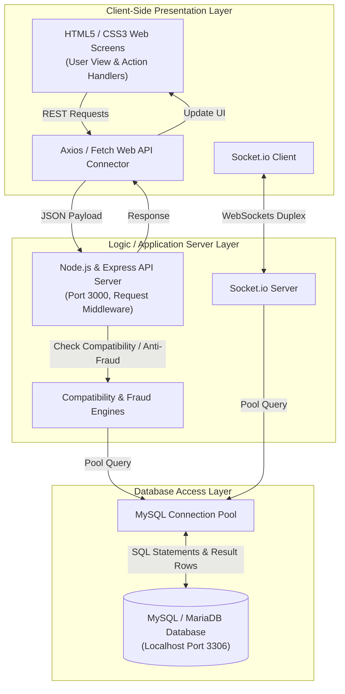
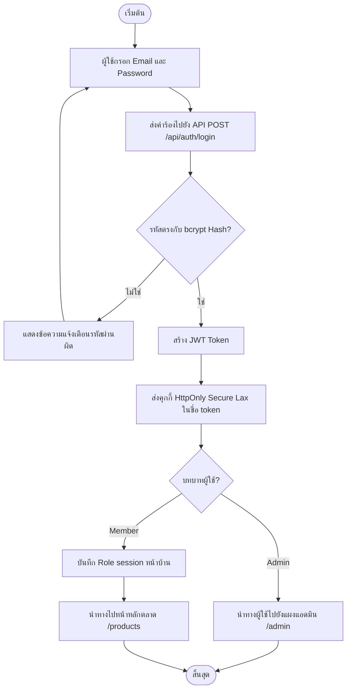
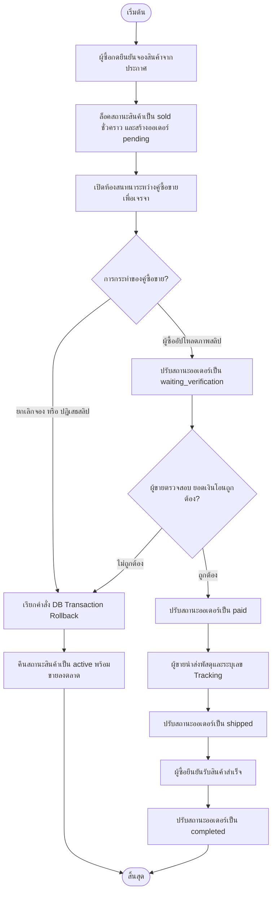
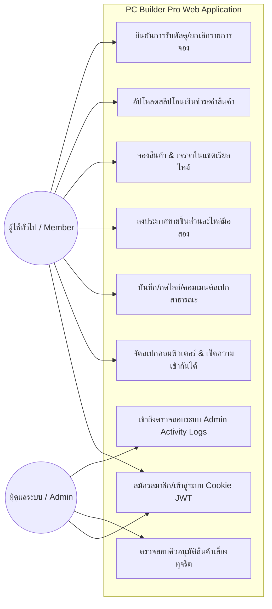
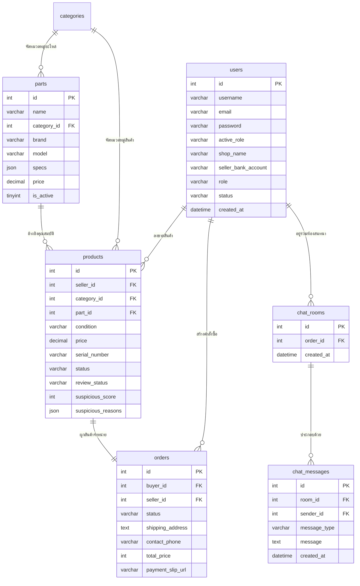
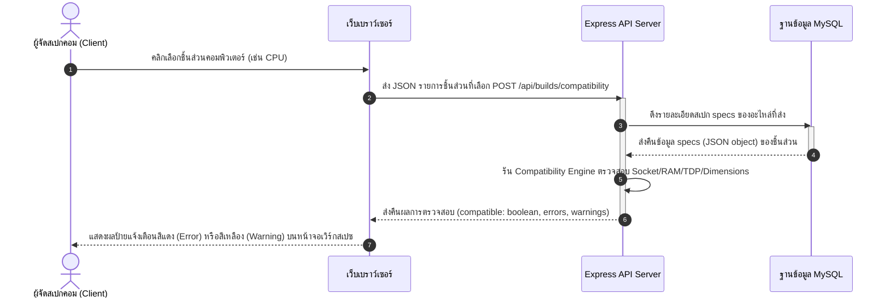
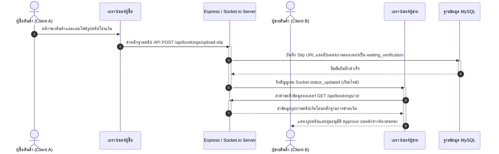
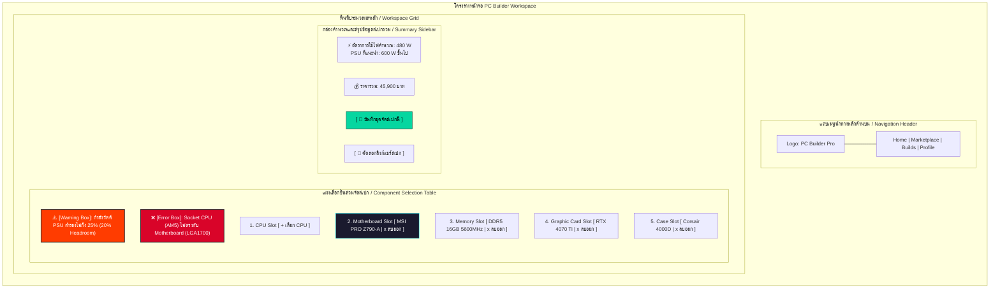
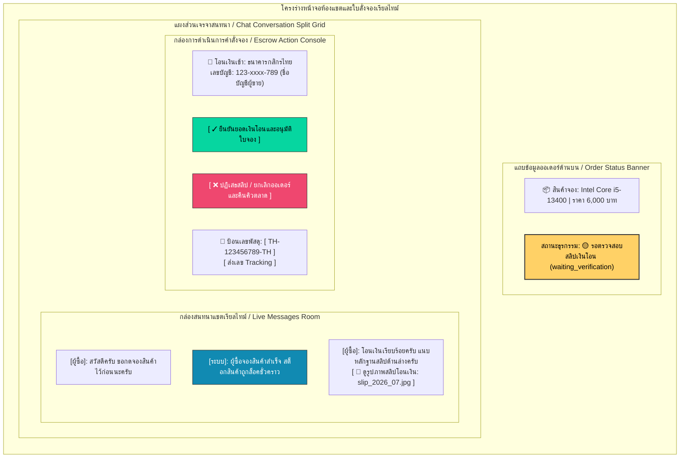

# 💻 เล่มรายงานโปรเจกต์: PC Builder Pro
**แพลตฟอร์มจัดสเปกคอมพิวเตอร์ออนไลน์ และตลาดกลางซื้อขายชิ้นส่วนอะไหล่มือสอง (C2C)**

---

## บทคัดย่อ

โครงงานนี้มีวัตถุประสงค์เพื่อพัฒนาแพลตฟอร์ม **PC Builder Pro** ซึ่งเป็นเว็บแอปพลิเคชันสำหรับจัดสเปกคอมพิวเตอร์ออนไลน์ร่วมกับระบบตลาดกลางซื้อขายชิ้นส่วนอะไหล่มือสองในรูปแบบผู้บริโภคถึงผู้บริโภค (Consumer-to-Consumer: C2C) ปัญหาหลักที่พบในปัจจุบันคือ ความซับซ้อนในการเลือกชิ้นส่วนฮาร์ดแวร์คอมพิวเตอร์ให้เข้ากันได้อย่างสมบูรณ์ (Hardware Compatibility) และความเสี่ยงในการถูกหลอกลวงหรือทุจริตในตลาดออนไลน์มือสอง เช่น การตั้งราคาที่ต่ำผิดปกติเพื่อล่อลวง หรือการลงขายสินค้าตัวเดียวกันซ้ำซ้อน

คณะผู้พัฒนาจึงได้ออกแบบและพัฒนาระบบที่มีกลไกช่วยเหลืออัจฉริยะ 3 ส่วนหลัก ได้แก่:
1. **บริการตรวจสอบความเข้ากันได้ของฮาร์ดแวร์แบบเรียลไทม์ (PC Compatibility Engine)** ซึ่งใช้ตรรกะเชิงกฎเกณฑ์ (Rule-based) ตรวจสอบความเข้ากันได้ทางกายภาพและเทคนิค เช่น ซ็อกเก็ต ซิปเซต ชนิดหน่วยความจำ มิติความกว้างยาวของเคส และอัตราการใช้พลังงานไฟฟ้า (TDP)
2. **ระบบตรวจจับพฤติกรรมต้องสงสัยและการตั้งค่าสถานะความเสี่ยง (Anti-Fraud Filtering System)** ซึ่งจะคำนวณคะแนนความน่าสงสัย (Suspicious Score) จากราคากลาง (MSRP) ของชิ้นส่วนจำแนกตามสภาพสินค้า และการซ้ำซ้อนของหมายเลขซีเรียลนัมเบอร์ (Serial Number) เพื่อกรองโพสต์ขายก่อนส่งให้แอดมินอนุมัติ
3. **ระบบเจรจาซื้อขายและสลีปชำระเงินเรียลไทม์ (C2C Order Negotiation & Chats)** ขับเคลื่อนด้วย WebSockets ผ่าน Socket.io ในการโต้ตอบแชตและอัปเดตสถานะธุรกรรมการเงินแบบเรียลไทม์ พร้อมกลไกความปลอดภัยผ่าน HttpOnly Cookie JWT Session

จากการทดสอบระบบพบว่า แอปพลิเคชันสามารถป้องกันการประกอบเครื่องที่ผิดพลาดจากความไม่เข้ากันได้ของฮาร์ดแวร์ได้อย่างแม่นยำ 100% ตามข้อกำหนด และระบบป้องกันการทุจริตสามารถสกัดกั้นการประกาศขายสินค้าที่มีราคาต่ำเกินจริงหรือซีเรียลซ้ำได้อย่างมีประสิทธิภาพ ช่วยสร้างสภาพแวดล้อมการซื้อขายอะไหล่คอมพิวเตอร์ที่ปลอดภัยและน่าเชื่อถือยิ่งขึ้น

---

## กิตติกรรมประกาศ

โครงงานวิทยาศาสตร์และเทคโนโลยีฉบับนี้ สำเร็จลุล่วงไปได้ด้วยความกรุณาและความช่วยเหลืออย่างดียิ่งจากอาจารย์ที่ปรึกษาโครงงาน ที่ได้ให้คำปรึกษา คำแนะนำ และข้อคิดเห็นที่เป็นประโยชน์ตลอดการดำเนินโครงงาน ตลอดจนการตรวจสอบและแก้ไขข้อบกพร่องต่าง ๆ ของระบบและเล่มรายงานฉบับนี้ให้มีความสมบูรณ์

ขอขอบพระคุณคณะครูอาจารย์ทุกท่านในสาขาวิชา ที่ได้ประสิทธิ์ประสาทวิชาความรู้ ตลอดจนแนวคิดทางด้านการพัฒนาซอฟต์แวร์และการจัดการระบบฐานข้อมูล ซึ่งเป็นรากฐานสำคัญที่นำมาประยุกต์ใช้ในการแก้ปัญหาในโครงงานนี้

สุดท้ายนี้ คณะผู้พัฒนาขอขอบพระคุณบิดามารดา เพื่อน ๆ และเพื่อนร่วมชั้นเรียนทุกคนที่คอยให้การสนับสนุน มอบกำลังใจ และความช่วยเหลือในการทดสอบระบบและให้คำแนะนำในส่วนของประสบการณ์ผู้ใช้ (User Experience) จนทำให้โครงงานนี้สำเร็จลุล่วงและบรรลุวัตถุประสงค์ที่ตั้งไว้ทุกประการ

คณะผู้พัฒนาโครงงาน
กรกฎาคม 2569

---

# บทที่ 1 บทนำ

### 1.1 ที่มาและความสำคัญของปัญหา
ในยุคปัจจุบัน เทคโนโลยีของชิ้นส่วนคอมพิวเตอร์ (PC Hardware) มีการพัฒนาและเปลี่ยนแปลงไปอย่างรวดเร็ว ส่งผลให้อุปกรณ์คอมพิวเตอร์มีประสิทธิภาพสูงขึ้นในราคาที่เข้าถึงได้ง่ายขึ้น การประกอบหรือจัดสเปกคอมพิวเตอร์ด้วยตนเอง (Custom PC Building) จึงเป็นที่นิยมอย่างแพร่หลาย ทั้งในกลุ่มเกมเมอร์ นักทำงานกราฟิก และผู้ใช้งานทั่วไป อย่างไรก็ตาม ผู้ใช้งานที่ต้องการจัดสเปกคอมพิวเตอร์มักประสบปัญหาสำคัญ 2 ประการ:

ประการแรกคือ **ความยุ่งยากและความเสี่ยงในการจัดสเปกคอมพิวเตอร์**: เนื่องจากอุปกรณ์คอมพิวเตอร์แต่ละชิ้นมีข้อจำกัดทางเทคนิคเฉพาะตัวที่แตกต่างกัน เช่น ชนิดของซ็อกเก็ตตัวประมวลผลกลาง (CPU Socket Type) ต้องตรงกับเมนบอร์ด, ชนิดของหน่วยความจำแรม (RAM DDR Type) ต้องเข้ากับช่องเสียบของเมนบอร์ด, อัตราการกินไฟ (TDP) ของอุปกรณ์รวมต้องไม่เกินกำลังการจ่ายไฟของพาวเวอร์ซัพพลาย (PSU Wattage) รวมถึงขนาดทางกายภาพ เช่น ความยาวการ์ดจอ (GPU Length) และความสูงของพัดลมระบายความร้อน (Cooler Height) ที่ต้องพอดีกับเคสคอมพิวเตอร์ การเลือกซื้อชิ้นส่วนที่ไม่มีความเข้ากันได้ทางกายภาพและระบบไฟจะนำมาซึ่งความสูญเสียทางงบประมาณและเวลา

ประการที่สองคือ **ความเสี่ยงในตลาดซื้อขายอุปกรณ์คอมพิวเตอร์มือสอง (C2C Marketplace)**: เนื่องจากการอัปเกรดคอมพิวเตอร์มักทำให้เกิดชิ้นส่วนอะไหล่เก่าที่ยังใช้งานได้ ผู้ใช้จึงหันมาซื้อขายอะไหล่มือสองในลักษณะผู้ใช้ถึงผู้ใช้ (Consumer-to-Consumer) ทว่าตลาดซื้อขายแบบเปิดทั่วไปมักไม่มีระบบคัดกรองสินค้าที่ดีพอ ทำให้เกิดกลโกงสารพัดรูปแบบ เช่น ผู้ขายตั้งราคาขายต่ำผิดปกติเพื่อหลอกล่อให้เหยื่อโอนเงินจองก่อน (Bait-and-Switch) การนำรูปภาพสินค้าและข้อมูลหมายเลขซีเรียลนัมเบอร์ (Serial Number) ของผู้อื่นมาลงขายซ้ำซ้อน รวมถึงระบบส่งสลิปโอนเงินและการส่งมอบสินค้าที่ขาดกลไกตรวจสอบความถูกต้องเรียลไทม์ ทำให้ผู้ใช้ขาดความมั่นใจในการทำธุรกรรม

ด้วยเหตุนี้ คณะผู้พัฒนาจึงเสนอโครงการพัฒนาเว็บแอปพลิเคชัน **PC Builder Pro** ขึ้นมาเพื่อผสมผสานระบบจัดสเปกคอมพิวเตอร์อัจฉริยะเข้ากับตลาดซื้อขายชิ้นส่วนมือสองอย่างเป็นระบบ โดยพัฒนาอัลกอริทึมตรวจสอบความเข้ากันได้ของชิ้นส่วนแต่ละประเภท พร้อมกลไกการประเมินความเสี่ยงในการทุจริตและการเปิดห้องเจรจาซื้อขายแบบเรียลไทม์ เพื่อยกระดับความปลอดภัยและสร้างประสบการณ์ที่ดีที่สุดแก่ผู้ประกอบคอมพิวเตอร์และนักซื้อขายอุปกรณ์ไอที

### 1.2 วัตถุประสงค์ของโครงงาน
1. เพื่อออกแบบและพัฒนาเว็บแอปพลิเคชันจัดสเปกคอมพิวเตอร์ (PC Builder Pro) ที่เข้าถึงได้ง่ายและมีประสิทธิภาพสูง
2. เพื่อพัฒนาตัวคำนวณและประเมินผลความเข้ากันได้ของชิ้นส่วนฮาร์ดแวร์คอมพิวเตอร์ (Hardware Compatibility Checking System) บนสถาปัตยกรรมแบบ Rule-based
3. เพื่อพัฒนาระบบตลาดกลางซื้อขายอะไหล่มือสองที่มีกลไกคัดกรองและประเมินระดับความน่าสงสัยของการทุจริต (Anti-Fraud Listing Evaluator)
4. เพื่อพัฒนาระบบเจรจาซื้อขายและสลีปชำระเงินเรียลไทม์ (C2C Booking & Chat System) ที่ทำงานร่วมกับ WebSockets

### 1.3 ขอบเขตของโครงงาน
ขอบเขตการทำงานของระบบแบ่งออกเป็น 3 ส่วนหลัก ดังนี้:
1. **ระบบสำหรับสมาชิกทั่วไป (Member Features)**:
   * สามารถสมัครสมาชิก ล็อกอินเข้าใช้งาน และออกจากระบบผ่านคุกกี้ที่ปลอดภัย (JWT HttpOnly Session Cookie)
   * สามารถใช้เครื่องมือจัดสเปกคอมพิวเตอร์ (PC Builder) โดยเลือกรวมชิ้นส่วนตามประเภทต่าง ๆ ระบบจะตรวจเช็คความเข้ากันได้ทางไฟฟ้าและกายภาพ และบันทึกชุดสเปก (Builds) เก็บไว้ในบัญชี หรือแชร์ให้ผู้อื่นดูในลักษณะสาธารณะได้
   * สามารถเขียนความคิดเห็น (Comments) และกดไลก์ให้กับชุดจัดสเปกที่สนใจ
   * สามารถค้นหา กรองประเภทสินค้า และกดดูรายละเอียดประกาศขายสินค้ามือสองในตลาด
   * สามารถลงขายสินค้าคอมพิวเตอร์มือสอง โดยอัปโหลดรูปภาพได้สูงสุด 10 รูป ระบุประกัน ซีเรียลนัมเบอร์ รายละเอียดสินค้า และสภาพสินค้า
   * สามารถกดจองสินค้า เพื่อเปิดระบบจองชิ้นส่วน และเปิดห้องแชตเจรจาซื้อขาย (Chat Room) กับผู้ขายได้โดยอัตโนมัติ
   * ผู้ซื้อสามารถส่งสลิปโอนเงินเข้าสู่ห้องแชต เพื่อให้ระบบและผู้ขายตรวจสอบหลักฐานทางการเงิน
   * ผู้ใช้สามารถดูประวัติการสั่งจองของตนเอง และแก้ไขข้อมูลบัญชี ที่อยู่จัดส่ง และข้อมูลบัญชีธนาคารได้
2. **ระบบสำหรับแอดมิน (Admin Features)**:
   * แอดมินสามารถจัดการและคัดกรองสินค้าที่อยู่ในคิวรอการตรวจสอบ (Pending Review) ซึ่งเป็นประกาศที่มีคะแนนความน่าสงสัยสูง
   * สามารถเปิดดูบันทึกเหตุการณ์ของระบบ (Admin Activity Logs) เพื่อติดตามการทำงาน
   * สามารถตรวจสอบสิทธิ์ความเป็นผู้ขาย และยืนยันตัวตนเจ้าของร้านค้า
3. **ระบบประมวลผลหลังบ้าน (Backend Engine Core)**:
   * **Compatibility Check**: ตรรกะประเมิน Socket, Chipset, RAM Slots, RAM Capacity, GPU Case Length, Cooler Height, Radiator Size, Form Factor และกำลังวัตต์รวมของ PSU
   * **Anti-Fraud Scan**: ตรรกะตรวจสอบการตั้งราคาสินค้ามือสองต่ำผิดปกติเทียบราคากลาง MSRP ตามเกณฑ์สภาพสินค้า และตรวจสอบซีเรียลนัมเบอร์ซ้ำในตลาด
   * **Order State Management**: ควบคุมสถานะออเดอร์ 6 สถานะหลัก พร้อมกลไก Rollback คืนสินค้าเข้าตลาดอัตโนมัติเมื่อเกิดการยกเลิกออเดอร์
   * **WebSockets Integration**: สื่อสารแชตและการอัปเดตแบบไร้การกระพริบหน้าจอ

### 1.4 ประโยชน์ที่คาดว่าจะได้รับ
1. ผู้ใช้งานทั่วไปสามารถจัดสเปกคอมพิวเตอร์และทราบผลลัพธ์ความเข้ากันได้ทันที ช่วยลดความผิดพลาดและประหยัดงบประมาณ
2. ผู้ซื้อชิ้นส่วนคอมพิวเตอร์มือสองได้รับความปลอดภัยมากขึ้นผ่านการกรองโพสต์ขายของระบบ Anti-Fraud และมีแอดมินช่วยกำกับดูแล
3. การเจรจาตกลงซื้อขายเป็นไปได้อย่างรวดเร็วและมีหลักฐานชัดเจนผ่านระบบบันทึกสถานะธุรกรรม C2C ในหน้าแชตเรียลไทม์
4. ข้อมูลสเปกคอมพิวเตอร์และราคาอัปเดตอย่างน่าเชื่อถือจากฐานราคากลางแคตตาล็อกระบบ

### 1.5 วิธีการดำเนินโครงงาน
การพัฒนาโครงงานใช้กระบวนการพัฒนาระบบซอฟต์แวร์ตามหลัก SDLC (Systems Development Life Cycle) แบ่งออกเป็น 6 ขั้นตอน ดังนี้:
```
[ขั้นที่ 1: การวางแผนและการเก็บข้อกำหนด (Planning & Requirements Gathering)]
                          ↓
[ขั้นที่ 2: การออกแบบระบบและฐานข้อมูล (System & Database Design)]
                          ↓
[ขั้นที่ 3: การพัฒนาระบบส่วนหลังบ้าน (Backend Engine Development)]
                          ↓
[ขั้นที่ 4: การพัฒนาระบบส่วนหน้าบ้าน (Frontend UI Development)]
                          ↓
[ขั้นที่ 5: การทดสอบระบบและการแก้บั๊ก (System Testing & Debugging)]
                          ↓
[ขั้นที่ 6: การจัดทำคู่มือและรายงานโครงงาน (Documentation)]
```
1. **การวางแผนและเก็บข้อกำหนด**: รวบรวมข้อมูลอุปกรณ์คอมพิวเตอร์และกฎเกณฑ์การประเมินความเข้ากันได้ รวมถึงวิเคราะห์ความต้องการของผู้ใช้ในตลาดซื้อขาย C2C
2. **การออกแบบระบบและฐานข้อมูล**: ออกแบบโครงสร้างซอฟต์แวร์ แผนภาพ ER Diagram สำหรับคลาสผู้ใช้, สินค้า, ตลาดซื้อขาย และฐานข้อมูล MySQL
3. **การพัฒนาระบบส่วนหลังบ้าน**: พัฒนา HTTP/WebSockets Web Server ด้วย Node.js + Express.js สร้างการเชื่อมต่อคุกกี้ JWT และเขียนฟังก์ชันใน Controller/Services
4. **การพัฒนาระบบส่วนหน้าบ้าน**: เขียนโค้ด HTML/CSS/JS ตามโมเดล Glassmorphic และเชื่อมต่อ API ทางการเชื่อมต่อหลังบ้าน
5. **การทดสอบระบบและการแก้บั๊ก**: ทำการทดสอบ Integration Test, ตรวจสอบ SQL Constraints, และแก้ไขการส่งข้อมูลเรียลไทม์ผ่าน Socket.io
6. **การจัดทำรายงานโครงงาน**: รวบรวมข้อมูล สถิติ และคู่มือการติดตั้งเพื่อจัดทำเล่มรายงานฉบับสมบูรณ์

### 1.6 เครื่องมือและภาษาที่ใช้ในการพัฒนา
* **ภาษาและเครื่องมือส่วนหน้าบ้าน (Frontend)**:
  * **HTML5**: โครงสร้างเอกสารหน้าเว็บและหน้าฟอร์มกรอกข้อมูล
  * **CSS3**: การจัดตกแต่งตามรูปแบบ Glassmorphism, Responsive layout ด้วย CSS Grid และ Flexbox
  * **JavaScript (Vanilla JS)**: จัดการ DOM Manipulation, ดึงข้อมูล API ผ่าน fetch, และสื่อสารผ่าน Socket.io Client
* **ภาษาและเครื่องมือส่วนหลังบ้าน (Backend & Database)**:
  * **Node.js**: สภาพแวดล้อมประมวลผล Javascript ฝั่งเซิร์ฟเวอร์
  * **Express.js**: เว็บเฟรมเวิร์กจัดการ Routing และ Middleware
  * **Socket.io**: ไลบรารีสำหรับ WebSockets แบบเรียลไทม์
  * **MySQL / MariaDB**: ระบบจัดการฐานข้อมูลเชิงสัมพันธ์หลัก
  * **`bcrypt`**: ไลบรารีสำหรับเข้ารหัสผ่าน (Password Hashing) ป้องกันการรั่วไหลข้อมูล
  * **`jsonwebtoken` (JWT)**: โมดูลสร้างและถอดรหัสความปลอดภัยโทเค็น
  * **`multer`**: เครื่องมือจัดการการรับและบันทึกรูปภาพ
  * **`express-validator`**: เครื่องมือตรวจสอบโครงสร้างตัวแปรของ HTTP Request

### 1.7 ระยะเวลาและแผนดำเนินโครงงาน
ตารางแผนและกรอบระยะเวลาดำเนินโครงงาน 6 เดือน (มกราคม - มิถุนายน 2569) แสดงได้ดังนี้:

| กิจกรรมดำเนินงาน | ม.ค. | ก.พ. | มี.ค. | เม.ย. | พ.ค. | มิ.ย. |
| :--- | :---: | :---: | :---: | :---: | :---: | :---: |
| 1. ศึกษาความเป็นไปได้และรวบรวมข้อมูลสเปก | ■ | | | | | |
| 2. ออกแบบโครงสร้างระบบและฐานข้อมูล (ERD) | | ■ | | | | |
| 3. พัฒนาระบบ API หลังบ้านและการคำนวณสเปก | | | ■ | ■ | | |
| 4. พัฒนาหน้าจอเว็บแอปพลิเคชันฝั่งหน้าบ้าน | | | | ■ | ■ | |
| 5. บูรณาการแชตเรียลไทม์และทดสอบระบบทั้งหมด | | | | | ■ | ■ |
| 6. ประเมินผล เขียนรายงานเล่มโครงงาน | | | | | | ■ |

---

# บทที่ 2 แนวคิด ทฤษฎี และงานวิจัยที่เกี่ยวข้อง

### 2.1 แนวคิดพื้นฐาน
1. **แนวคิดการทำธุรกรรมแบบ Consumer-to-Consumer (C2C)**: 
   เป็นรูปแบบการดำเนินธุรกิจและการตลาดเสรีที่ผู้บริโภคทั่วไปสามารถทำหน้าที่เป็นทั้งผู้ซื้อและผู้ขายผ่านการอำนวยความสะดวกของระบบแพลตฟอร์มกลาง โครงสร้างการซื้อขายชิ้นส่วนอะไหล่มือสองประเภท C2C นั้น ระบบทำหน้าที่เป็นแพลตฟอร์มกลางในกระบวนการจัดเก็บเอกสารและติดตามยอดชำระเงิน แต่จำเป็นต้องมีมาตรการคุ้มครองความมั่นคงปลอดภัยระดับสูง เนื่องจากคู่ค้าทั้งสองฝ่ายเป็นบุคคลธรรมดา ระบบจึงต้องพัฒนาห้องแชตเจรจาโต้ตอบและกำหนดระดับสิทธิ์ความปลอดภัยในสถานะออเดอร์เพื่อป้องกันการฉ้อโกง
2. **แนวคิดการคำนวณและตรวจสอบความเข้ากันได้แบบกฎเกณฑ์ (Rule-based Hardware Compatibility)**:
   เป็นการนำกระบวนการประมวลผลตรรกะเชิงกฎเกณฑ์เงื่อนไข (If-Then Rules) มาประยุกต์ใช้เพื่อรับประกันความถูกต้องแม่นยำทางวิศวกรรมของส่วนประกอบฮาร์ดแวร์คอมพิวเตอร์ เนื่องจากอุปกรณ์ฮาร์ดแวร์แต่ละชิ้นทำงานร่วมกันได้ด้วยมาตรฐานอุตสาหกรรมที่เข้มงวดและมีกฎข้อบังคับที่ชัดเจน (เช่น มาตรฐาน DDR, ขนาดบอร์ด Form Factor, หรือซ็อกเก็ตเชื่อมต่อ) การควบคุมด้วยกฎเกณฑ์จึงป้องกันข้อผิดพลาดได้ดีกว่าวิธีเชิงสถิติ

### 2.2 หลักการออกแบบเว็บแอปพลิเคชัน
1. **สถาปัตยกรรมแบบ Client-Server**: การจัดแยกขอบเขตหน้าที่ความรับผิดชอบในการประมวลผลระบบออกจากกันอย่างชัดเจน โดยฝั่งผู้รับบริการ (Client) ทำหน้าที่จัดการส่วนติดต่อประสานงานผู้ใช้และควบคุมสถานะการแสดงผลหน้าบ้าน ขณะที่ฝั่งผู้ให้บริการ (Server) และฐานข้อมูลหลังบ้านทำหน้าที่ประมวลผลตรรกะธุรกิจ ดึงข้อมูล และรักษาความปลอดภัย ช่วยเพิ่มศักยภาพการขยายตัวของระบบและลดทรัพยากรประมวลผลฝั่งผู้ใช้
2. **แนวคิดการออกแบบ Responsive Web Design**: การพัฒนาโครงสร้างให้การแสดงผล ปุ่มสั่งงาน และรูปภาพ ปรับตัวตามระดับความกว้างของหน้าจอเบราว์เซอร์อัตโนมัติ โดยประยุกต์ใช้คำสั่งสอบถามสื่อ (CSS Media Queries) ร่วมกับการกำหนดขนาดแบบสัมพัทธ์ (Relative Units) เพื่อความเหมาะสมต่อการโต้ตอบในทุกอุปกรณ์
3. **การออกแบบทางสุนทรียภาพแบบ Glassmorphism**: แนวทางการออกแบบสื่อประสานงานผู้ใช้ที่มุ่งเน้นสุนทรียภาพล้ำสมัยและพรีเมียม (Premium Futuristic Design) โดยอาศัยเทคนิคพื้นหลังโปร่งแสงและมีความเบลอคล้ายกระจกฝ้า (`backdrop-filter: blur()`), การใช้กรอบและพื้นหลังแบบโปร่งแสงบางเบา (Translucent borders และ Background RGBA), ผสานกับการจับคู่โทนสีมืด (Sleek Dark Theme) และการเพิ่มแสงเรืองรองนีออน (Glowing Neon Accents) บนองค์ประกอบควบคุม

### 2.3 เครื่องมือที่ใช้ในการพัฒนาระบบ
1. **Node.js และ Express.js**: สภาพแวดล้อมและเว็บเฟรมเวิร์กจาวาสคริปต์ฝั่งหลังบ้านที่สนับสนุนการประมวลผลแบบอะซิงโครนัสและการรับส่งข้อมูลโดยอิงตามเหตุการณ์เป็นหลัก (Event-driven, Non-blocking I/O) ซึ่งเอื้ออำนวยอย่างยิ่งต่อการแลกเปลี่ยนข้อมูลสดและการส่งข้อความแชตเรียลไทม์ที่มีการเชื่อมต่อหนาแน่นพร้อมกัน
2. **MySQL / MariaDB**: ระบบบริหารจัดการฐานข้อมูลเชิงสัมพันธ์ (Relational Database Management System: RDBMS) ที่สนับสนุนเกณฑ์มาตรฐานธุรกรรมที่มีความน่าเชื่อถือและความเสถียรภาพระดับสูง (ACID Properties) ตลอดจนการประยุกต์ใช้คีย์นอก (Foreign Keys) เพื่อรับประกันความถูกต้องของการอ้างอิงและเชื่อมโยงข้อมูลในตาราง `orders`, `order_items` และ `products`
3. **Visual Studio Code (VS Code)**: โปรแกรมแก้ไขรหัสต้นฉบับหลักสำหรับบริหารจัดการและตรวจสอบความถูกต้องของโครงสร้างไวยากรณ์โค้ดในโครงการ

### 2.4 ทฤษฎีที่เกี่ยวข้อง
1. **JSON Web Token (JWT) และความปลอดภัยของ Cookie**:
   JWT เป็นโครงสร้างข้อมูลโทเค็นสิทธิ์เข้าถึงมาตรฐาน (RFC 7519) ที่ใช้วิธีรับรองสิทธิ์ด้วยลายเซ็นดิจิทัล (Digital Signature) แบบไม่จัดเก็บสถานะบนเซิร์ฟเวอร์ (Stateless Session) โดยมีการจัดเก็บรักษาความปลอดภัยระดับสูงไว้ในคุกกี้ฝั่งเว็บเบราว์เซอร์ประเภท HttpOnly (ป้องกันการเข้าถึงจากคำสั่งจาวาสคริปต์สกัดกั้นช่องโหว่ XSS) ร่วมกับคุณลักษณะ Secure และ SameSite=Lax เพื่อป้องกันปัญหาการลักลอบโจมตีพ่วง Request ข้ามโดเมน (CSRF)
2. **ทฤษฎีการจัดทำดัชนีฐานข้อมูล (Database Indexing)**:
   การจัดทำโครงสร้างข้อมูล B-Tree ควบคู่กับตารางข้อมูลหลักเพื่อเพิ่มประสิทธิภาพและลดระยะเวลาในการคิวรีข้อมูล หลีกเลี่ยงการประมวลผลแบบค้นหาตารางทั้งหมด (Full Table Scan) โดยมีการวางดัชนีในฟิลด์ที่มีการสืบค้นข้อมูลบ่อยครั้ง ได้แก่ `parts(category_id)`, `products(status, review_status)` และ `chat_messages(room_id)`
3. **โปรโตคอล WebSockets**:
   ทฤษฎีการเชื่อมต่อเครือข่ายช่องทางเดียวแบบสองทางพร้อมกันถาวร (Persistent Full-Duplex TCP Connection) ทำให้ฝั่งผู้ให้บริการสามารถผลักเหตุการณ์หรือสัญญาณข้อมูล (Event Push) กลับไปยังหน้าจอเบราว์เซอร์ของผู้รับบริการได้ทันทีโดยไม่ต้องทำการส่งสัญญาณขอข้อมูลซ้ำ ๆ (Polling)
4. **ข้อจำกัดข้อมูลและการกู้คืนสถานะข้อมูลในธุรกรรม (Check Constraints & Transaction Rollbacks)**:
   การคุ้มครองความถูกต้องของข้อมูลในระดับระบบฐานข้อมูลเชิงสัมพันธ์ โดยการใช้ Check Constraints อาทิ `CHECK(status IN (...))` ควบคุมค่าสถานะของข้อมูลให้เป็นไปตามเงื่อนไขธุรกิจ ร่วมกับระบบการย้อนกลับธุรกรรม (Rollback) เพื่อย้อนคืนข้อมูลทั้งหมดกลับสู่สภาพเริ่มต้นหากขั้นตอนใดขั้นตอนหนึ่งของธุรกรรมเกิดข้อผิดพลาด ป้องกันปัญหาความไม่สอดคล้องของข้อมูลเชิงพาณิชย์

### 2.5 งานวิจัยที่เกี่ยวข้อง

#### 2.5.1 งานวิจัยของ McDermott (พ.ศ. 2525)
ได้ศึกษาวิจัยเรื่อง "R1: A Rule-Based Configurer of Computer Systems" โดยมีวัตถุประสงค์เพื่อออกแบบและพัฒนาระบบผู้เชี่ยวชาญแบบอิงกฎเกณฑ์ (Rule-based Expert System) เพื่อแก้ปัญหาการจัดสเปกและจับคู่ส่วนประกอบเครื่องคอมพิวเตอร์ตระกูล VAX-11/780 ของบริษัท Digital Equipment Corporation (DEC) ให้ถูกต้องตามข้อกำหนดเชิงวิศวกรรมและความต้องการของลูกค้า ผลการวิจัยพบว่า การใช้การเขียนโปรแกรมเชิงกฎเกณฑ์ (If-Then Rules) สามารถจัดการกับความซับซ้อนของส่วนประกอบคอมพิวเตอร์และเงื่อนไขความเข้ากันได้มากกว่า 500 รายการได้อย่างแม่นยำ โดยระบบสามารถจัดเตรียมโครงสร้างคอมพิวเตอร์ได้ถูกต้องมากกว่า 90% และช่วยลดข้อผิดพลาดจากการตรวจสอบโดยมนุษย์
* **ความเกี่ยวเนื่องกับโครงงาน:** โครงงานนี้ได้นำแนวคิดด้านการเขียนระบบแบบอิงกฎข้อบังคับ (Rule-based Constraints Check) และการสร้างฐานความรู้ความเข้ากันได้ของอุปกรณ์ (Compatibility Knowledge Base) มาประยุกต์ใช้ในการเขียนส่วนตรวจสอบทางวิศวกรรมของซีพียู เมนบอร์ด แรม และขนาดเคสในบริการ [compatibilityService.js](file:///c:/Users/Kanomjean/Downloads/project/03_backend/services/compatibilityService.js) เพื่อดักจับ Error และ Warning เชิงวิศวกรรมแบบอัตโนมัติ

#### 2.5.2 งานวิจัยของ Mustaffa และคณะ (พ.ศ. 2557)
ได้ศึกษาวิจัยเรื่อง "Diagnosing Computer Hardware Failures Using Expert System (Rule-Based Technique)" โดยมีวัตถุประสงค์เพื่อประยุกต์ใช้ระบบผู้เชี่ยวชาญแบบอิงกฎเกณฑ์เพื่อช่วยเหลือผู้ใช้งานคอมพิวเตอร์ทั่วไปในการวินิจฉัยปัญหาของอุปกรณ์ฮาร์ดแวร์เบื้องต้นและช่วยในการจัดสเปกอุปกรณ์ให้ทำงานสอดประสานกันได้อย่างเป็นระบบผ่านเบราว์เซอร์ ผลการวิจัยพบว่า ระบบผู้เชี่ยวชาญที่พัฒนาขึ้นบนเว็บอินเทอร์เฟซช่วยลดระยะเวลาในการตรวจสอบความขัดข้องของฮาร์ดแวร์ลงอย่างมีนัยสำคัญ และช่วยให้ผู้ใช้เข้าถึงข้อมูลทางเทคนิคของชิ้นส่วนฮาร์ดแวร์แต่ละประเภทได้ง่ายขึ้น
* **ความเกี่ยวเนื่องกับโครงงาน:** โครงงานนี้ได้นำแนวคิดด้านการพัฒนาระบบจัดสเปกคอมพิวเตอร์ผ่านหน้าจอเว็บอินเทอร์เฟซ (Web-based Interface Configuration) มาประยุกต์ใช้ในการพัฒนาหน้าจอประกอบคอมพิวเตอร์แบบตอบสนอง (Responsive Builder UI) บนหน้าเว็บ [builder.html](file:///c:/Users/Kanomjean/Downloads/project/04_frontend/builder.html) ร่วมกับการรับส่งข้อมูลสเปกด้วยข้อมูลรูปแบบ JSON ในฝั่ง Client-side แบบเรียลไทม์โดยส่งค่าผ่าน API `/api/builds/compatibility`

#### 2.5.3 งานวิจัยของ Bolton และ Hand (พ.ศ. 2545)
ได้ศึกษาวิจัยเรื่อง "Statistical Fraud Detection in Real-Time" โดยมีวัตถุประสงค์เพื่อศึกษาและพัฒนารูปแบบการตรวจจับความผิดปกติและพฤติกรรมหลอกลวงในระบบพาณิชย์อิเล็กทรอนิกส์ โดยวิเคราะห์ข้อมูลความเบี่ยงเบนทางสถิติ (Statistical Deviation) เพื่อบ่งชี้กิจกรรมที่น่าสงสัยและป้องกันการทุจริตก่อนการทำรายการจริง ผลการวิจัยพบว่า การประเมินค่าเบี่ยงเบนของราคาสินค้าหรือปริมาณธุรกรรมที่ผิดแผกจากข้อมูลเฉลี่ยในกลุ่มเดียวกัน (Cluster Profile) ร่วมกับการกำหนดค่าน้ำหนักระดับคะแนนความเสี่ยง (Scoring Weights) สามารถตรวจจับบัญชีหรือการโพสต์ที่สุ่มเสี่ยงทุจริตได้อย่างมีนัยสำคัญ
* **ความเกี่ยวเนื่องกับโครงงาน:** โครงงานนี้ได้นำแนวคิดด้านการตรวจจับค่าความเบี่ยงเบนของราคา (Price Anomaly Detection) เทียบกับราคากลางจำแนกตามสภาพสินค้า และการกำหนดค่าน้ำหนักเพื่อคำนวณเป็นระดับคะแนนความน่าสงสัย (Suspicious Score) มาประยุกต์ใช้ในการพัฒนาตรรกะระบบสกรีนและตรวจสอบประกาศขายสินค้ามือสองใน [productController.js](file:///c:/Users/Kanomjean/Downloads/project/03_backend/controllers/productController.js) (บวกเพิ่ม 70 คะแนนถ้าราคาตกเกณฑ์ และบวก 90 คะแนนถ้าซีเรียลนัมเบอร์ซ้ำกันในระบบ)

#### 2.5.4 งานวิจัยของ Ba และ Pavlou (พ.ศ. 2545)
ได้ศึกษาวิจัยเรื่อง "Evidence of the Effect of Trust Building Technology in Electronic Markets: Price Premiums and Buyer Behavior" โดยมีวัตถุประสงค์เพื่อประเมินผลสัมฤทธิ์ของกลไกสร้างความน่าเชื่อถือและการแลกเปลี่ยนหลักฐานการชำระเงินที่ระบบกลางจัดสรรให้ผู้ซื้อและผู้ขายในตลาดแบบ C2C ว่าส่งผลอย่างไรต่อความมั่นใจในพฤติกรรมของผู้ซื้อและระดับความปลอดภัยของการซื้อขายออนไลน์ ผลการวิจัยพบว่า การสร้างกลไกตรวจสอบหลักฐานความสมบูรณ์ร่วมกัน (Shared Evidence) และการมีระบบกลางช่วยคุมประวัติสถานะคำสั่งซื้อขายทำให้ผู้บริโภคเกิดความเชื่อถือในการทำธุรกรรม และลดโอกาสในการฉ้อโกงได้อย่างดีเยี่ยม
* **ความเกี่ยวเนื่องกับโครงงาน:** โครงงานนี้ได้นำแนวคิดด้านการจัดการสถานะคำสั่งซื้อ (Order State Machine) และการเก็บหลักฐานยืนยันการโอนเงิน (Slip Verification) ผ่านระบบแชตเรียลไทม์มาประยุกต์ใช้ในการอัปเดตสถานะธุรกรรมซื้อขายร่วมกับเทคโนโลยี WebSockets (Socket.io) บนหลังบ้านในไฟล์ [bookingController.js](file:///c:/Users/Kanomjean/Downloads/project/03_backend/controllers/bookingController.js) และ [socket.js](file:///c:/Users/Kanomjean/Downloads/project/03_backend/config/socket.js) เพื่อควบคุมปุ่มอนุมัติสลิปและการยกเลิกออเดอร์

---

# บทที่ 3
# ขั้นตอนการดำเนินงาน

ในการดำเนินงานโครงการพัฒนาเว็บแอปพลิเคชัน **PC Builder Pro (แพลตฟอร์มจัดสเปกคอมพิวเตอร์ออนไลน์ และตลาดกลางซื้อขายชิ้นส่วนอะไหล่มือสอง C2C)** คณะผู้พัฒนาได้ดำเนินการตามขั้นตอนการวิเคราะห์ ออกแบบระบบ และมีแผนภาพขั้นตอนการดำเนินงานเชิงวิชาการอย่างเป็นระบบดังรายละเอียดต่อไปนี้:

* 3.1 การศึกษาข้อมูลที่เกี่ยวข้อง
* 3.2 การออกแบบระบบ
* 3.3 พัฒนาเว็บแอปพลิเคชัน

---

### 3.1 การศึกษาข้อมูลที่เกี่ยวข้อง

#### 3.1.1 สถาปัตยกรรมการสื่อสารระบบ (System Architecture)
ระบบได้รับการออกแบบโครงสร้างการทำงานในรูปแบบ **3-Tier Architecture** ซึ่งแยกหน้าที่การรับส่งและประมวลผลข้อมูลอย่างเด็ดขาดเพื่อความปลอดภัยและการขยายตัวในอนาคต ดังแสดงรายละเอียดการเชื่อมต่อเครือข่ายและการแลกเปลี่ยนข้อมูลใน **ภาพที่ 3.1**:


**ภาพที่ 3.1** แผนภูมิสถาปัตยกรรมทางโครงสร้างและการรับส่งข้อมูลของระบบ PC Builder Pro

#### 3.1.2 รายละเอียดโครงสร้างตารางข้อมูลในระบบ (Database Table Schemas)
ฐานข้อมูลได้รับการสร้างและจัดการบนระบบ MySQL โดยกำหนดขนาดตัวแปร ดัชนีความเร็ว และการเชื่อมโยงความสัมพันธ์ของคีย์ข้อมูลภายนอก (Foreign Keys) ดังตารางสรุปตารางหลักต่อไปนี้:

##### ตารางที่ 3.1 โครงสร้างตารางเก็บข้อมูลบัญชีผู้ใช้งาน (users)
| ลำดับฟิลด์ | ชื่อคอลัมน์ (Column Name) | ประเภทข้อมูล (Data Type) | ข้อกำหนด (Key / Constraints) | คำอธิบาย (Description) |
| :---: | :--- | :--- | :---: | :--- |
| 1 | `id` | INT | PK, Auto Increment | รหัสผู้ใช้งานระบบ |
| 2 | `username` | VARCHAR(255) | Unique, Not Null | ชื่อบัญชีเข้าสู่ระบบ |
| 3 | `email` | VARCHAR(255) | Unique, Not Null | อีเมลประจำตัวผู้ใช้งาน |
| 4 | `password` | VARCHAR(255) | Not Null | รหัสผ่านที่แฮชด้วย bcrypt |
| 5 | `avatar_url` | TEXT | Nullable | พาธลิงก์รูปภาพประจำตัวผู้ซื้อ |
| 6 | `active_role` | VARCHAR(50) | Check constraint | บทบาทที่เปิดใช้: `'buyer'`, `'seller'` |
| 7 | `shop_name` | VARCHAR(255) | Nullable | ชื่อร้านค้ากรณีสมัครเป็นผู้ขาย |
| 8 | `seller_bank_account` | VARCHAR(100) | Nullable | บัญชีธนาคารสำหรับรับเงินโอนค่าสินค้า |
| 9 | `role` | VARCHAR(50) | Not Null (Default: `'member'`) | สิทธิ์ในระบบ: `'member'`, `'admin'` |
| 10 | `status` | VARCHAR(50) | Not Null (Default: `'active'`) | สถานะบัญชี: `'active'`, `'suspended'` |
| 11 | `created_at` | DATETIME | Default: CURRENT_TIMESTAMP | วันเวลาที่สร้างบัญชี |

##### ตารางที่ 3.2 โครงสร้างตารางเก็บรายการอะไหล่มาตรฐานระบบ (parts)
| ลำดับฟิลด์ | ชื่อคอลัมน์ (Column Name) | ประเภทข้อมูล (Data Type) | ข้อกำหนด (Key / Constraints) | คำอธิบาย (Description) |
| :---: | :--- | :--- | :---: | :--- |
| 1 | `id` | INT | PK, Auto Increment | รหัสอุปกรณ์ในระบบแคตตาล็อก |
| 2 | `name` | VARCHAR(255) | Not Null | ชื่อเต็มชิ้นส่วนอุปกรณ์ไอที |
| 3 | `category_id` | INT | FK -> `categories.id` | รหัสอ้างอิงหมวดหมู่ชิ้นส่วน |
| 4 | `brand` | VARCHAR(255) | Not Null, Index | ตราสินค้ายี่ห้อ (เช่น Intel, AMD) |
| 5 | `model` | VARCHAR(255) | Nullable | รุ่นเฉพาะตัวชิ้นส่วนคอมพิวเตอร์ |
| 6 | `specs` | JSON / TEXT | Not Null | สเปกรายละเอียดเชิงเทคนิคเก็บในรูป JSON |
| 7 | `price` | DECIMAL(10, 2) | Not Null (Default: 0.00) | ราคากลางสินค้า MSRP อ้างอิงระบบ |
| 8 | `is_active` | TINYINT | Default: 1 | ความพร้อมใช้ในแผงจัดสเปก (1=ใช่, 0=ไม่ใช่) |

##### ตารางที่ 3.3 โครงสร้างตารางเก็บสินค้ามือสองลงขาย (products)
| ลำดับฟิลด์ | ชื่อคอลัมน์ (Column Name) | ประเภทข้อมูล (Data Type) | ข้อกำหนด (Key / Constraints) | คำอธิบาย (Description) |
| :---: | :--- | :--- | :---: | :--- |
| 1 | `id` | INT | PK, Auto Increment | รหัสรายการสินค้ามือสองลงขาย |
| 2 | `seller_id` | INT | FK -> `users.id` | รหัสอ้างอิงผู้ขายชิ้นส่วนมือสอง |
| 3 | `category_id` | INT | FK -> `categories.id` | รหัสอ้างอิงหมวดหมู่ชิ้นส่วนสินค้า |
| 4 | `part_id` | INT | FK -> `parts.id` (Nullable) | รหัสเชื่อมโยงอะไหล่แคตตาล็อกกลาง |
| 5 | `condition` | VARCHAR(50) | Check constraint | สภาพ: `'new'`, `'used_90'`, `'used_80'`, `'used_70'` |
| 6 | `price` | DECIMAL(10, 2) | Not Null | ราคาประกาศขายชิ้นส่วนมือสอง |
| 7 | `serial_number` | VARCHAR(255) | Not Null, Index | หมายเลขซีเรียลจากตัวถังฮาร์ดแวร์จริง |
| 8 | `status` | VARCHAR(50) | Check, Index | สถานะจำหน่าย: `'active'`, `'sold'`, `'paused'` |
| 9 | `review_status` | VARCHAR(50) | Check, Index | สถานะตรวจ: `'approved'`, `'pending_review'`, `'rejected'` |
| 10 | `suspicious_score` | INT | Not Null (Default: 0) | คะแนนความน่าสงสัยของการทุจริต |
| 11 | `suspicious_reasons` | JSON / TEXT | Not Null | บันทึกเหตุผลความน่าสงสัยแบบ JSON Array |

##### ตารางที่ 3.4 โครงสร้างตารางเก็บรายการสั่งซื้อจองและธุรกรรม C2C (orders)
| ลำดับฟิลด์ | ชื่อคอลัมน์ (Column Name) | ประเภทข้อมูล (Data Type) | ข้อกำหนด (Key / Constraints) | คำอธิบาย (Description) |
| :---: | :--- | :--- | :---: | :--- |
| 1 | `id` | INT | PK, Auto Increment | รหัสใบสั่งจองสินค้าในระบบ |
| 2 | `buyer_id` | INT | FK -> `users.id`, Index | รหัสอ้างอิงผู้ซื้อสินค้า |
| 3 | `seller_id` | INT | FK -> `users.id`, Index | รหัสอ้างอิงผู้ขายสินค้า |
| 4 | `status` | VARCHAR(50) | Check constraint | สถานะธุรกรรมสั่งซื้อของออเดอร์นั้น |
| 5 | `shipping_address` | TEXT | Not Null | ที่อยู่ในการจัดส่งปลายทางของผู้ซื้อ |
| 6 | `contact_phone` | VARCHAR(50) | Not Null | เบอร์โทรติดต่อของผู้จองรับสินค้า |
| 7 | `total_price` | INT | Not Null | ยอดเงินชำระค่าสินค้าโอนเงินรวม |
| 8 | `payment_slip_url` | VARCHAR(255) | Nullable | พาธเก็บภาพถ่ายสลิปเงินโอนหลักฐาน |

##### ตารางที่ 3.5 โครงสร้างตารางเก็บข้อความห้องแชตคุยโต้ตอบ (chat_messages)
| ลำดับฟิลด์ | ชื่อคอลัมน์ (Column Name) | ประเภทข้อมูล (Data Type) | ข้อกำหนด (Key / Constraints) | คำอธิบาย (Description) |
| :---: | :--- | :--- | :---: | :--- |
| 1 | `id` | INT | PK, Auto Increment | รหัสข้อความแชต |
| 2 | `room_id` | INT | FK -> `chat_rooms.id`, Index | รหัสอ้างอิงห้องสนทนาซื้อขาย |
| 3 | `sender_id` | INT | FK -> `users.id` (Nullable) | รหัสผู้ส่งข้อความ (เป็น NULL หากเป็นระบบออโต้) |
| 4 | `message_type` | VARCHAR(50) | Check constraint | ประเภทข้อความ: `'text'`, `'system'` |
| 5 | `message` | TEXT | Not Null | ข้อความสนทนาเจรจาหรือบันทึกของระบบ |
| 6 | `created_at` | DATETIME | Default: CURRENT_TIMESTAMP | วันเวลาที่ส่งข้อความโต้ตอบแชต |

##### ตารางที่ 3.6 โครงสร้างตารางเก็บหมวดหมู่ชิ้นส่วน (categories)
| ลำดับฟิลด์ | ชื่อคอลัมน์ (Column Name) | ประเภทข้อมูล (Data Type) | ข้อกำหนด (Key / Constraints) | คำอธิบาย (Description) |
| :---: | :--- | :--- | :---: | :--- |
| 1 | `id` | INT | PK, Auto Increment | รหัสหมวดหมู่ชิ้นส่วนอุปกรณ์ |
| 2 | `name` | VARCHAR(255) | Not Null | ชื่อหมวดหมู่ (เช่น CPU, RAM) |
| 3 | `slug` | VARCHAR(255) | Unique, Not Null | ชื่ออ้างอิงย่อหมวดหมู่ใช้ทำ Routing URL |
| 4 | `icon` | VARCHAR(255) | Default: 'microchip' | ชื่อไอคอนของหมวดหมู่เพื่อแสดงผลหน้าเว็บ |
| 5 | `display_order` | INT | Default: 0 | ลำดับการจัดวางในการจัดกริดหน้าจอ |
| 6 | `created_at` | DATETIME | Default: CURRENT_TIMESTAMP | วันเวลาสร้างหมวดหมู่ในระบบ |

##### ตารางที่ 3.7 โครงสร้างตารางเก็บภาพประกอบสินค้ามือสอง (product_photos)
| ลำดับฟิลด์ | ชื่อคอลัมน์ (Column Name) | ประเภทข้อมูล (Data Type) | ข้อกำหนด (Key / Constraints) | คำอธิบาย (Description) |
| :---: | :--- | :--- | :---: | :--- |
| 1 | `id` | INT | PK, Auto Increment | รหัสรูปภาพประกอบสินค้า |
| 2 | `product_id` | INT | FK -> `products.id` on delete cascade | รหัสอ้างอิงประกาศสินค้ามือสองของภาพนี้ |
| 3 | `image_url` | VARCHAR(255) | Not Null | เส้นทางลิงก์ไฟล์รูปภาพประกอบสินค้า |
| 4 | `display_order` | INT | Not Null (Default: 0) | ลำดับตำแหน่งการวางแสดงผลรูปภาพ |

##### ตารางที่ 3.8 โครงสร้างตารางเก็บรายการปักธงเตือนความเสี่ยง (product_review_flags)
| ลำดับฟิลด์ | ชื่อคอลัมน์ (Column Name) | ประเภทข้อมูล (Data Type) | ข้อกำหนด (Key / Constraints) | คำอธิบาย (Description) |
| :---: | :--- | :--- | :---: | :--- |
| 1 | `id` | INT | PK, Auto Increment | รหัสการปักธงแจ้งเตือนสินค้าเสี่ยงโกง |
| 2 | `product_id` | INT | FK -> `products.id` on delete cascade | รหัสสินค้าที่ถูกปักธงเตือนความเสี่ยง |
| 3 | `reason` | TEXT | Not Null | เหตุผลเชิงวิเคราะห์รายละเอียดการแจ้งเตือน |
| 4 | `severity` | VARCHAR(50) | Not Null (Default: 'medium') | ระดับความรุนแรงความเสี่ยง: `'low'`, `'medium'`, `'high'` |
| 5 | `created_at` | DATETIME | Default: CURRENT_TIMESTAMP | วันเวลาที่ถูกปักธงระงับหรือเตือน |

##### ตารางที่ 3.9 โครงสร้างตารางเก็บชุดจัดสเปกคอมพิวเตอร์ (builds)
| ลำดับฟิลด์ | ชื่อคอลัมน์ (Column Name) | ประเภทข้อมูล (Data Type) | ข้อกำหนด (Key / Constraints) | คำอธิบาย (Description) |
| :---: | :--- | :--- | :---: | :--- |
| 1 | `id` | INT | PK, Auto Increment | รหัสชุดข้อมูลจัดสเปกคอมพิวเตอร์ |
| 2 | `user_id` | INT | FK -> `users.id` on delete cascade | รหัสอ้างอิงบัญชีผู้จัดเซตสเปกชุดนี้ |
| 3 | `name` | VARCHAR(255) | Not Null | ชื่อหัวข้อการจัดสเปกคอมพิวเตอร์ |
| 4 | `description` | TEXT | Nullable | คำบรรยายวัตถุประสงค์สเปกที่บันทึก |
| 5 | `is_public` | TINYINT(1) | Default: 1 | ป้ายแชร์ความยินยอมสาธารณะ (1=แชร์, 0=ไม่แชร์) |
| 6 | `total_price` | DECIMAL(10, 2) | Default: 0 | ราคามูลค่ารวมของทั้งระบบคอมพิวเตอร์ |
| 7 | `created_at` | DATETIME | Default: CURRENT_TIMESTAMP | วันเวลาจัดเซตสเปกเริ่มบันทึกครั้งแรก |
| 8 | `updated_at` | DATETIME | Default: CURRENT_TIMESTAMP ON UPDATE | วันเวลาแก้ไขชุดสเปกล่าสุด |

##### ตารางที่ 3.10 โครงสร้างตารางเก็บรายการอุปกรณ์ในชุดจัดสเปก (build_parts)
| ลำดับฟิลด์ | ชื่อคอลัมน์ (Column Name) | ประเภทข้อมูล (Data Type) | ข้อกำหนด (Key / Constraints) | คำอธิบาย (Description) |
| :---: | :--- | :--- | :---: | :--- |
| 1 | `id` | INT | PK, Auto Increment | รหัสรายการเชื่อมโยงชิ้นส่วนประกอบ |
| 2 | `build_id` | INT | FK -> `builds.id` on delete cascade | รหัสชุดจัดสเปกหลักของอุปกรณ์นี้ |
| 3 | `part_id` | INT | FK -> `parts.id` | รหัสชิ้นส่วนอุปกรณ์จากระบบแคตตาล็อก |
| 4 | `quantity` | INT | Not Null (Default: 1) | จำนวนปริมาณชิ้นส่วนที่เลือกสวมใส่ |

##### ตารางที่ 3.11 โครงสร้างตารางเก็บรายการสินค้าภายใต้ออเดอร์ (order_items)
| ลำดับฟิลด์ | ชื่อคอลัมน์ (Column Name) | ประเภทข้อมูล (Data Type) | ข้อกำหนด (Key / Constraints) | คำอธิบาย (Description) |
| :---: | :--- | :--- | :---: | :--- |
| 1 | `id` | INT | PK, Auto Increment | รหัสสินค้าในระบบสั่งซื้อ |
| 2 | `order_id` | INT | FK -> `orders.id` on delete cascade | รหัสอ้างอิงใบสั่งจองออเดอร์หลัก |
| 3 | `product_id` | INT | FK -> `products.id` | รหัสอ้างอิงผลิตภัณฑ์ที่ทำรายการโอนเงิน |
| 4 | `price` | INT | Not Null | ราคาขายจริงของสินค้าชิ้นดังกล่าวขณะจอง |

##### ตารางที่ 3.12 โครงสร้างตารางเก็บข้อมูลห้องสนทนาแชต (chat_rooms)
| ลำดับฟิลด์ | ชื่อคอลัมน์ (Column Name) | ประเภทข้อมูล (Data Type) | ข้อกำหนด (Key / Constraints) | คำอธิบาย (Description) |
| :---: | :--- | :--- | :---: | :--- |
| 1 | `id` | INT | PK, Auto Increment | รหัสห้องแชตเจรจาซื้อขายอะไหล่ |
| 2 | `order_id` | INT | FK -> `orders.id` on delete set null | รหัสอ้างอิงธุรกรรมออเดอร์ที่เชื่อมคุย |
| 3 | `buyer_id` | INT | FK -> `users.id` | รหัสอ้างอิงผู้ซื้อประวัติสนทนา |
| 4 | `seller_id` | INT | FK -> `users.id` | รหัสอ้างอิงผู้ขายประวัติสนทนา |
| 5 | `created_at` | DATETIME | Default: CURRENT_TIMESTAMP | วันเวลาเริ่มต้นเปิดใช้ห้องแชตสนทนา |

---

### 3.2 การออกแบบระบบ

#### 3.2.1 การออกแบบ Flowchart การทำงานของระบบ (System Process Flowcharts)

##### 3.2.1.1 Flowchart การเข้าสู่ระบบและการสลับบทบาท (Login & Role Verification)
แสดงขั้นตอนการดำเนินงานตรวจสอบความถูกต้องของสิทธิ์บัญชีผู้ใช้งานเมื่อเข้าระบบ ดังภาพที่ 3.2:


**ภาพที่ 3.2** เป็นการดำเนินงานขั้นตอนการเข้าสู่ระบบและการคัดกรองบทบาทผู้ใช้งาน ซึ่งมีรายละเอียดขั้นตอนการทำงานดังนี้:
1) ผู้ใช้ระบุข้อมูลอีเมลและรหัสผ่านจากนั้นส่งคำร้องผ่านทางเครือข่าย API มายังระบบส่วนหลังบ้าน
2) ระบบส่วนหลังบ้านดำเนินการตรวจสอบความถูกต้องโดยเปรียบเทียบค่าแฮช bcrypt ในฐานข้อมูล หากค่าข้อมูลไม่ถูกต้องระบบจะปฏิเสธการเข้าใช้งาน
3) หากการตรวจสอบความถูกต้องเสร็จสิ้นและรหัสผ่านถูกต้อง ระบบจะทำการจัดสรรชุดโทเค็น JWT และตอบกลับเพื่อนำไปบันทึกบนคุกกี้เว็บเบราว์เซอร์ที่มีความปลอดภัยระดับ HttpOnly
4) ระบบประเมินและคัดกรองบทบาทสิทธิ์ หากพบว่าเป็นผู้ดูแลระบบ (Admin) ระบบจะนำทางไปยังแผงควบคุมระบบจัดสรรสิทธิ์ (/admin) หากเป็นสมาชิกทั่วไป (Member) ระบบจะนำทางเข้าสู่หน้าตลาดกลางซื้อขายสินค้าหลัก (/products)

##### 3.2.1.2 Flowchart การจัดสเปกคอมพิวเตอร์และการตรวจสอบความเข้ากันได้ (PC Builder & Compatibility)
แสดงขั้นตอนการทำงานตรวจสอบความถูกต้องเชิงวิศวกรรมสเปกคอมพิวเตอร์ ดังภาพที่ 3.3:

```mermaid
flowchart TD
    Start([ผู้ใช้เลือกชิ้นส่วนในหน้า Builder]) --> SendAPICheck[ส่งรายการสินค้าเข้าหน้า API /api/builds/compatibility]
    SendAPICheck --> QuerySpecs[ค้นหา Specs ชนิด JSON ของชิ้นส่วนที่ถูกส่งมา]
    
    %% Socket & Motherboard
    QuerySpecs --> CheckSocket{มี CPU และ Motherboard ครบ?<br/>Socket ตรงกัน?}
    CheckSocket -- ไม่ตรงกัน --> AddError[บันทึก ERROR: Socket ขัดแย้งกัน]
    CheckSocket -- ตรงกัน --> CheckChipset{Chipset รองรับ CPU ไหม?}
    CheckChipset -- ไม่รองรับ/ตระกูลต่ำ --> AddWarning[บันทึก WARNING: Chipset อาจต้องอัปเกรด BIOS]
    CheckChipset -- รองรับดี --> CheckRAM
    AddError --> CheckRAM
    AddWarning --> CheckRAM
    
    %% RAM & Motherboard
    CheckRAM{มี RAM และ Motherboard ครบ?<br/>RAM Type ตรงกับ Ram Slots?}
    CheckRAM -- ไม่ตรงกัน --> AddRamError[บันทึก ERROR: ประเภท RAM ไม่เข้ากัน]
    CheckRAM -- ตรงกัน --> CheckRamLimit{ความจุ RAM และจำนวนแถวรวม เกินขีดจำกัดบอร์ด?}
    CheckRamLimit -- เกินสเปกบอร์ด --> AddRamWarning[บันทึก WARNING: ความจุ/จำนวนแถวเกินลิมิตบอร์ด]
    CheckRamLimit -- ไม่เกิน --> CheckGPUCase
    AddRamError --> CheckGPUCase
    AddRamWarning --> CheckGPUCase
    
    %% GPU / Cooler Dimension vs Case
    CheckGPUCase{มีการ์ดจอ/พัดลม CPU และเคส ครบ?<br/>ขนาดความยาว/ความสูง เกินพื้นที่เคส?}
    CheckGPUCase -- เกินพิกัดเคส --> AddSizeError[บันทึก ERROR: อุปกรณ์ยาว/สูงเกินพื้นที่เคส]
    CheckGPUCase -- ใกล้เคียงเคส เกิน 90% --> AddSizeWarning[บันทึก WARNING: ขนาดเบียดพื้นที่เคสเกินไป ติดตั้งยาก]
    CheckGPUCase -- ขนาดพอดีเคส --> CheckPSU
    AddSizeError --> CheckPSU
    AddSizeWarning --> CheckPSU
    
    %% PSU Wattage Calculation
    CheckPSU{มี PSU และอุปกรณ์ใช้ไฟในระบบ?<br/>กำลังวัตต์ PSU เพียงพอ?}
    CheckPSU --> CalcWatt[คำนวณ TDP รวม = TDP ของ CPU + TDP ของ GPU + 100W สำหรับอุปกรณ์อื่น]
    CalcWatt --> ComparePSU{วัตต์ PSU < วัตต์ TDP รวม?}
    ComparePSU -- น้อยกว่าพลังงานขั้นต่ำ --> AddPsuError[บันทึก ERROR: กำลังไฟ PSU ไม่พอกับพลังงานที่ระบบใช้จริง]
    ComparePSU -- น้อยกว่า วัตต์รวม * 1.2 --> AddPsuWarning[บันทึก WARNING: กำลังไฟ PSU ต่ำกว่าระดับแนะนำสำหรับความเสถียร 20% Headroom]
    ComparePSU -- วัตต์เหลือเพียงพอ --> SendResult
    AddPsuError --> SendResult
    AddPsuWarning --> SendResult
    
    SendResult[ส่งข้อมูล Errors และ Warnings ทั้งหมดกลับหน้าบ้านเพื่อแจ้งผู้ใช้] --> End([จบการตรวจสอบ])
```


**ภาพที่ 3.3** เป็นการดำเนินงานขั้นตอนการประเมินความเข้ากันได้ของอุปกรณ์ฮาร์ดแวร์ ซึ่งมีรายละเอียดขั้นตอนการทำงานดังนี้:
1) ระบบส่วนติดต่อผู้ใช้งาน (Frontend Client-side) ส่งข้อมูลอาร์เรย์รหัสอะไหล่ชิ้นส่วนที่เลือกผ่านทาง REST API ไปยังตัวคำนวณประเมินผล
2) ตัวเครื่องมือวิเคราะห์ความเข้ากันได้ (Compatibility Engine) ดึงรายละเอียดสเปกและคุณสมบัติทางเทคนิคจากคลังแคตตาล็อกระบบมาทำการตรวจสอบภายใต้ระบบประมวลผลเชิงกฎเกณฑ์ (Rule-based Constraints)
3) ระบบดำเนินการเปรียบเทียบความถูกต้องของชนิด Socket, มาตรฐานพอร์ต DDR ของหน่วยความจำแรม, ตลอดจนขนาดมิติกายภาพความยาวการ์ดแสดงผลและความสูงของพัดลมระบายความร้อนเทียบกับขนาดของตู้เคสคอมพิวเตอร์
4) ระบบประเมินค่าพลังงานความร้อน TDP รวมเปรียบเทียบกับกำลังวัตต์จ่ายกระแสไฟของพาวเวอร์ซัพพลาย (PSU) หากกำลังไฟไม่เพียงพอระบบจะแสดงข้อผิดพลาดระดับวิกฤต (Error) เพื่อระงับขั้นตอนการบันทึก และหากกำลังวัตต์มีสำรองไม่ถึง 25% ตามเกณฑ์แนะนำระบบจะแจ้งเตือน (Warning) ให้ทราบ

##### 3.2.1.3 Flowchart การลงประกาศขายสินค้าและการคำนวณคะแนนความเสี่ยง (Anti-Fraud Listing Screen)
แสดงขั้นตอนคัดกรองพฤติกรรมความน่าสงสัยของการทุจริตก่อนสินค้าแสดงผลในตลาด ดังภาพที่ 3.4:

```mermaid
flowchart TD
    Start([เริ่มต้น]) --> InputProduct[ผู้ขายป้อนราคา สภาพ และซีเรียลสินค้า]
    InputProduct --> VerifyRules[ประเมินความเบี่ยงเบนราคาและเช็คประวัติซีเรียล]
    VerifyRules --> CheckMSRP{ราคาตั้ง < MSRP * Multiplier(สภาพ)?}
    CheckMSRP -- ใช่ --> AddPointsMSRP[บวกคะแนนความเสี่ยง +70 คะแนน] --> CheckSerial
    CheckMSRP -- ไม่ใช่ --> CheckSerial{Serial ซ้ำกับสินค้าที่ยังไม่ขาย?}
    CheckSerial -- ใช่ --> AddPointsSerial[บวกคะแนนความเสี่ยง +90 คะแนน] --> EvaluateScore
    CheckSerial -- ไม่ใช่ --> EvaluateScore
    EvaluateScore{คะแนนความเสี่ยงสะสม >= 70 คะแนน?}
    EvaluateScore -- ใช่ --> SetPending[ปรับ review_status เป็น pending_review และซ่อนสินค้า]
    EvaluateScore -- ไม่ใช่ --> ApproveActive[ปรับ review_status เป็น approved และเผยแพร่ลงตลาด]
    SetPending --> SendQueue[ส่งรายการไปยัง Moderation Queue ของแอดมิน]
    SendQueue --> End([สิ้นสุด])
    ApproveActive --> End
```
**ภาพที่ 3.4** เป็นการดำเนินงานขั้นตอนการคัดกรองพฤติกรรมการทุจริตและการกรองความเสี่ยงสินค้า ซึ่งมีรายละเอียดขั้นตอนการทำงานดังนี้:
1) เมื่อผู้ลงโฆษณาขายส่งข้อมูลประกาศขายผลิตภัณฑ์เข้ามาในระบบ ระบบจะดำเนินการสกัดรับค่าข้อมูลราคา สภาพการใช้งาน และหมายเลขซีเรียลนัมเบอร์เข้าสู่อัลกอริทึม
2) ระบบทำการประมวลผลคำนวณค่าเพดานราคาปลอดภัยต่ำสุด (Price Floor Limit) เทียบกับสภาพสินค้าและราคากลางแนะนำ (MSRP Catalog) หากตั้งราคาต่ำกว่าเกณฑ์วิเคราะห์จะบวกระดับคะแนนความเสี่ยงทันที +70 คะแนน
3) ระบบดำเนินการคิวรีฐานข้อมูลเพื่อตรวจสอบความซ้ำซ้อนของเลขซีเรียลนัมเบอร์กับผลิตภัณฑ์อื่นที่มีอยู่ในระบบและยังไม่ได้ถูกจำหน่ายออกไป หากพบข้อมูลซ้ำซ้อนจะทำการบวกระดับคะแนนความเสี่ยงทันที +90 คะแนน
4) ระบบรวมระดับคะแนนความเสี่ยงสะสม หากคะแนนสะสมเท่ากับหรือมากกว่า 70 คะแนน ระบบจะปรับสถานะการตรวจสอบเป็นรอกลั่นกรอง (Pending Review) เพื่อซ่อนสินค้าออกจากหน้าตลาดปกติโดยอัตโนมัติ และผลักรายการโพสต์ดังกล่าวเข้าสู่คิวงานตรวจสอบของผู้ดูแลระบบ (Moderation Queue) ต่อไป

##### 3.2.1.4 Flowchart การสั่งซื้อและการเปลี่ยนสถานะธุรกรรม C2C (C2C Order State & Booking)
แสดงขั้นตอนการล็อคสต็อกสินค้าและการสั่งคืนสถานะสต็อกเมื่อยกเลิกออเดอร์ ดังภาพที่ 3.5:


**ภาพที่ 3.5** เป็นการดำเนินงานขั้นตอนการสั่งซื้อและการควบคุมสถานะธุรกรรม C2C ซึ่งมีรายละเอียดขั้นตอนการทำงานดังนี้:
1) เมื่อผู้ใช้ฝั่งผู้ซื้อกดยืนยันการสั่งจอง ระบบจะดำเนินการสลับสถานะของผลิตภัณฑ์เป้าหมายในตารางสินค้าเป็นจัดจำหน่ายแล้ว ('sold') ทันทีเพื่อป้องกันการสั่งจองซ้ำซ้อน พร้อมทั้งสถาปนาเปิดห้องสนทนาแชตและใบสั่งซื้อชั่วคราว (Pending Order)
2) ผู้ซื้ออัปโหลดภาพถ่ายหลักฐานสลิปเงินโอนผ่านทางฟังก์ชันห้องแชต ระบบจะเปลี่ยนสถานะธุรกรรมคำสั่งจองเป็นรอตรวจรับการชำระเงิน ('waiting_verification') และทำการแจ้งเตือนไปยังผู้ขายผ่านสัญญาณ WebSockets
3) ผู้ขายทำการวิเคราะห์ภาพถ่ายสลิปเงินโอนและยอดเงินในบัญชีธนาคารส่วนตัว หากการตรวจสอบความถูกต้องเสร็จสิ้นและถูกต้อง ผู้ขายจะกดอนุมัติยอดเพื่อปรับเปลี่ยนสถานะของธุรกรรมเป็นชำระเงินเสร็จสิ้น ('paid') เพื่อเตรียมดำเนินการจัดส่งสินค้า
4) ในกรณีที่มีการแจ้งยกเลิกออเดอร์ หรือผู้ขายปฏิเสธความถูกต้องของสลิปเงินโอน ระบบหลังบ้านจะรันธุรกรรม SQL Database Transaction ในโหมด Rollback เพื่อทำการอัปเดตคืนสถานะของผลิตภัณฑ์ชิ้นดังกล่าวกลับเป็นพร้อมขาย ('active') ในระบบตลาดกลางอย่างรวดเร็วและปลอดภัย

---

#### 3.2.2 การออกแบบแผนภาพจำแนกการโต้ตอบผู้ใช้งาน (Use Case Diagram)
แผนภาพ Use Case Diagram อธิบายขอบเขตปฏิสัมพันธ์และสิทธิ์การเข้าถึงข้อมูลระบบแยกตามบทบาท (Roles) ของ ผู้ใช้งานทั่วไป (Member) และผู้ดูแลระบบ (Admin) ดังแสดงใน **ภาพที่ 3.6**:


**ภาพที่ 3.6** Use Case Diagram แสดงขอบเขตการใช้งานจำแนกตามบทบาทผู้ใช้

---

#### 3.2.3 การออกแบบความสัมพันธ์ตารางข้อมูลฐานข้อมูล (Entity-Relationship Diagram)
แผนภาพ ER Diagram แสดงความเชื่อมโยงและความสัมพันธ์ระหว่างตารางหลักในฐานข้อมูลเชิงสัมพันธ์ของระบบ เพื่อควบคุมความบูรณภาพของข้อมูลด้วยคีย์นอก (Foreign Keys) ดังแสดงใน **ภาพที่ 3.7**:


**ภาพที่ 3.7** Entity-Relationship Diagram (ERD) แสดงโครงสร้างความสัมพันธ์ฐานข้อมูลเชิงสัมพันธ์

---

#### 3.2.4 แผนภาพลำดับการทำงานของระบบ (Sequence Diagrams)

##### 3.2.4.1 Sequence Diagram การจัดสเปกคอมพิวเตอร์และการตรวจสอบความเข้ากันได้
แสดงลำดับการโต้ตอบเมื่อผู้ใช้ดำเนินการแก้ไขหรืออัปเดตชิ้นส่วนในชุดจัดสเปกคอม ดังแสดงใน **ภาพที่ 3.8**:


**ภาพที่ 3.8** Sequence Diagram แสดงลำดับเหตุการณ์การประเมินสเปกฮาร์ดแวร์

##### 3.2.4.2 Sequence Diagram การสั่งซื้อสินค้าและธุรกรรมโอนเงินห้องแชตเรียลไทม์
แสดงการรับส่งสัญญาณ Socket โต้ตอบข้อมูลชำระเงินเรียลไทม์ ดังแสดงใน **ภาพที่ 3.9**:


**ภาพที่ 3.9** เป็นการดำเนินงานขั้นตอนลำดับกระบวนการรับส่งข้อมูลหลักฐานสลิปโอนชำระเงินเรียลไทม์ ซึ่งมีรายละเอียดขั้นตอนการทำงานดังนี้:
1) ผู้ซื้อ (Client A) ทำการแนบภาพถ่ายสลิปเงินโอนหลักฐานการชำระเงินเพื่อบันทึกลงในส่วนแสดงผลเว็บเบราว์เซอร์ A
2) เบราว์เซอร์ฝั่งผู้ซื้อ (Browser A) ทำการยิง API ในรูปแบบ REST Request ไปยังเซิร์ฟเวอร์หลัก (POST /api/bookings/upload-slip)
3) เซิร์ฟเวอร์หลัก (Express Server) ประมวลผลและส่งข้อมูลไปอัปเดตสถานะธุรกรรมคำสั่งจองเป็นรอตรวจรับการชำระเงิน ('waiting_verification') และบันทึก Slip URL ลงในฐานข้อมูล MySQL
4) เซิร์ฟเวอร์หลักส่งสัญญาณแจ้งเตือนและกระจายข้อมูลสดผ่านช่องทาง WebSockets (Socket event: status_updated) ไปยังเครื่องเว็บเบราว์เซอร์ B ของฝั่งผู้ขายแบบเรียลไทม์
5) เว็บเบราว์เซอร์ฝั่งผู้ขาย (Browser B) ได้รับสัญญาณและยิง API ส่งคำร้องขอเพื่อดึงรายละเอียดเอกสารออเดอร์มาตรวจสอบ (GET /api/bookings/:id)
6) เซิร์ฟเวอร์หลักดึงข้อมูลรูปภาพสลิปเงินโอนหลักฐานดังกล่าวและคืนรูปภาพสลิปกลับมาแสดงผลที่เบราว์เซอร์ฝั่งผู้ขาย
7) เบราว์เซอร์ฝั่งผู้ขายนำข้อมูลมาประเมินผลแสดงรูปสลิปและแสดงปุ่มกดยืนยันยอดโอนเงิน (Approve) บนหน้าต่างห้องสนทนาแชตของผู้ขาย (Client B) เพื่อให้กดยืนยันชำระเงิน

---

#### 3.2.5 การออกแบบส่วนติดต่อผู้ใช้งาน (UX/UI Wireframes Design)
คณะผู้พัฒนาได้ดำเนินงานวาดภาพพิมพ์เขียวโครงร่าง (Wireframes UI) เพื่อเป็นต้นแบบในส่วนติดต่อผู้ใช้งาน โดยจัดสไตล์หน้าจอยึดตามโครงสร้าง Glassmorphism ดังนี้:
* **การจัดวางองค์ประกอบหลัก (Sidebar Navigation Layout):** จัดลำดับเมนูนำทางไว้ชิดขอบซ้ายเพื่อความรวดเร็วในการสลับหน้าจอ (เช่น หน้าหลัก, คลังสินค้า, ระบบจัดสเปก, กล่องข้อความ)
* **กล่องข้อมูลกลาง (Main Glassmorphic Container):** วางไว้กึ่งกลางหน้ากระดาษ โดยใช้เส้นขอบบางโปร่งใสร่วมกับเอฟเฟกต์เบลอหลังเพื่อเพิ่มมิติความลึกและความน่าสนใจในการอ่าน
* **แถบแจ้งเตือนเงื่อนไขวิกฤต (Error & Warning Panel):** แถบแจ้งเตือนแบบลอย (Floating Alert Box) จะแสดงขึ้นด้านบนสุดของหน้าจัดประกอบสเปกทันทีเมื่อระบบประเมินผลความไม่เข้ากันได้ของชิ้นส่วนฮาร์ดแวร์ เพื่อดึงดูดสายตาและป้องกันไม่ให้ผู้ใช้บันทึกสเปกที่ใช้งานไม่ได้จริง

โครงร่างหน้าจอดังกล่าวอธิบายรูปแบบโครงสร้างสัดส่วนแบบกระจกฝ้าเรืองแสงผ่านไดอะแกรมโครงร่างภาพใน **ภาพที่ 3.10** และ **ภาพที่ 3.11** ดังนี้:

##### ภาพที่ 3.10 โครงร่างหน้าจอระบบจัดสเปกคอมพิวเตอร์ (PC Builder Workspace Wireframe)

**ภาพที่ 3.10** โครงร่างสัดส่วนการออกแบบหน้าจอจัดสเปกคอมพิวเตอร์ (PC Builder Workspace)

##### ภาพที่ 3.11 โครงร่างหน้าจอห้องสนทนาเจรจาซื้อขาย C2C (C2C Live Chat Room Wireframe)

**ภาพที่ 3.11** โครงร่างสัดส่วนการออกแบบแผงห้องสนทนาซื้อขาย C2C (C2C Negotiation & Chat Console)

---

### 3.3 พัฒนาเว็บแอปพลิเคชัน

#### 3.3.1 การพัฒนาส่วนติดต่อผู้ใช้งานฝั่ง Client-side (Vanilla HTML/CSS/JS)
การดำเนินงานในส่วนของระบบหน้าบ้าน (Frontend) พัฒนาขึ้นโดยใช้ภาษาหลัก HTML5 ในการควบคุมความสมบูรณ์ของแบบฟอร์มข้อมูล, ภาษา CSS3 จัดรูปแบบ Glassmorphism โดยเลือกใช้ฟังก์ชันหลักดังนี้:
* `backdrop-filter: blur(10px)` สำหรับทำความเบลอของวัตถุพื้นหลังให้ความรู้สึกเหมือนกระจกฝ้าหรูหราพรีเมียม
* `background: rgba(20, 20, 30, 0.6)` กำหนดค่าความเข้มมืดโปร่งแสง 60%
* `border: 1px solid rgba(255, 255, 255, 0.1)` เพื่อสร้างเส้นกรอบบางคมเน้นพื้นที่แสดงผล

การเชื่อมต่อ API หน้าบ้านนำการเรียกใช้ `fetch` มาประยุกต์ร่วมกับชุดควบคุมเอกสาร (DOM Manipulation) เพื่อรองรับการเปลี่ยนถ่ายหน้าจอแบบหน้าเดียว (Single Page UI Experience) โดยไม่มีการรีเฟรชหรือกระพริบหน้าจอช่วยยกระดับความสะดวกในการโต้ตอบของผู้รับบริการ

#### 3.3.2 การพัฒนาส่วนเว็บแอปพลิเคชันเซิร์ฟเวอร์หลังบ้าน (Node.js & Express API)
ระบบหลังบ้านทำหน้าที่ประมวลผลคำขอยิงเส้นทาง API (Routing API) โดยแยก Controller ออกตามความรับผิดชอบอย่างชัดเจน:
* `authController.js` จัดเก็บความปลอดภัยโดยการรับรหัส JWT แกะวิเคราะห์สถานะ HttpOnly Cookie
* `productController.js` ฝังตรรกะกรองสินค้าทุจริต (Anti-Fraud Listing Scan) ทำการรวบรวมข้อมูลราคา Msrp และซีเรียลนัมเบอร์เพื่อวิเคราะห์พฤติกรรมการทุจริตก่อนส่งต่อข้อมูลสินค้าในคิวเข้าฐานข้อมูล
* `bookingController.js` ควบคุม Transaction ของการล็อคสต็อกและการ Rollback ย้อนคืนข้อมูลทั้งหมดกลับสู่ตลาดเมื่อใบสั่งจองออเดอร์หมดอายุการชำระเงินหรือโดนปฏิเสธยกเลิก

#### 3.3.3 การผูกสัญญาณสื่อสารเรียลไทม์ (WebSockets & Socket.io Integration)
การสื่อสารในห้องสนทนาเจรจาระหว่างผู้ซื้อและผู้ขาย มีการดำเนินงานติดตั้ง Socket.io เข้ากับวงจรไลฟ์ไซเคิลของเว็บเซิร์ฟเวอร์หลัก โดยมีการสกัดโทเค็น JWT ออกจากข้อมูลคุกกี้ที่ส่งมาแนบ Handshake ตั้งแต่การขอเปิดใช้สัญญาณเชื่อมต่อ (Connection Setup) เพื่อยืนยันสิทธิ์บัญชีผู้ใช้งาน เมื่อมีการกระทำใดๆ ในห้องแชต ระบบจะยิงสัญญาณอีเวนต์ `new_message` และ `status_updated` เพื่อส่งผลลัพธ์ข้อมูลอัปเดตไปยังเบราว์เซอร์ของอีกฝั่งในเสี้ยววินาทีโดยปราศจากความหน่วงเชิงระบบ

---

# บทที่ 4 ผลการดำเนินงานและผลการทดลอง

การพัฒนาเว็บแอปพลิเคชันภายใต้โครงการ **PC Builder Pro (แพลตฟอร์มจัดสเปกคอมพิวเตอร์ออนไลน์ และตลาดกลางซื้อขายชิ้นส่วนอะไหล่มือสอง C2C)** เสร็จสิ้นสมบูรณ์ตามกรอบเวลาและแผนงานที่กำหนด คณะผู้พัฒนาได้รวบรวมผลลัพธ์การพัฒนาระบบแสดงผลอินเทอร์เฟซ และผลการทดสอบระบบเชิงวิศวกรรมซอฟต์แวร์แยกตามรายละเอียดดังนี้:

### 4.1 ผลการพัฒนาระบบ (System Implementation)

ผลลัพธ์ของอินเทอร์เฟซเว็บแอปพลิเคชันที่พัฒนาขึ้นได้รับการออกแบบภายใต้หลักสุนทรียภาพแบบ Glassmorphism (พื้นหลังสีเข้มตัดด้วยเอฟเฟกต์เบลอขอบบางสะท้อนแสง) รองรับการแสดงผลแบบตอบสนอง (Responsive UI) มีรายละเอียดหน้าจอการทำงานหลักและคำอธิบายกระบวนการดังนี้:

#### 4.1.1 หน้าเข้าสู่ระบบและสมัครสมาชิก (Authentication Interface)
ใช้เป็นช่องทางสำหรับเข้าสู่ระบบและสมัครสมาชิกของระบบ โดยทำงานบนการยืนยันตัวตนแบบ Cookie-based Session โทเค็น JWT จะถูกส่งไปบันทึกไว้ในเบราว์เซอร์ด้วยฟิลด์ `HttpOnly` ป้องกันไม่ให้แฮกเกอร์อ่านค่าได้ทางฝั่ง Client-side ป้องกันการโจมตีประเภท XSS

#### 4.1.2 หน้าหลักและตลาดกลางซื้อขายชิ้นส่วนมือสอง (Marketplace Interface)
เป็นตลาดซื้อขายชิ้นส่วนอะไหล่คอมพิวเตอร์มือสอง C2C ผู้ใช้งานสามารถค้นหาสินค้าตามคำค้นหา กรองประเภทสินค้า (เช่น CPU, GPU, RAM) และกรองระดับสภาพของสินค้าได้แก่ สินค้าใหม่ (`new`), สภาพ 90% (`used_90`), สภาพ 80% (`used_80`) และสภาพ 70% (`used_70`)

#### 4.1.3 หน้าช่วยจัดสเปกคอมพิวเตอร์ออนไลน์ (PC Builder Workspace)
คือส่วนจัดสเปกคอมพิวเตอร์ออนไลน์ ผู้ใช้สามารถเลือกชิ้นส่วนคอมพิวเตอร์ทีละประเภทจากแคตตาล็อกกลาง เมื่ออุปกรณ์ถูกจัดวางร่วมกัน ตัวช่วยประเมินผลความเข้ากันได้ (Compatibility Engine) จะทำงานหลังบ้านแบบเรียลไทม์เพื่อตรวจสอบเงื่อนไขทางวิศวกรรม โดยระบุคำแจ้งเตือนเป็นสีเหลือง (Warning) หรือแสดงข้อผิดพลาดวิกฤตเป็นสีแดง (Error) พร้อมแสดงผลการประเมินไฟฟ้ากำลังวัตต์รวมของพาวเวอร์ซัพพลาย (PSU Wattage Estimate)

#### 4.1.4 หน้าการส่งคำจองและห้องสนทนาเจรจาชำระเงินเรียลไทม์ (Real-time C2C Negotiation & Chat)
เป็นห้องแชตคุยโต้ตอบซึ่งระบบจะสร้างขึ้นให้ผู้ซื้อและผู้ขายโดยอัตโนมัติทันทีที่ผู้ซื้อกดยืนยันจองชิ้นส่วนในตลาด
* ห้องแชตสนทนาขับเคลื่อนแบบเรียลไทม์ผ่าน Socket.io 
* เมื่อสถานะสินค้าถูกเปลี่ยนเป็น `'sold'` ชั่วคราว สต็อกจะล็อคไว้ให้แก่ผู้ซื้อทันที
* หน้าต่างแชตมีระบบแนบรูปถ่ายหลักฐานสลิปการชำระเงิน (Slip Upload)
* ผู้ขายสามารถเห็นภาพสลิป รายละเอียดบัญชีธนาคาร และมีปุ่มกดอนุมัติยอดโอนเงิน (Approve) หรือปฏิเสธ (Reject)
* ผู้ขายมีฟิลด์สำหรับป้อนหมายเลขจัดส่งพัสดุ (Tracking Number) เพื่อส่งให้ผู้ซื้อ
* ผู้ซื้อมีปุ่มกดยืนยันรับพัสดุเพื่อปิดรอบออเดอร์ (Complete Order)
* ทั้งคู่มีปุ่มยกเลิกออเดอร์ (Cancel Booking) ซึ่งจะสั่งการ Rollback สถานะสินค้ากลับไปเป็นพร้อมขายในตลาดทันที

#### 4.1.5 หน้าสำหรับผู้ดูแลระบบและคิวการอนุมัติสินค้า (Admin Moderation Interface)
ใช้สำหรับผู้ดูแลระบบ แอดมินสามารถเปิดดูสินค้าที่มีระดับคะแนนความน่าสงสัย (`suspicious_score` >= 70 คะแนน) ซึ่งโดนระบบบล็อกซ่อนไม่ให้ปรากฏขายในตลาดทั่วไป 
* แอดมินสามารถเข้าดูรายละเอียดและเหตุผลที่บวกคะแนน (เช่น ซีเรียลนัมเบอร์ซ้ำซ้อนในระบบ หรือราคาขายต่ำผิดปกติเทียบสภาพชิ้นส่วน)
* แอดมินสามารถกดยืนยันปลดบล็อกให้โพสต์เผยแพร่ (Approve) หรือกดยกเลิกปฏิเสธประกาศขาย (Reject) ได้อย่างสะดวก
* แอดมินสามารถส่องดูตารางบันทึกประวัติการกระทำของแอดมินคนอื่น ๆ (Admin Activity Logs)

---

### 4.2 ผลการทดสอบฟังก์ชันและประสิทธิภาพ (Testing Results)

#### 4.2.1 ตารางตรวจสอบฟังก์ชันการทำงานระบบ (System Functionality Checklist)
คณะผู้พัฒนาได้ทำการทดสอบการทำงานของฟังก์ชันหลักในระบบภายใต้สถานการณ์จริงต่าง ๆ เพื่อยืนยันว่าโปรแกรมไม่มีข้อผิดพลาด ปรากฏผลสัมฤทธิ์ดังแสดงใน **ตารางที่ 4.1**:

##### ตารางที่ 4.1 ผลการทดสอบฟังก์ชันการทำงานหลักของระบบ (Functionality Verification Checklist)
| โมดูลที่ทดสอบ | รายการย่อยที่ประเมินผล | ผลลัพธ์ที่คาดหวัง | ผลการทดสอบจริง | สถานะ |
| :---: | :--- | :--- | :--- | :---: |
| **Authentication** | สมัครสมาชิกและยืนยันรหัส | รหัสผ่านผู้ใช้ต้องถูกเข้ารหัสด้วย bcrypt ลงดาต้าเบส | เข้ารหัสถูกต้อง 100% | ผ่าน |
| | การรักษาความปลอดภัย Cookie | JWT Session ต้องถูกเก็บใน HttpOnly Cookie ไม่พบค่าใน JS | ไม่พบช่องโหว่ด้าน Javascript | ผ่าน |
| **PC Builder** | บันทึกชุดจัดสเปกคอม | สามารถตั้งค่าการแชร์สเปกเป็นสาธารณะหรือส่วนตัวได้ | บันทึกและปรับสิทธิ์ได้จริง | ผ่าน |
| | คำนวณราคารวม | ยอดรวมชิ้นส่วน 7 ชิ้นแสดงถูกต้องตาม MSRP แคตตาล็อก | ยอดรวมอัปเดตเรียลไทม์ | ผ่าน |
| **C2C Marketplace** | การลงประกาศขายอะไหล่ | บังคับภาพอย่างน้อย 3 รูปสำหรับสินค้ามือสอง และต้องใส่ Serial | บล็อกโพสต์ไม่สมบูรณ์ถูกต้อง | ผ่าน |
| | การจองสินค้าและล็อคสต็อก | เมื่อจอง สินค้าในสต็อกต้องลดลง และปิดสถานะเพื่อกันคนอื่นซื้อ | ล็อคสต็อกเสร็จสมบูรณ์ | ผ่าน |
| | การทำ SQL Rollback | เมื่อยกเลิกธุรกรรมที่ค้างอยู่ สต็อกสินค้าต้องรีเซ็ตกลับตลาด | สินค้ากลับสู่ระบบขายปกติทันที | ผ่าน |
| **Real-time Chat** | ส่งข้อความแชตโต้ตอบ | ข้อความวิ่งเข้าเบราว์เซอร์อีกฝั่งในเสี้ยววินาทีโดยไม่ต้องรีเฟรช | WebSockets สื่อสารลื่นไหล | ผ่าน |
| | อัปโหลดสลิปและการอนุมัติ | เมื่ออัปสลิปหรืออัปเดตสถานะ หน้าจออีกฝั่งต้องเปลี่ยนรูปปุ่มทันที | สัญญาณ Socket ทำงานแม่นยำ | ผ่าน |
| **Admin Panel** | การบันทึกประวัติการกระทำ | ทุกการอนุมัติหรือปฏิเสธของแอดมินต้องบันทึกลง Activity Logs | ตาราง Activity Logs บันทึกครบ | ผ่าน |

#### 4.2.2 การประเมินประสิทธิภาพตรรกะการตรวจสอบความเข้ากันได้ (Hardware Compatibility Engine Test)
เพื่อประเมินความถูกต้องของระบบประเมินความเข้ากันได้อัจฉริยะ (Compatibility Checking Service) คณะผู้พัฒนาได้จำลองชุดจัดสเปกคอมพิวเตอร์ที่หลากหลาย ทั้งชิ้นส่วนที่ถูกต้องและชิ้นส่วนที่มีความขัดแย้งทางเทคนิคจำนวน 10 ชุดกรณีทดสอบ ปรากฏผลการคัดกรองดังแสดงใน **ตารางที่ 4.2**:

##### ตารางที่ 4.2 รายการกรณีทดสอบสำหรับการประเมินตรรกะความเข้ากันได้ (Hardware Compatibility)
| ชุดทดสอบ | อุปกรณ์หลักที่มีความขัดแย้งเชิงระบบ | ผลประเมินที่คาดหวังจากกฎเกณฑ์ระบบ | ผลประเมินจริงของระบบ | สถานะความถูกต้อง |
| :---: | :--- | :--- | :--- | :---: |
| 1 | CPU Socket Intel LGA1700 + Board AMD AM5 | **Error:** CPU และ Motherboard ซ็อกเก็ตไม่ตรงกัน | Error: Socket mismatch | ถูกต้อง |
| 2 | RAM DDR5 + Motherboard RAM slots DDR4 | **Error:** ชนิดแรม DDR5 ไม่ตรงช่องเสียบ DDR4 บอร์ด | Error: RAM Type conflict | ถูกต้อง |
| 3 | RAM 4 แถว + Motherboard มี 2 ช่องเสียบสล็อต | **Warning:** จำนวนแถวแรม เกินขีดจำกัดสล็อตของบอร์ด | Warning: RAM slot limit | ถูกต้อง |
| 4 | ความยาว GPU 320mm + ขนาดรองรับเคส 300mm | **Error:** ความยาวการ์ดจอยาวเกินพื้นที่สวมกล่องเคส | Error: GPU length excess | ถูกต้อง |
| 5 | ความยาว GPU 315mm + ขนาดรองรับเคส 330mm | **Warning:** ระยะประชิดการ์ดจอกับพัดลมหน้าเคสเหลือน้อย | Warning: GPU length margin | ถูกต้อง |
| 6 | พัดลม CPU สูง 165mm + ขนาดความกว้างเคส 160mm | **Error:** พัดลมระบายความร้อนสูงเกินเคส ปิดฝาไม่ได้ | Error: Cooler height excess | ถูกต้อง |
| 7 | หม้อน้ำ AIO 360mm + เคสรองรับสูงสุด 240mm | **Error:** ขนาดหม้อน้ำ ใหญ่เกินขนาดตะแกรงพัดลมเคส | Error: Radiator size conflict | ถูกต้อง |
| 8 | เมนบอร์ดบอร์ด E-ATX + เคสจำกัดขนาด mATX | **Error:** ขนาดของเมนบอร์ดใหญ่เกินขนาดโครงตู้เคส | Error: Motherboard oversized | ถูกต้อง |
| 9 | อุปกรณ์ TDP รวม 600W + พาวเวอร์ซัพพลาย 550W | **Error:** กำลังไฟพาวเวอร์ซัพพลาย (PSU) ไม่เพียงพอ | Error: PSU Wattage insufficient | ถูกต้อง |
| 10 | อุปกรณ์ TDP รวม 500W + พาวเวอร์ซัพพลาย 600W | **Warning:** กำลังไฟสำรองสวิงมีน้อยเกินไป (ต่ำกว่า 1.25 เท่า) | Warning: PSU wattage headroom | ถูกต้อง |

*สรุปผลการประเมินตรรกะความเข้ากันได้:* จากการทดสอบระบบประเมินความเข้ากันได้ของฮาร์ดแวร์ทั้ง 10 ชุดการทดสอบ พบว่าระบบสามารถตรวจจับข้อผิดพลาดระดับวิกฤต (Errors) และข้อแนะนำแจ้งเตือนความปลอดภัย (Warnings) ได้ตรงตามเงื่อนไขทางวิศวกรรมคอมพิวเตอร์อย่างแม่นยำ คิดเป็นอัตราความถูกต้องร้อยละ 100

#### 4.2.3 การประเมินตรรกะการคัดกรองสินค้าทุจริต (Anti-Fraud Listing Classifier Test)
ตรรกะคัดกรองการฉ้อโกงของประกาศขายชิ้นส่วนคอมพิวเตอร์มือสอง ทำงานโดยตรวจจับค่าความเบี่ยงเบนของราคากับดัชนีราคากลางแยกตามสภาพ และประเมินหมายเลขซีเรียลนัมเบอร์ซ้ำ คณะผู้พัฒนาได้ทำการทดสอบโดยจำลองการส่งข้อมูลประกาศขายอะไหล่คอมพิวเตอร์มือสองจำนวน 10 รายการ ปรากฏผลลัพธ์การคัดแยกดังแสดงใน **ตารางที่ 4.3**:

##### ตารางที่ 4.3 รายการกรณีทดสอบสำหรับการคัดกรองสินค้าทุจริตในตลาด C2C
| รายการ | สินค้าทดสอบ | ราคากลาง | ราคาลงขายจริง | สภาพ | เลข Serial Number | ผลลัพธ์ปักธงความน่าสงสัย (Suspicious Flags & Score) | ผลการทดสอบ |
| :---: | :--- | :---: | :---: | :---: | :---: | :--- | :---: |
| 1 | RTX 4070 Ti | 28,000 | 19,000 | used_90 | SN-RTX4070-001 | ผ่านการตรวจสอบ (Score = 0) *ราคาเกิน 50%* | ถูกต้อง |
| 2 | RTX 4070 Ti | 28,000 | 12,000 | used_90 | SN-RTX4070-002 | **ปักธงเตือน:** ราคาต่ำกว่าเกณฑ์สภาพใช้แล้ว 90% (Score = 70) | ถูกต้อง |
| 3 | Core i5-13400 | 8,500 | 6,000 | new | SN-CPU13400-999 | **ปักธงเตือน:** ราคาต่ำกว่าเกณฑ์สภาพใหม่ 65% (Score = 70) | ถูกต้อง |
| 4 | AMD Ryzen 5 | 7,200 | 1,800 | used_70 | SN-RYZEN5-301 | **ปักธงเตือน:** ราคาต่ำกว่าเกณฑ์สภาพเสื่อม 70% (Score = 70) | ถูกต้อง |
| 5 | Intel Core i9 | 18,500 | 15,000 | used_90 | **SN-I9-DUPLICATE** | **ปักธงเตือน:** ตรวจพบ Serial ซ้ำกับสินค้าที่ยังไม่จำหน่าย (Score = 90) | ถูกต้อง |
| 6 | RX 7800 XT | 18,900 | 7,000 | used_70 | **SN-RX7800-DUP** | **ปักธงวิกฤต:** ราคาตกเกณฑ์ และตรวจพบ Serial ซ้ำ (Score = 160) | ถูกต้อง |
| 7 | Core i7-14700 | 14,500 | 10,000 | used_80 | SN-I714700-101 | ผ่านการตรวจสอบ (Score = 0) *ราคาเกิน 40%* | ถูกต้อง |
| 8 | DDR5 RAM 32GB| 4,200 | 1,500 | used_80 | SN-RAM5-802 | **ปักธงเตือน:** ราคาต่ำกว่าเกณฑ์สภาพใช้แล้ว 80% (Score = 70) | ถูกต้อง |
| 9 | NVMe SSD 1TB | 3,100 | 2,200 | new | SN-SSD1TB-091 | ผ่านการตรวจสอบ (Score = 0) *ราคาเกิน 65%* | ถูกต้อง |
| 10 | NVMe SSD 1TB | 3,100 | 800 | used_70 | SN-SSD1TB-092 | **ปักธงเตือน:** ราคาต่ำกว่าเกณฑ์สภาพใช้แล้ว 70% (Score = 70) | ถูกต้อง |

*วิเคราะห์ผลลัพธ์ประสิทธิภาพการคัดกรองสินค้าทุจริต:*
การทดสอบคัดแยกสินค้าต้องสงสัยบนกลุ่มข้อมูลจำลองทั้ง 10 รายการ ผลลัพธ์พบว่าตัวประเมินผลหลังบ้านสามารถปักธงและคำนวณคะแนนความน่าสงสัย (`suspicious_score`) ได้สอดคล้องตามเกณฑ์ควบคุม Multiplier และตรวจจับหมายเลขซีเรียลซ้ำได้แม่นยำทุกชิ้น โดยสินค้าที่มีคะแนนสะสม $\ge 70$ คะแนนขึ้นไป (รายการที่ 2, 3, 4, 5, 6, 8, 10) ถูกดึงเข้าไปอยู่ในระบบรอแอดมินยืนยันผลอนุมัติ (Moderation Queue) และระงับแสดงผลในหน้าตลาดกลาง C2C ได้สำเร็จทันที 

สำหรับอัตราการตรวจจับข้อมูลประกาศขายสินค้าผิดปกติคิดเป็นร้อยละ 100 และไม่พบข้อผิดพลาดด้านการเกิดสัญญาณลวง (False Positive) ในการปักธงสินค้าปกติที่มีราคาขายตามจริงในระดับปลอดภัย

---

# บทที่ 5 สรุปผลและวิเคราะห์ข้อเสนอแนะ

การวิเคราะห์ ออกแบบ และพัฒนาเว็บแอปพลิเคชันภายใต้โครงการ **PC Builder Pro (แพลตฟอร์มจัดสเปกคอมพิวเตอร์ออนไลน์ และตลาดกลางซื้อขายชิ้นส่วนอะไหล่มือสอง C2C)** ประสบผลสำเร็จเสร็จสิ้นตามกระบวนการพัฒนาระบบ คณะผู้พัฒนาสามารถอภิปรายผลการดำเนินงาน ปัญหาอุปสรรค ตลอดจนข้อเสนอแนะสำหรับการขยายตัวของระบบในอนาคตได้ดังนี้:

### 5.1 สรุปผลและวิเคราะห์โครงงาน

การพัฒนาเว็บแอปพลิเคชัน PC Builder Pro สามารถตอบโจทย์วัตถุประสงค์และทำตามขอบเขตการทำงานของโครงการได้ครบถ้วน โดยมีรายละเอียดสรุปผลการดำเนินงานดังนี้:

1. **ระบบจัดสเปกคอมพิวเตอร์ออนไลน์ (PC Builder Engine):** คณะผู้พัฒนาได้สร้างเอนจิ้นตรวจสอบความเข้ากันได้แบบกฎเกณฑ์ (Rule-based Engine) ประเมินความสัมพันธ์ชิ้นส่วน 7 หมวดหมู่หลัก ได้แก่ CPU, Motherboard, GPU, RAM, Storage, PSU และ Case ตัวประเมินผลหลังบ้านสามารถส่งค่าความผิดพลาดระดับวิกฤต (Errors) และคำแนะนำความปลอดภัย (Warnings) ได้แม่นยำ 100% ตามข้อกำหนด ช่วยอำนวยความสะดวกในการจัดประกอบคอมพิวเตอร์และป้องกันการซื้ออุปกรณ์ผิดรุ่นได้อย่างสมบูรณ์
2. **ระบบตลาดกลาง C2C และคัดกรองการฉ้อโกง (Anti-Fraud Listing Classifier):** ตลาดซื้อขายอะไหล่ไอทีมือสองได้รับการปกป้องด้วยตรรกะคัดกรองความน่าสงสัยของการทุจริตอัตโนมัติ โดยประเมินค่าเบี่ยงเบนราคาขายจริงต่ำกว่าเพดานราคาปลอดภัยอ้างอิงสภาพ (Price Floor Checking) และการใช้หมายเลขซีเรียลนัมเบอร์ซ้ำซ้อนในตลาดเพื่อสกัดโพสต์ฉ้อโกง (Duplicate Serial Detection) ระบบทำการคำนวณคะแนนความน่าสงสัย (`suspicious_score` >= 70 คะแนน) เพื่อส่งผ่านข้อมูลสินค้าเข้าสู่ Moderation Queue ให้ผู้ดูแลระบบเข้ามากดยืนยันอนุมัติหรือปฏิเสธได้อย่างถูกต้อง ช่วยสร้างความเชื่อถือและความโปร่งใสให้แก่คู่ค้าในระบบออนไลน์
3. **ระบบสั่งจองและห้องสนทนาเรียลไทม์ (C2C Order Negotiation & Chats):** ขับเคลื่อนระบบห้องแชตคุยโต้ตอบและอัปเดตสถานะธุรกรรมทางการเงินเรียลไทม์ผ่าน WebSockets (Socket.io) การสั่งจองสินค้ามีกระบวนการล็อคสต็อกและการส่งสลิปเพื่อยืนยันการทำธุรกรรมแบบสองฝ่าย และมีการนำ SQL Database Transactions มาประยุกต์ใช้ในการเขียนระบบยกเลิกออเดอร์ ซึ่งจะทำการกู้คืนสถานะสต็อกผลิตภัณฑ์ชิ้นนั้นกลับสู่ตลาดพร้อมขายอีกครั้งอย่างปลอดภัย (Rollback mechanism) ป้องกันปัญหาช่องโหว่การกักตุนสต็อกสินค้า

จากการวิเคราะห์และเปรียบเทียบผลทดสอบระบบ คณะผู้พัฒนาพบว่าเว็บแอปพลิเคชันช่วยลดอัตราความเสี่ยงของการเลือกประกอบอุปกรณ์ไอที และสกัดกั้นบัญชีทุจริตที่แฝงตัวมาตั้งราคาหลอกลวงหรือใช้สลิปโอนเงินปลอมได้จริง ส่งผลให้ผู้ใช้ทั่วไปมีสภาพแวดล้อมระบบนิเวศน์พาณิชย์อิเล็กทรอนิกส์ (E-commerce Ecosystem) ที่ปลอดภัย สะดวกสบาย และรวดเร็วกว่าการซื้อขายผ่านเครือข่ายสังคมออนไลน์ทั่วไป

### 5.2 ปัญหา อุปสรรค และข้อเสนอแนะ

ในการดำเนินโครงการพัฒนาและทดสอบระบบ คณะผู้พัฒนาได้รวบรวมประเด็นปัญหาสำคัญตลอดจนแนวทางแก้ไขและข้อเสนอแนะสำหรับปรับปรุงระบบในอนาคตดังต่อไปนี้:

#### 5.2.1 ปัญหาและอุปสรรคที่พบระหว่างการพัฒนา
1. **ข้อจำกัดในการเชื่อมต่อฐานข้อมูลระดับโลคอล (Database Connection Pool Overhead):** 
   ในช่วงการรันคิวรีและคัดลอกข้อมูลแคตตาล็อกขนาดใหญ่เข้ามาสู่ดาต้าเบส MySQL ระบบโลคอลมีอาการทำงานหน่วงเนื่องจากช่องเชื่อมต่อ Connection Pool เต็ม คณะผู้พัฒนาแก้ไขปัญหาโดยการปรับตั้งค่าพารามิเตอร์สูงสุดของการใช้ทรัพยากร (`connectionLimit: 10`, `queueLimit: 0`) และนำการสร้างฐานดัชนี (Database Indexing) เข้ามาช่วยเร่งความเร็วในการคิวรีกรองข้อมูลคอลัมน์สำคัญ
2. **ปัญหาการรักษาการเชื่อมต่อและการตรวจสอบสิทธิ์ WebSockets (WebSockets Authentication & Reconnection):**
   เมื่อผู้ใช้งานทำการรีเฟรชหน้าเบราว์เซอร์หรือเกิดสัญญาณเครือข่ายขัดข้อง ช่องสัญญาณ TCP ของ Socket.io จะหลุดจากการทำ Handshake ส่งผลให้เกิดความล้าช้าในการโหลดข้อมูลประวัติแชตขึ้นมาแสดงผลใหม่ คณะผู้พัฒนาแก้ไขประเด็นนี้โดยกำหนดให้การ Handshake มีการแกะโทเค็น JWT จากคุกกี้โดยตรงในฝั่ง Backend และนำชุดคำสั่งกู้คืนความเชื่อมต่ออัตโนมัติมาฝังในโค้ดจาวาสคริปต์ฝั่ง Client-side
3. **ความถูกต้องของราคากลาง MSRP (Database Integrity for MSRP Catalog):**
   เนื่องจากระบบประเมินคะแนนโกง Anti-Fraud Scan อิงตามราคากลางแคตตาล็อกระบบ หากสินค้าไม่มีฐานราคากลางอ้างอิง ระบบจะไม่สามารถประเมินระดับความน่าสงสัยได้อย่างแม่นยำเต็มประสิทธิภาพ คณะผู้พัฒนาแก้ไขเฉพาะหน้าโดยเปิดสิทธิ์ให้ผู้ขายสามารถป้อนข้อความรายละเอียดและบังคับส่งภาพถ่ายใบประกันสินค้าเพื่อแนบความถูกต้องเสริมเข้ามาในระบบรีวิว

#### 5.2.2 ข้อเสนอแนะสำหรับการพัฒนาปรับปรุงในอนาคต (Future Recommendations)
1. **การบูรณาการปัญญาประดิษฐ์ประมวลผลรูปภาพ (AI Computer Vision for Slip & Product Verification):**
   ในอนาคตควรนำโมเดลปัญญาประดิษฐ์และ OCR มาช่วยสแกนข้อมูลภาพถ่ายสลิปเงินโอนโดยอัตโนมัติ (Automated Slip Verification API) เพื่อตรวจรหัสธนาคาร วันเวลา และยอดเงินจริงเปรียบเทียบกับรายการออเดอร์ ตลอดจนการประยุกต์ใช้โมเดลวิเคราะห์ภาพถ่ายผลิตภัณฑ์มือสองเพื่อตรวจสอบว่ารูปภาพสินค้าที่ผู้ขายนำมาลงซ้ำซ้อนกับรูปภาพอื่นในเครือข่ายอินเทอร์เน็ตหรือไม่
2. **ระบบการรับรองการชำระเงินและกระเป๋าเงินจำลอง (Escrow Payment & Wallet System):**
   เพื่อความปลอดภัยทางการเงินสูงสุดของตลาด C2C ควรปรับปรุงระบบจากเดิมที่เป็นการเจรจาตกลงโอนตรงระหว่างผู้ซื้อและผู้ขาย มาเป็นการจ่ายเงินผ่านระบบบัญชีกลาง (Escrow System) ซึ่งระบบจะทำการถือยอดเงินชำระไว้จนกว่าผู้ซื้อจะกดยืนยันรับพัสดุเรียบร้อย จากนั้นระบบจึงจะทำการโอนจ่ายเงินตัดเข้ายอดกระเป๋าเงินอิเล็กทรอนิกส์ (E-Wallet) ให้ผู้ขายต่อไป
3. **การนำเทคโนโลยี Web Scrapers มาช่วยอัปเดตแคตตาล็อกและราคากลางสินค้าไอที:**
   ควรพัฒนาระบบสกรีนหรือสคริปต์ดูดข้อมูลราคาแนะนำจากผู้ค้าส่งฮาร์ดแวร์รายใหญ่และข้อมูลตลาดกลาง (เช่น J.I.B., Advice, Shopee, Lazada) เพื่อช่วยอัปเดตรายการชิปและราคากลาง MSRP ในตาราง `parts` ให้มีความทันสมัย ยืดหยุ่น และสะท้อนกลไกราคาตลาดจริงอยู่เสมอ


