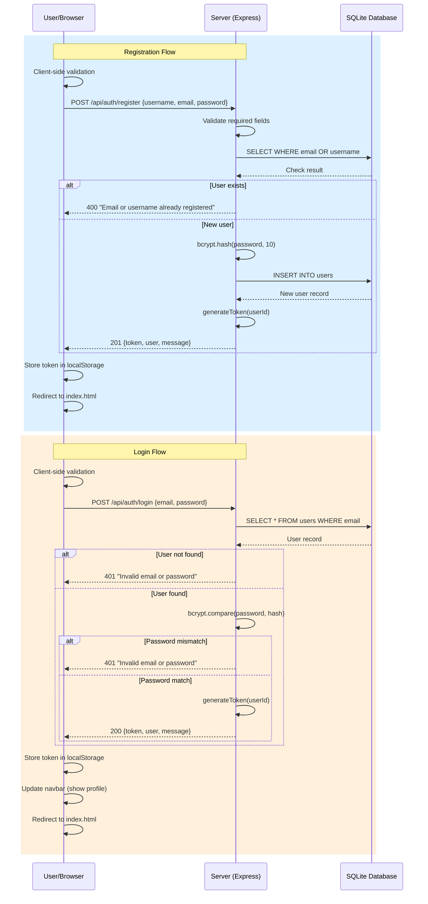
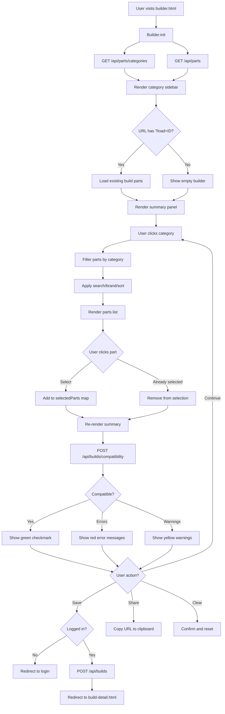
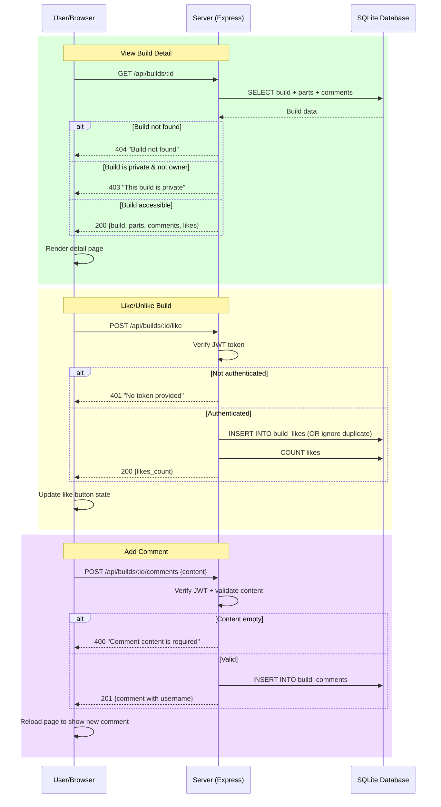
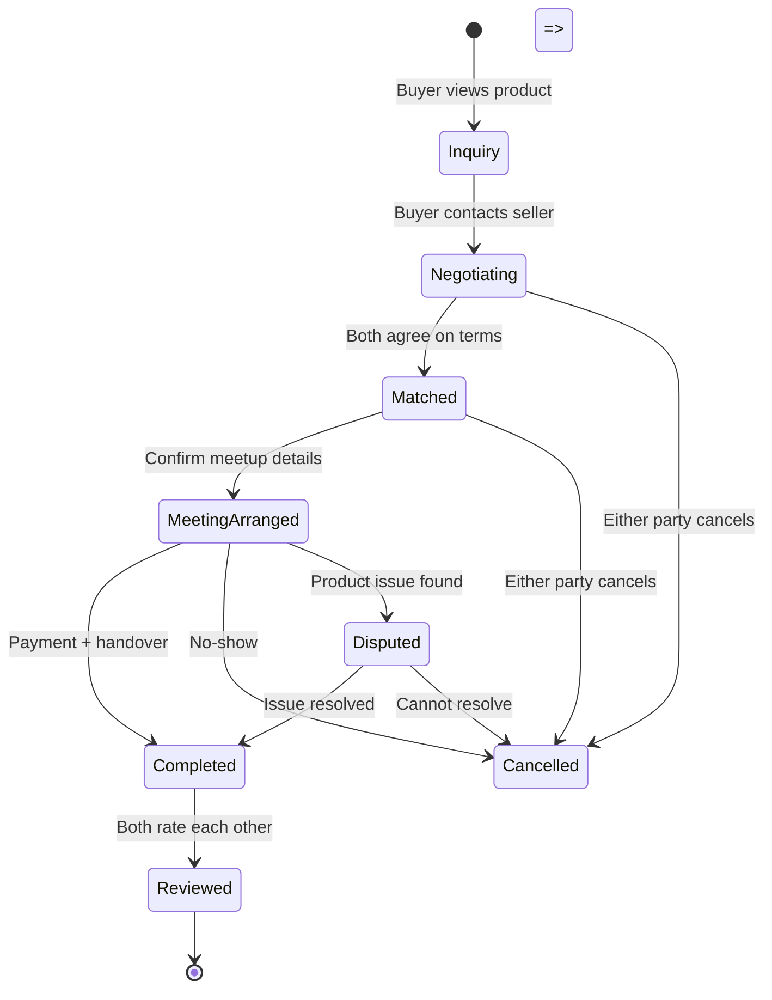
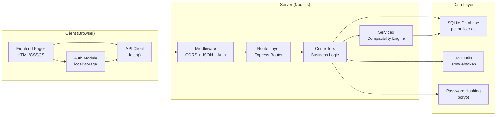

# 💻 PC Builder Pro — Detailed Website Flowchart

## Second-hand Computer Marketplace + PC Builder Platform

---

## Table of Contents

1. [User Registration & Login](#1-user-registration--login)
2. [Home Page Navigation](#2-home-page-navigation)
3. [Product/Service Search](#3-productservice-search)
4. [Product Detail View](#4-product-detail-view)
5. [PC Build Recommendation System](#5-pc-build-recommendation-system)
6. [Shopping Cart Management](#6-shopping-cart-management)
7. [Checkout Process](#7-checkout-process)
8. [Payment Processing](#8-payment-processing)
9. [Order Confirmation](#9-order-confirmation)
10. [User Profile Management](#10-user-profile-management)
11. [Admin Dashboard](#11-admin-dashboard)
12. [Product Management](#12-product-management)
13. [Order Management](#13-order-management)
14. [Error Handling & Validation](#14-error-handling--validation)
15. [System Architecture Overview](#15-system-architecture-overview)
16. [Database Entity Relationships](#16-database-entity-relationships)

---

## 1. User Registration & Login

```
┌─────────────────────────────────────────────────────────────────────┐
│                        USER REGISTRATION & LOGIN                    │
└─────────────────────────────────────────────────────────────────────┘

                              ┌──────────┐
                              │  START   │
                              └────┬─────┘
                                   │
                                   ▼
                         ┌─────────────────┐
                         │  Visit Website  │
                         │  (index.html)   │
                         └────────┬────────┘
                                  │
                                  ▼
                    ┌──────────────────────────┐
                    │  Check localStorage for  │
                    │  existing JWT token      │
                    └────────────┬─────────────┘
                                 │
                    ┌────────────┴────────────┐
                    │                         │
                    ▼                         ▼
              ┌──────────┐            ┌──────────────┐
              │  Token   │            │  No Token /  │
              │  Exists  │            │  Expired     │
              └────┬─────┘            └──────┬───────┘
                   │                         │
                   ▼                         ▼
          ┌────────────────┐       ┌──────────────────┐
          │  Redirect to   │       │  Show Login/     │
          │  Home Page     │       │  Register Buttons│
          │  (Logged In)   │       │  in Navbar       │
          └────────────────┘       └────────┬─────────┘
                                            │
                              ┌─────────────┴─────────────┐
                              │                           │
                              ▼                           ▼
                    ┌──────────────────┐        ┌──────────────────┐
                    │  Click "Login"   │        │ Click "Register" │
                    │  (login.html)    │        │ (login.html?     │
                    │                  │        │  register)       │
                    └────────┬─────────┘        └────────┬─────────┘
                             │                           │
                             ▼                           ▼
               ┌─────────────────────────┐  ┌─────────────────────────┐
               │     LOGIN FORM          │  │   REGISTRATION FORM     │
               │  ┌───────────────────┐  │  │  ┌───────────────────┐  │
               │  │ Email: [________] │  │  │  │ Username: [_____] │  │
               │  │ Password: [______] │  │  │  │ Email: [________] │  │
               │  │ [Login Button]    │  │  │  │ Password: [______] │  │
               │  └───────────────────┘  │  │  │ Confirm: [_______] │  │
               └────────────┬────────────┘  │  │ [Register Button] │  │
                            │               │  └───────────────────┘  │
                            │               └────────────┬────────────┘
                            │                            │
                            ▼                            ▼
               ┌────────────────────────────────────────────────────┐
               │              CLIENT-SIDE VALIDATION                │
               │  ┌──────────────────────────────────────────────┐  │
               │  │ Login:                                       │  │
               │  │  • Email not empty                           │  │
               │  │  • Password not empty                        │  │
               │  │                                              │  │
               │  │ Register:                                    │  │
               │  │  • Username ≥ 3 characters                   │  │
               │  │  • Valid email format (@ and .)              │  │
               │  │  • Password ≥ 8 characters                   │  │
               │  │  • Passwords match                           │  │
               │  └──────────────────────────────────────────────┘  │
               └──────────────────────┬─────────────────────────────┘
                                      │
                         ┌────────────┴────────────┐
                         │                         │
                         ▼                         ▼
                   ┌──────────┐             ┌──────────────┐
                   │  Valid   │             │  Invalid     │
                   └────┬─────┘             └──────┬───────┘
                        │                          │
                        ▼                          ▼
              ┌──────────────────┐        ┌──────────────────┐
              │  POST /api/auth/ │        │  Show inline     │
              │  login           │        │  error messages  │
              │  or              │        │  on form         │
              │  POST /api/auth/ │        └──────────────────┘
              │  register        │
              └────────┬─────────┘
                       │
                       ▼
              ┌──────────────────┐
              │  SERVER-SIDE     │
              │  VALIDATION      │
              │  (authController)│
              └────────┬─────────┘
                       │
          ┌────────────┴────────────┐
          │                         │
          ▼                         ▼
   ┌──────────────┐         ┌──────────────┐
   │  Validation  │         │  Validation  │
   │  Passed      │         │  Failed      │
   └──────┬───────┘         └──────┬───────┘
          │                        │
          ▼                        ▼
   ┌──────────────────┐    ┌──────────────────┐
   │ LOGIN:           │    │ Return 400/401   │
   │ • Check user     │    │ with error msg   │
   │   exists by email│    │                  │
   │ • bcrypt.compare │    │ "Invalid email   │
   │   password       │    │  or password"    │
   │                  │    │ "Missing fields" │
   │ REGISTER:        │    │ "Email taken"    │
   │ • Check unique   │    │ "Username taken" │
   │   email/username │    └────────┬─────────┘
   │ • bcrypt.hash    │             │
   │   password (10)  │             ▼
   │ • INSERT into    │    ┌──────────────────┐
   │   users table    │    │ Display error in │
   └──────┬───────────┘    │ error div on     │
          │                │ page             │
          ▼                └──────────────────┘
   ┌──────────────────┐
   │ Generate JWT     │
   │ (24h expiry)     │
   │ using jsonwebtoken│
   └──────┬───────────┘
          │
          ▼
   ┌──────────────────────────────────────┐
   │ RESPONSE:                            │
   │  • token: JWT                        │
   │  • user: { id, username, email,      │
   │           avatar_url }               │
   │  • message: "Login/Register success" │
   └──────┬───────────────────────────────┘
          │
          ▼
   ┌──────────────────────────────────────┐
   │ CLIENT ACTIONS:                      │
   │  • Auth.setToken(token)              │
   │    → localStorage                    │
   │  • Auth.setUser(user)                │
   │    → localStorage                    │
   │  • Toast.success("Welcome!")         │
   │  • Redirect to index.html            │
   └──────┬───────────────────────────────┘
          │
          ▼
   ┌──────────────────────────────────────┐
   │ NAVBAR UPDATES:                      │
   │  • Shows "👤 {username}" profile btn │
   │  • Shows "Logout" button             │
   └──────┬───────────────────────────────┘
          │
          ▼
     ┌──────────┐
     │   END    │
     └──────────┘
```

---

## 2. Home Page Navigation

```
┌─────────────────────────────────────────────────────────────────────┐
│                        HOME PAGE NAVIGATION                          │
└─────────────────────────────────────────────────────────────────────┘

                              ┌──────────┐
                              │  START   │
                              └────┬─────┘
                                   │
                                   ▼
                         ┌─────────────────┐
                         │  Load index.html│
                         └────────┬────────┘
                                  │
                                  ▼
                    ┌──────────────────────────┐
                    │  DOMContentLoaded event  │
                    │  Auth.updateUI()         │
                    │  → Check login status    │
                    │  → Update navbar         │
                    └────────────┬─────────────┘
                                 │
                                 ▼
               ┌─────────────────────────────────────┐
               │  PARALLEL API CALLS:                │
               │  • GET /api/parts                   │
               │  • GET /api/parts/categories        │
               │  • GET /api/builds                  │
               └─────────────────┬───────────────────┘
                                 │
                    ┌────────────┴────────────┐
                    │                         │
                    ▼                         ▼
              ┌──────────┐            ┌──────────────┐
              │ Success  │            │  Error       │
              └────┬─────┘            └──────┬───────┘
                   │                         │
                   ▼                         ▼
   ┌──────────────────────────┐   ┌──────────────────────┐
   │ RENDER HOME PAGE:        │   │ console.error()      │
   │                          │   │ Show empty state     │
   │ ┌──────────────────────┐ │   │ with error message   │
   │ │ HERO SECTION         │ │   └──────────────────────┘
   │ │ "ประกอบคอมพิวเตอร์   │ │
   │ │  ในฝันของคุณ"        │ │
   │ │ [เริ่มประกอบ] [ดูชุด] │ │
   │ └──────────────────────┘ │
   │                          │
   │ ┌──────────────────────┐ │
   │ │ STATS BAR            │ │
   │ │ • Total parts count  │ │
   │ │ • Categories count   │ │
   │ │ • Community builds   │ │
   │ └──────────────────────┘ │
   │                          │
   │ ┌──────────────────────┐ │
   │ │ FEATURED BUILDS      │ │
   │ │ (6 latest builds)    │ │
   │ │ • Build card grid    │ │
   │ │ • Name, author, price│ │
   │ │ • Likes & comments   │ │
   │ └──────────────────────┘ │
   │                          │
   │ ┌──────────────────────┐ │
   │ │ CATEGORIES GRID      │ │
   │ │ • CPU 🔲 GPU 🎮      │ │
   │ │ • RAM 📊 MB 📋       │ │
   │ │ • Storage 💾 PSU ⚡  │ │
   │ │ • Case 📦 Cooler 🌀  │ │
   │ │ • Part count per cat │ │
   │ └──────────────────────┘ │
   └────────────┬─────────────┘
                │
                ▼
   ┌──────────────────────────────────────┐
   │         USER NAVIGATION OPTIONS      │
   │                                      │
   │  ┌────────────┐  ┌────────────┐     │
   │  │ Navbar     │  │ Hero CTA   │     │
   │  │ Links:     │  │ Buttons:   │     │
   │  │ • หน้าแรก   │  │ • เริ่ม     │     │
   │  │ • ประกอบ PC│  │   ประกอบ   │     │
   │  │ • ดูชุด     │  │ • ดูชุด    │     │
   │  │   ประกอบ   │  │   ประกอบ   │     │
   │  │ • Login/   │  │            │     │
   │  │   Register │  │            │     │
   │  │ • Profile  │  │            │     │
   │  └────────────┘  └────────────┘     │
   │                                      │
   │  ┌────────────────────────────┐     │
   │  │ Category Cards → builder   │     │
   │  │   .html?category={slug}    │     │
   │  └────────────────────────────┘     │
   │                                      │
   │  ┌────────────────────────────┐     │
   │  │ Build Cards → build-       │     │
   │  │   detail.html?id={id}      │     │
   │  └────────────────────────────┘     │
   └──────────────────────────────────────┘
```

---

## 3. Product/Service Search

```
┌─────────────────────────────────────────────────────────────────────┐
│                     PRODUCT/SERVICE SEARCH                           │
└─────────────────────────────────────────────────────────────────────┘

                              ┌──────────┐
                              │  START   │
                              └────┬─────┘
                                   │
                                   ▼
                    ┌──────────────────────────┐
                    │  User initiates search   │
                    │  from:                   │
                    │  • Header search bar     │
                    │  • Category filter       │
                    │  • Builder parts panel   │
                    │  • Builds page search    │
                    └────────────┬─────────────┘
                                 │
                                 ▼
               ┌─────────────────────────────────────┐
               │         SEARCH INPUT TYPES           │
               │                                      │
               │  ┌────────────────────────────────┐  │
               │  │ Parts Search (Builder Page):   │  │
               │  │  • Text: name, brand, model    │  │
               │  │  • Category filter (slug)      │  │
               │  │  • Brand filter (dropdown)     │  │
               │  │  • Sort: name, price-asc/desc  │  │
               │  └────────────────────────────────┘  │
               │                                      │
               │  ┌────────────────────────────────┐  │
               │  │ Builds Search (Builds Page):   │  │
               │  │  • Text: build name/desc       │  │
               │  │  • Sort: newest, popular,      │  │
               │  │    price_low, price_high       │  │
               │  │  • Pagination (12 per page)    │  │
               │  └────────────────────────────────┘  │
               │                                      │
               │  ┌────────────────────────────────┐  │
               │  │ Products Search (Marketplace): │  │
               │  │  • GET /api/products           │  │
               │  │  • GET /api/products/:id       │  │
               │  │  • Planned: search?query=...   │  │
               │  └────────────────────────────────┘  │
               └─────────────────┬───────────────────┘
                                 │
                                 ▼
               ┌─────────────────────────────────────┐
               │     API ENDPOINTS CALLED            │
               │                                      │
               │  GET /api/parts                      │
               │    ?category={slug}                  │
               │    &brand={brand}                    │
               │    &search={query}                   │
               │    &min_price={min}                  │
               │    &max_price={max}                  │
               │    &sort={field}                     │
               │    &order={asc|desc}                 │
               │                                      │
               │  GET /api/builds                     │
               │    ?page={n}                         │
               │    &sort={newest|popular|price}      │
               │    &search={query}                   │
               │                                      │
               │  GET /api/products                   │
               │  GET /api/products/:id               │
               └─────────────────┬───────────────────┘
                                 │
                                 ▼
               ┌─────────────────────────────────────┐
               │     SERVER-SIDE PROCESSING           │
               │     (partsController.js)             │
               │                                      │
               │  1. Build dynamic SQL query          │
               │  2. Apply WHERE filters              │
               │  3. JOIN parts with categories       │
               │  4. Set ORDER BY clause              │
               │  5. Execute with parameterized       │
               │     queries (SQL injection safe)     │
               │  6. Return JSON results              │
               └─────────────────┬───────────────────┘
                                 │
                    ┌────────────┴────────────┐
                    │                         │
                    ▼                         ▼
              ┌──────────┐            ┌──────────────┐
              │ Results  │            │  No Results  │
              │ Found    │            │  Found       │
              └────┬─────┘            └──────┬───────┘
                   │                         │
                   ▼                         ▼
   ┌──────────────────────────┐   ┌──────────────────────┐
   │ RENDER RESULTS:          │   │ Show "ไม่พบอะไหล่"   │
   │ • Part cards with:       │   │ (No parts found)     │
   │   - Name, brand, price   │   │ with suggestion to   │
   │   - Specs summary        │   │ change filters       │
   │   - Compatibility status │   └──────────────────────┘
   │ • Build cards with:      │
   │   - Name, author, price  │
   │   - Part tags preview    │
   │   - Likes & comments     │
   │ • Pagination controls    │
   └────────────┬─────────────┘
                │
                ▼
     ┌──────────────────────┐
     │  User clicks result  │
     └──────────┬───────────┘
                │
                ▼
     ┌──────────────────────┐
     │  Navigate to detail  │
     │  page or add to      │
     │  builder selection   │
     └──────────────────────┘
```

---

## 4. Product Detail View

```
┌─────────────────────────────────────────────────────────────────────┐
│                        PRODUCT DETAIL VIEW                           │
└─────────────────────────────────────────────────────────────────────┘

                              ┌──────────┐
                              │  START   │
                              └────┬─────┘
                                   │
                                   ▼
               ┌───────────────────────────────────────┐
               │  User clicks on:                      │
               │  • Build card → build-detail.html?id=N│
               │  • Part item → (shown in builder)     │
               │  • Product → product_detail.html (planned)│
               └───────────────────┬───────────────────┘
                                   │
                                   ▼
               ┌───────────────────────────────────────┐
               │  Extract ID from URL params            │
               │  const buildId = urlParams.get('id')  │
               └───────────────────┬───────────────────┘
                                   │
                                   ▼
                    ┌──────────────────────────┐
                    │  Validate buildId exists │
                    └────────────┬─────────────┘
                                 │
                    ┌────────────┴────────────┐
                    │                         │
                    ▼                         ▼
              ┌──────────┐            ┌──────────────────┐
              │  Valid   │            │  Missing/Invalid │
              │  ID      │            │                  │
              └────┬─────┘            └──────┬───────────┘
                   │                         │
                   ▼                         ▼
   ┌──────────────────────────┐   ┌──────────────────────┐
   │ GET /api/builds/:id      │   │ Show "ไม่พบชุดประกอบ"│
   │ (with auth if logged in) │   │ (Build not found)    │
   └────────────┬─────────────┘   │ Link back to builds  │
                │                 └──────────────────────┘
                ▼
   ┌──────────────────────────────────────┐
   │ SERVER PROCESSING:                   │
   │  1. Fetch build by ID                │
   │  2. Check visibility:                │
   │     • is_public = 1 → show all       │
   │     • is_private → only owner        │
   │  3. Fetch all build_parts with       │
   │     part details + category info     │
   │  4. Count likes & comments           │
   │  5. Check if current user liked it   │
   │  6. Fetch all comments with users    │
   └────────────┬─────────────────────────┘
                │
   ┌────────────┴────────────┐
   │                         │
   ▼                         ▼
┌──────────────┐     ┌──────────────┐
│  Build Found │     │  Not Found / │
│              │     │  Unauthorized│
└──────┬───────┘     └──────┬───────┘
       │                    │
       ▼                    ▼
┌──────────────────────┐  ┌──────────────────────┐
│ RENDER DETAIL PAGE:  │  │ 404: "Build not found"│
│                      │  │ 403: "This build is   │
│ ┌──────────────────┐ │  │       private"        │
│ │ HEADER           │ │  └──────────────────────┘
│ │ • Build name     │ │
│ │ • Author & avatar│ │
│ │ • Date created   │ │
│ │ • Like count     │ │
│ │ • Comment count  │ │
│ │ • Description    │ │
│ └──────────────────┘ │
│                      │
│ ┌──────────────────┐ │
│ │ PARTS TABLE      │ │
│ │ • Category icon  │ │
│ │ • Part name      │ │
│ │ • Brand + Model  │ │
│ │ • Specs summary  │ │
│ │ • Price per item │ │
│ └──────────────────┘ │
│                      │
│ ┌──────────────────┐ │
│ │ TOTAL PRICE      │ │
│ │ (highlighted)    │ │
│ └──────────────────┘ │
│                      │
│ ┌──────────────────┐ │
│ │ ACTION BUTTONS   │ │
│ │ • 🤍 Like/❤️     │ │
│ │   Liked toggle   │ │
│ │ • 📋 Copy build  │ │
│ │   (clone to      │ │
│ │    builder)      │ │
│ └──────────────────┘ │
│                      │
│ ┌──────────────────┐ │
│ │ SIDEBAR          │ │
│ │ • Parts count    │ │
│ │ • Total price    │ │
│ │ • Likes count    │ │
│ │ • Creator name   │ │
│ │ • Creation date  │ │
│ │ • Copy button    │ │
│ └──────────────────┘ │
│                      │
│ ┌──────────────────┐ │
│ │ COMMENTS SECTION │ │
│ │ • Comment count  │ │
│ │ • Input (if auth)│ │
│ │ • Comment list:  │ │
│ │   - Username     │ │
│ │   - Date         │ │
│ │   - Content      │ │
│ └──────────────────┘ │
└──────────┬───────────┘
           │
           ▼
┌──────────────────────────────────────┐
│         USER INTERACTIONS            │
│                                      │
│  ┌────────────────────────────────┐  │
│  │ Like/Unlike:                   │  │
│  │  POST/DELETE /api/builds/:id/  │  │
│  │  like                          │  │
│  │  → Reload page for new count   │  │
│  └────────────────────────────────┘  │
│                                      │
│  ┌────────────────────────────────┐  │
│  │ Add Comment:                   │  │
│  │  POST /api/builds/:id/comments │  │
│  │  { content: "..." }            │  │
│  │  → Reload page for new comment │  │
│  └────────────────────────────────┘  │
│                                      │
│  ┌────────────────────────────────┐  │
│  │ Copy Build:                    │  │
│  │  → builder.html?load=:id       │  │
│  │  → Loads all parts into builder│  │
│  └────────────────────────────────┘  │
└──────────────────────────────────────┘
```

---

## 5. PC Build Recommendation System

```
┌─────────────────────────────────────────────────────────────────────┐
│                  PC BUILD RECOMMENDATION SYSTEM                      │
└─────────────────────────────────────────────────────────────────────┘

                              ┌──────────┐
                              │  START   │
                              └────┬─────┘
                                   │
                                   ▼
                         ┌─────────────────┐
                         │  Visit          │
                         │  builder.html   │
                         └────────┬────────┘
                                  │
                                  ▼
               ┌─────────────────────────────────────┐
               │  Builder.init()                     │
               │  1. GET /api/parts/categories       │
               │  2. GET /api/parts (all parts)      │
               │  3. Check URL for ?load={buildId}  │
               │  4. Render category list            │
               │  5. Render empty summary panel      │
               │  6. Check compatibility (empty)     │
               └─────────────────┬───────────────────┘
                                 │
                                 ▼
               ┌─────────────────────────────────────┐
               │         BUILDER LAYOUT              │
               │                                      │
               │  ┌──────────┬──────────┬──────────┐ │
               │  │ LEFT     │ CENTER   │ RIGHT    │ │
               │  │ SIDEBAR  │ PANEL    │ SIDEBAR  │ │
               │  │          │          │          │ │
               │  │Category  │ Parts    │ Summary  │ │
               │  │List:     │ List:    │ Panel:   │ │
               │  │• CPU     │• Search  │• Selected│ │
               │  │• Cooler  │• Filter  │  parts   │ │
               │  │• MB      │• Sort    │• Total   │ │
               │  │• RAM     │• Cards   │  price   │ │
               │  │• GPU     │          │• Wattage │ │
               │  │• Storage │          │  bar     │ │
               │  │• PSU     │          │• Compat  │ │
               │  │• Case    │          │  status  │ │
               │  │          │          │• Actions │ │
               │  └──────────┴──────────┴──────────┘ │
               └─────────────────┬───────────────────┘
                                 │
                                 ▼
               ┌─────────────────────────────────────┐
               │     USER SELECTS CATEGORY           │
               │     (e.g., click "CPU")             │
               └─────────────────┬───────────────────┘
                                 │
                                 ▼
               ┌─────────────────────────────────────┐
               │  selectCategory(slug)               │
               │  • Highlight active category        │
               │  • Filter parts by category_slug    │
               │  • Apply search/brand/sort filters  │
               │  • Render parts list                │
               └─────────────────┬───────────────────┘
                                 │
                                 ▼
               ┌─────────────────────────────────────┐
               │     USER SELECTS PART               │
               │     (e.g., click "Intel i5-12400")  │
               └─────────────────┬───────────────────┘
                                 │
                                 ▼
               ┌─────────────────────────────────────┐
               │  selectPart(categorySlug, part)     │
               │  • Add to selectedParts{} map       │
               │  • Mark category as "has-selection" │
               │  • Re-render summary                │
               │  • Trigger compatibility check      │
               └─────────────────┬───────────────────┘
                                 │
                                 ▼
               ┌─────────────────────────────────────┐
               │     COMPATIBILITY CHECK              │
               │     (checkCompatibilityService.js)  │
               └─────────────────┬───────────────────┘
                                 │
                                 ▼
               ┌─────────────────────────────────────┐
               │  POST /api/builds/compatibility     │
               │  { parts: [{part_id, quantity}] }   │
               └─────────────────┬───────────────────┘
                                 │
                                 ▼
               ┌─────────────────────────────────────┐
               │  SERVER-SIDE COMPATIBILITY ENGINE    │
               │                                      │
               │  Checks performed:                   │
               │  ┌────────────────────────────────┐  │
               │  │ 1. CPU ↔ Motherboard socket    │  │
               │  │    • Socket match?             │  │
               │  │    • Chipset support?          │  │
               │  │    (LGA1700→B660/Z690/...)    │  │
               │  │    (AM4→B450/X570/...)        │  │
               │  │    (AM5→B650/X670/...)        │  │
               │  └────────────────────────────────┘  │
               │  ┌────────────────────────────────┐  │
               │  │ 2. RAM ↔ Motherboard           │  │
               │  │    • DDR type match?           │  │
               │  │    • Total capacity ≤ max?     │  │
               │  │    • Module count ≤ slots?     │  │
               │  └────────────────────────────────┘  │
               │  ┌────────────────────────────────┐  │
               │  │ 3. GPU ↔ Case                  │  │
               │  │    • GPU length ≤ case max?    │  │
               │  │    • Warning if >90% of max    │  │
               │  └────────────────────────────────┘  │
               │  ┌────────────────────────────────┐  │
               │  │ 4. CPU Cooler ↔ Case           │  │
               │  │    • Cooler height ≤ case max? │  │
               │  └────────────────────────────────┘  │
               │  ┌────────────────────────────────┐  │
               │  │ 5. PSU Wattage                 │  │
               │  │    • Total TDP + 100W headroom │  │
               │  │    • PSU ≥ total draw?         │  │
               │  │    • 20% headroom recommended?  │  │
               │  └────────────────────────────────┘  │
               │  ┌────────────────────────────────┐  │
               │  │ 6. AIO Radiator ↔ Case         │  │
               │  │    • Radiator size supported?  │  │
               │  └────────────────────────────────┘  │
               │  ┌────────────────────────────────┐  │
               │  │ 7. MB Form Factor ↔ Case       │  │
               │  │    • ATX fits ATX/mATX/ITX     │  │
               │  │    • mATX fits mATX/ITX        │  │
               │  │    • ITX fits ITX only         │  │
               │  └────────────────────────────────┘  │
               │                                      │
               │  Returns:                            │
               │  { compatible: bool,                 │
               │    warnings: [...],                  │
               │    errors: [...] }                   │
               └─────────────────┬───────────────────┘
                                 │
                                 ▼
               ┌─────────────────────────────────────┐
               │  RENDER COMPATIBILITY PANEL         │
               │                                      │
               │  ┌────────────────────────────────┐  │
               │  │ If all OK:                     │  │
               │  │  ✓ เข้ากันได้ (Compatible)     │  │
               │  └────────────────────────────────┘  │
               │  ┌────────────────────────────────┐  │
               │  │ If errors exist:               │  │
               │  │  ✗ ปัญหาความเข้ากันได้         │  │
               │  │  • Error 1                      │  │
               │  │  • Error 2                      │  │
               │  └────────────────────────────────┘  │
               │  ┌────────────────────────────────┐  │
               │  │ If warnings exist:             │  │
               │  │  ⚠ คำเตือน                     │  │
               │  │  • Warning 1                    │  │
               │  │  • Warning 2                    │  │
               │  └────────────────────────────────┘  │
               └─────────────────┬───────────────────┘
                                 │
                                 ▼
               ┌─────────────────────────────────────┐
               │  UPDATE SUMMARY PANEL               │
               │  • List all selected parts          │
               │  • Show individual prices           │
               │  • Show total price                 │
               │  • Update wattage bar               │
               │    (green/yellow/red zones)         │
               └─────────────────┬───────────────────┘
                                 │
               ┌─────────────────┴───────────────────┐
               │                                     │
               ▼                                     ▼
   ┌───────────────────────┐           ┌───────────────────────┐
   │  CONTINUE BUILDING    │           │  SAVE / SHARE / CLEAR │
   │  (select more parts)  │           │                       │
   └───────────┬───────────┘           └───────────┬───────────┘
               │                                   │
               │                                   ├─→ Save Build
               │                                   │   • Check auth
               │                                   │   • Require name
               │                                   │   • POST /api/builds
               │                                   │   → Redirect to detail
               │                                   │
               │                                   ├─→ Share Build
               │                                   │   • Copy URL to clipboard
               │                                   │   • builder.html?parts=1,2,3
               │                                   │
               │                                   └─→ Clear All
               │                                       • Confirm dialog
               │                                       • Reset selectedParts{}
               │                                       • Re-render all
               │
               └──────────→ (loop back to category
                            selection)
```

---

## 6. Shopping Cart Management

```
┌─────────────────────────────────────────────────────────────────────┐
│                      SHOPPING CART MANAGEMENT                        │
│                  (Planned for Marketplace Module)                    │
└─────────────────────────────────────────────────────────────────────┘

                              ┌──────────┐
                              │  START   │
                              └────┬─────┘
                                   │
                                   ▼
                    ┌──────────────────────────┐
                    │  User browses products   │
                    │  on marketplace          │
                    └────────────┬─────────────┘
                                 │
                                 ▼
                    ┌──────────────────────────┐
                    │  User clicks "Add to     │
                    │  Cart" on product        │
                    └────────────┬─────────────┘
                                 │
                                 ▼
                    ┌──────────────────────────┐
                    │  Is user logged in?      │
                    └────────────┬─────────────┘
                                 │
               ┌─────────────────┴─────────────────┐
               │                                   │
               ▼                                   ▼
       ┌──────────────┐                   ┌──────────────┐
       │  Yes (Auth)  │                   │  No (Guest)  │
       └──────┬───────┘                   └──────┬───────┘
              │                                   │
              ▼                                   ▼
   ┌──────────────────────┐            ┌──────────────────────┐
   │ Add to server-side   │            │ Add to localStorage  │
   │ cart via API:        │            │ guest cart           │
   │ POST /api/cart       │            │                      │
   │ { product_id, qty }  │            │ Prompt: "Login to    │
   └──────────┬───────────┘            │ save your cart?"     │
              │                        └──────────┬───────────┘
              │                                   │
              └───────────────┬───────────────────┘
                              │
                              ▼
               ┌─────────────────────────────────────┐
               │         CART VIEW                   │
               │                                      │
               │  ┌────────────────────────────────┐  │
               │  │ Cart Items:                    │  │
               │  │ • Product image                │  │
               │  │ • Product name                 │  │
               │  │ • Seller info                  │  │
               │  │ • Price per unit               │  │
               │  │ • Quantity [+/-]               │  │
               │  │ • Subtotal                     │  │
               │  │ • Remove button                │  │
               │  └────────────────────────────────┘  │
               │                                      │
               │  ┌────────────────────────────────┐  │
               │  │ Cart Summary:                  │  │
               │  │ • Total items                  │  │
               │  │ • Subtotal                     │  │
               │  │ • Shipping (if applicable)     │  │
               │  │ • Grand total                  │  │
               │  └────────────────────────────────┘  │
               │                                      │
               │  ┌────────────────────────────────┐  │
               │  │ Actions:                       │  │
               │  │ • Update quantity              │  │
               │  │ • Remove item                  │  │
               │  │ • Clear cart                   │  │
               │  │ • Continue shopping            │  │
               │  │ • Proceed to checkout          │  │
               │  └────────────────────────────────┘  │
               └─────────────────┬───────────────────┘
                                 │
               ┌─────────────────┴─────────────────┐
               │                                   │
               ▼                                   ▼
   ┌──────────────────────┐            ┌──────────────────────┐
   │  UPDATE QUANTITY     │            │  REMOVE ITEM         │
   │  • Validate stock    │            │  • Confirm removal   │
   │  • Recalculate total │            │  • Update cart       │
   │  • Save to storage   │            │  • Recalculate total │
   └──────────────────────┘            └──────────────────────┘
```

---

## 7. Checkout Process

```
┌─────────────────────────────────────────────────────────────────────┐
│                         CHECKOUT PROCESS                             │
│                  (Planned for Marketplace Module)                    │
└─────────────────────────────────────────────────────────────────────┘

                              ┌──────────┐
                              │  START   │
                              └────┬─────┘
                                   │
                                   ▼
                         ┌─────────────────┐
                         │  Cart has items │
                         └────────┬────────┘
                                  │
                                  ▼
                    ┌──────────────────────────┐
                    │  Click "Proceed to       │
                    │  Checkout"               │
                    └────────────┬─────────────┘
                                 │
                                 ▼
                    ┌──────────────────────────┐
                    │  Is user logged in?      │
                    └────────────┬─────────────┘
                                 │
               ┌─────────────────┴─────────────────┐
               │                                   │
               ▼                                   ▼
       ┌──────────────┐                   ┌──────────────────────┐
       │  Yes         │                   │  No → Redirect to    │
       └──────┬───────┘                   │  login.html?redirect=│
              │                           │  checkout            │
              ▼                           └──────────────────────┘
   ┌──────────────────────────────────────┐
   │         CHECKOUT STEPS               │
   │                                      │
   │  STEP 1: REVIEW ORDER               │
   │  ┌────────────────────────────────┐  │
   │  │ • List all items               │  │
   │  │ • Quantities & prices          │  │
   │  │ • Seller information           │  │
   │  │ • Total amount                 │  │
   │  └────────────────────────────────┘  │
   │                                      │
   │  STEP 2: MEETUP ARRANGEMENT         │
   │  ┌────────────────────────────────┐  │
   │  │ (Safe Transaction Flow)        │  │
   │  │ • Select province/district     │  │
   │  │ • Choose public meeting place  │  │
   │  │ • Agree on date/time           │  │
   │  │ • Select payment method:       │  │
   │  │   - Bank transfer (PromptPay)  │  │
   │  │   - Cash on meetup             │  │
   │  │   - Partial payment (50/50)    │  │
   │  └────────────────────────────────┘  │
   │                                      │
   │  STEP 3: BUYER CONFIRMATION         │
   │  ┌────────────────────────────────┐  │
   │  │ • Review all details           │  │
   │  │ • Accept terms                 │  │
   │  │ • Click "Confirm Order"        │  │
   │  └────────────────────────────────┘  │
   └─────────────────┬───────────────────┘
                     │
                     ▼
   ┌──────────────────────────────────────┐
   │  POST /api/orders                    │
   │  {                                   │
   │    items: [...],                     │
   │    meetup_location: {...},           │
   │    payment_method: "bank_transfer",  │
   │    total_amount: 15000               │
   │  }                                   │
   └─────────────────┬───────────────────┘
                     │
        ┌────────────┴────────────┐
        │                         │
        ▼                         ▼
  ┌──────────┐            ┌──────────────┐
  │ Success  │            │  Error       │
  └────┬─────┘            └──────┬───────┘
       │                         │
       ▼                         ▼
  ┌──────────────────┐   ┌──────────────────┐
  │ Order created    │   │ Show error:      │
  │ Status: "Inquiry"│   │ • Out of stock   │
  │ Redirect to      │   │ • Invalid data   │
  │ order detail     │   │ • Auth failed    │
  └──────────────────┘   └──────────────────┘
```

---

## 8. Payment Processing

```
┌─────────────────────────────────────────────────────────────────────┐
│                       PAYMENT PROCESSING                             │
│              (Direct Buyer ↔ Seller — No Escrow)                    │
└─────────────────────────────────────────────────────────────────────┘

                              ┌──────────┐
                              │  START   │
                              └────┬─────┘
                                   │
                                   ▼
               ┌─────────────────────────────────────┐
               │  TRANSACTION STATUS: "Matched"       │
               │  Both buyer & seller confirmed       │
               └─────────────────┬───────────────────┘
                                 │
                                 ▼
               ┌─────────────────────────────────────┐
               │     PAYMENT METHOD SELECTION        │
               │                                      │
               │  ┌────────────────────────────────┐  │
               │  │ Option A: BANK TRANSFER        │  │
               │  │ (PromptPay / Online Banking)   │  │
               │  └────────────────────────────────┘  │
               │  ┌────────────────────────────────┐  │
               │  │ Option B: CASH ON MEETUP       │  │
               │  └────────────────────────────────┘  │
               │  ┌────────────────────────────────┐  │
               │  │ Option C: PARTIAL PAYMENT      │  │
               │  │ (50% deposit + 50% on meetup)  │  │
               │  └────────────────────────────────┘  │
               └─────────────────┬───────────────────┘
                                 │
               ┌─────────────────┴─────────────────┐
               │                                   │
               ▼                                   ▼
   ┌───────────────────────┐           ┌───────────────────────┐
   │  BANK TRANSFER FLOW   │           │  CASH PAYMENT FLOW    │
   │                       │           │                       │
   │ 1. Buyer & Seller     │           │ 1. Buyer brings exact │
   │    arrive at location │           │    cash to meetup     │
   │                       │           │                       │
   │ 2. Buyer inspects     │           │ 2. Buyer inspects     │
   │    device using       │           │    device using       │
   │    buyer checklist    │           │    buyer checklist    │
   │                       │           │                       │
   │ 3. Buyer opens        │           │ 3. Verify cash is     │
   │    banking app        │           │    genuine            │
   │                       │           │                       │
   │ 4. Enter seller's     │           │ 4. Exchange:          │
   │    PromptPay/ID       │           │    Cash ↔ Device      │
   │                       │           │                       │
   │ 5. Enter agreed       │           │ 5. Both confirm       │
   │    amount             │           │    satisfaction       │
   │                       │           │                       │
   │ 6. Confirm transfer   │           │ 6. Mark as complete   │
   │                       │           └───────────┬───────────┘
   │ 7. Seller shows       │                       │
   │    proof of payment   │                       │
   │                       │                       │
   │ 8. Seller hands over  │                       │
   │    device             │                       │
   │                       │                       │
   │ 9. Buyer confirms     │                       │
   │    receipt            │                       │
   └───────────┬───────────┘                       │
               │                                   │
               └───────────────┬───────────────────┘
                               │
                               ▼
               ┌─────────────────────────────────────┐
               │  TRANSACTION STATUS: "Completed"    │
               │                                      │
               │  Both parties confirm completion     │
               └─────────────────┬───────────────────┘
                                 │
                                 ▼
               ┌─────────────────────────────────────┐
               │  RATING & REVIEW PHASE              │
               │                                      │
               │  Buyer rates seller (1-5 ⭐)         │
               │  Seller rates buyer (1-5 ⭐)         │
               │  Optional written review             │
               └─────────────────┬───────────────────┘
                                 │
                                 ▼
               ┌─────────────────────────────────────┐
               │  TRANSACTION STATUS: "Reviewed"     │
               │  Transaction fully closed            │
               └─────────────────────────────────────┘
```

---

## 9. Order Confirmation

```
┌─────────────────────────────────────────────────────────────────────┐
│                        ORDER CONFIRMATION                            │
└─────────────────────────────────────────────────────────────────────┘

                              ┌──────────┐
                              │  START   │
                              └────┬─────┘
                                   │
                                   ▼
                    ┌──────────────────────────┐
                    │  Order successfully      │
                    │  created via API         │
                    └────────────┬─────────────┘
                                 │
                                 ▼
               ┌─────────────────────────────────────┐
               │     CONFIRMATION PAGE DISPLAY       │
               │                                      │
               │  ┌────────────────────────────────┐  │
               │  │ ✅ Order Confirmed!            │  │
               │  │                                │  │
               │  │ Order #: ORD-2024-00001        │  │
               │  │ Date: 11 มิ.ย. 2025            │  │
               │  │                                │  │
               │  │ Items:                         │  │
               │  │  • Product 1 × 1  ฿XX,XXX     │  │
               │  │  • Product 2 × 1  ฿XX,XXX     │  │
               │  │                                │  │
               │  │ Total: ฿XX,XXX                 │  │
               │  │                                │  │
               │  │ Meetup:                        │  │
               │  │  • Location: [agreed place]    │  │
               │  │  • Date/Time: [agreed time]    │  │
               │  │  • Payment: [method]           │  │
               │  │                                │  │
               │  │ Seller: [name] [contact]       │  │
               │  └────────────────────────────────┘  │
               │                                      │
               │  ┌────────────────────────────────┐  │
               │  │ Next Steps:                    │  │
               │  │ 1. Contact seller via chat     │  │
               │  │ 2. Arrange meetup details      │  │
               │  │ 3. Review buyer checklist      │  │
               │  │ 4. Meet & complete transaction │  │
               │  └────────────────────────────────┘  │
               └─────────────────┬───────────────────┘
                                 │
               ┌─────────────────┴─────────────────┐
               │                                   │
               ▼                                   ▼
   ┌──────────────────────┐            ┌──────────────────────┐
   │  NOTIFICATIONS       │            │  ORDER TRACKING      │
   │  • Toast success     │            │  Status flow:        │
   │  • Email (planned)   │            │                      │
   │  • In-app (planned)  │            │  📋 Inquiry          │
   └──────────────────────┘            │  → 🟡 Negotiating    │
                                      │  → 🟢 Matched        │
                                      │  → 📍 Meeting        │
                                      │    Arranged          │
                                      │  → ✅ Completed      │
                                      │  → ⭐ Reviewed       │
                                      └──────────────────────┘
```

---

## 10. User Profile Management

```
┌─────────────────────────────────────────────────────────────────────┐
│                      USER PROFILE MANAGEMENT                         │
└─────────────────────────────────────────────────────────────────────┘

                              ┌──────────┐
                              │  START   │
                              └────┬─────┘
                                   │
                                   ▼
                         ┌─────────────────┐
                         │  Visit          │
                         │  profile.html   │
                         └────────┬────────┘
                                  │
                                  ▼
                    ┌──────────────────────────┐
                    │  Check Auth.isLoggedIn() │
                    └────────────┬─────────────┘
                                 │
               ┌─────────────────┴─────────────────┐
               │                                   │
               ▼                                   ▼
       ┌──────────────┐                   ┌──────────────────────┐
       │  Logged In   │                   │  Not Logged In       │
       └──────┬───────┘                   │  → Redirect to       │
              │                           │  login.html?redirect=│
              ▼                           │  profile.html        │
   ┌──────────────────────────┐           └──────────────────────┘
   │  PARALLEL API CALLS:     │
   │  • GET /api/auth/profile │
   │  • GET /api/builds/      │
   │    user/:userId          │
   └────────────┬─────────────┘
                │
                ▼
   ┌──────────────────────────────────────┐
   │         PROFILE LAYOUT               │
   │                                      │
   │  ┌────────────┬───────────────────┐  │
   │  │  SIDEBAR   │  MAIN CONTENT     │  │
   │  │            │                   │  │
   │  │ ┌────────┐ │ ┌───────────────┐ │  │
   │  │ │Avatar  │ │ │ MY BUILDS     │ │  │
   │  │ │Initial │ │ │               │ │  │
   │  │ └────────┘ │ │ • Build cards │ │  │
   │  │            │ │ • Public/     │ │  │
   │  │ Username   │ │   Private     │ │  │
   │  │ Email      │ │   badge       │ │  │
   │  │ Member     │ │ • Likes       │ │  │
   │  │ since      │ │ • Comments    │ │  │
   │  │            │ │ • Dates       │ │  │
   │  │ ┌────────┐ │ │               │ │  │
   │  │ │STATS   │ │ │ [+ สร้างใหม่] │ │  │
   │  │ │• Total │ │ └───────────────┘ │  │
   │  │ │  builds│ │                   │  │
   │  │ │• Public│ │ ┌───────────────┐ │  │
   │  │ │• Total │ │ │ ACCOUNT       │ │  │
   │  │ │  spent │ │ │ SETTINGS      │ │  │
   │  │ │• Mine  │ │ │               │ │  │
   │  │ └────────┘ │ │ • Edit username│ │  │
   │  │            │ │ • Edit email   │ │  │
   │  │            │ │ • [Update]     │ │  │
   │  │            │ └───────────────┘ │  │
   │  │            │                   │  │
   │  │            │ ┌───────────────┐ │  │
   │  │            │ │ CHANGE        │ │  │
   │  │            │ │ PASSWORD      │ │  │
   │  │            │ │ (planned)     │ │  │
   │  │            │ └───────────────┘ │  │
   │  └────────────┴───────────────────┘  │
   └─────────────────┬───────────────────┘
                     │
                     ▼
   ┌──────────────────────────────────────┐
   │         PROFILE ACTIONS              │
   │                                      │
   │  ┌────────────────────────────────┐  │
   │  │ Update Profile:                │  │
   │  │  PUT /api/auth/profile         │  │
   │  │  { username, email, avatar }   │  │
   │  │  • Check unique username       │  │
   │  │  • Check unique email          │  │
   │  │  • Update localStorage user    │  │
   │  │  • Toast "อัปเดตโปรไฟล์แล้ว!"  │  │
   │  └────────────────────────────────┘  │
   │                                      │
   │  ┌────────────────────────────────┐  │
   │  │ Change Password:               │  │
   │  │  PUT /api/auth/change-password │  │
   │  │  { current_password,           │  │
   │  │    new_password }              │  │
   │  │  • Verify current password     │  │
   │  │  • New password ≥ 8 chars      │  │
   │  │  • bcrypt.hash new password    │  │
   │  │  • Toast "เปลี่ยนรหัสผ่านแล้ว!" │  │
   │  └────────────────────────────────┘  │
   │                                      │
   │  ┌────────────────────────────────┐  │
   │  │ Logout:                        │  │
   │  │  • Auth.clearToken()           │  │
   │  │  • Remove from localStorage    │  │
   │  │  • Redirect to index.html      │  │
   │  └────────────────────────────────┘  │
   └──────────────────────────────────────┘
```

---

## 11. Admin Dashboard

```
┌─────────────────────────────────────────────────────────────────────┐
│                         ADMIN DASHBOARD                              │
│                      (Planned Module)                                │
└─────────────────────────────────────────────────────────────────────┘

                              ┌──────────┐
                              │  START   │
                              └────┬─────┘
                                   │
                                   ▼
                         ┌─────────────────┐
                         │  Admin logs in  │
                         │  (login.html)   │
                         └────────┬────────┘
                                  │
                                  ▼
                    ┌──────────────────────────┐
                    │  Check user role:        │
                    │  Is user admin?          │
                    └────────────┬─────────────┘
                                 │
               ┌─────────────────┴─────────────────┐
               │                                   │
               ▼                                   ▼
       ┌──────────────┐                   ┌──────────────────────┐
       │  Yes (Admin) │                   │  No → Regular user   │
       └──────┬───────┘                   │  dashboard           │
              │                           └──────────────────────┘
              ▼
   ┌──────────────────────────────────────┐
   │         ADMIN DASHBOARD LAYOUT       │
   │                                      │
   │  ┌────────────────────────────────┐  │
   │  │ SIDEBAR NAVIGATION             │  │
   │  │                                │  │
   │  │ 📊 Dashboard Overview          │  │
   │  │ 👥 User Management             │  │
   │  │ 📦 Product Management          │  │
   │  │ 🛠️ Parts Management            │  │
   │  │ 📋 Order Management            │  │
   │  │ ⭐ Review Moderation           │  │
   │  │ 🚨 Dispute Resolution          │  │
   │  │ 📈 Analytics & Reports         │  │
   │  │ ⚙️ System Settings             │  │
   │  └────────────────────────────────┘  │
   │                                      │
   │  ┌────────────────────────────────┐  │
   │  │ MAIN CONTENT AREA              │  │
   │  │                                │  │
   │  │ ┌────────────────────────────┐ │  │
   │  │ │ STATS CARDS                │ │  │
   │  │ │ • Total users              │ │  │
   │  │ │ • Total products           │ │  │
   │  │ │ • Active orders            │ │  │
   │  │ │ • Pending disputes         │ │  │
   │  │ │ • Revenue (if applicable)  │ │  │
   │  │ └────────────────────────────┘ │  │
   │  │                                │  │
   │  │ ┌────────────────────────────┐ │  │
   │  │ │ RECENT ACTIVITY            │ │  │
   │  │ │ • New registrations        │ │  │
   │  │ │ • New listings             │ │  │
   │  │ │ • Recent orders            │ │  │
   │  │ │ • Flagged content          │ │  │
   │  │ └────────────────────────────┘ │  │
   │  │                                │  │
   │  │ ┌────────────────────────────┐ │  │
   │  │ │ QUICK ACTIONS              │ │  │
   │  │ │ • Add new part             │ │  │
   │  │ │ • Ban user                 │ │  │
   │  │ │ • Resolve dispute          │ │  │
   │  │ │ • Generate report          │ │  │
   │  │ └────────────────────────────┘ │  │
   │  └────────────────────────────────┘  │
   └──────────────────────────────────────┘
```

---

## 12. Product Management

```
┌─────────────────────────────────────────────────────────────────────┐
│                        PRODUCT MANAGEMENT                            │
│               (Seller Listing + Admin Oversight)                     │
└─────────────────────────────────────────────────────────────────────┘

                              ┌──────────┐
                              │  START   │
                              └────┬─────┘
                                   │
                                   ▼
               ┌─────────────────────────────────────┐
               │  WHO IS MANAGING?                   │
               └─────────────────┬───────────────────┘
                                 │
               ┌─────────────────┴─────────────────┐
               │                                   │
               ▼                                   ▼
   ┌───────────────────────┐           ┌───────────────────────┐
   │  SELLER LISTING FLOW  │           │  ADMIN MANAGEMENT     │
   │                       │           │                       │
   │  (sell.html planned)  │           │  (admin dashboard)    │
   └───────────┬───────────┘           └───────────┬───────────┘
               │                                   │
               ▼                                   ▼
   ┌───────────────────────────────────────────────────────────────────┐
   │                    SELLER LISTING PROCESS                         │
   │                                                                   │
   │  STEP 1: BASIC INFO                                               │
   │  ┌─────────────────────────────────────────────────────────────┐  │
   │  │ • Device Type (Computer/Laptop/Notebook/Phone)              │  │
   │  │ • Brand (Dropdown)                                          │  │
   │  │ • Model (Text/Autocomplete)                                 │  │
   │  │ • Year (Dropdown)                                           │  │
   │  └─────────────────────────────────────────────────────────────┘  │
   │                                                                   │
   │  STEP 2: SPECIFICATIONS                                          │
   │  ┌─────────────────────────────────────────────────────────────┐  │
   │  │ • CPU/Processor                                             │  │
   │  │ • GPU/Graphics                                              │  │
   │  │ • RAM                                                       │  │
   │  │ • Storage                                                   │  │
   │  │ • Display Size                                              │  │
   │  │ • Battery Health                                            │  │
   │  └─────────────────────────────────────────────────────────────┘  │
   │                                                                   │
   │  STEP 3: CONDITION & DOCUMENTATION                               │
   │  ┌─────────────────────────────────────────────────────────────┐  │
   │  │ • Condition Level (New/Like New/Good/Fair/Poor)             │  │
   │  │ • Included Items (Charger/Cable/Box)                        │  │
   │  │ • Damage/Issues description                                 │  │
   │  │ • Serial Number                                             │  │
   │  │ • Photos (4+ angles, drag & drop)                          │  │
   │  │ • Test Results (screenshots)                                │  │
   │  └─────────────────────────────────────────────────────────────┘  │
   │                                                                   │
   │  STEP 4: LOCATION & PRICE                                        │
   │  ┌─────────────────────────────────────────────────────────────┐  │
   │  │ • Seller Province (Required)                                │  │
   │  │ • Seller District (Optional)                                │  │
   │  │ • Price (Baht)                                              │  │
   │  │ • Willing to meet at: [Provinces]                           │  │
   │  └─────────────────────────────────────────────────────────────┘  │
   │                                                                   │
   │  STEP 5: VERIFICATION & SUBMIT                                   │
   │  ┌─────────────────────────────────────────────────────────────┐  │
   │  │ • Preview listing                                           │  │
   │  │ • Submit: POST /api/products                                │  │
   │  │ • Seller verification badge assigned:                       │  │
   │  │   🟢 Verified (all 3 steps complete)                        │  │
   │  │   🟡 Partial (some steps complete)                          │  │
   │  │   🔵 New Seller (no documents)                              │  │
   │  └─────────────────────────────────────────────────────────────┘  │
   └───────────────────────────────────────────────────────────────────┘
                                 │
                                 ▼
   ┌───────────────────────────────────────────────────────────────────┐
   │                    ADMIN PRODUCT MANAGEMENT                       │
   │                                                                   │
   │  ┌─────────────────────────────────────────────────────────────┐  │
   │  │ VIEW ALL PRODUCTS                                           │  │
   │  │ • GET /api/products (with filters)                          │  │
   │  │ • Search, filter by category, seller, status                │  │
   │  │ • Sort by date, price, popularity                           │  │
   │  └─────────────────────────────────────────────────────────────┘  │
   │                                                                   │
   │  ┌─────────────────────────────────────────────────────────────┐  │
   │  │ MODERATE LISTINGS                                           │  │
   │  │ • Approve/reject new listings                               │  │
   │  │ • Flag suspicious content                                   │  │
   │  │ • Remove listings violating TOS                             │  │
   │  │ • Verify seller documents                                   │  │
   │  └─────────────────────────────────────────────────────────────┘  │
   │                                                                   │
   │  ┌─────────────────────────────────────────────────────────────┐  │
   │  │ MANAGE PC PARTS DATABASE                                    │  │
   │  │ • Add new parts to database                                 │  │
   │  │ • Update part specifications                                │  │
   │  │ • Manage categories                                         │  │
   │  │ • Update prices                                             │  │
   │  │ • Activate/deactivate parts                                 │  │
   │  └─────────────────────────────────────────────────────────────┘  │
   └───────────────────────────────────────────────────────────────────┘
```

---

## 13. Order Management

```
┌─────────────────────────────────────────────────────────────────────┐
│                         ORDER MANAGEMENT                             │
└─────────────────────────────────────────────────────────────────────┘

                              ┌──────────┐
                              │  START   │
                              └────┬─────┘
                                   │
                                   ▼
               ┌─────────────────────────────────────┐
               │  ORDER LIFECYCLE                    │
               │                                      │
               │  ┌─────┐   ┌─────┐   ┌─────┐       │
               │  │Inquiry│→│Negot│→│Match│       │
               │  └─────┘   └─────┘   └──┬──┘       │
               │                          │           │
               │                          ▼           │
               │  ┌─────┐   ┌─────┐   ┌─────┐       │
               │  │Review│←│Compl│←│Meet │       │
               │  └─────┘   └─────┘   └─────┘       │
               │                                      │
               │  Alternative: ❌ Cancelled            │
               │                ⚠️ Disputed            │
               └─────────────────────────────────────┘
                                 │
                                 ▼
   ┌───────────────────────────────────────────────────────────────────┐
   │                    BUYER ORDER ACTIONS                            │
   │                                                                   │
   │  • View my orders                                                 │
   │  • Contact seller via messaging                                   │
   │  • Confirm "I'm ready" for meetup                                 │
   │  • Mark transaction as completed                                  │
   │  • Rate & review seller (1-5 ⭐)                                  │
   │  • Report dispute if issue found                                  │
   │  • Use buyer checklist at meetup                                  │
   └───────────────────────────────────────────────────────────────────┘
                                 │
                                 ▼
   ┌───────────────────────────────────────────────────────────────────┐
   │                    SELLER ORDER ACTIONS                           │
   │                                                                   │
   │  • View incoming orders/inquiries                                 │
   │  • Confirm "I'm ready" for meetup                                 │
   │  • Manage meetup arrangements                                     │
   │  • Mark transaction as completed                                  │
   │  • Rate & review buyer (1-5 ⭐)                                   │
   │  • Report no-show or problematic buyer                            │
   └───────────────────────────────────────────────────────────────────┘
                                 │
                                 ▼
   ┌───────────────────────────────────────────────────────────────────┐
   │                    ADMIN ORDER ACTIONS                            │
   │                                                                   │
   │  • View all orders (GET /api/orders)                              │
   │  • Update order status (PUT /api/orders/:id/status)               │
   │  • Monitor disputed transactions                                  │
   │  • Mediate between buyer and seller                               │
   │  • Suspend users for repeated violations                           │
   │  • Generate transaction reports                                   │
   │  • Blacklist fraudulent accounts                                  │
   └───────────────────────────────────────────────────────────────────┘
```

---

## 14. Error Handling & Validation

```
┌─────────────────────────────────────────────────────────────────────┐
│                     ERROR HANDLING & VALIDATION                      │
└─────────────────────────────────────────────────────────────────────┘

                              ┌──────────┐
                              │  START   │
                              └────┬─────┘
                                   │
                                   ▼
   ┌───────────────────────────────────────────────────────────────────┐
   │                    ERROR HANDLING LAYERS                          │
   │                                                                   │
   │  ┌─────────────────────────────────────────────────────────────┐  │
   │  │ LAYER 1: CLIENT-SIDE VALIDATION (Frontend)                  │  │
   │  │                                                             │  │
   │  │  Registration:                                              │  │
   │  │  • Username ≥ 3 characters                                  │  │
   │  │  • Valid email format (@ and .)                             │  │
   │  │  • Password ≥ 8 characters                                  │  │
   │  │  • Passwords match (confirm field)                          │  │
   │  │                                                             │  │
   │  │  Login:                                                     │  │
   │  │  • Email not empty                                          │  │
   │  │  • Password not empty                                       │  │
   │  │                                                             │  │
   │  │  Build Save:                                                │  │
   │  │  • Build name not empty                                     │  │
   │  │  • At least one part selected                               │  │
   │  │                                                             │  │
   │  │  Profile Update:                                            │  │
   │  │  • Username uniqueness check (server)                       │  │
   │  │  • Email uniqueness check (server)                          │  │
   │  │                                                             │  │
   │  │  Display: Inline error messages in form fields              │  │
   │  │  UI: Toast notifications (success/error/warning)            │  │
   │  └─────────────────────────────────────────────────────────────┘  │
   │                                                                   │
   │  ┌─────────────────────────────────────────────────────────────┐  │
   │  │ LAYER 2: API REQUEST HANDLING (app.js)                      │  │
   │  │                                                             │  │
   │  │  API.request() method:                                      │  │
   │  │  • Adds Authorization header (Bearer token)                 │  │
   │  │  • Serializes body to JSON                                  │  │
   │  │  • Parses JSON response                                     │  │
   │  │  • Checks response.ok                                       │  │
   │  │                                                             │  │
   │  │  Error Responses:                                           │  │
   │  │  • 401 Unauthorized → Clear token, redirect to login        │  │
   │  │  • 403 Forbidden → Show "Not authorized" message            │  │
   │  │  • 404 Not Found → Show "Not found" message                 │  │
   │  │  • 400 Bad Request → Show validation error                  │  │
   │  │  • 500 Server Error → Show generic error                    │  │
   │  │                                                             │  │
   │  │  Display: Toast.error(message, 5000ms duration)             │  │
   │  └─────────────────────────────────────────────────────────────┘  │
   


---

# 📊 ENHANCED SECTIONS (v2.0 Additions)

---

## 16. Database Entity Relationships

```
┌─────────────────────────────────────────────────────────────────────┐
│                    DATABASE ENTITY RELATIONSHIPS                     │
└─────────────────────────────────────────────────────────────────────┘

┌──────────────┐       ┌──────────────┐       ┌──────────────┐
│    users     │       │ categories   │       │    parts     │
├──────────────┤       ├──────────────┤       ├──────────────┤
│ id (PK)      │       │ id (PK)      │       │ id (PK)      │
│ username     │       │ name         │       │ name         │
│ email        │       │ slug         │       │ category_id  │──┐
│ password     │       │ icon         │       │ brand        │  │
│ avatar_url   │       │ display_order│       │ model        │  │
│ created_at   │       │ created_at   │       │ specs (JSON) │  │
└──────┬───────┘       └──────────────┘       │ price        │  │
       │                                       │ image_url    │  │
       │ 1:N                                   │ is_active    │  │
       │                                       │ created_at   │  │
       ▼                                       └──────┬───────┘  │
┌──────────────┐              1:N                     │          │
│   builds     │                                      │          │
├──────────────┤       ┌──────────────┐               │          │
│ id (PK)      │       │ build_parts  │               │          │
│ user_id (FK) │       ├──────────────┤               │          │
│ name         │       │ id (PK)      │               │          │
│ description  │       │ build_id(FK) │               │          │
│ is_public    │       │ part_id (FK) │◄──────────────┘          │
│ total_price  │       │ quantity     │                          │
│ created_at   │       └──────────────┘                          │
│ updated_at   │              M:N                                  │
└──────┬───────┘                                                  │
       │                                                          │
       │ 1:N                                                      │
       ▼                                                          │
┌──────────────┐       ┌──────────────┐                           │
│ build_likes  │       │build_comments│                           │
├──────────────┤       ├──────────────┤                           │
│ id (PK)      │       │ id (PK)      │                           │
│ build_id(FK) │       │ build_id(FK) │                           │
│ user_id (FK) │       │ user_id (FK) │                           │
│ created_at   │       │ content      │                           │
└──────────────┘       │ created_at   │                           │
                       └──────────────┘                           │
                                                                  │
RELATIONSHIPS:                                                    │
├── users 1:N builds       (one user has many builds)             │
├── users 1:N build_likes  (one user likes many builds)           │
├── users 1:N build_comments (one user comments on many builds)   │
├── builds 1:N build_parts (one build has many parts)             │
├── builds 1:N build_likes  (one build has many likes)            │
├── builds 1:N build_comments (one build has many comments)       │
├── categories 1:N parts   (one category has many parts)          │
└── parts 1:N build_parts  (one part can be in many builds)       │
```

---

## 17. API Endpoint Reference

```
┌─────────────────────────────────────────────────────────────────────────────────┐
│                          API ENDPOINT REFERENCE                                  │
├─────────────────────────────────────────────────────────────────────────────────┤
│                                                                                  │
│  AUTHENTICATION ENDPOINTS                                                        │
│  ┌──────────┬──────────────────────────┬──────────┬──────────────────────────┐  │
│  │ Method   │ Endpoint                 │ Auth     │ Description              │  │
│  ├──────────┼──────────────────────────┼──────────┼──────────────────────────┤  │
│  │ POST     │ /api/auth/register       │ No       │ Register new user        │  │
│  │ POST     │ /api/auth/login          │ No       │ Login user               │  │
│  │ GET      │ /api/auth/profile        │ Yes      │ Get user profile+stats   │  │
│  │ PUT      │ /api/auth/profile        │ Yes      │ Update profile           │  │
│  │ PUT      │ /api/auth/change-password│ Yes      │ Change password          │  │
│  └──────────┴──────────────────────────┴──────────┴──────────────────────────┘  │
│                                                                                  │
│  PARTS ENDPOINTS                                                                 │
│  ┌──────────┬──────────────────────────┬──────────┬──────────────────────────┐  │
│  │ Method   │ Endpoint                 │ Auth     │ Description              │  │
│  ├──────────┼──────────────────────────┼──────────┼──────────────────────────┤  │
│  │ GET      │ /api/parts               │ No       │ List all parts+filters   │  │
│  │ GET      │ /api/parts/:id           │ No       │ Get single part detail   │  │
│  │ GET      │ /api/parts/categories    │ No       │ List all categories      │  │
│  │ GET      │ /api/parts/brands        │ No       │ List all brands          │  │
│  │ GET      │ /api/parts/category/:slug│ No       │ Get parts by category    │  │
│  └──────────┴──────────────────────────┴──────────┴──────────────────────────┘  │
│                                                                                  │
│  BUILDS ENDPOINTS                                                                │
│  ┌──────────┬──────────────────────────┬──────────┬──────────────────────────┐  │
│  │ Method   │ Endpoint                 │ Auth     │ Description              │  │
│  ├──────────┼──────────────────────────┼──────────┼──────────────────────────┤  │
│  │ GET      │ /api/builds              │ No       │ List public builds       │  │
│  │ GET      │ /api/builds/:id          │ Optional │ Get build detail+parts   │  │
│  │ GET      │ /api/builds/user/:userId │ Yes      │ Get user's builds        │  │
│  │ POST     │ /api/builds              │ Yes      │ Create new build         │  │
│  │ PUT      │ /api/builds/:id          │ Yes      │ Update build (owner)     │  │
│  │ DELETE   │ /api/builds/:id          │ Yes      │ Delete build (owner)     │  │
│  │ POST     │ /api/builds/compatibility│ No       │ Check parts compatibility│  │
│  │ POST     │ /api/builds/:id/like     │ Yes      │ Like a build             │  │
│  │ DELETE   │ /api/builds/:id/like     │ Yes      │ Unlike a build           │  │
│  │ POST     │ /api/builds/:id/comments │ Yes      │ Add comment to build     │  │
│  └──────────┴──────────────────────────┴──────────┴──────────────────────────┘  │
│                                                                                  │
│  PRODUCTS ENDPOINTS (Marketplace)                                                │
│  ┌──────────┬──────────────────────────┬──────────┬──────────────────────────┐  │
│  │ Method   │ Endpoint                 │ Auth     │ Description              │  │
│  ├──────────┼──────────────────────────┼──────────┼──────────────────────────┤  │
│  │ GET      │ /api/products            │ No       │ List all products        │  │
│  │ GET      │ /api/products/:id        │ No       │ Get product detail       │  │
│  │ POST     │ /api/products            │ Yes      │ Create product listing   │  │
│  │ PUT      │ /api/products/:id        │ Yes      │ Update product (seller)  │  │
│  │ DELETE   │ /api/products/:id        │ Yes      │ Delete product (seller)  │  │
│  └──────────┴──────────────────────────┴──────────┴──────────────────────────┘  │
│                                                                                  │
│  ORDERS ENDPOINTS (Planned)                                                      │
│  ┌──────────┬──────────────────────────┬──────────┬──────────────────────────┐  │
│  │ Method   │ Endpoint                 │ Auth     │ Description              │  │
│  ├──────────┼──────────────────────────┼──────────┼──────────────────────────┤  │
│  │ GET      │ /api/orders              │ Yes      │ List user's orders       │  │
│  │ POST     │ /api/orders              │ Yes      │ Create new order         │  │
│  │ PUT      │ /api/orders/:id/status   │ Yes      │ Update order status      │  │
│  └──────────┴──────────────────────────┴──────────┴──────────────────────────┘  │
│                                                                                  │
│  SYSTEM ENDPOINTS                                                                │
│  ┌──────────┬──────────────────────────┬──────────┬──────────────────────────┐  │
│  │ GET      │ /api/health              │ No       │ Health check             │  │
│  │ ALL      │ /api/* (unknown)         │ -        │ 404 error handler        │  │
│  └──────────┴──────────────────────────┴──────────┴──────────────────────────┘  │
└─────────────────────────────────────────────────────────────────────────────────┘
```

---

## 18. Mermaid Diagrams

### 18.1 User Authentication Flow (Mermaid Sequence Diagram)



### 18.2 PC Builder Flow (Mermaid Flowchart)



### 18.3 Build Detail & Social Features (Mermaid Sequence Diagram)



### 18.4 Transaction Flow (Mermaid State Diagram)



### 18.5 System Data Flow (Mermaid Flowchart)



### 18.6 Compatibility Check Logic (Mermaid Flowchart)

```mermaid
flowchart TD
    A[POST /api/builds/compatibility] --> B[Extract part IDs]
    B --> C[Fetch full part data from DB]
    C --> D[Build parts map by category]
    D --> E{CPU + MB selected?}
    E -->|Yes| F{CPU socket = MB socket?}
    F -->|No| G[ADD ERROR: Socket mismatch]
    F -->|Yes| H{Chipset supports CPU?}
    H -->|No| I[ADD WARNING: Chipset may not fully support]
    E -->|No| J{RAM + MB selected?}
    H -->|Yes| J
    G --> J
    I --> J
    J -->|Yes| K{RAM type = MB RAM type?}
    K -->|No| L[ADD ERROR: RAM type mismatch]
    K -->|Yes| M{RAM capacity <= max?}
    M -->|No| N[ADD WARNING: Exceeds max RAM]
    J -->|No| O{GPU + Case selected?}
    L --> O
    N --> O
    O -->|Yes| P{GPU length <= case max?}
    P -->|No| Q[ADD ERROR: GPU too long]
    P -->|Yes| R{Within 90% of max?}
    R -->|Yes| S[ADD WARNING: Tight fit]
    O -->|No| T{Cooler + Case selected?}
    Q --> T
    S --> T
    T -->|Yes| U{Cooler height <= case max?}
    U -->|No| V[ADD ERROR: Cooler too tall]
    T -->|No| W{PSU + CPU/GPU selected?}
    V --> W
    U -->|Yes| W
    W -->|Yes| X{PSU wattage >= total TDP + 100W?}
    X -->|No| Y[ADD ERROR: PSU wattage insufficient]
    X -->|Yes| Z{PSU >= recommended with 20% headroom?}
    Z -->|No| AA[ADD WARNING: Below recommended wattage]
    W -->|No| AB{AIO + Case selected?}
    Y --> AB
    AA --> AB
    AB -->|Yes| AC{Case supports radiator size?}
    AC -->|No| AD[ADD ERROR: Radiator not supported]
    AB -->|No| AE{MB + Case selected?}
    AD --> AE
    AC -->|Yes| AE
    AE -->|Yes| AF{Case supports MB form factor?}
    AF -->|No| AG[ADD ERROR: MB form factor not supported]
    AE -->|No| AH[Return result]
    AF -->|Yes| AH
    AG --> AH
    AH --> AI{errors.length > 0?}
    AI -->|Yes| AJ[Return compatible: false]
    AI -->|No| AK[Return compatible: true]
    AJ --> AL[Return warnings + errors]
    AK --> AL
```



---

## 19. Security Architecture

```
┌─────────────────────────────────────────────────────────────────────┐
│                        SECURITY ARCHITECTURE                         │
└─────────────────────────────────────────────────────────────────────┘

┌──────────────────────────────────────────────────────────────────────┐
│  LAYER 1: TRANSPORT SECURITY                                        │
│  - HTTPS for all communications (planned)                            │
│  - CORS configured for allowed origins only                          │
│  - Rate limiting per IP (planned)                                    │
│  - Request size limits (express.json())                              │
├──────────────────────────────────────────────────────────────────────┤
│  LAYER 2: AUTHENTICATION                                            │
│  - JWT (JSON Web Tokens) with 24-hour expiry                        │
│  - Bearer token in Authorization header                              │
│  - bcrypt password hashing (10 salt rounds)                          │
│  - Token verification middleware on protected routes                 │
│  - Auto-logout on token expiry                                       │
├──────────────────────────────────────────────────────────────────────┤
│  LAYER 3: AUTHORIZATION                                             │
│  - Users can only modify their own resources                         │
│  - Build ownership check before update/delete                        │
│  - Product seller check before update/delete                         │
│  - Private builds only visible to owner                              │
│  - Admin role check for admin operations (planned)                   │
├──────────────────────────────────────────────────────────────────────┤
│  LAYER 4: INPUT VALIDATION                                          │
│  - Client-side: Form validation before submission                    │
│  - Server-side: Controller validation for all inputs                 │
│  - Parameterized SQL queries (prevents SQL injection)                │
│  - Email format validation                                           │
│  - Password strength requirements                                    │
│  - Username length requirements                                       │
├──────────────────────────────────────────────────────────────────────┤
│  LAYER 5: DATA PROTECTION                                           │
│  - Passwords never stored in plain text                              │
│  - Passwords never returned in API responses                         │
│  - User ID extracted from JWT, not from request body                 │
│  - localStorage for token (client-side only)                         │
│  - No sensitive data in URL parameters                               │
└──────────────────────────────────────────────────────────────────────┘
```

---

## 20. Complete User Journey Map

```
┌─────────────────────────────────────────────────────────────────────┐
│                     COMPLETE USER JOURNEY MAP                        │
└─────────────────────────────────────────────────────────────────────┘

NEW USER:
  Visit Site -> Browse Home -> View Builds -> Click Build Detail
  -> Like/Comment (prompted to login) -> Register -> Login
  -> Return to Build -> Like/Comment -> Go to Builder
  -> Select Parts -> Check Compatibility -> Save Build
  -> View Saved Build -> Share Build -> Logout

RETURNING USER:
  Visit Site -> Auto-detected via JWT -> Browse Home
  -> Go to Builder -> Load Previous Build -> Modify Parts
  -> Check Compatibility -> Save New Build -> View Profile
  -> See All Builds -> Edit Profile -> Logout

SELLER USER:
  Login -> Create Product Listing -> Add Specs/Photos
  -> Set Location/Price -> Submit -> View Listing
  -> Receive Inquiry -> Chat with Buyer -> Confirm Meetup
  -> Complete Transaction -> Rate Buyer

ADMIN USER:
  Login -> Access Admin Dashboard -> View Statistics
  -> Manage Users -> Moderate Listings -> Manage Parts DB
  -> Handle Disputes -> Generate Reports -> System Settings
```

---

*Document generated: 2026-06-13*
*Project: PC Builder Pro - Second-hand Computer Marketplace*
*Tech Stack: Node.js + Express + SQLite + Vanilla JS*
*Version: 2.0*
